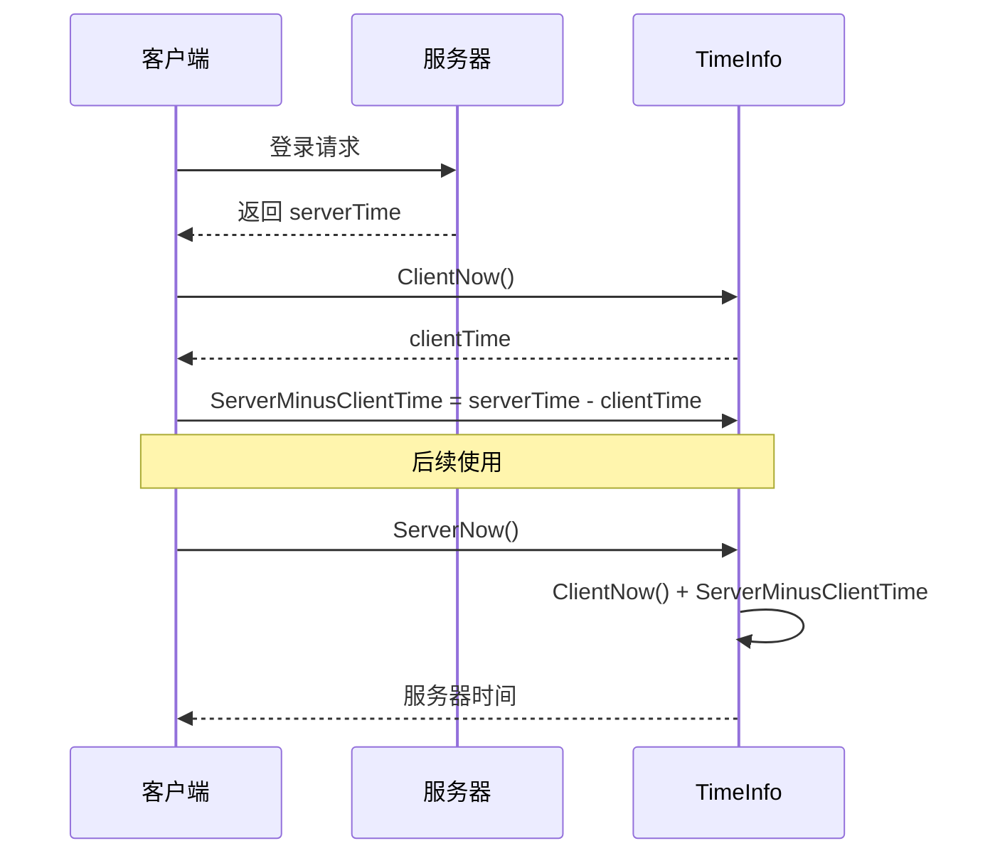

# TimeInfo.cs 注解文档

## 文件基本信息

| 属性 | 值 |
|------|-----|
| **文件名** | TimeInfo.cs |
| **路径** | Assets/Scripts/Mono/Module/Timer/TimeInfo.cs |
| **所属模块** | Mono 层 → Timer 定时器 |
| **文件职责** | 提供全局时间服务，包括时间戳转换、时区处理、服务器时间同步、时间格式化等功能 |

---

## 类/结构体说明

### TimeInfo

| 属性 | 说明 |
|------|------|
| **职责** | 全局时间信息服务，提供客户端/服务器时间戳、时区转换、时间格式化等功能 |
| **泛型参数** | 无 |
| **继承关系** | 无继承 |
| **实现的接口** | `IDisposable` |

**设计模式**: 单例模式

```csharp
// 单例实现
public static TimeInfo Instance = new TimeInfo();

// 使用方式
long now = TimeInfo.Instance.ClientNow();
DateTime dt = TimeInfo.Instance.ToDateTime(timeStamp);
```

---

## 常量定义

| 名称 | 值 | 说明 |
|------|-----|------|
| `OneDay` | `86400000` | 一天的毫秒数 (24 * 60 * 60 * 1000) |
| `Hour` | `3600000` | 一小时的毫秒数 (60 * 60 * 1000) |
| `Minute` | `60000` | 一分钟的毫秒数 (60 * 1000) |

---

## 字段与属性

| 名称 | 类型 | 访问级别 | 说明 |
|------|------|----------|------|
| `Instance` | `TimeInfo` | `public static` | 单例实例 |
| `TimeZone` | `int` | `public` | 时区（小时单位，如东八区为 8） |
| `ServerMinusClientTime` | `long` | `public` | 服务器时间 - 客户端时间（用于时间同步） |
| `FrameTime` | `long` | `public` | 当前帧时间戳 |
| `dt1970` | `DateTime` | `private` | 1970-01-01 UTC 基准时间 |
| `dt` | `DateTime` | `private` | 考虑时区后的基准时间 |

---

## 方法说明

### ClientNow()

**签名**:
```csharp
public long ClientNow()
```

**职责**: 获取当前客户端时间戳（毫秒，Unix 时间戳）

**返回值**: `long` - 当前时间戳

**核心逻辑**:
```
1. 计算 DateTime.UtcNow.Ticks - dt1970.Ticks
2. 除以 10000 转换为毫秒
3. 返回结果
```

**使用示例**:
```csharp
long now = TimeInfo.Instance.ClientNow();
Log.Info($"当前时间戳：{now}");
```

---

### ServerNow()

**签名**:
```csharp
public long ServerNow()
```

**职责**: 获取当前服务器时间戳（考虑时间同步偏移）

**返回值**: `long` - 服务器时间戳

**核心逻辑**:
```
return ClientNow() + ServerMinusClientTime
```

**使用示例**:
```csharp
// 登录时同步服务器时间
long serverTime = response.ServerTime;
long clientTime = TimeInfo.Instance.ClientNow();
TimeInfo.Instance.ServerMinusClientTime = serverTime - clientTime;

// 后续使用服务器时间
long now = TimeInfo.Instance.ServerNow();
```

---

### ToDateTime()

**签名**:
```csharp
public DateTime ToDateTime(long timeStamp)
```

**职责**: 将时间戳转换为 DateTime 对象

**参数**:
- `timeStamp`: 时间戳（毫秒）

**返回值**: `DateTime` - 对应的日期时间

**使用示例**:
```csharp
long timeStamp = 1709280000000; // 2024-03-01 00:00:00
DateTime dt = TimeInfo.Instance.ToDateTime(timeStamp);
Log.Info($"日期：{dt:yyyy-MM-dd HH:mm:ss}");
```

---

### Transition()

**签名**:
```csharp
public long Transition(DateTime d)
```

**职责**: 将 DateTime 转换为时间戳

**参数**:
- `d`: DateTime 对象

**返回值**: `long` - 时间戳（毫秒）

**使用示例**:
```csharp
DateTime target = new DateTime(2024, 12, 31, 23, 59, 59);
long timeStamp = TimeInfo.Instance.Transition(target);
```

---

### TransitionToStr()

**签名**:
```csharp
public string TransitionToStr(long time)
```

**职责**: 将时间间隔（毫秒）格式化为可读字符串

**参数**:
- `time`: 时间间隔（毫秒）

**返回值**: `string` - 格式化字符串（如 "1d2h3m4s"）

**格式**:
- `d`: 天
- `h`: 小时
- `m`: 分钟
- `s`: 秒

**使用示例**:
```csharp
long duration = 90061000; // 1 天 1 小时 1 分钟 1 秒
string str = TimeInfo.Instance.TransitionToStr(duration);
// 返回："1d1h1m1s"
```

---

### TransitionToStr2()

**签名**:
```csharp
public string TransitionToStr2(long time)
```

**职责**: 将时间间隔格式化为带国际化单位的字符串

**参数**:
- `time`: 时间间隔（毫秒）

**返回值**: `string` - 格式化字符串（如 "1 天 2 小时"）

**特点**:
- 使用 I18NBridge 获取多语言单位文本
- 单单位时省略数字（如 "1 秒" 显示为 "1 秒"，但逻辑上特殊处理）

**使用示例**:
```csharp
long duration = 3661000; // 1 小时 1 分钟 1 秒
string str = TimeInfo.Instance.TransitionToStr2(duration);
// 返回："1 小时 1 分钟 1 秒" (根据语言设置)
```

---

### Update()

**签名**:
```csharp
public void Update()
```

**职责**: 每帧调用，更新 FrameTime

**核心逻辑**:
```
FrameTime = ClientNow()
```

**调用者**: 游戏主循环 Update

---

## 时间同步机制

### 服务器时间同步流程



### 同步代码示例

```csharp
// 登录响应处理
void OnLoginResponse(LoginResponse response)
{
    long serverTime = response.ServerTime;
    long clientTime = TimeInfo.Instance.ClientNow();
    
    // 计算时间差
    TimeInfo.Instance.ServerMinusClientTime = serverTime - clientTime;
    
    Log.Info($"时间同步完成，偏移：{TimeInfo.Instance.ServerMinusClientTime}ms");
}

// 使用服务器时间
long GetServerTime()
{
    return TimeInfo.Instance.ServerNow();
}
```

---

## 使用示例

### 示例 1: 获取当前时间

```csharp
// 客户端时间
long clientTime = TimeInfo.Instance.ClientNow();
DateTime clientDt = TimeInfo.Instance.ToDateTime(clientTime);

// 服务器时间
long serverTime = TimeInfo.Instance.ServerNow();
DateTime serverDt = TimeInfo.Instance.ToDateTime(serverTime);
```

### 示例 2: 倒计时显示

```csharp
// 活动结束时间戳
long endTime = 1709366400000;

void UpdateCountdown()
{
    long now = TimeInfo.Instance.ServerNow();
    long remaining = endTime - now;
    
    if (remaining <= 0)
    {
        countdownText.text = "已结束";
        return;
    }
    
    string text = TimeInfo.Instance.TransitionToStr2(remaining);
    countdownText.text = $"剩余：{text}";
}
```

### 示例 3: 定时任务

```csharp
// 每天凌晨 5 点刷新
async ETTask DailyReset()
{
    while (true)
    {
        long now = TimeInfo.Instance.ServerNow();
        DateTime nowDt = TimeInfo.Instance.ToDateTime(now);
        
        // 计算下一个凌晨 5 点
        DateTime nextReset = nowDt.Date.AddHours(5);
        if (nowDt >= nextReset)
        {
            nextReset = nextReset.AddDays(1);
        }
        
        long resetTime = TimeInfo.Instance.Transition(nextReset);
        long waitTime = resetTime - now;
        
        // 等待到刷新时间
        await TimerManager.Instance.WaitTillAsync(resetTime);
        
        // 执行刷新逻辑
        DoDailyReset();
    }
}
```

### 示例 4: 设置时区

```csharp
// 根据玩家所在地设置时区
void SetTimeZone(string timezone)
{
    switch (timezone)
    {
        case "Asia/Shanghai":
            TimeInfo.Instance.TimeZone = 8;
            break;
        case "America/New_York":
            TimeInfo.Instance.TimeZone = -5;
            break;
        case "Europe/London":
            TimeInfo.Instance.TimeZone = 0;
            break;
    }
}
```

---

## 相关文档

- [TimerManager.cs.md](./TimerManager.cs.md) - 定时器管理器
- [GameTimerManager.cs.md](./GameTimerManager.cs.md) - 游戏时间管理器
- [I18NBridge.cs.md](../I18N/I18NBridge.cs.md) - 国际化桥接（TransitionToStr2 使用）

---

*文档生成时间：2026-03-02 | OpenClaw AI 助手*
