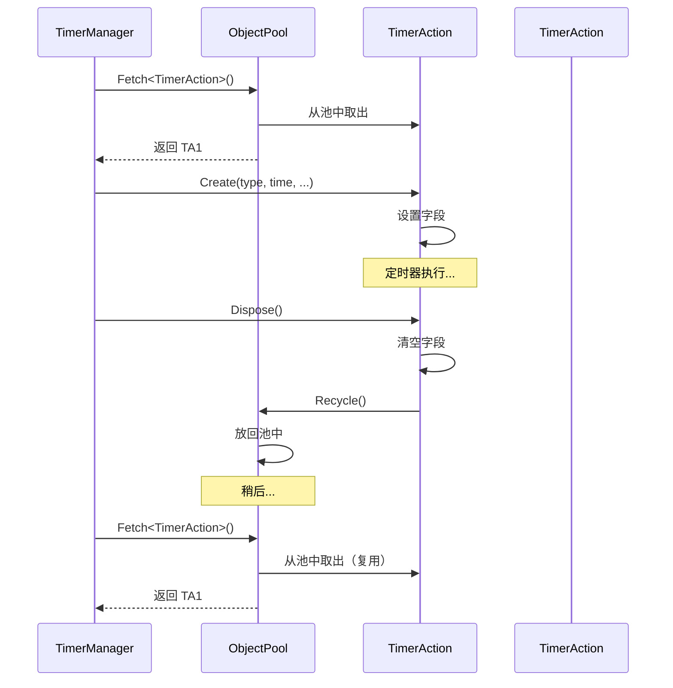

# TimerAction.cs 注解文档

## 文件基本信息

| 属性 | 值 |
|------|-----|
| **文件名** | TimerAction.cs |
| **路径** | Assets/Scripts/Mono/Module/Timer/TimerAction.cs |
| **所属模块** | 框架层 → Mono/Module/Timer |
| **文件职责** | 定时器动作数据结构，存储定时器的类型、时间、参数等信息 |

---

## 类/结构体说明

### TimerAction

| 属性 | 说明 |
|------|------|
| **职责** | 存储定时器的所有状态信息，包括类型、时间、参数、ID 等 |
| **泛型参数** | 无 |
| **继承关系** | 实现 `IDisposable` |
| **设计模式** | 对象池模式 |

```csharp
// 通过对象池创建
var timerAction = ObjectPool.Instance.Fetch<TimerAction>();

// 使用后回收到对象池
timerAction.Dispose();
```

---

## 字段与属性（按重要程度排序）

| 名称 | 类型 | 访问级别 | 说明 |
|------|------|----------|------|
| `TimerClass` | `TimerClass` | `public` | 定时器类型（OnceTimer/OnceWaitTimer/RepeatedTimer） |
| `Object` | `object` | `public` | 定时器参数对象（传递给 ITimer.Handle） |
| `Time` | `long` | `public` | 定时器间隔时间（毫秒），重复定时器使用 |
| `Type` | `int` | `public` | 定时器类型 ID（对应 TimerAttribute 的 Type） |
| `Id` | `long` | `public` | 定时器唯一标识 ID |

---

## 方法说明

### Create()

**签名**:
```csharp
public static TimerAction Create(TimerClass timerClass, long time, int type, object obj)
```

**职责**: 从对象池获取并初始化 TimerAction

**核心逻辑**:
```
1. 从对象池获取实例 ObjectPool.Instance.Fetch<TimerAction>()
2. 设置 TimerClass = timerClass
3. 设置 Object = obj
4. 设置 Time = time
5. 设置 Type = type
6. 生成唯一 ID IdGenerater.Instance.GenerateId()
7. 返回实例
```

**调用者**: TimerManager.AddChild()

**使用示例**:
```csharp
// 创建一次性定时器动作
var action = TimerAction.Create(
    TimerClass.OnceTimer,
    1000,
    TimerType.MyTimer,
    this
);

// 创建重复定时器动作
var action2 = TimerAction.Create(
    TimerClass.RepeatedTimer,
    5000,
    TimerType.CheckTimer,
    this
);
```

---

### Dispose()

**签名**:
```csharp
public void Dispose()
```

**职责**: 释放 TimerAction，回收到对象池

**核心逻辑**:
```
1. 设置 Id = 0
2. 设置 Object = null（释放引用）
3. 设置 Time = 0
4. 设置 TimerClass = TimerClass.None
5. 设置 Type = 0
6. 回收到对象池 ObjectPool.Instance.Recycle(this)
```

**调用者**: TimerManager.RemoveChild()

**使用示例**:
```csharp
// 使用完定时器动作后释放
action.Dispose();
```

---

## 数据结构

### TimerAction 内存布局

```
┌─────────────────────────────────────────┐
│            TimerAction                  │
├─────────────────────────────────────────┤
│ TimerClass : TimerClass (1 byte)        │
│ Object     : object (reference)         │
│ Time       : long (8 bytes)             │
│ Type       : int (4 bytes)              │
│ Id         : long (8 bytes)             │
└─────────────────────────────────────────┘
```

### 对象池复用流程



---

## 阅读指引

### 建议的阅读顺序

1. **理解 TimerAction 作用** - 为什么需要这个数据结构
2. **看字段定义** - 了解各字段的含义
3. **重点看 Create** - 理解对象池创建方式
4. **深入 Dispose** - 理解对象池回收机制

### 最值得学习的技术点

1. **对象池模式**: 使用 ObjectPool 减少 GC 压力
2. **IDisposable**: 提供统一的释放接口
3. **状态重置**: Dispose 时清空所有字段，避免状态污染
4. **静态工厂**: 使用静态 Create 方法封装创建逻辑

---

## 使用示例

### 示例 1: 创建一次性定时器动作

```csharp
// 创建一次性定时器动作
var action = TimerAction.Create(
    TimerClass.OnceTimer,
    1000,           // 1 秒后触发
    TimerType.MyTimer,
    this            // 传递的参数
);

// 添加到 TimerManager
TimerManager.Instance.AddChild(action);
```

### 示例 2: 创建重复定时器动作

```csharp
// 创建重复定时器动作
var action = TimerAction.Create(
    TimerClass.RepeatedTimer,
    5000,           // 每 5 秒触发
    TimerType.CheckTimer,
    this
);

// 添加到 TimerManager
TimerManager.Instance.AddChild(action);
```

### 示例 3: 创建每帧定时器动作

```csharp
// 创建每帧定时器动作（Time = 0 表示每帧）
var action = TimerAction.Create(
    TimerClass.RepeatedTimer,
    0,              // 每帧触发
    TimerType.FrameUpdate,
    player
);
```

### 示例 4: 创建等待定时器动作

```csharp
// 创建等待定时器动作（用于异步等待）
var tcs = ETTask<bool>.Create(true);
var action = TimerAction.Create(
    TimerClass.OnceWaitTimer,
    1000,
    0,              // 不需要 Type
    tcs             // 传递 TaskCompletionSource
);
```

### 示例 5: 手动管理 TimerAction 生命周期

```csharp
// 创建
var action = TimerAction.Create(
    TimerClass.OnceTimer,
    1000,
    TimerType.MyTimer,
    this
);

try
{
    // 使用 action...
    DoSomething(action);
}
finally
{
    // 确保释放
    action.Dispose();
}
```

---

## 与 TimerManager 的配合

### TimerManager 创建 TimerAction

```csharp
// TimerManager.AddChild()
public TimerAction AddChild(TimerClass timerClass, long time, int type, object obj)
{
    TimerAction timer = TimerAction.Create(timerClass, time, type, obj);
    this.childs.Add(timer.Id, timer);
    return timer;
}
```

### TimerManager 移除 TimerAction

```csharp
// TimerManager.RemoveChild()
public void RemoveChild(long id)
{
    var timer = this.GetChild(id);
    if (timer != null)
    {
        this.childs.Remove(id);
        timer.Dispose(); // 回收到对象池
    }
}
```

---

## 性能优化

### 对象池优势

1. **减少 GC**: 避免频繁创建/销毁 TimerAction 对象
2. **内存复用**: 重复使用同一块内存
3. **性能稳定**: 避免 GC 导致的帧率波动

### 使用建议

- ✅ 总是通过 `Create()` 创建，不要 `new TimerAction()`
- ✅ 使用后务必调用 `Dispose()` 回收
- ✅ 避免持有 TimerAction 的长期引用

---

## 相关文档

- [TimerManager.cs.md](./TimerManager.cs.md) - 定时器管理器
- [ObjectPool.cs.md](../../Core/ObjectPool.cs.md) - 对象池
- [IdGenerater.cs.md](../../Core/Object/IdGenerater.cs.md) - ID 生成器
- [TimerClass.cs.md](./TimerClass.cs.md) - 定时器类型枚举

---

*文档生成时间：2026-03-01 | OpenClaw AI 助手*
