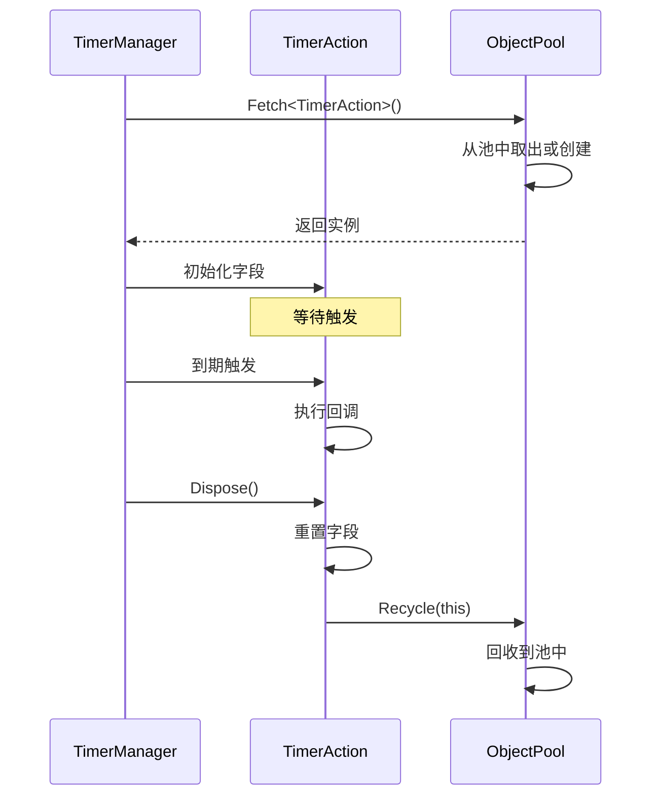

# TimerAction.cs 注解文档

## 文件基本信息

| 属性 | 值 |
|------|------|
| **文件名** | TimerAction.cs |
| **路径** | Assets/Scripts/Mono/Module/Timer/TimerAction.cs |
| **所属模块** | 框架层 → Mono/Module/Timer |
| **文件职责** | 定义定时器动作数据结构，存储定时器回调信息并支持对象池复用 |

---

## 类/结构体说明

### TimerAction

| 属性 | 说明 |
|------|------|
| **职责** | 存储定时器回调的完整信息（类型、时间、参数等），支持对象池复用 |
| **泛型参数** | 无 |
| **继承关系** | 无 |
| **实现的接口** | `IDisposable` |

**设计模式**: 数据传输对象（DTO）+ 对象池模式

```csharp
// 创建定时器动作
var action = TimerAction.Create(
    TimerClass.Normal,
    GameTimerManager.Instance.GetTimeNow() + 1000,
    TimerType.RefreshData,
    uiManager
);

// 使用
Debug.Log($"定时器 ID: {action.Id}, 类型：{action.Type}");

// 回收
action.Dispose();
```

---

## 字段与属性

### TimerClass

| 属性 | 值 |
|------|------|
| **类型** | `TimerClass` |
| **访问级别** | `public` |
| **说明** | 定时器分类（如 Normal、Once、EveryFrame 等） |

**用途**: 区分不同类型的定时器

---

### Object

| 属性 | 值 |
|------|------|
| **类型** | `object` |
| **访问级别** | `public` |
| **说明** | 定时器回调参数 |

**用途**: 传递给 `ATimer<T>.Run(T t)` 的参数

**示例**:
```csharp
action.Object = uiManager;  // 传递给 ATimer<UIManager>
```

---

### Time

| 属性 | 值 |
|------|------|
| **类型** | `long` |
| **访问级别** | `public` |
| **说明** | 定时器触发时间戳（毫秒） |

**用途**: TimerManager 根据此时间判断是否触发

---

### Type

| 属性 | 值 |
|------|------|
| **类型** | `int` |
| **访问级别** | `public` |
| **说明** | 定时器类型（与 TimerAttribute.Type 对应） |

**用途**: 用于查找对应的定时器类

---

### Id

| 属性 | 值 |
|------|------|
| **类型** | `long` |
| **访问级别** | `public` |
| **说明** | 定时器唯一标识符 |

**用途**: 用于取消、查询定时器

---

## 方法说明

### Create

**签名**:
```csharp
public static TimerAction Create(TimerClass timerClass, long time, int type, object obj)
```

**职责**: 从对象池创建 TimerAction 实例

**核心逻辑**:
```
1. 从对象池获取实例 ObjectPool.Instance.Fetch<TimerAction>()
2. 初始化字段（TimerClass、Object、Time、Type）
3. 生成唯一 ID IdGenerater.Instance.GenerateId()
4. 返回实例
```

**参数**:
| 参数名 | 类型 | 说明 |
|--------|------|------|
| `timerClass` | `TimerClass` | 定时器分类 |
| `time` | `long` | 触发时间戳 |
| `type` | `int` | 定时器类型 |
| `obj` | `object` | 回调参数 |

**返回值**: `TimerAction` - 新创建的定时器动作

**调用者**: TimerManager.NewTimer 系列方法

---

### Dispose

**签名**:
```csharp
public void Dispose()
```

**职责**: 清理字段并回收到对象池

**核心逻辑**:
```
1. 重置所有字段（Id=0, Object=null, Time=0, etc.）
2. 回收到对象池 ObjectPool.Instance.Recycle(this)
```

**调用者**: TimerManager.RemoveTimer、using 语句块结束

**被调用者**: `ObjectPool.Recycle<T>()`

---

## 对象池复用流程



---

## 使用示例

### 示例 1: 创建一次性定时器

```csharp
// 1 秒后执行
long triggerTime = GameTimerManager.Instance.GetTimeNow() + 1000;

var action = TimerAction.Create(
    TimerClass.Once,
    triggerTime,
    TimerType.RefreshData,
    uiManager
);

// 注册到 TimerManager
TimerManager.Instance.AddTimer(action);
```

### 示例 2: 创建循环定时器

```csharp
// 每 5 秒执行一次
long interval = 5000;
long firstTime = GameTimerManager.Instance.GetTimeNow() + interval;

var action = TimerAction.Create(
    TimerClass.Repeat,
    firstTime,
    TimerType.Heartbeat,
    networkManager
);

TimerManager.Instance.AddTimer(action);
```

### 示例 3: 取消定时器

```csharp
// 保存定时器 ID
long timerId = action.Id;

// 稍后取消
TimerManager.Instance.Remove(ref timerId);
// timerId 会被设为 0
```

### 示例 4: 在 ATimer 中使用

```csharp
[Timer(TimerType.RefreshData)]
public class RefreshDataTimer : ATimer<UIManager>
{
    public override void Run(UIManager ui)
    {
        // TimerAction.Object 会被转换为 UIManager
        ui.RefreshAllWindows();
    }
}

// TimerManager 触发时
TimerAction action = ...;  // action.Object = uiManager
ATimer<UIManager> timer = GetTimer(action.Type);
timer.Handle(action.Object);  // 调用 Run(UIManager)
```

---

## 设计要点

### 为什么需要对象池？

1. **减少 GC**: 定时器频繁创建/销毁会产生大量垃圾
2. **性能优化**: 对象池复用避免频繁内存分配
3. **自动清理**: Dispose 时重置字段，避免内存泄漏

### 为什么需要唯一 ID？

```csharp
public long Id = IdGenerater.Instance.GenerateId();
```

**用途**:
- 取消特定定时器
- 查询定时器状态
- 防止重复取消

### 为什么使用 object 参数？

```csharp
public object Object;
```

**原因**:
- 支持任意类型的参数
- 配合泛型 `ATimer<T>` 使用
- 运行时转换为具体类型

**缺点**: 
- 需要类型转换
- 可能有装箱/拆箱开销

**解决**: `ATimer<T>` 提供类型安全的封装

---

## 字段重置顺序

```csharp
public void Dispose()
{
    this.Id = 0;              // 先重置 ID（标记为无效）
    this.Object = null;       // 释放引用
    this.Time = 0;
    this.TimerClass = TimerClass.None;
    this.Type = 0;
    ObjectPool.Instance.Recycle(this);  // 最后回收
}
```

**意义**:
- 防止回收后被误用
- 释放引用避免内存泄漏
- 确保下次使用时是干净状态

---

## 相关文档

- [TimerManager.cs.md](./TimerManager.cs.md) - 定时器管理器（创建 TimerAction）
- [ITimer.cs.md](./ITimer.cs.md) - 定时器接口（使用 TimerAction）
- [ObjectPool.cs.md](../Core/Object/ObjectPool.cs.md) - 对象池实现
- [IdGenerater.cs.md](../Core/Object/IdGenerater.cs.md) - ID 生成器

---

*文档生成时间：2026-02-28 | OpenClaw AI 助手*
