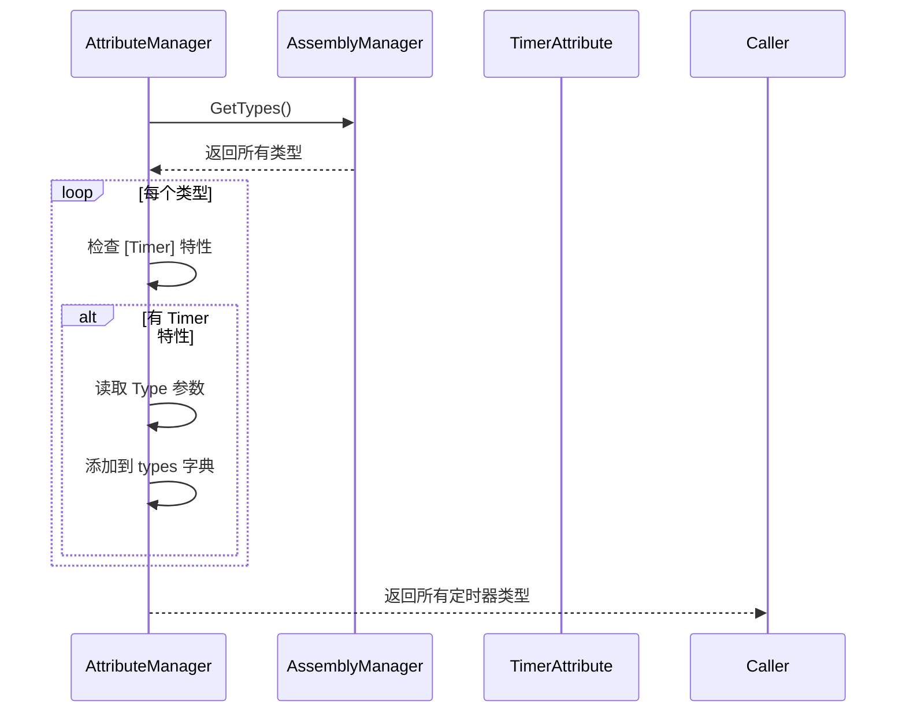

# TimerAttribute.cs 注解文档

## 文件基本信息

| 属性 | 值 |
|------|------|
| **文件名** | TimerAttribute.cs |
| **路径** | Assets/Scripts/Mono/Module/Timer/TimerAttribute.cs |
| **所属模块** | 框架层 → Mono/Module/Timer |
| **文件职责** | 定义定时器特性标记，用于注册定时器回调类 |

---

## 类/结构体说明

### TimerAttribute

| 属性 | 说明 |
|------|------|
| **职责** | 标记一个类为定时器回调类，指定其触发类型 |
| **泛型参数** | 无 |
| **继承关系** | 继承 `BaseAttribute` |
| **实现的接口** | 无 |

**设计模式**: 标记特性（Marker Attribute）

```csharp
// 使用示例
[Timer(TimerType.ResetTimeScale)]
public class ResetTimeScale : ATimer<GameTimerManager>
{
    public override void Run(GameTimerManager t)
    {
        t.SetTimeScale(1);
    }
}
```

---

## 字段与属性

### Type

| 属性 | 值 |
|------|------|
| **类型** | `int` |
| **访问级别** | `public` (get) |
| **说明** | 定时器类型标识符 |

**用途**:
- 用于定时器系统的类型匹配
- 在 TimerManager 中通过类型查找对应的定时器类

---

## 构造函数

### TimerAttribute

**签名**:
```csharp
public TimerAttribute(int type)
```

**参数**:
| 参数名 | 类型 | 说明 |
|--------|------|------|
| `type` | `int` | 定时器类型（如 TimerType.ResetTimeScale） |

**使用示例**:
```csharp
[Timer(TimerType.ResetTimeScale)]  // type = TimerType.ResetTimeScale
public class ResetTimeScale : ATimer<GameTimerManager>
```

---

## 继承关系

```
System.Attribute
    ↓
TaoTie.BaseAttribute
    ↓
TaoTie.TimerAttribute
```

---

## 使用示例

### 示例 1: 基础定时器

```csharp
[Timer(TimerType.UpdatePlayer)]
public class UpdatePlayerTimer : ATimer<Player>
{
    public override void Run(Player player)
    {
        player.UpdateStats();
    }
}
```

### 示例 2: 游戏时间重置

```csharp
[Timer(TimerType.ResetTimeScale)]
public class ResetTimeScale : ATimer<GameTimerManager>
{
    public override void Run(GameTimerManager t)
    {
        try
        {
            t.SetTimeScale(1);  // 恢复正常速度
        }
        catch (Exception ex)
        {
            Log.Error(ex);
        }
    }
}
```

### 示例 3: 定时器注册

```csharp
// TimerManager 内部使用
public void InitAction()
{
    // 扫描所有标记了 [Timer] 的类
    var timerTypes = AttributeManager.Instance.GetTypes(TypeInfo<TimerAttribute>.Type);
    
    foreach (var type in timerTypes)
    {
        // 获取 Timer 特性的 Type 参数
        var attr = type.GetCustomAttribute<TimerAttribute>();
        
        // 注册定时器
        RegisterTimer(attr.Type, type);
    }
}
```

---

## 与 AttributeManager 配合

### 扫描流程



### 代码示例

```csharp
// AttributeManager.Init()
HashSet<Type> temp = new HashSet<Type>();
var allTypes = AssemblyManager.Instance.GetTypes();

foreach (var item in allTypes)
{
    Type type = item.Value;
    
    if (type.IsAbstract) continue;
    
    // 查找所有 [Timer] 特性
    object[] objects = type.GetCustomAttributes(TypeInfo<TimerAttribute>.Type, true);
    
    foreach (object o in objects)
    {
        Type otype = o.GetType();
        this.types.Add(otype, type);  // 按特性类型索引
    }
}
```

---

## 设计要点

### 为什么使用特性？

1. **自动发现**: 无需手动注册定时器类
2. **解耦**: 定时器定义与注册逻辑分离
3. **类型安全**: 编译时检查
4. **可扩展**: 新增定时器无需修改注册代码

### Type 参数的意义

```csharp
[Timer(TimerType.ResetTimeScale)]
```

**作用**:
- 区分不同类型的定时器
- 支持按类型触发
- 便于管理和调试

### 与 ATimer<T> 配合

```csharp
[Timer(TimerType.SomeType)]
public class SomeTimer : ATimer<GameTimerManager>
{
    public override void Run(GameTimerManager t)
    {
        // 定时器逻辑
    }
}
```

**关系**:
- `[Timer]`: 标记类为定时器，指定类型
- `ATimer<T>`: 提供泛型回调接口
- `TimerManager`: 扫描并触发定时器

---

## 相关文档

- [BaseAttribute.cs.md](../Assembly/BaseAttribute.cs.md) - 基础特性类
- [AttributeManager.cs.md](../Assembly/AttributeManager.cs.md) - 特性管理器
- [ATimer.cs.md](./ITimer.cs.md) - 定时器抽象类
- [TimerManager.cs.md](./TimerManager.cs.md) - 定时器管理器

---

*文档生成时间：2026-02-28 | OpenClaw AI 助手*
