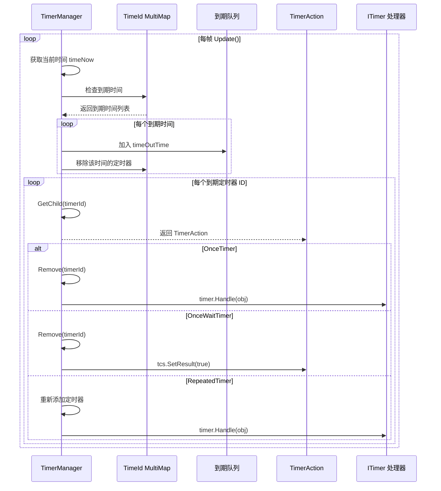

# TimerManager.cs 注解文档

## 文件基本信息

| 属性 | 值 |
|------|-----|
| **文件名** | TimerManager.cs |
| **路径** | Assets/Scripts/Mono/Module/Timer/TimerManager.cs |
| **所属模块** | Mono 层 → Timer 定时器 |
| **文件职责** | 定时器管理系统，支持一次性定时器、重复定时器、每帧定时器，提供异步等待功能 |

---

## 类/结构体说明

### TimerManager

| 属性 | 说明 |
|------|------|
| **职责** | 管理所有定时器的创建、执行、取消，支持基于时间的定时器和每帧定时器 |
| **泛型参数** | 无 |
| **继承关系** | 无继承 |
| **实现的接口** | `IUpdate`, `IManager` |

**设计模式**: 单例模式 + 时间轮算法优化

```csharp
// 单例实现
public static TimerManager Instance { get; private set; }

// 通过 ManagerProvider 注册
ManagerProvider.RegisterManager<TimerManager>();
```

---

## 核心数据结构

### TimerClass 枚举

```csharp
public enum TimerClass : byte
{
    None,           // 无效类型
    OnceTimer,      // 一次性定时器
    OnceWaitTimer,  // 一次性等待定时器（用于异步等待）
    RepeatedTimer,  // 重复定时器
}
```

### 数据字段

| 名称 | 类型 | 说明 |
|------|------|------|
| `childs` | `Dictionary<long, TimerAction>` | 定时器 ID 到 TimerAction 的映射 |
| `TimeId` | `MultiMap<long, long>` | 到期时间 → 定时器 ID 列表（按时间排序） |
| `timeOutTime` | `Queue<long>` | 到期时间队列（临时缓冲） |
| `timeOutTimerIds` | `Queue<long>` | 到期定时器 ID 队列（临时缓冲） |
| `everyFrameTimer` | `Queue<long>` | 每帧执行的定时器 ID 队列 |
| `minTime` | `long` | 最小到期时间缓存（避免每次查询 MultiMap） |
| `timerActions` | `ITimer[]` | 定时器处理器数组（按类型索引） |

---

## 方法说明

### Init()

**职责**: 初始化定时器管理器，注册所有 TimerAttribute 标记的定时器处理器

**核心逻辑**:
```
1. 设置 Instance = this
2. 调用 InitAction() 扫描并注册定时器处理器
```

---

### Update()

**职责**: 每帧调用，检查并执行到期的定时器

**核心逻辑**:
```
1. 处理每帧定时器（everyFrameTimer 队列）
2. 如果 TimeId 为空，直接返回
3. 获取当前时间 timeNow
4. 如果 timeNow < minTime，无需处理
5. 遍历 TimeId，收集所有到期的时间
6. 将到期的定时器 ID 加入 timeOutTimerIds 队列
7. 依次执行到期的定时器
```

---

### WaitAsync()

**签名**:
```csharp
public async ETTask<bool> WaitAsync(long time, ETCancellationToken cancellationToken = null)
```

**职责**: 异步等待指定时间

**参数**:
- `time`: 等待时间（毫秒）
- `cancellationToken`: 取消令牌（可选）

**返回值**: `ETTask<bool>` - 成功返回 true，被取消返回 false

**使用示例**:
```csharp
// 等待 1 秒
await TimerManager.Instance.WaitAsync(1000);

// 带取消的等待
var cancelToken = new ETCancellationToken();
await TimerManager.Instance.WaitAsync(5000, cancelToken);
```

---

### WaitTillAsync()

**签名**:
```csharp
public async ETTask<bool> WaitTillAsync(long tillTime, ETCancellationToken cancellationToken = null)
```

**职责**: 异步等待到指定时间戳

**参数**:
- `tillTime`: 目标时间戳

**使用示例**:
```csharp
// 等待到明天零点
long tomorrowMidnight = TimeInfo.Instance.ClientNow() + TimeInfo.OneDay;
await TimerManager.Instance.WaitTillAsync(tomorrowMidnight);
```

---

### Remove()

**签名**:
```csharp
public bool Remove(ref long id)
```

**职责**: 移除/取消定时器

**参数**:
- `id`: 定时器 ID（引用传递，成功后置为 0）

**返回值**: `bool` - 成功返回 true

**使用示例**:
```csharp
long timerId = TimerManager.Instance.NewRepeatedTimer(1000, TimerType.FrameUpdate, obj);
// ... 取消定时器
TimerManager.Instance.Remove(ref timerId);  // timerId 会被置为 0
```

---

## 定时器类型注册

### InitAction() 流程

```csharp
protected void InitAction()
{
    this.timerActions = new ITimer[TimerManager.TimeTypeMax];
    
    // 从 AttributeManager 获取所有带有 TimerAttribute 的类型
    List<Type> types = AttributeManager.Instance.GetTypes(
        TypeInfo<TimerAttribute>.Type
    );

    foreach (Type type in types)
    {
        ITimer iTimer = Activator.CreateInstance(type) as ITimer;
        
        // 获取 TimerAttribute 中定义的类型
        object[] attrs = type.GetCustomAttributes(
            TypeInfo<TimerAttribute>.Type, 
            false
        );
        
        foreach (object attr in attrs)
        {
            TimerAttribute timerAttribute = attr as TimerAttribute;
            this.timerActions[timerAttribute.Type] = iTimer;
        }
    }
}
```

**说明**: 通过反射扫描所有标记了 `TimerAttribute` 的类，注册到 `timerActions` 数组中，按类型索引。

---

## 定时器执行流程



---

## 使用示例

### 示例 1: 一次性定时器

```csharp
// 定义定时器处理器
[TimerType(TimerType.DelayAction)]
public class DelayActionTimer : ITimer
{
    public void Handle(object obj)
    {
        Action action = obj as Action;
        action?.Invoke();
    }
}

// 使用
long timerId = TimerManager.Instance.NewOnceTimer(
    2000,  // 2 秒后执行
    TimerType.DelayAction,
    () => Log.Info("2 秒到了！")
);
```

### 示例 2: 重复定时器

```csharp
// 每 1 秒执行一次
long timerId = TimerManager.Instance.NewRepeatedTimer(
    1000,  // 1 秒间隔
    TimerType.FrameUpdate,
    gameEntity
);

// 取消定时器
TimerManager.Instance.Remove(ref timerId);
```

### 示例 3: 异步等待

```csharp
// 等待 3 秒
await TimerManager.Instance.WaitAsync(3000);
Log.Info("3 秒后执行");

// 等待到指定时间戳
long targetTime = TimeInfo.Instance.ClientNow() + 5000;
await TimerManager.Instance.WaitTillAsync(targetTime);
```

### 示例 4: 带取消的等待

```csharp
ETCancellationToken cancelToken = new ETCancellationToken();

// 启动异步等待
ETTask<bool> waitTask = TimerManager.Instance.WaitAsync(10000, cancelToken);

// 用户点击取消按钮
void OnCancel()
{
    cancelToken.Cancel();
}

// 等待结果
bool success = await waitTask;
if (success)
{
    Log.Info("等待完成");
}
else
{
    Log.Info("等待被取消");
}
```

---

## 性能优化

### 1. minTime 缓存

避免每次 Update 都从 MultiMap 取第一个值（最小键）：

```csharp
if (timeNow < this.minTime)
{
    return;  // 无需处理
}
```

### 2. 每帧定时器单独队列

不用遍历 TimeId，减少 GC：

```csharp
int count = this.everyFrameTimer.Count;
for (int i = 0; i < count; ++i)
{
    long timerId = this.everyFrameTimer.Dequeue();
    // 处理每帧定时器
}
```

### 3. 对象池复用

TimerAction 使用对象池管理，减少内存分配。

---

## 相关文档

- [TimeInfo.cs.md](./TimeInfo.cs.md) - 时间信息服务
- [GameTimerManager.cs.md](./GameTimerManager.cs.md) - 游戏时间管理器
- [ITimer.cs.md](./ITimer.cs.md) - 定时器处理器接口
- [TimerAction.cs.md](./TimerAction.cs.md) - 定时器动作数据结构
- [TimerAttribute.cs.md](./TimerAttribute.cs.md) - 定时器类型属性

---

*文档生成时间：2026-03-02 | OpenClaw AI 助手*
