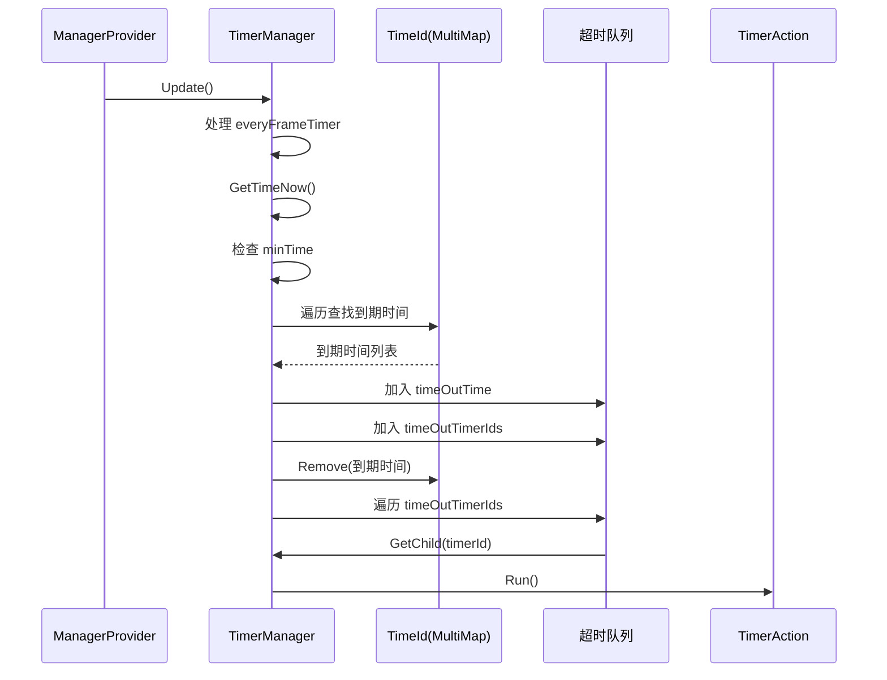
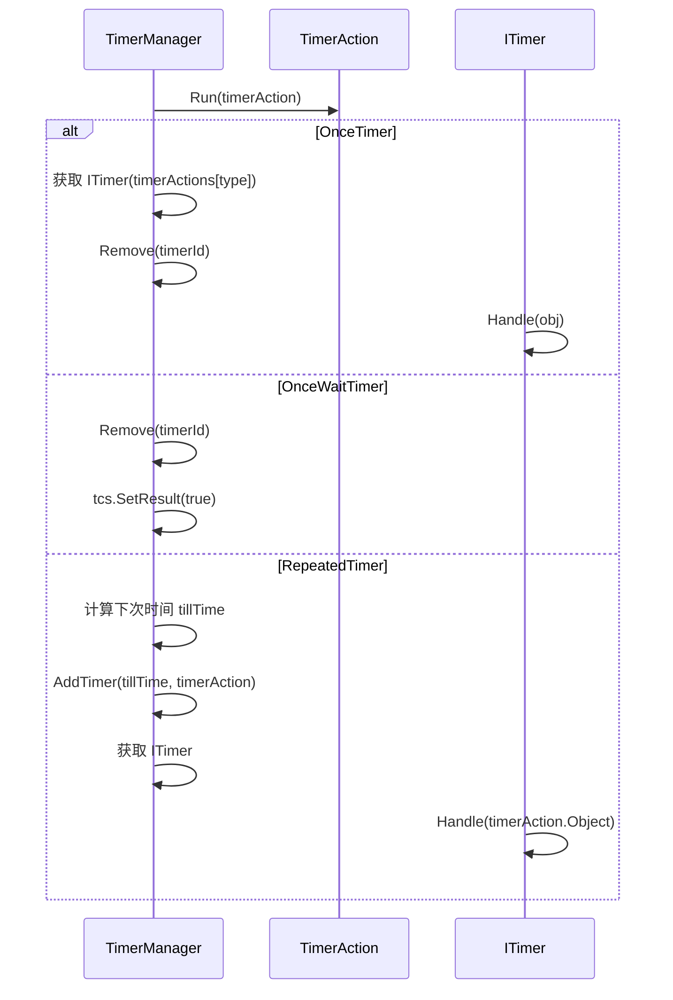

# TimerManager.cs 注解文档

## 文件基本信息

| 属性 | 值 |
|------|-----|
| **文件名** | TimerManager.cs |
| **路径** | Assets/Scripts/Mono/Module/Timer/TimerManager.cs |
| **所属模块** | 框架层 → Mono/Module/Timer |
| **文件职责** | 定时器管理系统，负责定时任务的创建、调度、取消和执行 |

---

## 类/结构体说明

### TimerManager

| 属性 | 说明 |
|------|------|
| **职责** | 管理所有定时器任务，支持一次性定时器、重复定时器、每帧定时器 |
| **泛型参数** | 无 |
| **继承关系** | 实现 `IUpdate`, `IManager` |
| **设计模式** | 单例模式 + 时间轮 + 事件驱动 |

```csharp
// 单例实现
public static TimerManager Instance { get; private set; }

// 通过 ManagerProvider 注册
ManagerProvider.RegisterManager<TimerManager>();
```

---

## 枚举说明

### TimerClass

```csharp
public enum TimerClass : byte
{
    None,           // 无类型
    OnceTimer,      // 一次性定时器
    OnceWaitTimer,  // 一次性等待定时器（返回 Task）
    RepeatedTimer,  // 重复定时器
}
```

---

## 字段与属性（按重要程度排序）

| 名称 | 类型 | 访问级别 | 说明 |
|------|------|----------|------|
| `Instance` | `TimerManager` | `public static` | 单例实例，全局访问点 |
| `childs` | `Dictionary<long, TimerAction>` | `protected` | 按 ID 索引的定时器动作字典 |
| `TimeId` | `MultiMap<long, long>` | `protected` | 按时间索引的定时器 ID 多映射（key: 时间，value: 定时器 ID） |
| `timeOutTime` | `Queue<long>` | `protected` | 超时时间队列 |
| `timeOutTimerIds` | `Queue<long>` | `protected` | 超时的定时器 ID 队列 |
| `everyFrameTimer` | `Queue<long>` | `protected` | 每帧执行的定时器队列 |
| `minTime` | `long` | `protected` | 最小超时时间（优化，避免每次都查 MultiMap） |
| `timerActions` | `ITimer[]` | `protected` | 定时器动作数组（按类型索引） |

---

## 方法说明（按重要程度排序）

### Init()

**签名**:
```csharp
public virtual void Init()
```

**职责**: 初始化定时器管理器

**核心逻辑**:
```
1. 设置单例 Instance = this
2. 初始化定时器动作 InitAction()
```

**调用者**: ManagerProvider.RegisterManager<TimerManager>()

---

### Destroy()

**签名**:
```csharp
public virtual void Destroy()
```

**职责**: 销毁定时器管理器

**核心逻辑**:
```
1. 设置 Instance = null
2. 遍历所有 TimerAction，调用 Dispose()
3. 清空 childs 字典
```

**调用者**: ManagerProvider.RemoveManager<TimerManager>()

---

### Update()

**签名**:
```csharp
public virtual void Update()
```

**职责**: 每帧更新，检查并执行到期的定时器

**核心逻辑**:
```
1. 处理每帧定时器（everyFrameTimer 队列）
2. 如果没有定时器 → 返回
3. 获取当前时间 GetTimeNow()
4. 如果当前时间 < minTime → 返回（还没到任何定时器的时间）
5. 遍历 TimeId，找出所有到期的时间
6. 将到期时间加入 timeOutTime 队列
7. 将到期时间对应的所有定时器 ID 加入 timeOutTimerIds 队列
8. 从 TimeId 移除已处理的时间
9. 遍历 timeOutTimerIds，执行每个定时器 Run()
```

**调用者**: ManagerProvider.Update()

**性能优化**:
- 使用 `minTime` 缓存最小时间，避免每次遍历 MultiMap
- 每帧定时器单独队列，不加入 TimeId，减少遍历
- 使用 Queue 避免 foreach 产生 GC

---

### WaitAsync(long time, ETCancellationToken)

**签名**:
```csharp
public async ETTask<bool> WaitAsync(long time, ETCancellationToken cancellationToken = null)
```

**职责**: 异步等待指定时间

**核心逻辑**:
```
1. 如果 time == 0 → 立即返回 true
2. 计算到期时间 tillTime = GetTimeNow() + time
3. 创建 ETTask<bool>
4. 创建 TimerAction（OnceWaitTimer 类型）
5. 添加定时器
6. 注册取消回调（如果提供 cancellationToken）
7. await 等待任务完成
8. 返回结果
```

**调用者**: 需要异步等待的代码

**使用示例**:
```csharp
// 等待 1 秒
await TimerManager.Instance.WaitAsync(1000);

// 带取消令牌
var cts = new ETCancellationToken();
await TimerManager.Instance.WaitAsync(1000, cts);
```

---

### WaitTillAsync(long tillTime, ETCancellationToken)

**签名**:
```csharp
public async ETTask<bool> WaitTillAsync(long tillTime, ETCancellationToken cancellationToken = null)
```

**职责**: 异步等待到指定时间点

**核心逻辑**: 同 `WaitAsync`，但使用绝对时间而非相对时间

**使用示例**:
```csharp
// 等到明天零点
long tomorrow = TimerManager.Instance.GetTimeNow() + TimeInfo.OneDay;
await TimerManager.Instance.WaitTillAsync(tomorrow);
```

---

### WaitFrameAsync(ETCancellationToken)

**签名**:
```csharp
public async ETTask<bool> WaitFrameAsync(ETCancellationToken cancellationToken = null)
```

**职责**: 异步等待一帧

**核心逻辑**:
```
1. 调用 WaitAsync(1, cancellationToken)
```

**使用示例**:
```csharp
// 等待下一帧
await TimerManager.Instance.WaitFrameAsync();
```

---

### NewOnceTimer(long tillTime, int type, object args)

**签名**:
```csharp
public long NewOnceTimer(long tillTime, int type, object args)
```

**职责**: 创建一次性定时器（回调式）

**核心逻辑**:
```
1. 检查 tillTime 是否小于当前时间（发出警告）
2. 创建 TimerAction（OnceTimer 类型）
3. 添加定时器
4. 返回定时器 ID
```

**调用者**: 需要回调式定时器的代码

**使用示例**:
```csharp
// 创建一次性定时器
long timerId = TimerManager.Instance.NewOnceTimer(
    TimerManager.Instance.GetTimeNow() + 1000,
    TimerType.MyTimer,
    this
);

// 取消定时器
TimerManager.Instance.Remove(ref timerId);
```

---

### NewRepeatedTimer(long time, int type, object args)

**签名**:
```csharp
public long NewRepeatedTimer(long time, int type, object args)
```

**职责**: 创建重复定时器

**核心逻辑**:
```
1. 检查 time 是否小于最小间隔 Define.MinRepeatedTimerInterval
2. 调用 NewRepeatedTimerInner 创建
3. 返回定时器 ID
```

**使用示例**:
```csharp
// 每 1 秒执行一次
long timerId = TimerManager.Instance.NewRepeatedTimer(
    1000,
    TimerType.MyRepeatedTimer,
    this
);
```

---

### NewFrameTimer(int type, object args)

**签名**:
```csharp
public long NewFrameTimer(int type, object args)
```

**职责**: 创建每帧定时器

**核心逻辑**:
```
1. 调用 NewRepeatedTimerInner(0, type, args)
```

**使用示例**:
```csharp
// 每帧执行
long timerId = TimerManager.Instance.NewFrameTimer(
    TimerType.MyFrameTimer,
    this
);
```

---

### Remove(ref long id)

**签名**:
```csharp
public bool Remove(ref long id)
```

**职责**: 移除定时器

**核心逻辑**:
```
1. 保存 id 到临时变量
2. 将 id 置为 0（防止重复移除）
3. 调用 Remove(long id)
```

**使用示例**:
```csharp
long timerId = TimerManager.Instance.NewOnceTimer(...);
TimerManager.Instance.Remove(ref timerId);
// timerId 现在是 0
```

---

### GetTimeNow()

**签名**:
```csharp
public virtual long GetTimeNow()
```

**职责**: 获取当前时间（毫秒时间戳）

**核心逻辑**:
```
1. 返回 TimeInfo.Instance.ServerNow()
```

**调用者**: 所有需要当前时间的地方

---

## 定时器执行流程

### Update 检查流程



### 定时器执行流程



---

## 定时器类型对比

| 类型 | 创建方法 | 执行次数 | 返回类型 | 适用场景 |
|------|----------|----------|----------|----------|
| OnceTimer | NewOnceTimer | 1 次 | long (ID) | 回调式一次性任务 |
| OnceWaitTimer | WaitAsync/WaitTillAsync | 1 次 | ETTask<bool> | 异步等待 |
| RepeatedTimer | NewRepeatedTimer | 多次 | long (ID) | 周期性任务 |
| FrameTimer | NewFrameTimer | 每帧 | long (ID) | 每帧执行的任务 |

---

## 阅读指引

### 建议的阅读顺序

1. **理解定时器作用** - 为什么需要 TimerManager
2. **看字段定义** - 了解 TimeId/childs 等数据结构
3. **重点看 Update** - 理解定时器调度机制
4. **深入 WaitAsync** - 理解异步等待实现
5. **了解定时器类型** - 理解不同定时器的使用场景

### 最值得学习的技术点

1. **时间轮算法**: 使用 MultiMap<long, long> 按时间索引定时器
2. **异步等待**: 使用 ETTask 实现异步等待
3. **每帧优化**: 每帧定时器单独队列，避免遍历 TimeId
4. **minTime 缓存**: 避免每次都查 MultiMap 第一个元素
5. **回调注册**: 通过 TimerAttribute 注册定时器处理器
6. **取消机制**: 支持 ETCancellationToken 取消等待

---

## 使用示例

### 示例 1: 异步等待

```csharp
// 等待 1 秒
await TimerManager.Instance.WaitAsync(1000);

// 等待到指定时间
long tillTime = TimerManager.Instance.GetTimeNow() + 5000;
await TimerManager.Instance.WaitTillAsync(tillTime);

// 等待一帧
await TimerManager.Instance.WaitFrameAsync();

// 带取消令牌
var cts = new ETCancellationToken();
try
{
    await TimerManager.Instance.WaitAsync(1000, cts);
}
catch
{
    // 被取消了
}
```

### 示例 2: 一次性定时器（回调式）

```csharp
// 定义定时器处理器
[Timer(TimerType.MyTimer)]
public class MyTimerHandler : ATimer<MyClass>
{
    public override void Run(MyClass obj)
    {
        // 定时器触发时的逻辑
        obj.DoSomething();
    }
}

// 创建定时器
long timerId = TimerManager.Instance.NewOnceTimer(
    TimerManager.Instance.GetTimeNow() + 1000,
    TimerType.MyTimer,
    this
);

// 取消定时器
TimerManager.Instance.Remove(ref timerId);
```

### 示例 3: 重复定时器

```csharp
// 每 1 秒执行一次
long timerId = TimerManager.Instance.NewRepeatedTimer(
    1000,
    TimerType.MyRepeatedTimer,
    this
);

// 取消定时器
TimerManager.Instance.Remove(ref timerId);
```

### 示例 4: 每帧定时器

```csharp
// 每帧执行
long timerId = TimerManager.Instance.NewFrameTimer(
    TimerType.MyFrameTimer,
    this
);

// 在 Handler 中处理每帧逻辑
[Timer(TimerType.MyFrameTimer)]
public class MyFrameTimerHandler : ATimer<MyClass>
{
    public override void Run(MyClass obj)
    {
        // 每帧执行的逻辑
        obj.UpdateFrame();
    }
}
```

### 示例 5: 定时器组合使用

```csharp
public class GameLogic
{
    private long checkTimerId;
    
    public async ETTask Start()
    {
        // 每 5 秒检查一次
        checkTimerId = TimerManager.Instance.NewRepeatedTimer(
            5000,
            TimerType.CheckTimer,
            this
        );
        
        // 等待 10 秒后执行某个操作
        await TimerManager.Instance.WaitAsync(10000);
        DoSomething();
    }
    
    public void Stop()
    {
        TimerManager.Instance.Remove(ref checkTimerId);
    }
}
```

---

## 相关文档

- [TimeInfo.cs.md](./TimeInfo.cs.md) - 时间信息服务
- [TimerAction.cs.md](./TimerAction.cs.md) - 定时器动作
- [ITimer.cs.md](./ITimer.cs.md) - 定时器接口
- [TimerAttribute.cs.md](./TimerAttribute.cs.md) - 定时器特性
- [ManagerProvider.cs.md](../../Core/Manager/ManagerProvider.cs.md) - 管理器注册中心

---

*文档生成时间：2026-03-01 | OpenClaw AI 助手*
