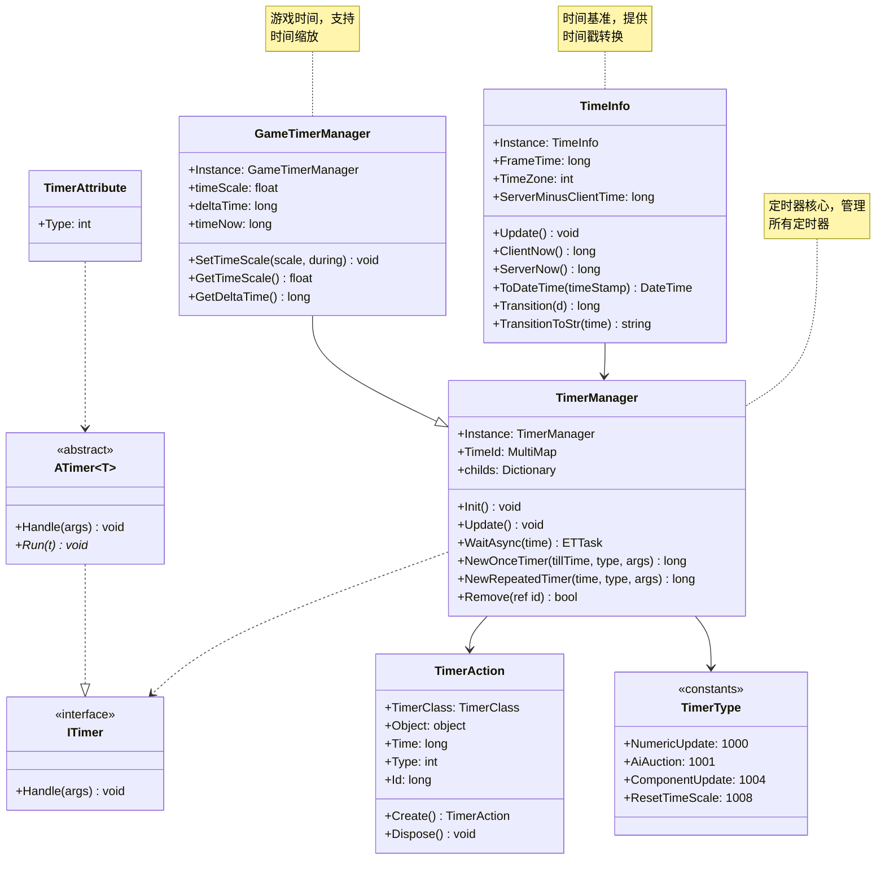

# Timer 系统综合文档

> **覆盖文件**: ITimer.cs, TimerAttribute.cs, TimeInfo.cs, TimerAction.cs, TimerManager.cs, GameTimerManager.cs, TimerType.cs  
> **生成时间**: 2026-02-28  
> **命名空间**: `TaoTie`

---

## 📑 目录

1. [系统概述](#1-系统概述)
2. [TimeInfo - 时间信息](#2-timeinfo---时间信息)
3. [ITimer & TimerAttribute - 定时器接口](#3-itimer--timerattribute---定时器接口)
4. [TimerAction - 定时器动作](#4-timeraction---定时器动作)
5. [TimerManager - 定时器管理器](#5-timermanager---定时器管理器)
6. [GameTimerManager - 游戏时间管理器](#6-gametimermanager---游戏时间管理器)
7. [TimerType - 定时器类型常量](#7-timertype---定时器类型常量)
8. [使用示例](#8-使用示例)

---

## 1. 系统概述

### 架构设计



### 核心概念

| 概念 | 说明 |
|------|------|
| **TimeInfo** | 全局时间基准，提供时间戳、时区、服务器时间同步 |
| **TimerManager** | 定时器管理器，管理所有定时器的创建、执行、销毁 |
| **GameTimerManager** | 游戏时间管理器，支持时间缩放（子弹时间等） |
| **ITimer** | 定时器接口，用于热更新定时器逻辑 |
| **TimerAction** | 定时器动作对象，存储定时器状态 |
| **TimerAttribute** | 标记定时器类型，用于反射注册 |

---

## 2. TimeInfo - 时间信息

### 类说明

| 属性 | 说明 |
|------|------|
| **职责** | 全局时间基准，提供时间戳获取、时区设置、时间格式化等功能 |
| **单例** | `TimeInfo.Instance` |
| **关键属性** | `FrameTime`, `TimeZone`, `ServerMinusClientTime` |

### 常量

```csharp
public const long OneDay = 86400000;    // 1 天毫秒数
public const long Hour = 3600000;       // 1 小时毫秒数
public const long Minute = 60000;       // 1 分钟毫秒数
```

### 核心 API

#### ClientNow / ServerNow

```csharp
// 获取客户端当前时间戳（毫秒，1970 年起）
long clientTime = TimeInfo.Instance.ClientNow();

// 获取服务器当前时间戳（考虑时间同步）
long serverTime = TimeInfo.Instance.ServerNow();
```

#### FrameTime

```csharp
// 获取当前帧时间（用于定时器）
long frameTime = TimeInfo.Instance.FrameTime;

// 每帧由 Update() 刷新
TimeInfo.Instance.Update();
```

#### ToDateTime / Transition

```csharp
// 时间戳 → DateTime
DateTime dt = TimeInfo.Instance.ToDateTime(1677571200000);

// DateTime → 时间戳
long timestamp = TimeInfo.Instance.Transition(DateTime.Now);
```

#### TransitionToStr (格式化)

```csharp
// 毫秒数 → 可读字符串
long time = 3725000; // 1 小时 2 分 5 秒

string str1 = TimeInfo.Instance.TransitionToStr(time);
// 输出："1h2m5s"

string str2 = TimeInfo.Instance.TransitionToStr2(time);
// 输出："1 小时 2 分钟 5 秒" (支持国际化)
```

### 时间同步

```csharp
// 设置服务器与客户端时间差
TimeInfo.Instance.ServerMinusClientTime = serverTime - clientTime;

// 之后 ServerNow() 会自动加上时间差
long syncedTime = TimeInfo.Instance.ServerNow();
```

---

## 3. ITimer & TimerAttribute - 定时器接口

### ITimer 接口

```csharp
public interface ITimer
{
    void Handle(object args);
}
```

**用途**: 定义定时器回调，支持热更新

### ATimer 抽象类

```csharp
public abstract class ATimer<T>: ITimer where T: class
{
    public void Handle(object args)
    {
        this.Run(args as T);
    }

    public abstract void Run(T t);
}
```

**用途**: 泛型包装，类型安全的定时器实现

### TimerAttribute

```csharp
[Timer(TimerType.NumericUpdate)]
public class NumericUpdateTimer : ATimer<NumericComponent>
{
    public override void Run(NumericComponent numeric)
    {
        numeric.Update();
    }
}
```

**用途**: 标记定时器类型，TimerManager 通过反射自动注册

---

## 4. TimerAction - 定时器动作

### 类说明

| 属性 | 说明 |
|------|------|
| **职责** | 存储定时器状态，从对象池获取/回收 |
| **对象池** | 通过 `ObjectPool.Instance.Fetch<TimerAction>()` 获取 |

### 字段

| 名称 | 类型 | 说明 |
|------|------|------|
| `TimerClass` | `TimerClass` | 定时器类型（OnceTimer/RepeatedTimer/OnceWaitTimer） |
| `Object` | `object` | 定时器参数/回调对象 |
| `Time` | `long` | 定时器时间（间隔或绝对时间） |
| `Type` | `int` | 定时器类型 ID（对应 TimerType） |
| `Id` | `long` | 唯一 ID，用于移除 |

### 创建与回收

```csharp
// 创建
TimerAction action = TimerAction.Create(
    TimerClass.OnceTimer,
    time: 1000,
    type: TimerType.ComponentUpdate,
    obj: component
);

// 回收
action.Dispose(); // 自动回收到对象池
```

---

## 5. TimerManager - 定时器管理器

### 类说明

| 属性 | 说明 |
|------|------|
| **职责** | 管理所有定时器的创建、执行、移除 |
| **单例** | `TimerManager.Instance` |
| **实现的接口** | `IUpdate`, `IManager` |

### 核心 API

#### WaitAsync ⭐

```csharp
// 等待指定时间（毫秒）
await TimerManager.Instance.WaitAsync(1000);
Log.Info("1 秒后");

// 带取消令牌
var cts = new ETCancellationToken();
await TimerManager.Instance.WaitAsync(5000, cts);

// 等待一帧
await TimerManager.Instance.WaitFrameAsync();
```

#### NewOnceTimer

```csharp
// 一次性定时器（热更新支持）
long timerId = TimerManager.Instance.NewOnceTimer(
    tillTime: TimeInfo.Instance.ServerNow() + 1000,
    type: TimerType.NumericUpdate,
    args: component
);

// 移除定时器
TimerManager.Instance.Remove(ref timerId);
```

#### NewRepeatedTimer

```csharp
// 重复定时器
long timerId = TimerManager.Instance.NewRepeatedTimer(
    time: 1000,  // 每 1 秒
    type: TimerType.AiAuction,
    args: aiComponent
);

// 移除
TimerManager.Instance.Remove(ref timerId);
```

#### NewFrameTimer

```csharp
// 每帧执行的定时器
long timerId = TimerManager.Instance.NewFrameTimer(
    type: TimerType.ComponentUpdate,
    args: component
);
```

### 定时器类型

```csharp
public enum TimerClass : byte
{
    None,
    OnceTimer,        // 一次性定时器
    OnceWaitTimer,    // 等待定时器（内部使用）
    RepeatedTimer,    // 重复定时器
}
```

---

## 6. GameTimerManager - 游戏时间管理器

### 类说明

| 属性 | 说明 |
|------|------|
| **职责** | 继承 TimerManager，支持时间缩放（子弹时间） |
| **单例** | `GameTimerManager.Instance` |
| **继承关系** | `GameTimerManager : TimerManager` |

### 核心 API

#### SetTimeScale ⭐

```csharp
// 设置时间缩放（0.5=慢动作，2=快进）
GameTimerManager.Instance.SetTimeScale(0.5f);

// 设置时间缩放，持续 5 秒后恢复
GameTimerManager.Instance.SetTimeScale(2.0f, during: 5000);

// 获取当前时间缩放
float scale = GameTimerManager.Instance.GetTimeScale();
```

#### GetDeltaTime

```csharp
// 获取缩放后的帧时间
long deltaTime = GameTimerManager.Instance.GetDeltaTime();

// 时间缩放 0.5 时，deltaTime 是实际帧时间的一半
```

### 时间缩放原理

```
实际帧时间：16ms (60 FPS)
时间缩放：0.5

游戏时间增量 = 16ms × 0.5 = 8ms

→ 游戏内时间流逝变慢（子弹时间）
→ 定时器触发变慢
→ 动画播放变慢
```

---

## 7. TimerType - 定时器类型常量

### 预定义类型

```csharp
public class TimerType
{
    public const int NumericUpdate = 1000;      // 数值更新
    public const int AiAuction = 1001;          // AI 拍卖
    public const int DelayDestroyEntity = 1003; // 延迟销毁 Entity
    public const int ComponentUpdate = 1004;    // 组件 Update
    public const int UIRestaurantViewUpdate = 1005;
    public const int UIMarketView = 1006;
    public const int DailyRefresh = 1007;       // 每日刷新
    public const int ResetTimeScale = 1008;     // 重置时间缩放
    public const int UIShopWin = 1009;
    public const int UIWashDishViewUpdate = 1010;
    public const int UIMatchUpdate = 1011;
}
```

### 自定义定时器类型

```csharp
// 定义新类型
public class MyTimerType
{
    public const int MyCustomTimer = 2001;
}

// 实现定时器
[Timer(MyTimerType.MyCustomTimer)]
public class MyCustomTimer : ATimer<MyComponent>
{
    public override void Run(MyComponent component)
    {
        component.DoSomething();
    }
}
```

---

## 8. 使用示例

### 示例 1: 等待异步

```csharp
// 简单等待
public async ETTask DelayedAction()
{
    Log.Info("开始");
    await TimerManager.Instance.WaitAsync(1000);
    Log.Info("1 秒后");
}

// 带取消
public async ETTask DelayedActionWithCancel()
{
    var cts = new ETCancellationToken();
    
    // 启动取消任务
    _ = Task.Run(async () => 
    {
        await Task.Delay(500);
        cts.Cancel(); // 0.5 秒后取消
    });
    
    try
    {
        await TimerManager.Instance.WaitAsync(5000, cts);
        Log.Info("5 秒后");
    }
    catch (OperationCanceledException)
    {
        Log.Info("已取消");
    }
}
```

### 示例 2: 重复定时器

```csharp
[Timer(TimerType.NumericUpdate)]
public class NumericUpdateTimer : ATimer<NumericComponent>
{
    public override void Run(NumericComponent numeric)
    {
        numeric.Update(); // 每帧更新数值
    }
}

// 使用
public class NumericComponent : IComponent
{
    private long updateTimerId;
    
    public void Init()
    {
        // 每帧更新
        updateTimerId = TimerManager.Instance.NewFrameTimer(
            TimerType.NumericUpdate,
            this
        );
    }
    
    public void Destroy()
    {
        TimerManager.Instance.Remove(ref updateTimerId);
    }
}
```

### 示例 3: 时间缩放（子弹时间）

```csharp
public class BulletTimeSystem : IUpdate
{
    private bool isBulletTime = false;
    
    public void Update()
    {
        if (Input.GetKeyDown(KeyCode.Space))
        {
            ToggleBulletTime();
        }
    }
    
    private void ToggleBulletTime()
    {
        isBulletTime = !isBulletTime;
        
        if (isBulletTime)
        {
            // 进入子弹时间（0.3 倍速）
            GameTimerManager.Instance.SetTimeScale(0.3f);
            Log.Info("进入子弹时间");
        }
        else
        {
            // 恢复正常
            GameTimerManager.Instance.SetTimeScale(1.0f);
            Log.Info("恢复正常时间");
        }
    }
}
```

### 示例 4: 倒计时系统

```csharp
public class CountdownTimer : UIBaseView, IOnCreate, IOnDisable
{
    private UIText txtCountdown;
    private long remainingTime = 60000; // 60 秒
    private long lastUpdateTime = 0;
    
    public void OnCreate()
    {
        txtCountdown = AddComponent<UIText>("txtCountdown");
        StartCountdown();
    }
    
    public void OnDisable()
    {
        StopCountdown();
    }
    
    private async void StartCountdown()
    {
        lastUpdateTime = TimeInfo.Instance.ServerNow();
        
        while (remainingTime > 0)
        {
            await TimerManager.Instance.WaitAsync(100); // 每 0.1 秒更新
            
            long now = TimeInfo.Instance.ServerNow();
            long delta = now - lastUpdateTime;
            remainingTime -= delta;
            lastUpdateTime = now;
            
            UpdateText();
        }
        
        OnCountdownFinished();
    }
    
    private void UpdateText()
    {
        long seconds = remainingTime / 1000;
        long ms = remainingTime % 1000;
        txtCountdown.SetText($"{seconds}.{ms / 100}");
    }
    
    private void OnCountdownFinished()
    {
        Log.Info("倒计时结束");
        CloseSelf().Coroutine();
    }
    
    private void StopCountdown()
    {
        remainingTime = 0;
    }
}
```

### 示例 5: 技能冷却系统

```csharp
public class SkillCooldown
{
    private Dictionary<int, long> cooldowns = new Dictionary<int, long>();
    private Dictionary<int, int> cooldownDurations = new Dictionary<int, int>();
    
    // 开始冷却
    public void StartCooldown(int skillId, int durationMs)
    {
        cooldowns[skillId] = TimeInfo.Instance.ServerNow();
        cooldownDurations[skillId] = durationMs;
    }
    
    // 检查是否可用
    public bool IsReady(int skillId)
    {
        if (!cooldowns.ContainsKey(skillId)) return true;
        
        long elapsed = TimeInfo.Instance.ServerNow() - cooldowns[skillId];
        return elapsed >= cooldownDurations[skillId];
    }
    
    // 获取剩余冷却时间
    public long GetRemainingCooldown(int skillId)
    {
        if (!cooldowns.ContainsKey(skillId)) return 0;
        
        long elapsed = TimeInfo.Instance.ServerNow() - cooldowns[skillId];
        long remaining = cooldownDurations[skillId] - elapsed;
        return Math.Max(0, remaining);
    }
    
    // 显示冷却时间
    public string GetCooldownString(int skillId)
    {
        long remaining = GetRemainingCooldown(skillId);
        if (remaining <= 0) return "READY";
        
        return TimeInfo.Instance.TransitionToStr(remaining);
    }
}

// 使用
public class SkillSystem
{
    private SkillCooldown cooldown = new SkillCooldown();
    
    public async ETTask CastSkill(int skillId)
    {
        if (!cooldown.IsReady(skillId))
        {
            Log.Info($"技能冷却中：{cooldown.GetCooldownString(skillId)}");
            return;
        }
        
        // 施放技能
        await DoCastSkill(skillId);
        
        // 开始冷却（10 秒）
        cooldown.StartCooldown(skillId, 10000);
    }
    
    private async ETTask DoCastSkill(int skillId)
    {
        // 技能逻辑
        await TimerManager.Instance.WaitAsync(100);
    }
}
```

---

## ⚠️ 注意事项

| 问题 | 说明 | 解决方案 |
|------|------|----------|
| **忘记移除定时器** | 定时器泄漏，持续触发 | 在 Destroy/OnDisable 中移除 |
| **时间同步问题** | 客户端与服务器时间不一致 | 使用 ServerNow() 并设置时间差 |
| **时间缩放影响** | GameTimerManager 受时间缩放影响 | 需要真实时间用 TimerManager |
| **对象池回收** | TimerAction 未正确回收 | 使用 Remove() 自动回收 |
| **取消令牌泄漏** | ETCancellationToken 未清理 | 在 finally 块中清理 |

---

## 相关文档

- [ObjectPool.cs.md](../Core/Object/ObjectPool.cs.md) - 对象池
- [IdGenerater.cs.md](../Core/Object/IdGenerater.cs.md) - ID 生成器
- [TimeInfo.cs.md](./TimeInfo.cs.md) - 时间信息（待创建）

---

*文档由 OpenClaw AI 助手自动生成 | 基于静态代码分析*
