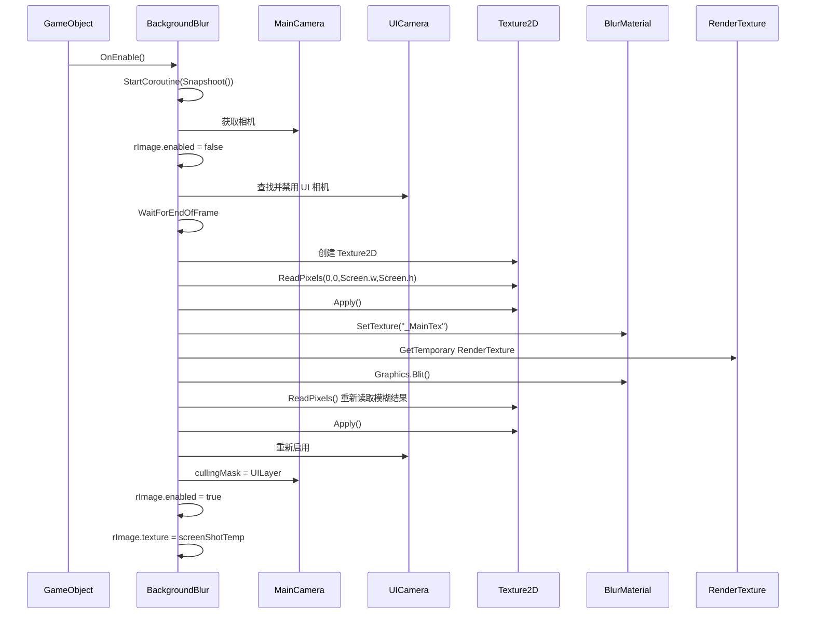

# BackgroundBlur.cs 注解文档

## 文件基本信息

| 属性 | 值 |
|------|-----|
| **文件名** | BackgroundBlur.cs |
| **路径** | Assets/Scripts/Mono/Module/UI/BackgroundBlur.cs |
| **所属模块** | 框架层 → Mono/Module/UI |
| **文件职责** | UI 弹窗背景截图模糊效果，为弹窗提供毛玻璃背景 |

---

## 类说明

### BackgroundBlur

| 属性 | 说明 |
|------|------|
| **职责** | 捕获屏幕截图并应用模糊材质，作为 UI 弹窗的背景 |
| **继承关系** | `MonoBehaviour` |
| **依赖组件** | `RawImage` (RequiredComponent) |
| **执行模式** | `[ExecuteAlways]` - 编辑器模式下也执行 |

**设计模式**: 单例纹理缓存 + 引用计数

```csharp
// 引用计数管理纹理生命周期
public static int RefCount = 0;
private static Texture2D screenShotTemp;
```

---

## 字段与属性

| 名称 | 类型 | 访问级别 | 说明 |
|------|------|----------|------|
| `blurMaterial` | `Material` | `public` | 模糊效果材质（Shader） |
| `rImage` | `RawImage` | `public` | RawImage 组件引用 |
| `screenShotTemp` | `Texture2D` | `private static` | 静态屏幕截图纹理缓存 |
| `RefCount` | `int` | `public static` | 引用计数，管理纹理生命周期 |

---

## 方法说明

### Awake()

**签名**:
```csharp
private void Awake()
```

**职责**: 编辑器模式下初始化组件引用

**核心逻辑**:
```
1. 获取 RawImage 组件引用
2. (注释) 加载模糊材质资源
```

**注意**: 仅在 `UNITY_EDITOR` 下执行

---

### OnEnable()

**签名**:
```csharp
private void OnEnable()
```

**职责**: 组件启用时启动截图协程

**核心逻辑**:
```
1. 启动 Snapshoot() 协程
```

**调用时机**: GameObject 启用时自动调用

---

### Snapshoot()

**签名**:
```csharp
private IEnumerator Snapshoot()
```

**职责**: 截图入口协程，检查组件状态

**核心逻辑**:
```
1. 检查 rImage 是否为空
2. 为空 → 输出警告，等待一帧
3. 不为空 → 调用 ReadPixels()
```

---

### ReadPixels()

**签名**:
```csharp
private IEnumerator ReadPixels()
```

**职责**: 执行屏幕截图和模糊处理（核心方法）

**核心逻辑**:
```
1. 获取主相机 Camera.main
2. 禁用 rImage 避免拍到自身
3. 等待引用计数>0 且纹理为空时延迟一帧
4. RefCount++ 增加引用计数
5. 如果纹理为空（首次创建）:
   a. 查找 UI 相机（从 UniversalAdditionalCameraData 的 cameraStack）
   b. 临时禁用 UI 相机
   c. 等待一帧确保渲染完成
   d. 创建 Texture2D (Screen.width x Screen.height)
   e. ReadPixels() 读取屏幕像素
   f. Apply() 应用纹理
   g. 如果 blurMaterial 存在:
      - 创建临时 RenderTexture
      - 使用 Graphics.Blit 应用模糊 Shader
      - 重新读取模糊后的像素
   h. 重新启用 UI 相机
6. 设置相机 cullingMask 为 UILayer
7. 启用 rImage 并设置 texture = screenShotTemp
```

**关键技术点**:

```csharp
// 查找 UI 相机
var cd = mainCamera.GetUniversalAdditionalCameraData();
for (int i = 0; i < cd.cameraStack.Count; i++)
{
    if (cd.cameraStack[i].gameObject.layer == LayerMask.NameToLayer("UI"))
    {
        uiCamera = cd.cameraStack[i].gameObject;
        break;
    }
}

// 模糊处理
RenderTexture destination = RenderTexture.GetTemporary(...);
blurMaterial.SetTexture("_MainTex", screenShotTemp);
Graphics.Blit(null, destination, blurMaterial);
```

---

### OnDisable()

**签名**:
```csharp
private void OnDisable()
```

**职责**: 组件禁用时清理资源

**核心逻辑**:
```
1. RefCount-- 减少引用计数
2. 如果 RefCount <= 0:
   a. 恢复相机 cullingMask 为 AllLayer
   b. 销毁 screenShotTemp 纹理
```

**资源管理**: 使用引用计数确保多个 BackgroundBlur 实例共享纹理时不会过早销毁

---

## 工作流程

### 截图流程图



### 引用计数管理

```
实例 A OnEnable() → RefCount = 1 → 创建纹理
实例 B OnEnable() → RefCount = 2 → 复用纹理
实例 A OnDisable() → RefCount = 1 → 保留纹理
实例 B OnDisable() → RefCount = 0 → 销毁纹理
```

---

## 使用示例

### 示例 1: 基础使用

```csharp
// 在 UI 弹窗预制体上添加 BackgroundBlur 组件
// 1. 添加 RawImage 组件（必需）
// 2. 添加 BackgroundBlur 组件
// 3. 赋值模糊材质（使用 uitexblur.mat）

// 代码控制
var blur = GetComponent<BackgroundBlur>();
blur.blurMaterial = yourBlurMaterial;
```

### 示例 2: 多弹窗共享

```csharp
// 多个弹窗可以同时使用 BackgroundBlur
// 引用计数自动管理纹理生命周期

// 弹窗 A 打开
popupA.SetActive(true);  // RefCount = 1, 创建纹理

// 弹窗 B 打开（嵌套弹窗）
popupB.SetActive(true);  // RefCount = 2, 复用纹理

// 弹窗 A 关闭
popupA.SetActive(false); // RefCount = 1, 保留纹理

// 弹窗 B 关闭
popupB.SetActive(false); // RefCount = 0, 销毁纹理
```

---

## 注意事项

### ⚠️ 性能考虑

1. **屏幕截图开销**: ReadPixels() 是 GPU→CPU 的同步操作，避免频繁调用
2. **纹理大小**: 使用 Screen.width x Screen.height，高分辨率设备内存占用大
3. **模糊计算**: Graphics.Blit 需要额外的 RenderTexture 和 Shader 计算

### ⚠️ 使用限制

1. **仅支持 URP**: 依赖 `GetUniversalAdditionalCameraData()`
2. **单纹理共享**: 所有实例共享同一张截图，同时打开多个弹窗时显示相同背景
3. **静态截图**: 截图后不会更新，背景内容变化时需要重新启用组件

### ⚠️ 编辑器模式

```csharp
#if UNITY_EDITOR
// 编辑器模式下需要手动赋值 blurMaterial
// 运行时加载代码已注释
#endif
```

---

## 相关文档

- [RawImage](https://docs.unity3d.com/Manual/class-RawImage.html) - Unity RawImage 组件
- [Graphics.Blit](https://docs.unity3d.com/ScriptReference/Graphics.Blit.html) - 渲染纹理复制
- [URP Camera Stack](https://docs.unity3d.com/Packages/com.unity.render-pipelines.universal@latest) - URP 相机栈

---

*文档生成时间：2026-03-01 | OpenClaw AI 助手*
