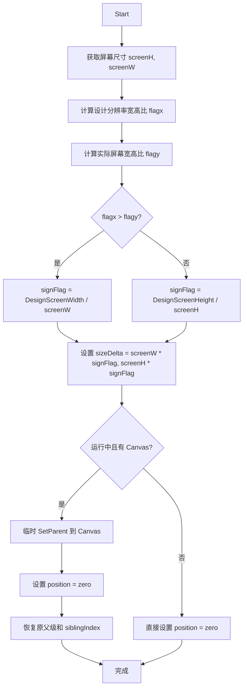
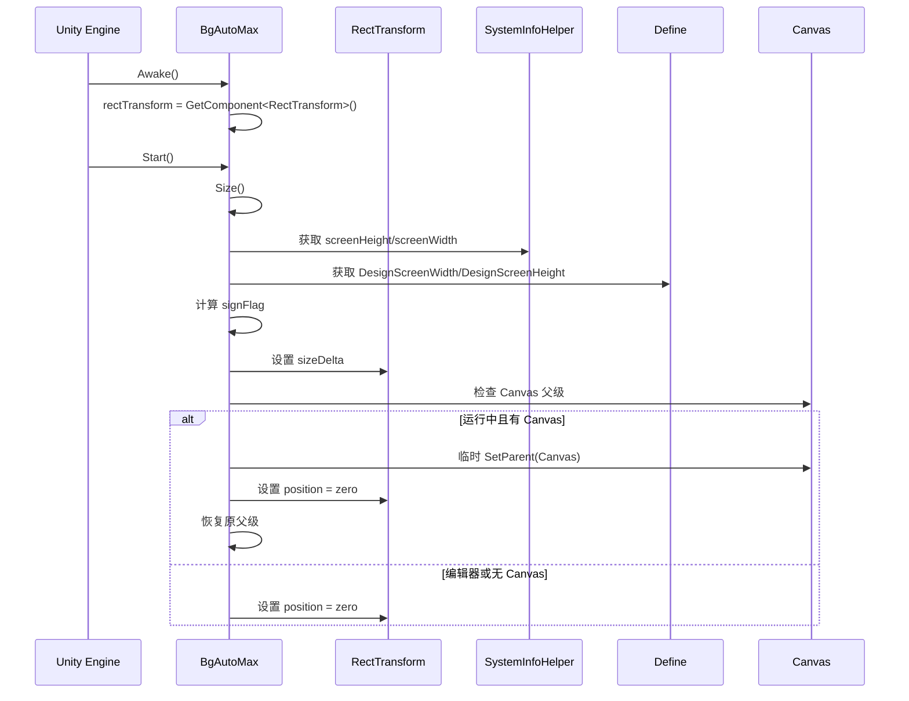

# BgAutoMax.cs 注解文档

## 文件基本信息

| 属性 | 值 |
|------|-----|
| **文件名** | BgAutoMax.cs |
| **路径** | Assets/Scripts/Mono/Module/UI/BgAutoMax.cs |
| **所属模块** | Mono/Module/UI - UI 辅助组件 |
| **文件职责** | 背景自适应组件，自动调整 UI 背景大小以适配不同屏幕分辨率 |

---

## 类/结构体说明

### BgAutoMax 类

| 属性 | 说明 |
|------|------|
| **职责** | 根据屏幕分辨率自动调整 UI 背景大小，确保背景完全覆盖屏幕 |
| **泛型参数** | 无 |
| **继承关系** | `MonoBehaviour` |
| **实现的接口** | 无 |
| **特性** | `[ExecuteAlways]` - 在编辑器中也执行 |

**设计模式**: 自适应布局 + 屏幕适配

```csharp
// 使用示例
// 在 Unity 编辑器中将组件添加到背景 UI 元素
// 启动时自动计算并调整大小以适配屏幕
```

---

## 字段与属性（按重要程度排序）

| 名称 | 类型 | 访问级别 | 说明 |
|------|------|----------|------|
| `rectTransform` | `RectTransform` | `private` | 自身的矩形变换组件引用 |

---

## 方法说明（按重要程度排序）

### Awake()

**签名**:
```csharp
private void Awake()
```

**职责**: 初始化，获取 RectTransform 引用

**核心逻辑**:
```
1. 获取自身的 RectTransform 组件
```

**调用者**: Unity 生命周期

---

### Start()

**签名**:
```csharp
void Start()
```

**职责**: 启动时执行一次自适应调整

**核心逻辑**:
```
1. 调用 Size() 方法计算并调整大小
```

**调用者**: Unity 生命周期

**被调用者**: `Size()`

---

### Size()

**签名**:
```csharp
void Size()
```

**职责**: 计算并调整背景大小以适配屏幕

**核心逻辑**:
```
1. 获取屏幕高度和宽度（SystemInfoHelper.screenHeight/screenWidth）
2. 计算设计分辨率宽高比 flagx = DesignScreenWidth / DesignScreenHeight
3. 计算实际屏幕宽高比 flagy = screenWidth / screenHeight
4. 根据宽高比比较结果计算缩放因子 signFlag：
   - 如果 flagx > flagy：signFlag = DesignScreenWidth / screenWidth
   - 否则：signFlag = DesignScreenHeight / screenHeight
5. 设置 rectTransform.sizeDelta = (screenW * signFlag, screenH * signFlag)
6. 如果在运行中且有 Canvas 父级：
   - 临时将自身.SetParent 到 Canvas.transform
   - 设置 localPosition 和 anchoredPosition 为 zero
   - 恢复原来的父级和 siblingIndex
7. 否则（编辑器或无 Canvas）：
   - 直接设置 localPosition 和 anchoredPosition 为 zero
```

**调用者**: `Start()`

**被调用者**: `SystemInfoHelper.screenHeight`, `SystemInfoHelper.screenWidth`, `Define.DesignScreenWidth`, `Define.DesignScreenHeight`

---

## Mermaid 流程图

### 屏幕适配计算流程



### 组件生命周期



---

## 使用示例

### 基础用法

```csharp
// 在 Unity 编辑器中配置：
// 1. 将 BgAutoMax 组件添加到背景 UI 元素的 GameObject
// 2. 确保该元素有 RectTransform 组件
// 3. 启动游戏时自动适配屏幕

// 无需代码调用，组件自动工作
```

### 编辑器模式

```csharp
// 由于使用了 [ExecuteAlways] 特性
// 在 Unity 编辑器中也能看到适配效果
// 方便 UI 设计师实时预览

// 注意：预制体实例在编辑器中会跳过某些操作
#if UNITY_EDITOR
var type = UnityEditor.PrefabUtility.GetPrefabAssetType(gameObject);
var status = UnityEditor.PrefabUtility.GetPrefabInstanceStatus(gameObject);
if (type != PrefabAssetType.NotAPrefab && status != PrefabInstanceStatus.NotAPrefab)
{
    return; // 预制体实例跳过
}
#endif
```

### 手动触发调整

```csharp
// 如果需要手动触发调整（如屏幕旋转后）
var bgAutoMax = GetComponent<BgAutoMax>();
// 可以通过反射或修改组件调用 Size() 方法
// 或者在屏幕旋转事件中重新应用逻辑
```

---

## 相关文档链接

- [SystemInfoHelper.cs.md](../../../Helper/SystemInfoHelper.cs.md) - 系统信息助手
- [Define.cs.md](../../../Define.cs.md) - 全局常量定义
- [UIManager.cs.md](../../../../Code/Module/UI/UIManager.cs.md) - UI 管理系统

---

*最后更新：2026-03-01*
