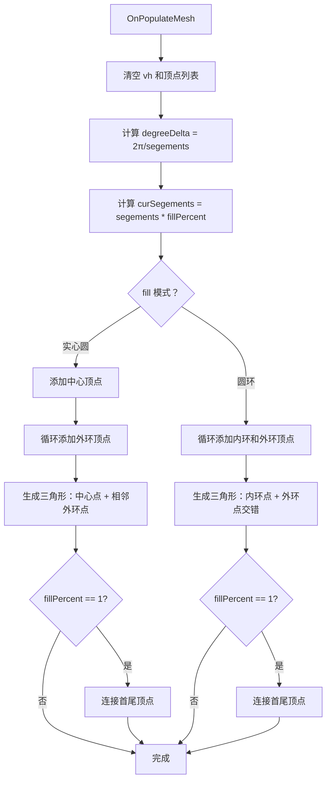
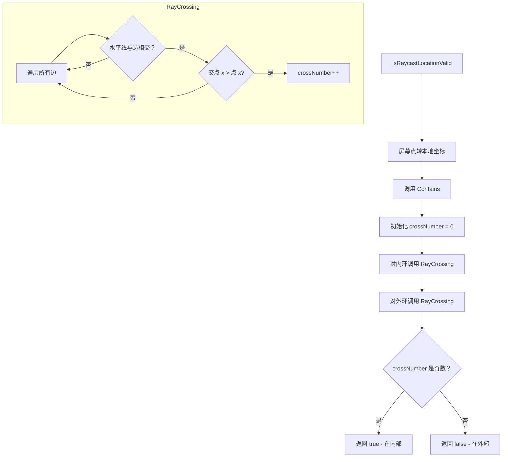

# CircleImage.cs 注解文档

## 文件基本信息

| 属性 | 值 |
|------|-----|
| **文件名** | CircleImage.cs |
| **路径** | Assets/Scripts/Mono/Module/UI/CircleImage.cs |
| **所属模块** | Mono/Module/UI - UI 辅助组件 |
| **文件职责** | 圆形/扇形 UI 图片组件，支持圆环、扇形填充和射线检测 |

---

## 类/结构体说明

### CircleImage 类

| 属性 | 说明 |
|------|------|
| **职责** | 继承自 Unity Image，提供圆形、扇形、圆环的渲染和射线检测功能 |
| **泛型参数** | 无 |
| **继承关系** | `Image` |
| **实现的接口** | 无 |
| **菜单路径** | `UI/Circle Image` |

**设计模式**: 网格生成 + 射线检测算法

```csharp
// 使用示例
// 在 Unity 编辑器中通过菜单 UI/Circle Image 添加
// 配置 fillPercent、thickness、segements 等参数
```

---

## 字段与属性（按重要程度排序）

| 名称 | 类型 | 访问级别 | 说明 |
|------|------|----------|------|
| `fillPercent` | `float` | `public` | 圆形或扇形填充比例（0-1），[Range(0, 1)] |
| `fill` | `bool` | `public` | 是否填充圆形（true=实心圆，false=圆环） |
| `thickness` | `float` | `public` | 圆环宽度 |
| `segements` | `int` | `public` | 分段数（3-100），决定圆形的平滑度 |
| `innerVertices` | `List<Vector3>` | `private` | 内环顶点列表（圆环模式使用） |
| `outterVertices` | `List<Vector3>` | `private` | 外环顶点列表 |

---

## 方法说明（按重要程度排序）

### Awake()

**签名**:
```csharp
void Awake()
```

**职责**: 初始化顶点列表

**核心逻辑**:
```
1. 初始化 innerVertices 列表
2. 初始化 outterVertices 列表
```

**调用者**: Unity 生命周期

---

### Update()

**签名**:
```csharp
void Update()
```

**职责**: 每帧限制 thickness 范围

**核心逻辑**:
```
1. 将 thickness 限制在 0 到 rectTransform.rect.width / 2 之间
```

**调用者**: Unity 生命周期

---

### OnPopulateMesh()

**签名**:
```csharp
protected override void OnPopulateMesh(VertexHelper vh)
```

**职责**: 生成圆形/扇形/圆环的网格

**核心逻辑**:
```
1. 清空 VertexHelper
2. 清空 innerVertices 和 outterVertices
3. 计算每段的角度 degreeDelta = 2π / segements
4. 计算实际分段数 curSegements = segements * fillPercent
5. 计算外半径和内半径
6. 计算 UV 坐标缩放
7. 根据 fill 模式选择渲染方式：
   - fill=true（实心圆/扇形）:
     a. 添加中心顶点
     b. 循环添加外环顶点
     c. 生成三角形（中心点 + 相邻外环点）
   - fill=false（圆环）:
     a. 循环添加内环和外环顶点
     b. 生成三角形（内环点 + 外环点交错）
8. 如果 fillPercent==1，连接首尾顶点
```

**调用者**: Unity UI 系统（网格重建时）

**被调用者**: `rectTransform.rect`, `DataUtility.GetOuterUV()`

---

### IsRaycastLocationValid()

**签名**:
```csharp
public override bool IsRaycastLocationValid(Vector2 screenPoint, Camera eventCamera)
```

**职责**: 射线检测，判断点击位置是否在圆形区域内

**核心逻辑**:
```
1. 获取 overrideSprite（如果有）
2. 将屏幕点转换为本地坐标
3. 调用 Contains() 判断是否在多边形内
```

**调用者**: Unity UI 射线检测系统

**被调用者**: `RectTransformUtility.ScreenPointToLocalPointInRectangle()`, `Contains()`

---

### Contains()

**签名**:
```csharp
private bool Contains(Vector2 p, List<Vector3> outterVertices, List<Vector3> innerVertices)
```

**职责**: 判断点是否在圆环区域内

**核心逻辑**:
```
1. 初始化交叉数 crossNumber = 0
2. 对内环调用 RayCrossing()
3. 对外环调用 RayCrossing()
4. 返回 crossNumber 的奇偶性（奇数=在内部）
```

**调用者**: `IsRaycastLocationValid()`

**被调用者**: `RayCrossing()`

---

### RayCrossing()

**签名**:
```csharp
private void RayCrossing(Vector2 p, List<Vector3> vertices, ref int crossNumber)
```

**职责**: 射线交叉算法，判断点是否在多边形内

**核心逻辑**:
```
1. 遍历所有边（顶点 i 到顶点 i+1）
2. 检查点的水平线是否与边相交：
   - 条件：(v1.y <= p.y && v2.y > p.y) || (v1.y > p.y && v2.y <= p.y)
3. 如果相交，计算交点 x 坐标
4. 如果交点 x > 点的 x，crossNumber++
5. 最终 crossNumber 为奇数表示点在多边形内
```

**调用者**: `Contains()`

---

## Mermaid 流程图

### 网格生成流程（实心圆模式）



### 射线检测算法



---

## 使用示例

### 基础用法 - 实心圆

```csharp
// 在 Unity 编辑器中配置：
// 1. 通过菜单 UI/Circle Image 添加 CircleImage 组件
// 2. 设置 fill = true（实心圆）
// 3. 设置 fillPercent = 1.0（完整圆形）
// 4. 设置 segements = 100（平滑度）

// 用于血条、进度条等
circleImage.fillPercent = 0.75f; // 75% 血量
```

### 扇形填充

```csharp
// 创建扇形效果（如技能冷却）
circleImage.fill = true;
circleImage.fillPercent = 0.25f; // 1/4 扇形（90 度）
circleImage.segements = 60;
```

### 圆环模式

```csharp
// 创建圆环效果（如环形进度条）
circleImage.fill = false;
circleImage.thickness = 10f; // 圆环宽度
circleImage.fillPercent = 0.5f; // 半圆环
```

### 动态进度条

```csharp
// 在代码中动态更新填充比例
public class HealthBar : MonoBehaviour
{
    public CircleImage healthCircle;
    public float currentHealth = 100f;
    public float maxHealth = 100f;
    
    void Update()
    {
        float healthPercent = currentHealth / maxHealth;
        healthCircle.fillPercent = healthPercent;
    }
}
```

---

## 相关文档链接

- [CircleRawImage.cs.md](./CircleRawImage.cs.md) - 圆形 RawImage 组件
- [UIImage.cs.md](../../../../Code/Module/UIComponent/UIImage.cs.md) - UI 图片组件
- [RayCrossing 算法](https://en.wikipedia.org/wiki/Point_in_polygon) - 点多边形检测算法

---

*最后更新：2026-03-01*
