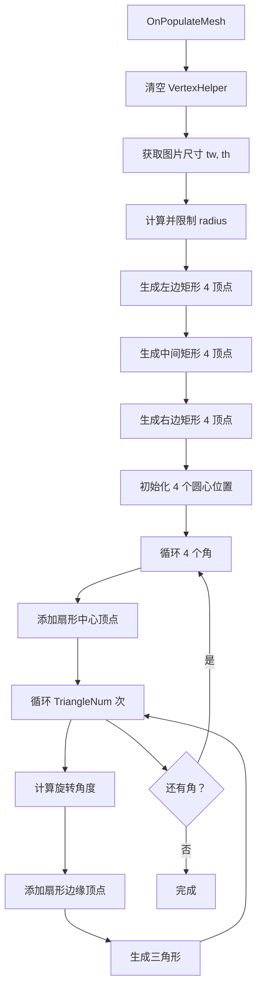
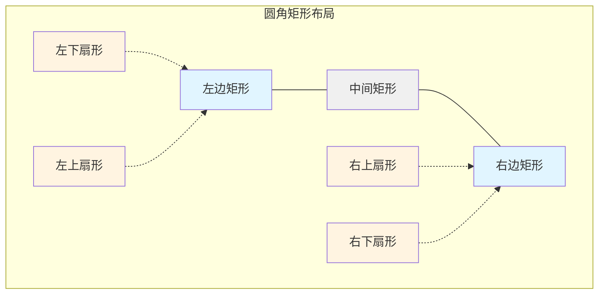

# CircleRawImage.cs 注解文档

## 文件基本信息

| 属性 | 值 |
|------|-----|
| **文件名** | CircleRawImage.cs |
| **路径** | Assets/Scripts/Mono/Module/UI/CircleRawImage.cs |
| **所属模块** | Mono/Module/UI - UI 辅助组件 |
| **文件职责** | 圆形 RawImage 组件，在矩形图片四角添加圆角效果 |

---

## 类/结构体说明

### CircleRawImage 类

| 属性 | 说明 |
|------|------|
| **职责** | 继承自 Unity RawImage，通过修改网格在矩形四角添加圆角效果 |
| **泛型参数** | 无 |
| **继承关系** | `RawImage` |
| **实现的接口** | 无 |

**设计模式**: 网格变形 + 扇形生成

```csharp
// 使用示例
// 将普通 RawImage 替换为 CircleRawImage
// 调整 Radius 参数控制圆角大小
```

---

## 字段与属性（按重要程度排序）

| 名称 | 类型 | 访问级别 | 说明 |
|------|------|----------|------|
| `Radius` | `float` | `public` | 内切圆半径，控制圆角大小（默认 2） |
| `TriangleNum` | `int` | `protected` | 每个扇形的三角形数量，决定圆角平滑度（默认 36） |

---

## 方法说明（按重要程度排序）

### OnPopulateMesh()

**签名**:
```csharp
protected override void OnPopulateMesh(VertexHelper vh)
```

**职责**: 生成带圆角的矩形网格

**核心逻辑**:
```
1. 清空 VertexHelper
2. 获取图片宽高 tw, th 和半宽半高 twr, thr
3. 计算并限制 radius 范围（0 到 tw/2）
4. 生成三个矩形区域：
   a. 左边矩形（-twr 到 -twr+radius）
   b. 中间矩形（-twr+radius 到 twr-radius）
   c. 右边矩形（twr-radius 到 twr）
5. 生成四个圆角扇形：
   a. 左下角圆心 (-twr+radius, -thr+radius)
   b. 左上角圆心 (-twr+radius, thr-radius)
   c. 右上角圆心 (twr-radius, thr-radius)
   d. 右下角圆心 (twr-radius, -thr+radius)
6. 每个扇形生成 TriangleNum 个三角形
7. 计算并设置 UV 坐标
```

**调用者**: Unity UI 系统（网格重建时）

**被调用者**: `AddVert()`, `GetTextureUVS()`

---

### GetTextureUVS()

**签名**:
```csharp
protected Vector2[] GetTextureUVS(Vector2[] vhs, float tw, float th)
```

**职责**: 计算顶点的 UV 坐标

**核心逻辑**:
```
1. 遍历所有顶点
2. 将顶点坐标转换为 UV 坐标（0-1 范围）
3. UV = (x/tw + 0.5, y/th + 0.5)
```

**调用者**: `AddVert()`, `OnPopulateMesh()`

---

### AddVert()

**签名**:
```csharp
protected void AddVert(Vector2 pos0, float tw, float th, VertexHelper vh, UIVertex vert)
```

**职责**: 添加顶点到网格

**核心逻辑**:
```
1. 设置顶点位置
2. 计算并设置 UV 坐标
3. 添加到 VertexHelper
```

**调用者**: `OnPopulateMesh()`

**被调用者**: `GetTextureUVS()`

---

## Mermaid 流程图

### 圆角矩形网格生成流程



### 圆角布局示意



---

## 使用示例

### 基础用法

```csharp
// 在 Unity 编辑器中配置：
// 1. 将 RawImage 组件替换为 CircleRawImage
// 2. 设置 Radius 参数控制圆角大小
// 3. 调整 TriangleNum 控制平滑度

// 小圆角
circleRawImage.Radius = 2f;
circleRawImage.TriangleNum = 36;

// 大圆角（接近圆形）
circleRawImage.Radius = 10f;
circleRawImage.TriangleNum = 60;
```

### 动态圆角效果

```csharp
// 在代码中动态调整圆角
public class DynamicRoundedImage : MonoBehaviour
{
    public CircleRawImage circleRawImage;
    public float targetRadius = 5f;
    public float smoothSpeed = 2f;
    
    void Update()
    {
        // 平滑过渡圆角大小
        circleRawImage.Radius = Mathf.Lerp(
            circleRawImage.Radius, 
            targetRadius, 
            Time.deltaTime * smoothSpeed
        );
    }
}
```

### 圆角按钮

```csharp
// 创建圆角按钮背景
// 1. 创建 RawImage 显示按钮背景图
// 2. 添加 CircleRawImage 组件
// 3. 设置合适的 Radius 值
// 4. 添加 Button 组件

// 注意：CircleRawImage 会覆盖 RawImage 的网格
// 确保纹理正确设置
```

---

## 与 CircleImage 对比

| 特性 | CircleImage | CircleRawImage |
|------|-------------|----------------|
| **基类** | Image | RawImage |
| **用途** | 圆形/扇形/圆环 | 圆角矩形 |
| **纹理** | Sprite | Texture |
| **填充模式** | 支持 fill/fillPercent | 固定圆角矩形 |
| **射线检测** | 自定义圆形检测 | 默认矩形检测 |

---

## 相关文档链接

- [CircleImage.cs.md](./CircleImage.cs.md) - 圆形/扇形 Image 组件
- [UIRawImage.cs.md](../../../../Code/Module/UIComponent/UIRawImage.cs.md) - UI RawImage 组件
- [UIImage.cs.md](../../../../Code/Module/UIComponent/UIImage.cs.md) - UI Image 组件

---

*最后更新：2026-03-01*
