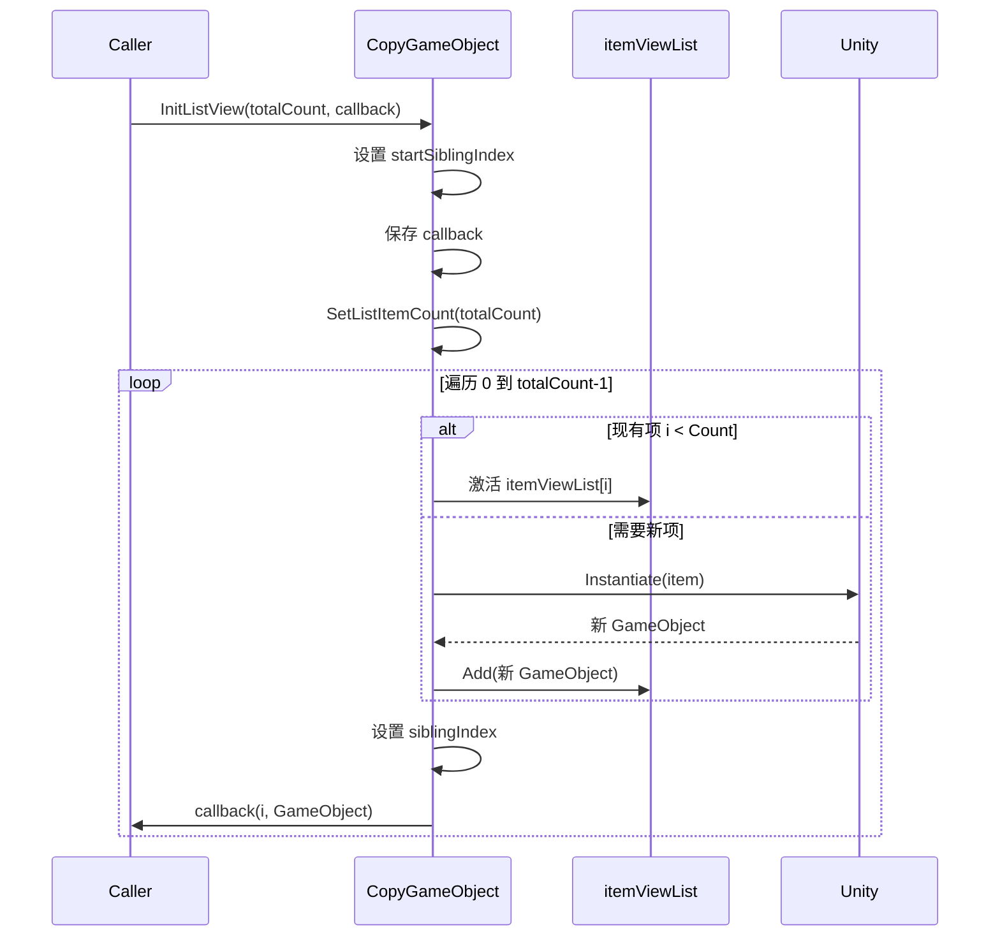
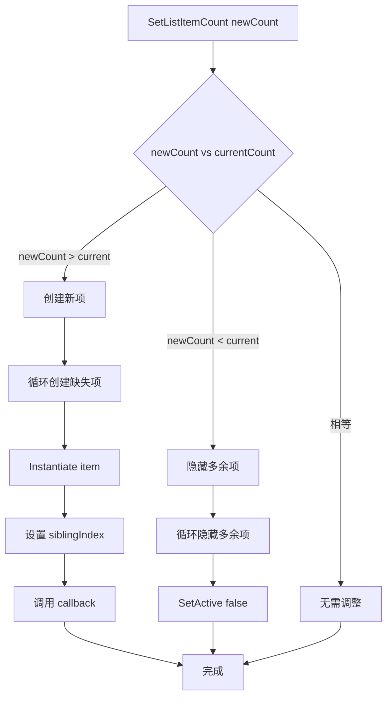

# CopyGameObject.cs 注解文档

## 文件基本信息

| 属性 | 值 |
|------|-----|
| **文件名** | CopyGameObject.cs |
| **路径** | Assets/Scripts/Mono/Module/UI/CopyGameObject.cs |
| **所属模块** | Mono/Module/UI - UI 辅助组件 |
| **文件职责** | 游戏对象复制组件，用于快速创建和管理多个相同 UI 元素的实例 |

---

## 类/结构体说明

### CopyGameObject 类

| 属性 | 说明 |
|------|------|
| **职责** | 复制并管理多个相同 GameObject 实例，支持动态数量调整和刷新 |
| **泛型参数** | 无 |
| **继承关系** | `MonoBehaviour` |
| **实现的接口** | 无 |

**设计模式**: 对象池简化版 + 列表管理

```csharp
// 使用示例
// 用于创建多个相同的 UI 项（如列表项、格子等）
// 避免手动实例化和管理的繁琐
```

---

## 字段与属性（按重要程度排序）

| 名称 | 类型 | 访问级别 | 说明 |
|------|------|----------|------|
| `item` | `GameObject` | `public` | 要复制的原始 GameObject（模板） |
| `itemViewList` | `List<GameObject>` | `private` | 已创建的实例列表 |
| `showCount` | `int` | `private` | 当前显示的数量 |
| `startSiblingIndex` | `int?` | `private` | 起始兄弟索引（排序位置） |
| `onGetItemCallback` | `Action<int, GameObject>` | `private` | 获取项时的回调函数 |

---

## 方法说明（按重要程度排序）

### Awake()

**签名**:
```csharp
private void Awake()
```

**职责**: 初始化，记录 item 的起始兄弟索引

**核心逻辑**:
```
1. 检查 item 的父级是否为自身 transform
2. 如果是，记录 item 的 siblingIndex 到 startSiblingIndex
```

**调用者**: Unity 生命周期

---

### OnEnable()

**签名**:
```csharp
private void OnEnable()
```

**职责**: 启用时隐藏模板 item

**核心逻辑**:
```
1. 设置 item.SetActive(false)
```

**调用者**: Unity 生命周期

---

### InitListView()

**签名**:
```csharp
public void InitListView(int totalCount, Action<int, GameObject> onGetItemCallback = null, int? startSiblingIndex = null)
```

**职责**: 初始化列表视图

**核心逻辑**:
```
1. 如果提供了 startSiblingIndex，设置并限制范围
2. 保存 onGetItemCallback 回调
3. 调用 SetListItemCount(totalCount) 创建实例
```

**参数**:
- `totalCount`: 总项数
- `onGetItemCallback`: 获取每项时的回调（索引，GameObject）
- `startSiblingIndex`: 起始兄弟索引（可选）

**调用者**: 外部代码

**被调用者**: `SetListItemCount()`

---

### SetListItemCount()

**签名**:
```csharp
public void SetListItemCount(int totalCount, int? startSiblingIndex = null)
```

**职责**: 设置列表项数量，创建或销毁实例

**核心逻辑**:
```
1. 如果 totalCount > 10，输出警告日志
2. 检查 item 是否为空
3. 如果提供了 startSiblingIndex，设置并限制范围
4. 保存 showCount = totalCount
5. 计算需要处理的总数 count = max(itemViewList.Count, totalCount)
6. 遍历 0 到 count-1：
   - 如果 i < itemViewList.Count 且 i < totalCount：激活现有项
   - 如果 i >= itemViewList.Count 且 i < totalCount：实例化新项
   - 如果 i >= totalCount：隐藏现有项
7. 设置每项的 siblingIndex
8. 调用 onGetItemCallback 初始化每项
```

**调用者**: `InitListView()`, 外部代码

---

### RefreshAllShownItem()

**签名**:
```csharp
public void RefreshAllShownItem(int? startSiblingIndex = null)
```

**职责**: 刷新所有显示项

**核心逻辑**:
```
1. 调用 RefreshAllShownItemAsync().Coroutine()
```

**调用者**: 外部代码

**被调用者**: `RefreshAllShownItemAsync()`

---

### RefreshAllShownItemAsync()

**签名**:
```csharp
private async ETTask RefreshAllShownItemAsync(int? startSiblingIndex = null)
```

**职责**: 异步刷新所有显示项

**核心逻辑**:
```
1. 如果提供了 startSiblingIndex，设置并限制范围
2. 遍历 0 到 showCount-1
3. 对每项调用 onGetItemCallback 刷新
```

**调用者**: `RefreshAllShownItem()`

---

### GetItemByIndex()

**签名**:
```csharp
public GameObject GetItemByIndex(int index)
```

**职责**: 根据索引获取项

**返回**: 指定索引的 GameObject

**调用者**: 外部代码

---

### GetListItemCount()

**签名**:
```csharp
public int GetListItemCount()
```

**职责**: 获取当前列表项数量

**返回**: showCount

**调用者**: 外部代码

---

### Clear()

**签名**:
```csharp
public void Clear()
```

**职责**: 清空所有实例

**核心逻辑**:
```
1. 倒序遍历 itemViewList
2. 销毁每项
3. 清空列表
```

**调用者**: 外部代码

---

## Mermaid 流程图

### 列表初始化流程



### 动态调整数量流程



---

## 使用示例

### 基础用法 - 创建列表项

```csharp
// 在 Unity 编辑器中配置：
// 1. 将 CopyGameObject 组件添加到容器 GameObject
// 2. 将模板 item 拖拽赋值给 item 字段
// 3. 模板 item 设为子对象并隐藏

// 在代码中初始化
public class ItemList : MonoBehaviour
{
    public CopyGameObject copyGameObject;
    public List<ItemData> items;
    
    void Start()
    {
        copyGameObject.InitListView(items.Count, (index, go) =>
        {
            // 初始化每项
            var itemUI = go.GetComponent<ItemUI>();
            itemUI.Setup(items[index]);
        });
    }
}
```

### 动态调整数量

```csharp
// 动态改变列表项数量
copyGameObject.SetListItemCount(newCount);

// 数量增加：自动创建新项
// 数量减少：自动隐藏多余项
```

### 刷新所有项

```csharp
// 数据更新后刷新所有显示项
copyGameObject.RefreshAllShownItem();

// 或者带回调刷新
copyGameObject.RefreshAllShownItem((index, go) =>
{
    var itemUI = go.GetComponent<ItemUI>();
    itemUI.Refresh(items[index]);
});
```

### 获取特定项

```csharp
// 获取索引为 3 的项
GameObject item3 = copyGameObject.GetItemByIndex(3);

// 修改该项
item3.GetComponent<ItemUI>().Highlight();
```

### 清空列表

```csharp
// 销毁所有实例
copyGameObject.Clear();
```

---

## 注意事项

1. **性能警告**: 代码中有日志提示 `totalCount 不建议超过 10 个`
   - 适用于少量 UI 项的场景
   - 大量项建议使用 UILoopListView2 或 UILoopGridView

2. **模板管理**: 
   - 模板 item 在 OnEnable 时自动隐藏
   - 确保模板是子对象

3. **兄弟索引**: 
   - startSiblingIndex 控制项的排序位置
   - 确保索引在有效范围内

---

## 相关文档链接

- [UILoopListView2.cs.md](../../../../Code/Module/UIComponent/UILoopListView2.cs.md) - 循环列表视图（大量项）
- [UILoopGridView.cs.md](../../../../Code/Module/UIComponent/UILoopGridView.cs.md) - 循环网格视图
- [UICopyGameObject.cs.md](../../../../Code/Module/UIComponent/UICopyGameObject.cs.md) - UIComponent 中的类似组件

---

*最后更新：2026-03-01*
