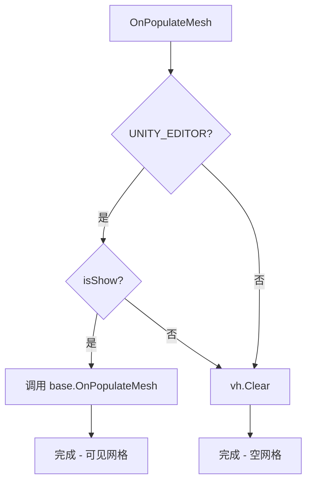
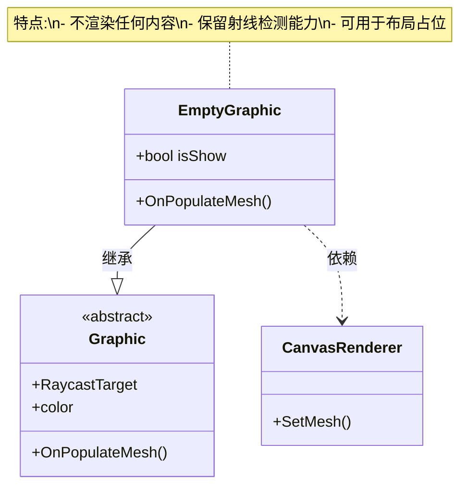

# EmptyGraphic.cs 注解文档

## 文件基本信息

| 属性 | 值 |
|------|-----|
| **文件名** | EmptyGraphic.cs |
| **路径** | Assets/Scripts/Mono/Module/UI/EmptyGraphic.cs |
| **所属模块** | Mono/Module/UI - UI 辅助组件 |
| **文件职责** | 空图形组件，用于接收射线检测但不渲染任何内容 |

---

## 类/结构体说明

### EmptyGraphic 类

| 属性 | 说明 |
|------|------|
| **职责** | 继承自 Unity Graphic，创建一个不可见但可接收射线检测的 UI 元素 |
| **泛型参数** | 无 |
| **继承关系** | `Graphic` |
| **实现的接口** | 无 |
| **依赖组件** | `[RequireComponent(typeof(CanvasRenderer))]` |

**设计模式**: 空实现 + 条件编译

```csharp
// 使用示例
// 用于创建透明点击区域
// 或作为 UI 布局占位符
```

---

## 字段与属性（按重要程度排序）

| 名称 | 类型 | 访问级别 | 说明 |
|------|------|----------|------|
| `isShow` | `bool` | `public` | 编辑器调试选项，是否在编辑器中显示网格 |

---

## 方法说明（按重要程度排序）

### OnPopulateMesh()

**签名**:
```csharp
protected override void OnPopulateMesh(VertexHelper vh)
```

**职责**: 生成网格（实际上是清空网格）

**核心逻辑**:
```
#if UNITY_EDITOR
    如果 isShow = true:
        调用 base.OnPopulateMesh(vh) 显示网格
    否则:
        清空 VertexHelper
#else
    清空 VertexHelper（始终不渲染）
#endif
```

**调用者**: Unity UI 系统（网格重建时）

---

## Mermaid 流程图

### 网格生成流程



### 组件用途



---

## 使用示例

### 基础用法 - 透明点击区域

```csharp
// 在 Unity 编辑器中配置：
// 1. 创建空 GameObject 或 UI 元素
// 2. 添加 EmptyGraphic 组件（自动添加 CanvasRenderer）
// 3. 调整 RectTransform 大小定义点击区域
// 4. 添加需要的交互组件（如 Button、PointerClick 等）

// EmptyGraphic 本身不可见，但可以接收射线检测
// 适合创建透明按钮或点击热区
```

### 布局占位符

```csharp
// 在布局中占位，不显示内容但占据空间
// 例如：在水平布局组中创建固定宽度的间隔

// 创建 EmptyGraphic
var empty = new GameObject("Spacer");
empty.AddComponent<EmptyGraphic>();
var rect = empty.GetComponent<RectTransform>();
rect.sizeDelta = new Vector2(50, 0); // 50 像素宽度的间隔

// 添加到布局组
layoutGroup.transform.AddChild(empty);
```

### 条件显示（编辑器调试）

```csharp
// 在编辑器中调试时显示网格
#if UNITY_EDITOR
var emptyGraphic = GetComponent<EmptyGraphic>();
emptyGraphic.isShow = true; // 在编辑器中可见

// 方便查看点击区域范围
#endif
```

### 配合事件系统使用

```csharp
// 创建透明点击区域接收事件
public class TransparentClickZone : MonoBehaviour
{
    void Start()
    {
        // 添加 EmptyGraphic 确保射线检测
        var empty = gameObject.AddComponent<EmptyGraphic>();
        
        // 添加点击事件
        var pointerClick = gameObject.AddComponent<PointerClick>();
        pointerClick.onClick.AddListener(() =>
        {
            Debug.Log("透明区域被点击");
        });
    }
}
```

---

## 与相关组件对比

| 组件 | 渲染 | 射线检测 | 用途 |
|------|------|----------|------|
| **EmptyGraphic** | ❌ | ✅ | 透明点击区域、占位符 |
| **Image** (空 Sprite) | ❌ | ✅ | 需要 Image 属性的场景 |
| **GraphicRaycaster** | N/A | ✅ | 整个 Canvas 的射线检测 |

---

## 注意事项

1. **CanvasRenderer 依赖**: 组件自动要求 CanvasRenderer，无需手动添加

2. **编辑器调试**: 
   - `isShow` 仅在编辑器中生效
   - 构建后始终不可见

3. **射线检测**: 
   - 确保 Canvas 有 GraphicRaycaster 组件
   - 确保 Graphic.raycastTarget = true（默认）

4. **性能**: 
   - 空网格不会增加渲染开销
   - 适合大量使用

---

## 相关文档链接

- [PointerClick.cs.md](./PointerClick.cs.md) - 点击事件组件
- [Graphic 基类](https://docs.unity3d.com/ScriptReference/UI.Graphic.html) - Unity 官方文档
- [UI 射线检测](https://docs.unity3d.com/Manual/UIRaycasting.html) - Unity 官方文档

---

*最后更新：2026-03-01*
