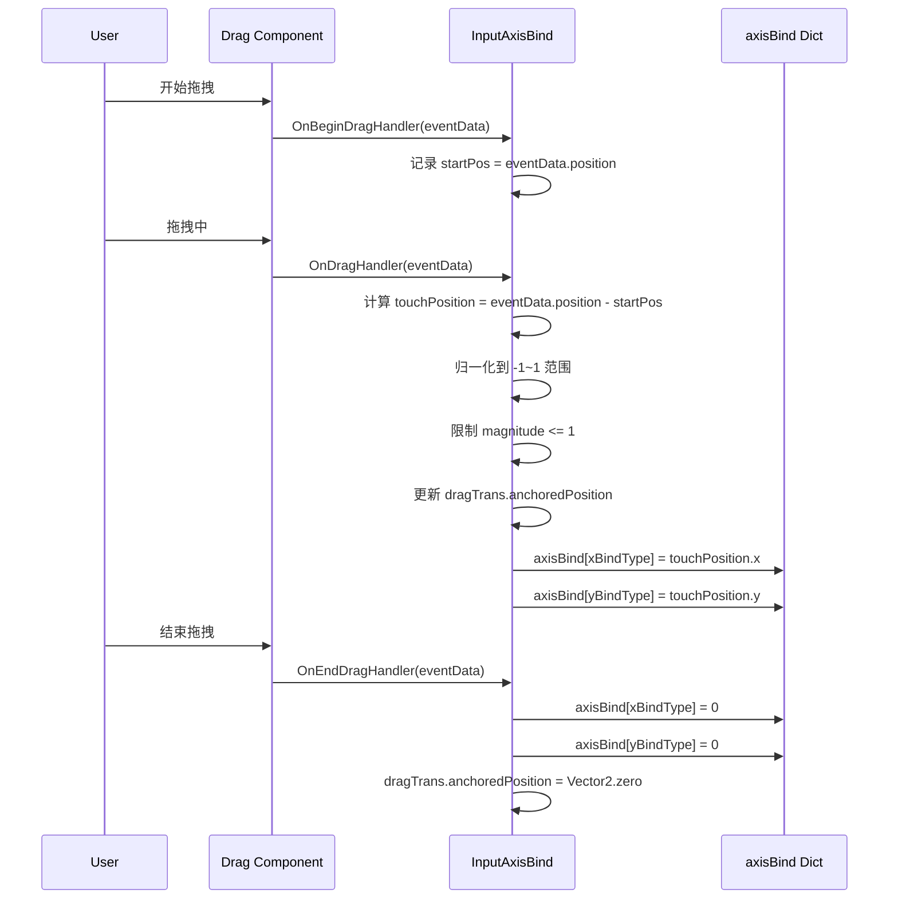
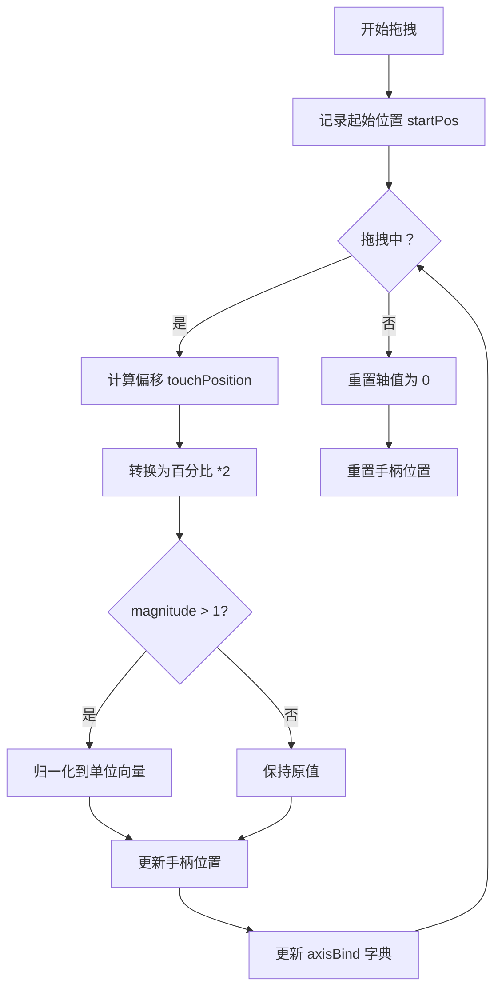

# InputAxisBind.cs 注解文档

## 文件基本信息

| 属性 | 值 |
|------|-----|
| **文件名** | InputAxisBind.cs |
| **路径** | Assets/Scripts/Mono/Module/UI/Input/InputAxisBind.cs |
| **所属模块** | Mono/Module/UI/Input - 输入绑定系统 |
| **文件职责** | 虚拟摇杆轴绑定，将 UI 拖拽操作映射为轴向输入值 |

---

## 类/结构体说明

### AxisType 枚举

| 属性 | 说明 |
|------|------|
| **职责** | 定义轴向类型（水平/垂直） |

| 成员 | 值 | 说明 |
|------|-----|------|
| `Vertical` | 0 | 垂直轴 |
| `Horizontal` | 1 | 水平轴 |

---

### InputAxisBind 类

| 属性 | 说明 |
|------|------|
| **职责** | 虚拟摇杆组件，将拖拽操作转换为轴向输入值 |
| **泛型参数** | 无 |
| **继承关系** | `MonoBehaviour` |
| **实现的接口** | 无 |

**设计模式**: 事件监听 + 状态保持

```csharp
// 使用示例
// 在 Unity 编辑器中将 Drag 组件赋值给 handle 字段
// 拖拽时自动更新 axisBind 字典中的值
```

---

## 字段与属性（按重要程度排序）

| 名称 | 类型 | 访问级别 | 说明 |
|------|------|----------|------|
| `handle` | `Drag` | `public` | 拖拽处理组件，负责监听拖拽事件 |
| `xBindType` | `AxisType` | `public` | X 轴绑定的轴向类型（默认 Horizontal） |
| `yBindType` | `AxisType` | `public` | Y 轴绑定的轴向类型（默认 Vertical） |
| `axisBind` | `Dictionary<AxisType, float>` | `public static` | 全局轴向输入值字典，存储当前输入状态 |
| `background` | `RectTransform` | `private` | 背景矩形变换组件 |
| `dragTrans` | `RectTransform` | `private` | 拖拽手柄的矩形变换组件 |
| `startPos` | `Vector2` | `private` | 拖拽起始位置 |

---

## 方法说明（按重要程度排序）

### Awake()

**签名**:
```csharp
private void Awake()
```

**职责**: 初始化组件，获取引用并注册事件监听

**核心逻辑**:
```
1. 获取 background RectTransform（当前 transform）
2. 获取 dragTrans RectTransform（handle 的 transform）
3. 注册 OnBeginDragHandler 事件
4. 注册 OnDragHandler 事件
5. 注册 OnEndDragHandler 事件
```

**调用者**: Unity 生命周期

---

### OnDestroy()

**签名**:
```csharp
private void OnDestroy()
```

**职责**: 清理资源，移除事件监听

**核心逻辑**:
```
1. 移除 OnBeginDragHandler 事件监听
2. 移除 OnDragHandler 事件监听
3. 移除 OnEndDragHandler 事件监听
```

**调用者**: Unity 生命周期

---

### OnBeginDragHandler()

**签名**:
```csharp
private void OnBeginDragHandler(PointerEventData eventData)
```

**职责**: 记录拖拽起始位置

**核心逻辑**:
```
1. 保存 eventData.position 到 startPos
```

**调用者**: Drag 组件的拖拽事件

---

### OnEndDragHandler()

**签名**:
```csharp
private void OnEndDragHandler(PointerEventData eventData)
```

**职责**: 重置输入值和手柄位置

**核心逻辑**:
```
1. 将 xBindType 和 yBindType 对应的轴值设为 0
2. 将 dragTrans.anchoredPosition 重置为 Vector2.zero
```

**调用者**: Drag 组件的拖拽结束事件

---

### OnDragHandler()

**签名**:
```csharp
private void OnDragHandler(PointerEventData eventData)
```

**职责**: 处理拖拽，计算并更新轴向输入值

**核心逻辑**:
```
1. 计算触摸位置相对于起始位置的偏移 touchPosition
2. 将偏移转换为相对于背景大小的百分比（*2 归一化到 -1~1）
3. 限制 touchPosition 的 magnitude 不超过 1（圆形边界）
4. 更新 dragTrans.anchoredPosition 到计算位置
5. 更新 axisBind 字典中的轴向输入值
```

**调用者**: Drag 组件的拖拽事件

**被调用者**: `axisBind` 静态字典

---

## Mermaid 流程图

### 拖拽输入处理流程



### 输入值计算逻辑



---

## 使用示例

### 基础用法

```csharp
// 在 Unity 编辑器中配置：
// 1. 将 InputAxisBind 组件添加到摇杆背景 GameObject
// 2. 将 Drag 组件添加到摇杆手柄 GameObject
// 3. 将 handle 字段拖拽赋值

// 在游戏中读取输入值
float horizontalInput = InputAxisBind.axisBind[AxisType.Horizontal];
float verticalInput = InputAxisBind.axisBind[AxisType.Vertical];

// 用于角色移动
Vector2 moveDirection = new Vector2(horizontalInput, verticalInput);
character.Move(moveDirection);
```

### 自定义轴向绑定

```csharp
// 可以自定义 X/Y 轴绑定的类型
inputAxisBind.xBindType = AxisType.Horizontal;  // X 轴绑定到水平
inputAxisBind.yBindType = AxisType.Vertical;    // Y 轴绑定到垂直

// 或者反过来（特殊需求）
inputAxisBind.xBindType = AxisType.Vertical;    // X 轴绑定到垂直
inputAxisBind.yBindType = AxisType.Horizontal;  // Y 轴绑定到水平
```

---

## 相关文档链接

- [InputKeyBind.cs.md](./InputKeyBind.cs.md) - UI 按键绑定组件
- [Drag.cs.md](../Drag.cs.md) - 拖拽事件处理组件
- [InputManager.cs.md](../../../../Code/Module/Input/InputManager.cs.md) - 输入管理系统

---

*最后更新：2026-03-01*
