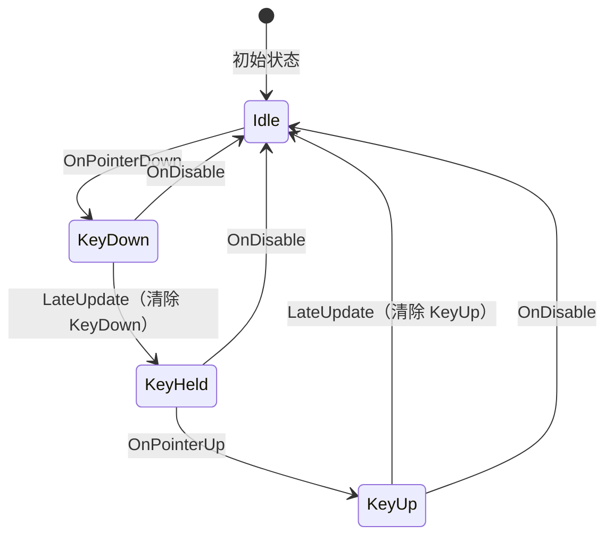
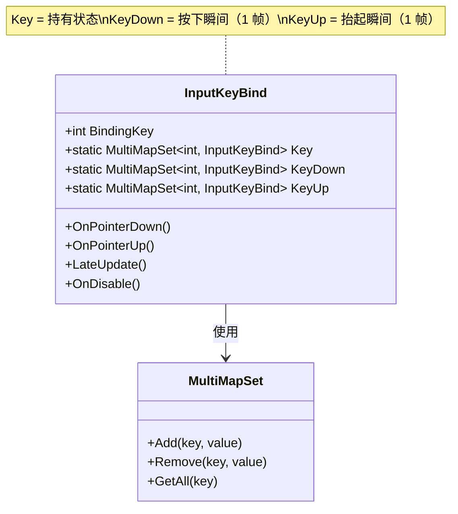
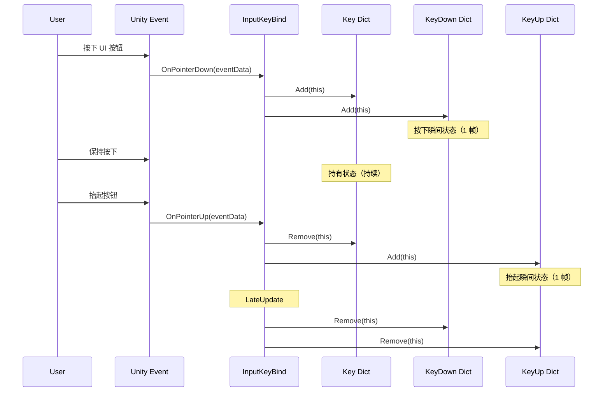

# InputKeyBind.cs 注解文档

## 文件基本信息

| 属性 | 值 |
|------|-----|
| **文件名** | InputKeyBind.cs |
| **路径** | Assets/Scripts/Mono/Module/UI/Input/InputKeyBind.cs |
| **所属模块** | Mono/Module/UI/Input - 输入绑定系统 |
| **文件职责** | UI 按键绑定，将 UI 元素映射为虚拟按键输入 |

---

## 类/结构体说明

### InputKeyBind 类

| 属性 | 说明 |
|------|------|
| **职责** | 将 UI 元素（如按钮）绑定为虚拟按键，支持按下/持有/抬起状态检测 |
| **泛型参数** | 无 |
| **继承关系** | `MonoBehaviour` |
| **实现的接口** | `IPointerDownHandler`, `IPointerUpHandler` |

**设计模式**: 事件驱动 + 多映射集合

```csharp
// 使用示例
// 在 Unity 编辑器中将组件添加到 UI 按钮
// 设置 BindingKey 为自定义按键 ID
// 通过静态字典查询按键状态
```

---

## 字段与属性（按重要程度排序）

| 名称 | 类型 | 访问级别 | 说明 |
|------|------|----------|------|
| `BindingKey` | `int` | `public` | 绑定的按键 ID，用于标识不同的虚拟按键 |
| `Key` | `MultiMapSet<int, InputKeyBind>` | `public static` | 当前按下的按键集合（持有状态） |
| `KeyDown` | `MultiMapSet<int, InputKeyBind>` | `public static` | 本帧按下的按键集合（按下瞬间） |
| `KeyUp` | `MultiMapSet<int, InputKeyBind>` | `public static` | 本帧抬起的按键集合（抬起瞬间） |

---

## 方法说明（按重要程度排序）

### LateUpdate()

**签名**:
```csharp
public void LateUpdate()
```

**职责**: 每帧清理瞬时状态（KeyDown/KeyUp）

**核心逻辑**:
```
1. 从 KeyDown 集合中移除自身（清除按下瞬间状态）
2. 从 KeyUp 集合中移除自身（清除抬起瞬间状态）
```

**调用者**: Unity 生命周期（LateUpdate）

**注意**: 瞬时状态只持续一帧，需要在每帧清理

---

### OnDisable()

**签名**:
```csharp
public void OnDisable()
```

**职责**: 组件禁用时清理所有状态

**核心逻辑**:
```
1. 从 Key 集合中移除自身
2. 从 KeyDown 集合中移除自身
3. 从 KeyUp 集合中移除自身
```

**调用者**: Unity 生命周期

---

### OnPointerDown()

**签名**:
```csharp
public void OnPointerDown(PointerEventData eventData)
```

**职责**: 处理指针按下事件

**核心逻辑**:
```
1. 将自身添加到 Key 集合（持有状态）
2. 将自身添加到 KeyDown 集合（按下瞬间状态）
```

**调用者**: Unity 事件系统（指针按下时）

**被调用者**: `Key.Add()`, `KeyDown.Add()`

---

### OnPointerUp()

**签名**:
```csharp
public void OnPointerUp(PointerEventData eventData)
```

**职责**: 处理指针抬起事件

**核心逻辑**:
```
1. 从 Key 集合中移除自身（结束持有状态）
2. 将自身添加到 KeyUp 集合（抬起瞬间状态）
```

**调用者**: Unity 事件系统（指针抬起时）

**被调用者**: `Key.Remove()`, `KeyUp.Add()`

---

## Mermaid 流程图

### 按键状态生命周期



### 状态集合关系



### 输入检测流程



---

## 使用示例

### 基础用法

```csharp
// 在 Unity 编辑器中配置：
// 1. 将 InputKeyBind 组件添加到 UI 按钮 GameObject
// 2. 设置 BindingKey 为自定义按键 ID（如 1=跳跃，2=攻击）

// 在游戏中检测按键状态
// 检测按键是否按下（瞬间）
if (InputKeyBind.KeyDown.ContainsKey(1))
{
    // 执行跳跃动作（只触发一次）
    character.Jump();
}

// 检测按键是否持有（持续）
if (InputKeyBind.Key.ContainsKey(1))
{
    // 持续执行（如蓄力）
    character.ChargeAttack();
}

// 检测按键是否抬起（瞬间）
if (InputKeyBind.KeyUp.ContainsKey(1))
{
    // 执行释放动作
    character.ReleaseCharge();
}
```

### 多按键绑定

```csharp
// 同一个按键 ID 可以绑定到多个 UI 元素
// 例如：两个不同的按钮都绑定到"攻击"按键

// 获取所有绑定到按键 1 的 InputKeyBind 实例
var attackButtons = InputKeyBind.Key.GetAll(1);

// 遍历所有按下的攻击按钮
foreach (var button in attackButtons)
{
    // 处理每个按钮的按下事件
    Debug.Log($"攻击按钮 {button.name} 被按下");
}
```

### 自定义按键 ID

```csharp
// 定义按键 ID 常量
public class GameKeys
{
    public const int Jump = 1;
    public const int Attack = 2;
    public const int Skill1 = 3;
    public const int Skill2 = 4;
    public const int MoveLeft = 10;
    public const int MoveRight = 11;
}

// 在游戏中使用
if (InputKeyBind.KeyDown.ContainsKey(GameKeys.Jump))
{
    character.Jump();
}
```

---

## 相关文档链接

- [InputAxisBind.cs.md](./InputAxisBind.cs.md) - 虚拟摇杆轴绑定组件
- [Drag.cs.md](../Drag.cs.md) - 拖拽事件处理组件
- [InputManager.cs.md](../../../../Code/Module/Input/InputManager.cs.md) - 输入管理系统
- [MultiMapSet.cs.md](../../../Core/Object/MultiMapSet.cs.md) - 多映射集合数据结构

---

*最后更新：2026-03-01*
