# PointerClick.cs 注解文档

## 文件基本信息

| 属性 | 值 |
|------|-----|
| **文件名** | PointerClick.cs |
| **路径** | Assets/Scripts/Mono/Module/UI/PointerClick.cs |
| **所属模块** | Mono/Module/UI - UI 辅助组件 |
| **文件职责** | 简化点击事件组件，将 Unity 的 IPointerClickHandler 封装为 UnityEvent |

---

## 类/结构体说明

### PointerClick 类

| 属性 | 说明 |
|------|------|
| **职责** | 监听指针点击事件，并通过 UnityEvent 广播给订阅者 |
| **泛型参数** | 无 |
| **继承关系** | `MonoBehaviour` |
| **实现的接口** | `IPointerClickHandler` |

**设计模式**: 事件代理 + UnityEvent

```csharp
// 使用示例
// 在 Unity 编辑器中通过 Inspector 配置点击事件
// 无需编写代码即可响应点击
```

---

## 字段与属性（按重要程度排序）

| 名称 | 类型 | 访问级别 | 说明 |
|------|------|----------|------|
| `onClick` | `UnityEvent` | `public` | 点击事件，可在 Inspector 中配置监听器 |

---

## 方法说明（按重要程度排序）

### OnPointerClick()

**签名**:
```csharp
public void OnPointerClick(PointerEventData eventData)
```

**职责**: 处理指针点击事件

**核心逻辑**:
```
1. 调用 onClick.Invoke() 触发所有注册的监听器
```

**参数**:
- `eventData`: 指针事件数据（包含点击位置、按钮等信息）

**调用者**: Unity 事件系统（点击时）

---

## Mermaid 流程图

### 点击事件处理流程


### 组件结构

```mermaid
classDiagram
    class PointerClick {
        +UnityEvent onClick
        +OnPointerClick(PointerEventData)
    }
    
    class IPointerClickHandler {
        <<interface>>
        +OnPointerClick(PointerEventData)
    }
    
    class UnityEvent {
        +AddListener()
        +RemoveListener()
        +Invoke()
    }
    
    PointerClick ..|> IPointerClickHandler : 实现
    PointerClick --> UnityEvent : 使用
    
    note for PointerClick "简化点击事件处理<br/>无需编写代码即可响应点击"
```



---

## 使用示例

### Inspector 配置（推荐）

```csharp
// 在 Unity 编辑器中配置：
// 1. 将 PointerClick 组件添加到 UI 元素 GameObject
// 2. 确保 GameObject 有 Image 或其他可射线检测的组件
// 3. 在 Inspector 中展开 onClick 事件列表
// 4. 点击 "+" 添加监听器
// 5. 拖拽目标对象和选择方法

// 示例配置：
// - 拖拽 Player 对象，选择 Player.Jump() 方法
// - 拖拽 AudioManager 对象，选择 AudioManager.PlayClickSound()
// - 拖拽 UIManager 对象，选择 UIManager.OpenWindow()
```

### 代码订阅事件

```csharp
// 在代码中动态添加监听器
public class ClickHandler : MonoBehaviour
{
    void Start()
    {
        var pointerClick = GetComponent<PointerClick>();
        
        // 添加无参数监听器
        pointerClick.onClick.AddListener(() =>
        {
            Debug.Log("UI 元素被点击");
        });
        
        // 添加方法引用
        pointerClick.onClick.AddListener(OnClicked);
    }
    
    void OnClicked()
    {
        Debug.Log("点击处理方法被调用");
    }
}
```

### 传递点击数据

```csharp
// PointerClick 不直接传递 eventData
// 如需访问点击数据，使用自定义实现：

public class AdvancedPointerClick : MonoBehaviour, IPointerClickHandler
{
    public UnityEvent<Vector2> onClickWithPosition;
    
    public void OnPointerClick(PointerEventData eventData)
    {
        onClickWithPosition?.Invoke(eventData.position);
    }
}

// 使用：
// onClickWithPosition.AddListener(pos => Debug.Log($"点击位置：{pos}"));
```

### 配合其他组件使用

```csharp
// 与 Image 配合（最常见）
// 1. 添加 Image 组件显示背景
// 2. 添加 PointerClick 组件处理点击

// 与 EmptyGraphic 配合（透明点击区）
// 1. 添加 EmptyGraphic 组件（不可见但可点击）
// 2. 添加 PointerClick 组件处理点击

// 与 Button 对比：
// - Button: 有交互状态（Normal/Highlighted/Pressed）
// - PointerClick: 简单点击事件，无状态变化
```

---

## 与 Unity Button 对比

| 特性 | PointerClick | Unity Button |
|------|-------------|--------------|
| **复杂度** | 简单 | 较复杂 |
| **交互状态** | ❌ | ✅ (Normal/Highlighted/Pressed/Disabled) |
| **过渡效果** | ❌ | ✅ (Color/Sprite/Animation) |
| **点击事件** | ✅ UnityEvent | ✅ UnityEvent |
| **适用场景** | 简单点击 | 完整按钮交互 |

---

## 注意事项

1. **射线检测要求**:
   - GameObject 必须有可射线检测的组件（Image、EmptyGraphic 等）
   - Canvas 必须有 GraphicRaycaster 组件

2. **事件顺序**:
   - OnPointerClick 在 OnPointerUp 之后触发
   - 如需更细粒度控制，使用 IPointerDownHandler/IPointerUpHandler

3. **性能**:
   - UnityEvent 有轻微性能开销
   - 高频点击场景考虑直接实现接口

---

## 相关文档链接

- [EmptyGraphic.cs.md](./EmptyGraphic.cs.md) - 空图形组件（透明点击区）
- [UIEventTrigger.cs.md](../../../../Code/Module/UIComponent/UIEventTrigger.cs.md) - 更强大的事件触发器
- [IPointerClickHandler](https://docs.unity3d.com/ScriptReference/EventSystems.IPointerClickHandler.html) - Unity 官方文档

---

*最后更新：2026-03-01*
