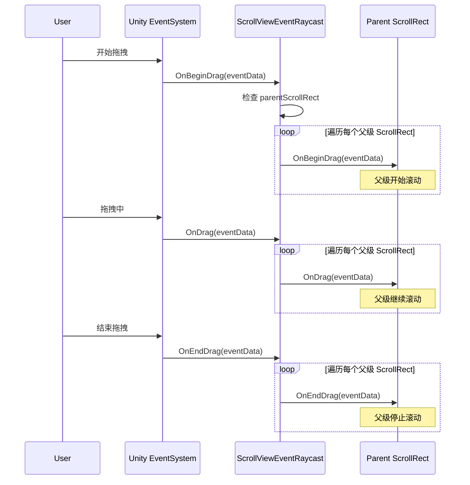
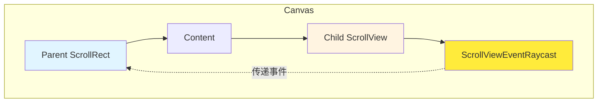

# ScrollViewEventRaycast.cs 注解文档

## 文件基本信息

| 属性 | 值 |
|------|-----|
| **文件名** | ScrollViewEventRaycast.cs |
| **路径** | Assets/Scripts/Mono/Module/UI/ScrollViewEventRaycast.cs |
| **所属模块** | Mono/Module/UI - UI 辅助组件 |
| **文件职责** | 滚动视图事件传递组件，将拖拽事件传递给父级 ScrollRect |

---

## 类/结构体说明

### ScrollViewEventRaycast 类

| 属性 | 说明 |
|------|------|
| **职责** | 解决嵌套 ScrollRect 的拖拽事件传递问题，允许子对象将拖拽事件传递给父级滚动视图 |
| **泛型参数** | 无 |
| **继承关系** | `MonoBehaviour` |
| **实现的接口** | `IBeginDragHandler`, `IDragHandler`, `IEndDragHandler` |

**设计模式**: 事件传递/冒泡

```csharp
// 使用示例
// 用于嵌套滚动视图场景
// 子 ScrollView 将拖拽事件传递给父级
```

---

## 字段与属性（按重要程度排序）

| 名称 | 类型 | 访问级别 | 说明 |
|------|------|----------|------|
| `parentScrollRect` | `ScrollRect[]` | `public` | 上层的 ScrollRect 数组，事件将传递给这些组件 |

---

## 方法说明（按重要程度排序）

### OnBeginDrag()

**签名**:
```csharp
public void OnBeginDrag(PointerEventData eventData)
```

**职责**: 处理开始拖拽事件并传递给父级

**核心逻辑**:
```
1. 检查 parentScrollRect 是否为空
2. 如果不为空，遍历数组
3. 对每个非空的 ScrollRect 调用其 OnBeginDrag(eventData)
```

**调用者**: Unity 事件系统（开始拖拽时）

**被调用者**: `ScrollRect.OnBeginDrag()`

---

### OnDrag()

**签名**:
```csharp
public void OnDrag(PointerEventData eventData)
```

**职责**: 处理拖拽中事件并传递给父级

**核心逻辑**:
```
1. 检查 parentScrollRect 是否为空
2. 如果不为空，遍历数组
3. 对每个非空的 ScrollRect 调用其 OnDrag(eventData)
```

**调用者**: Unity 事件系统（拖拽中）

**被调用者**: `ScrollRect.OnDrag()`

---

### OnEndDrag()

**签名**:
```csharp
public void OnEndDrag(PointerEventData eventData)
```

**职责**: 处理结束拖拽事件并传递给父级

**核心逻辑**:
```
1. 检查 parentScrollRect 是否为空
2. 如果不为空，遍历数组
3. 对每个非空的 ScrollRect 调用其 OnEndDrag(eventData)
```

**调用者**: Unity 事件系统（结束拖拽时）

**被调用者**: `ScrollRect.OnEndDrag()`

---

## Mermaid 流程图

### 事件传递流程



### 嵌套滚动视图结构



---

## 使用示例

### 基础用法 - 嵌套滚动视图

```csharp
// 在 Unity 编辑器中配置：
// 1. 创建父级 ScrollRect（外层滚动区域）
// 2. 在 Content 中创建子级 ScrollView（内层滚动区域）
// 3. 在子级 ScrollView 上添加 ScrollViewEventRaycast 组件
// 4. 将父级 ScrollRect 拖拽赋值给 parentScrollRect 数组

// 场景示例：
// - 父级：垂直滚动的聊天窗口
// - 子级：水平滚动的表情选择器
// - 需求：在表情区域拖拽时，同时滚动父级聊天窗口
```

### 多层嵌套

```csharp
// 支持多层嵌套滚动视图
// parentScrollRect 数组可以包含多个父级 ScrollRect

// 配置示例：
// 1. 最外层：整个页面的垂直滚动
// 2. 中间层：某个区域的水平滚动
// 3. 最内层：某个列表的垂直滚动

// 将外层和中间层的 ScrollRect 都添加到 parentScrollRect 数组
// 拖拽事件会同时传递给所有父级
```

### 代码动态配置

```csharp
// 在代码中动态设置父级 ScrollRect
public class NestedScrollView : MonoBehaviour
{
    public ScrollViewEventRaycast childScrollView;
    public ScrollRect parentScrollRect;
    
    void Start()
    {
        // 动态赋值
        childScrollView.parentScrollRect = new ScrollRect[] { parentScrollRect };
    }
}
```

### 条件传递

```csharp
// 自定义版本：根据条件决定是否传递事件
public class ConditionalScrollViewRaycast : MonoBehaviour, 
    IBeginDragHandler, IDragHandler, IEndDragHandler
{
    public ScrollRect[] parentScrollRect;
    public Func<PointerEventData, bool> shouldPassEvent;
    
    public void OnDrag(PointerEventData eventData)
    {
        // 根据条件决定是否传递
        if (shouldPassEvent?.Invoke(eventData) == true)
        {
            foreach (var sr in parentScrollRect)
            {
                sr?.OnDrag(eventData);
            }
        }
    }
    
    // OnBeginDrag 和 OnEndDrag 类似实现
}
```

---

## 常见问题与解决方案

### 问题 1: 子滚动视图阻止父级滚动

**现象**: 在子 ScrollView 上拖拽时，父级不滚动

**原因**: Unity 事件系统默认只触发最内层的处理器

**解决**: 使用 ScrollViewEventRaycast 手动传递事件

### 问题 2: 滚动方向冲突

**现象**: 子级和父级滚动方向相同，导致滚动混乱

**解决**: 
- 方案 A: 设置不同的滚动方向（子级水平，父级垂直）
- 方案 B: 根据拖拽方向决定是否传递事件

### 问题 3: 滚动优先级

**现象**: 不确定应该先滚动子级还是父级

**解决**: 
- 通常先滚动子级，子级到边界后再滚动父级
- 可在自定义实现中添加边界检测逻辑

---

## 注意事项

1. **空引用检查**: 代码中包含对 null 的检查，确保安全性

2. **事件顺序**: 事件先触发子级，再手动传递给父级

3. **性能考虑**: 
   - 遍历数组有轻微开销
   - parentScrollRect 数组通常很小（1-3 个）

4. **替代方案**: 
   - Unity 2019+ 提供了更好的嵌套滚动支持
   - 考虑使用 ScrollRect 的 MovementType 设置

---

## 相关文档链接

- [ScrollRect](https://docs.unity3d.com/ScriptReference/UI.ScrollRect.html) - Unity 官方文档
- [UI 事件系统](https://docs.unity3d.com/Manual/UIEventSystem.html) - Unity 官方文档
- [UILoopListView2.cs.md](../../../../Code/Module/UIComponent/UILoopListView2.cs.md) - 循环列表视图

---

*最后更新：2026-03-01*
