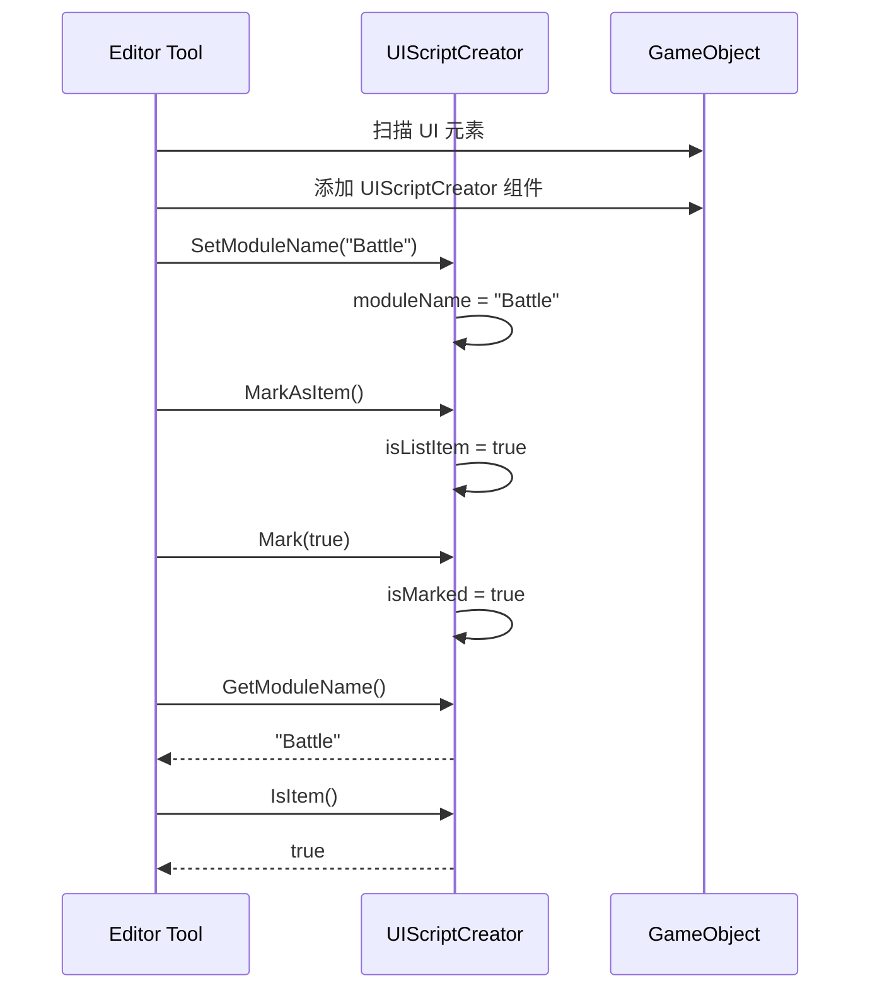
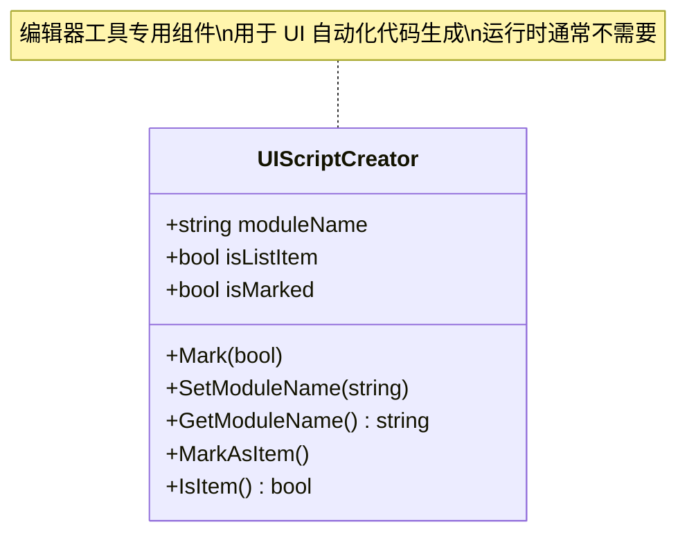

# UIScriptCreator.cs 注解文档

## 文件基本信息

| 属性 | 值 |
|------|-----|
| **文件名** | UIScriptCreator.cs |
| **路径** | Assets/Scripts/Mono/Module/UI/UIScriptCreator.cs |
| **所属模块** | Mono/Module/UI - UI 辅助组件 |
| **文件职责** | UI 脚本创建器标记组件，用于编辑器工具识别和标记 UI 元素 |

---

## 类/结构体说明

### UIScriptCreator 类

| 属性 | 说明 |
|------|------|
| **职责** | 标记 UI 元素的元数据（模块名、是否列表项、是否已标记），供编辑器工具使用 |
| **泛型参数** | 无 |
| **继承关系** | `MonoBehaviour` |
| **实现的接口** | 无 |

**设计模式**: 标记/元数据组件

```csharp
// 使用示例
// 在 Unity 编辑器中添加到 UI 元素
// 供自动化 UI 代码生成工具使用
```

---

## 字段与属性（按重要程度排序）

| 名称 | 类型 | 访问级别 | 说明 |
|------|------|----------|------|
| `moduleName` | `string` | `public` | 模块名称，标识该 UI 元素所属的功能模块 |
| `isListItem` | `bool` | `public` | 是否为列表项标记 |
| `isMarked` | `bool` | `public` | 是否已标记（用于工具追踪处理状态） |

---

## 方法说明（按重要程度排序）

### Mark()

**签名**:
```csharp
public void Mark(bool isMark)
```

**职责**: 设置标记状态

**参数**:
- `isMark`: 标记状态（true=已标记，false=未标记）

**调用者**: 编辑器工具

---

### SetModuleName()

**签名**:
```csharp
public void SetModuleName(string name)
```

**职责**: 设置模块名称

**参数**:
- `name`: 模块名称

**调用者**: 编辑器工具

---

### GetModuleName()

**签名**:
```csharp
public string GetModuleName()
```

**职责**: 获取模块名称

**返回**: moduleName

**调用者**: 编辑器工具

---

### MarkAsItem()

**签名**:
```csharp
public void MarkAsItem()
```

**职责**: 标记为列表项

**核心逻辑**:
```
1. 设置 isListItem = true
```

**调用者**: 编辑器工具

---

### IsItem()

**签名**:
```csharp
public bool IsItem()
```

**职责**: 检查是否为列表项

**返回**: isListItem

**调用者**: 编辑器工具

---

## Mermaid 流程图

### 编辑器工具工作流程



### 组件用途



---

## 使用示例

### 编辑器工具标记 UI

```csharp
// 在 Unity 编辑器中使用（Editor 脚本）
#if UNITY_EDITOR
using UnityEditor;
using UnityEngine;

public class UIScriptCreatorTool : EditorWindow
{
    [MenuItem("Tools/UI Script Creator")]
    static void ShowWindow()
    {
        var window = GetWindow<UIScriptCreatorTool>();
        window.Show();
    }
    
    void OnGUI()
    {
        GUILayout.Label("UI Script Creator Tool");
        
        if (GUILayout.Button("Mark Selected UI"))
        {
            MarkSelectedUI();
        }
    }
    
    void MarkSelectedUI()
    {
        var selected = Selection.activeGameObject;
        if (selected == null) return;
        
        // 添加或获取 UIScriptCreator 组件
        var creator = selected.GetComponent<UIScriptCreator>();
        if (creator == null)
        {
            creator = selected.AddComponent<UIScriptCreator>();
        }
        
        // 设置模块名
        creator.SetModuleName("MyModule");
        
        // 标记为列表项（如果需要）
        if (selected.name.Contains("Item"))
        {
            creator.MarkAsItem();
        }
        
        // 标记为已处理
        creator.Mark(true);
        
        Debug.Log($"Marked {selected.name} as UI element");
    }
}
#endif
```

### 批量处理 UI 元素

```csharp
// 批量扫描和标记 UI 元素
#if UNITY_EDITOR
public class BatchUIMarker
{
    public static void MarkAllUIInScene()
    {
        var allUI = FindObjectsOfType<RectTransform>();
        
        foreach (var rect in allUI)
        {
            // 根据命名规则自动标记
            if (rect.name.StartsWith("UI_"))
            {
                var creator = rect.GetComponent<UIScriptCreator>();
                if (creator == null)
                {
                    creator = rect.gameObject.AddComponent<UIScriptCreator>();
                }
                
                // 提取模块名（例如 UI_Battle_Button -> Battle）
                string moduleName = ExtractModuleName(rect.name);
                creator.SetModuleName(moduleName);
                
                // 标记为列表项
                if (rect.name.Contains("Item") || rect.name.Contains("List"))
                {
                    creator.MarkAsItem();
                }
                
                creator.Mark(true);
            }
        }
    }
    
    static string ExtractModuleName(string uiName)
    {
        // UI_Module_Element -> Module
        var parts = uiName.Split('_');
        return parts.Length > 1 ? parts[1] : "Default";
    }
}
#endif
```

### 代码生成工具

```csharp
// 根据标记生成 UI 代码
#if UNITY_EDITOR
public class UIGenerator
{
    public static void GenerateUICode()
    {
        var creators = FindObjectsOfType<UIScriptCreator>();
        
        foreach (var creator in creators)
        {
            if (!creator.isMarked) continue;
            
            string moduleName = creator.GetModuleName();
            bool isItem = creator.IsItem();
            
            // 根据标记生成对应的代码
            if (isItem)
            {
                GenerateItemCode(creator.gameObject, moduleName);
            }
            else
            {
                GenerateWindowCode(creator.gameObject, moduleName);
            }
        }
    }
    
    static void GenerateItemCode(GameObject go, string moduleName)
    {
        // 生成列表项代码
        Debug.Log($"Generating item code for {go.name} in {moduleName}");
    }
    
    static void GenerateWindowCode(GameObject go, string moduleName)
    {
        // 生成窗口代码
        Debug.Log($"Generating window code for {go.name} in {moduleName}");
    }
}
#endif
```

---

## 注意事项

1. **编辑器专用**: 此组件主要用于编辑器工具，运行时通常不需要

2. **标记状态**: `isMarked` 用于追踪哪些元素已被工具处理

3. **模块命名**: `moduleName` 应遵循项目约定的命名规范

4. **列表项识别**: `isListItem` 用于区分普通 UI 元素和列表项

---

## 相关文档链接

- [Unity Editor 脚本](https://docs.unity3d.com/Manual/EditorScripting.html) - Unity 官方文档
- [UIManager.cs.md](../../../../Code/Module/UI/UIManager.cs.md) - UI 管理系统
- [UIBaseView.cs.md](../../../../Code/Module/UI/UIBaseView.cs.md) - UI 基类视图

---

*最后更新：2026-03-01*
