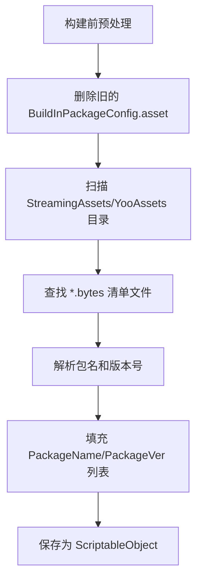

# BuildInPackageConfig.cs 文档

## 📄 文件信息表

| 属性 | 值 |
|------|------|
| 文件路径 | `Assets/Scripts/Mono/Module/YooAssets/BuildInPackageConfig.cs` |
| 命名空间 | `TaoTie` |
| 类类型 | ScriptableObject 配置类 |
| 依赖模块 | System.Collections.Generic, UnityEngine |

---

## 🏗️ 类说明

**BuildInPackageConfig** 是 Unity ScriptableObject 配置类，用于存储内置资源包的名称和版本信息。

### 核心职责

- 记录游戏打包时内置的资源包列表
- 维护每个资源包的内置版本号
- 在构建时自动生成（通过 StreamingAssetsHelper）
- 用于版本比对和热更新判断

---

## 📊 字段表

| 字段名 | 类型 | 访问修饰符 | 说明 |
|--------|------|------------|------|
| `PackageName` | `List<string>` | `public` | 内置资源包名称列表 |
| `PackageVer` | `List<int>` | `public` | 对应的资源包版本列表 |

**注意:** `PackageName` 和 `PackageVer` 通过索引一一对应。

---

## 🔧 方法说明

### GetBuildInPackageVersion

```csharp
public int GetBuildInPackageVersion(string name)
```

获取指定资源包的内置版本号。

**参数:**
- `name`: 资源包名称

**返回:** 
- 找到匹配返回对应版本号
- 未找到返回 -1

**实现:**
```csharp
for (int i = 0; i < PackageName.Count; i++)
{
    if (PackageName[i] == name)
    {
        return PackageVer[i];
    }
}
return -1;
```

---

## 🔄 Mermaid 流程图

### 版本查询流程

```mermaid
flowchart TD
    A[GetBuildInPackageVersion name] --> B[遍历 PackageName 列表]
    B --> C{PackageName[i] == name?}
    C -->|是 | D[返回 PackageVer[i]]
    C -->|否 | E{还有下一个？}
    E -->|是 | B
    E -->|否 | F[返回 -1]
```

### 构建时生成流程



---

## 💡 使用示例

### 读取内置版本

```csharp
// 从 Resources 加载配置
var buildInConfig = Resources.Load<BuildInPackageConfig>("BuildInPackageConfig");

// 获取默认包的内置版本
int buildInVer = buildInConfig.GetBuildInPackageVersion(Define.DefaultName);
Log.Info($"内置版本：{buildInVer}");
```

### 版本比对

```csharp
// 比对内置版本和 PlayerPrefs 中的版本
string packageName = Define.DefaultName;
int buildInVer = buildInConfig.GetBuildInPackageVersion(packageName);
int savedVer = PlayerPrefs.GetInt("PACKAGE_VERSION_" + packageName, -1);

if (savedVer < buildInVer)
{
    // 需要更新版本记录
    PlayerPrefs.SetInt("PACKAGE_VERSION_" + packageName, buildInVer);
    PlayerPrefs.Save();
}
```

### 在 PackageManager 中的使用

```csharp
// PackageManager.InitBuildInPackageVersion 中的逻辑
BuildInPackageConfig = Resources.Load<BuildInPackageConfig>("BuildInPackageConfig");
#if !UNITY_EDITOR
if (BuildInPackageConfig == null) return;
for (int i = 0; i < BuildInPackageConfig.PackageName.Count; i++)
{
    var name = BuildInPackageConfig.PackageName[i];
    var ver = GetPackageVersion();
    if (ver < 0 || ver < BuildInPackageConfig.PackageVer[i])
    {
        PlayerPrefs.SetInt("PACKAGE_VERSION_" + name, BuildInPackageConfig.PackageVer[i]);
    }
}
PlayerPrefs.Save();
#endif
```

---

## 📝 配置示例

在 Unity 编辑器中创建的 `BuildInPackageConfig.asset` 示例：

```yaml
PackageName:
  - Default
  - UI
  - Audio
PackageVer:
  - 100
  - 50
  - 30
```

表示：
- Default 包内置版本 100
- UI 包内置版本 50
- Audio 包内置版本 30

---

## 🔗 相关文档链接

- [PackageManager.cs.md](./PackageManager.cs.md) - 资源包管理器
- [StreamingAssetsHelper.cs.md](./StreamingAssetsHelper.cs.md) - 构建时生成助手
- [PackageConfig.cs.md](./PackageConfig.cs.md) - 资源包配置

---

*最后更新：2026-03-02*
