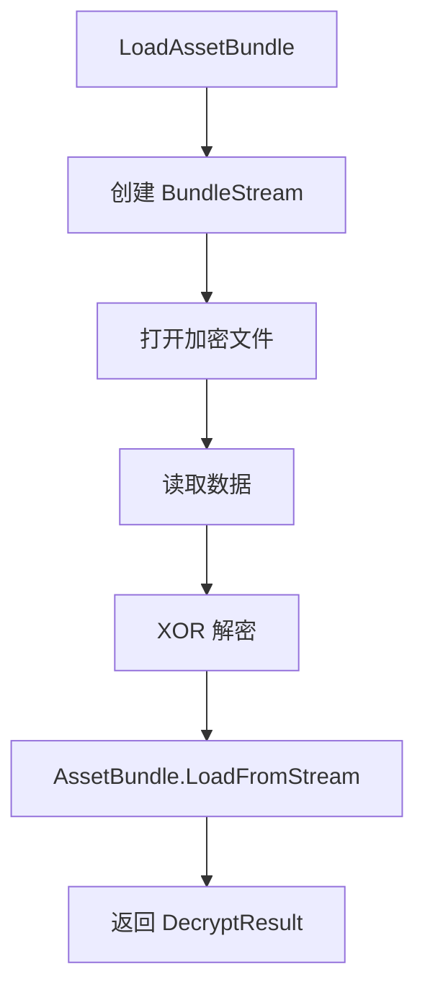
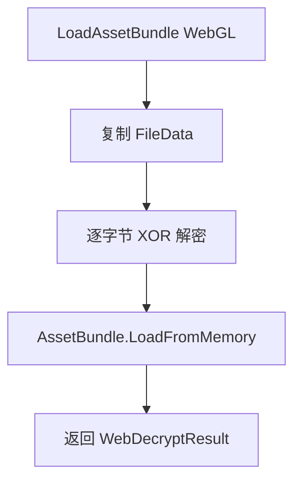
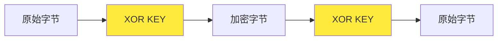

# BundleDecryption.cs 文档

## 📄 文件信息表

| 属性 | 值 |
|------|------|
| 文件路径 | `Assets/Scripts/Mono/Module/YooAssets/BundleDecryption.cs` |
| 命名空间 | `TaoTie` |
| 类类型 | 资源解密类 |
| 依赖模块 | System, System.IO, YooAsset, UnityEngine |
| 实现接口 | `IDecryptionServices`, `IWebDecryptionServices` |

---

## 🏗️ 类说明

**BundleDecryption** 包含资源包解密相关的类，用于对 YooAsset 资源包进行加密/解密处理，防止资源被直接提取。

### 包含的类

1. **BundleStream** - 加密文件流
2. **FileStreamDecryption** - 文件流解密服务（本地模式）
3. **WebDecryption** - Web 解密服务（WebGL 模式）

### 加密原理

使用简单的 XOR 异或加密：
- 加密密钥：`Define.KEY`
- 加密方式：逐字节 XOR 运算

---

## 📊 字段表

### BundleStream

| 字段名 | 类型 | 访问修饰符 | 说明 |
|--------|------|------------|------|
| (继承自 FileStream) | - | - | 文件流基类功能 |

### FileStreamDecryption

| 字段名 | 类型 | 访问修饰符 | 说明 |
|--------|------|------------|------|
| (实现 IDecryptionServices) | - | - | 解密服务接口 |

### WebDecryption

| 字段名 | 类型 | 访问修饰符 | 说明 |
|--------|------|------------|------|
| (实现 IWebDecryptionServices) | - | - | Web 解密服务接口 |

---

## 🔧 方法说明

### BundleStream.Read

```csharp
public override int Read(byte[] array, int offset, int count)
```

重写读取方法，在读取时自动解密。

**参数:**
- `array`: 目标字节数组
- `offset`: 起始偏移
- `count`: 读取数量

**返回:** 实际读取的字节数

**解密逻辑:**
```csharp
var index = base.Read(array, offset, count);
for (int i = 0; i < array.Length; i++)
{
    array[i] ^= Define.KEY;
}
return index;
```

---

### FileStreamDecryption.LoadAssetBundle

```csharp
DecryptResult IDecryptionServices.LoadAssetBundle(DecryptFileInfo fileInfo)
```

同步加载并解密 AssetBundle。

**参数:**
- `fileInfo`: 解密文件信息（包含路径、CRC 等）

**返回:** `DecryptResult` 包含解密后的 AssetBundle

**流程:**
1. 创建 `BundleStream` 加密流
2. 使用 `AssetBundle.LoadFromStream` 加载
3. 返回解密结果

---

### FileStreamDecryption.LoadAssetBundleAsync

```csharp
DecryptResult IDecryptionServices.LoadAssetBundleAsync(DecryptFileInfo fileInfo)
```

异步加载并解密 AssetBundle。

**参数:**
- `fileInfo`: 解密文件信息

**返回:** `DecryptResult` 包含异步加载请求

---

### FileStreamDecryption.ReadFileData / ReadFileText

```csharp
byte[] IDecryptionServices.ReadFileData(DecryptFileInfo fileInfo)
string IDecryptionServices.ReadFileText(DecryptFileInfo fileInfo)
```

读取原始文件数据/文本（未实现）。

**状态:** 抛出 `NotImplementedException`

---

### WebDecryption.LoadAssetBundle

```csharp
public WebDecryptResult LoadAssetBundle(WebDecryptFileInfo fileInfo)
```

加载并解密 WebGL 平台的 AssetBundle。

**参数:**
- `fileInfo`: 包含加密的文件数据

**返回:** `WebDecryptResult` 包含解密后的 AssetBundle

**流程:**
1. 复制文件数据到新数组
2. 逐字节 XOR 解密
3. 使用 `AssetBundle.LoadFromMemory` 加载

---

### GetManagedReadBufferSize

```csharp
private static uint GetManagedReadBufferSize()
```

获取托管读取缓冲区大小。

**返回:** `1024` 字节

---

## 🔄 Mermaid 流程图

### 本地资源解密流程



### Web 资源解密流程



### XOR 加密原理



---

## 💡 使用示例

### 在 PackageManager 中使用

```csharp
// 离线模式 - 使用文件流解密
var buildinFileSystemParams = FileSystemParameters.CreateDefaultBuildinFileSystemParameters(
    new FileStreamDecryption()
);
var initParameters = new OfflinePlayModeParameters();
initParameters.BuildinFileSystemParameters = buildinFileSystemParams;
await package.InitializeAsync(initParameters);

// 联机模式 - 使用缓存 + 内置解密
var cacheFileSystemParams = FileSystemParameters.CreateDefaultCacheFileSystemParameters(
    remoteServices,
    new FileStreamDecryption()
);
var initParameters = new HostPlayModeParameters();
initParameters.BuildinFileSystemParameters = buildinFileSystemParams;
initParameters.CacheFileSystemParameters = cacheFileSystemParams;
await package.InitializeAsync(initParameters);
```

### WebGL 平台解密

```csharp
var initParameters = new WebPlayModeParameters();
var webRemoteFileSystemParams = FileSystemParameters.CreateDefaultWebRemoteFileSystemParameters(
    remoteServices,
    new WebDecryption()
);
initParameters.WebRemoteFileSystemParameters = webRemoteFileSystemParams;
await package.InitializeAsync(initParameters);
```

### 加密资源打包

在打包资源时使用相同的 KEY 进行加密：

```csharp
// 打包时的加密（示例）
byte[] data = File.ReadAllBytes("AssetBundle");
for (int i = 0; i < data.Length; i++)
{
    data[i] ^= Define.KEY;
}
File.WriteAllBytes("AssetBundle.encrypted", data);
```

---

## 📝 注意事项

### 密钥安全

- `Define.KEY` 是全局常量，建议在正式发布时使用更安全的密钥管理
- XOR 加密强度较低，仅用于防止直接提取

### 性能考虑

- 解密操作在读取时进行，会增加少量 CPU 开销
- 缓冲区大小为 1024 字节，可根据需要调整

### 平台差异

- **本地平台**（Windows/Android/iOS）: 使用 `FileStreamDecryption`
- **WebGL 平台**: 使用 `WebDecryption`（内存解密）

---

## 🔗 相关文档链接

- [PackageManager.cs.md](./PackageManager.cs.md) - 资源包管理器
- [Define.cs.md](../../Define.cs.md) - 全局常量定义（包含 KEY）
- [CDNConfig.cs.md](./CDNConfig.cs.md) - CDN 配置
- [RemoteServices.cs.md](./RemoteServices.cs.md) - 远程服务

---

*最后更新：2026-03-02*
