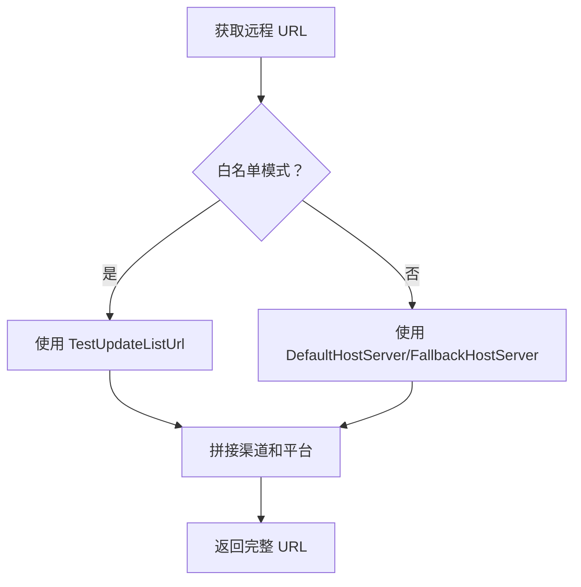
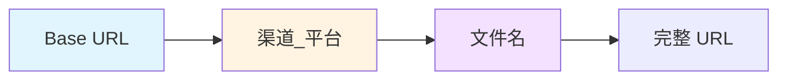

# CDNConfig.cs 文档

## 📄 文件信息表

| 属性 | 值 |
|------|------|
| 文件路径 | `Assets/Scripts/Mono/Module/YooAssets/CDNConfig.cs` |
| 命名空间 | `TaoTie` |
| 类类型 | ScriptableObject 配置类 |
| 依赖模块 | System, System.Collections.Generic, UnityEngine |

---

## 🏗️ 类说明

**CDNConfig** 是 Unity ScriptableObject 配置类，用于配置 CDN 资源服务器的地址和更新策略。

### 核心职责

- 配置资源下载的主备服务器地址
- 设置更新列表的获取地址
- 区分正式环境和测试环境（白名单）
- 配置 AOT 编译选项

---

## 📊 字段表

| 字段名 | 类型 | 访问修饰符 | 说明 |
|--------|------|------------|------|
| `Channel` | `string` | `public` | 渠道标识 |
| `DefaultHostServer` | `string` | `public` | 主资源服务器地址 |
| `FallbackHostServer` | `string` | `public` | 备用资源服务器地址 |
| `UpdateListUrl` | `string` | `public` | 正式环境更新列表地址 |
| `TestUpdateListUrl` | `string` | `public` | 白名单/测试环境更新列表地址 |
| `BuildHotfixAssembliesAOT` | `bool` | `public` | 是否进行 AOT 编译 |

---

## 🔧 方法说明

### GetChannel

```csharp
public string GetChannel()
```

获取渠道标识（继承自 ScriptableObject，通常在 RemoteServices 中使用）。

**返回:** 渠道字符串

**使用场景:**
- 构建远程资源 URL 时区分不同渠道
- 格式：`{channel}_{platform}`

---

## 🔄 Mermaid 流程图

### CDN 地址选择逻辑



### URL 拼接格式



---

## 💡 使用示例

### 创建配置

在 Unity 编辑器中：
1. 右键 → Create → CDNConfig
2. 填写配置信息：

```yaml
Channel: official
DefaultHostServer: https://cdn.example.com/resources
FallbackHostServer: https://cdn-backup.example.com/resources
UpdateListUrl: https://api.example.com/update/list
TestUpdateListUrl: https://test-api.example.com/update/list
BuildHotfixAssembliesAOT: true
```

### 在 RemoteServices 中使用

```csharp
public class RemoteServices : IRemoteServices
{
    private CDNConfig conf;
    private string rename;
    
    public RemoteServices(CDNConfig config)
    {
        conf = config;
        rename = conf.GetChannel();
    }
    
    public string GetRemoteMainURL(string fileName)
    {
        string baseUrl = whiteMode ? conf.TestUpdateListUrl : conf.DefaultHostServer;
        string platform = PlatformUtil.GetStrPlatformIgnoreEditor();
        return $"{baseUrl}/{rename}_{platform}/{fileName}";
    }
    
    public string GetRemoteFallbackURL(string fileName)
    {
        string baseUrl = whiteMode ? conf.TestUpdateListUrl : conf.FallbackHostServer;
        string platform = PlatformUtil.GetStrPlatformIgnoreEditor();
        return $"{baseUrl}/{rename}_{platform}/{fileName}";
    }
}
```

### 加载配置

```csharp
// 从 Resources 加载 CDN 配置
var cdnConfig = Resources.Load<CDNConfig>("CDNConfig");

// 初始化远程服务
var remoteServices = new RemoteServices(cdnConfig);

// 获取资源 URL
string resourceUrl = remoteServices.GetRemoteMainURL("Prefabs/Player.prefab");
// 结果：https://cdn.example.com/resources/official_windows/Prefabs/Player.prefab
```

---

## 📝 配置说明

### 渠道配置

| 渠道值 | 说明 |
|--------|------|
| `official` | 官方渠道 |
| `test` | 测试渠道 |
| `tiktok` | 抖音渠道 |
| `wechat` | 微信渠道 |

### 平台标识

由 `PlatformUtil.GetStrPlatformIgnoreEditor()` 返回：
- `windows` - Windows 平台
- `android` - Android 平台
- `ios` - iOS 平台
- `webgl` - WebGL 平台

---

## 🔗 相关文档链接

- [PackageManager.cs.md](./PackageManager.cs.md) - 资源包管理器
- [RemoteServices.cs.md](./RemoteServices.cs.md) - 远程服务类
- [PlatformUtil.cs.md](../../Helper/PlatformUtil.cs.md) - 平台工具类

---

*最后更新：2026-03-02*
