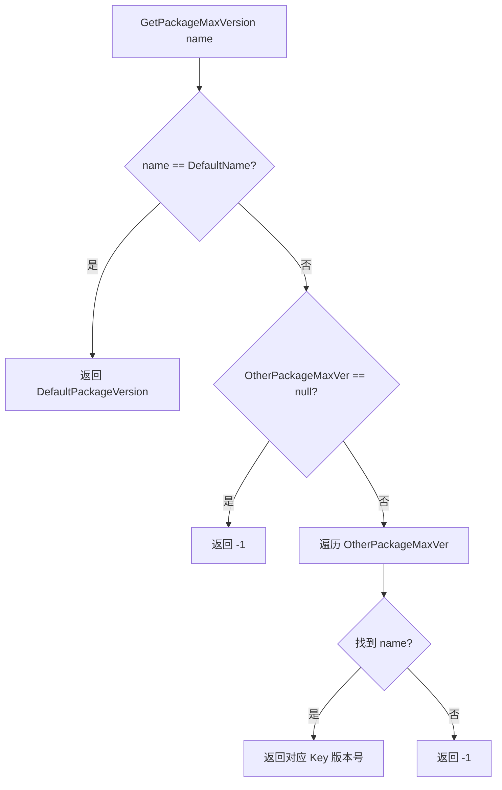

# PackageConfig.cs 文档

## 📄 文件信息表

| 属性 | 值 |
|------|------|
| 文件路径 | `Assets/Scripts/Mono/Module/YooAssets/PackageConfig.cs` |
| 命名空间 | `TaoTie` |
| 类类型 | 数据配置类 |
| 依赖模块 | System, System.Collections.Generic, UnityEngine |

---

## 🏗️ 类说明

**PackageConfig** 及其相关类用于定义资源包的版本配置和更新策略。

### 包含的类

1. **PackageConfig** - 资源包版本配置
2. **WhiteConfig** - 白名单配置
3. **Resver** - 资源版本配置
4. **AppConfig** - 应用配置
5. **UpdateConfig** - 更新配置总表

---

## 📊 字段表

### PackageConfig

| 字段名 | 类型 | 访问修饰符 | 说明 |
|--------|------|------------|------|
| `DefaultPackageVersion` | `int` | `public` | 默认资源包版本 |
| `OtherPackageMaxVer` | `Dictionary<int, string[]>` | `public` | 其他包的最大版本映射 |

### WhiteConfig

| 字段名 | 类型 | 访问修饰符 | 说明 |
|--------|------|------------|------|
| `EnvId` | `int` | `public` | 环境 ID |
| `Account` | `string` | `public` | 白名单账号 |

### Resver

| 字段名 | 类型 | 访问修饰符 | 说明 |
|--------|------|------------|------|
| `Channel` | `List<string>` | `public` | 适用渠道列表 |
| `UpdateTailNumber` | `List<string>` | `public` | 更新尾号列表 |
| `ForceUpdate` | `int` | `public` | 是否强制更新 |
| `MaxResVer` | `int` | `public` | 最大资源版本 |

### AppConfig

| 字段名 | 类型 | 访问修饰符 | 说明 |
|--------|------|------------|------|
| `AppUrl` | `string` | `public` | 应用下载地址 |
| `AppVer` | `Dictionary<int, Resver>` | `public` | 应用版本配置 |
| `JumpChannel` | `string` | `public` | 跳转渠道 |

### UpdateConfig

| 字段名 | 类型 | 访问修饰符 | 说明 |
|--------|------|------------|------|
| `ResList` | `Dictionary<string, Dictionary<int, Resver>>` | `public` | 资源列表配置 |
| `AppList` | `Dictionary<string, AppConfig>` | `public` | 应用列表配置 |

---

## 🔧 方法说明

### PackageConfig.GetPackageMaxVersion

```csharp
public int GetPackageMaxVersion(string name)
```

获取指定资源包的最大允许版本。

**参数:**
- `name`: 资源包名称

**返回:** 
- 如果是默认包，返回 `DefaultPackageVersion`
- 如果在 `OtherPackageMaxVer` 中找到匹配，返回对应版本号
- 否则返回 -1

**逻辑:**
```csharp
if (name == Define.DefaultName)
    return DefaultPackageVersion;

foreach (var item in OtherPackageMaxVer)
    if (item.Value.Contains(name))
        return item.Key;

return -1;
```

---

## 🔄 Mermaid 流程图

### GetPackageMaxVersion 逻辑



---

## 💡 使用示例

### 解析配置

```csharp
// 从 JSON 解析配置
var config = JsonHelper.FromJson<PackageConfig>(configText);

// 获取默认包最大版本
int maxVer = config.GetPackageMaxVersion(Define.DefaultName);
```

### 检查版本兼容性

```csharp
// 检查资源包版本是否在允许范围内
string packageName = "MyPackage";
int maxVersion = config.GetPackageMaxVersion(packageName);
int currentVersion = PackageManager.Instance.GetPackageVersion(packageName);

if (currentVersion < maxVersion)
{
    Log.Info($"需要更新：{currentVersion} -> {maxVersion}");
}
```

### 更新配置结构

```csharp
// UpdateConfig 示例结构
var updateConfig = new UpdateConfig
{
    ResList = new Dictionary<string, Dictionary<int, Resver>>
    {
        ["Default"] = new Dictionary<int, Resver>
        {
            [1] = new Resver
            {
                Channel = new List<string> { "official", "test" },
                ForceUpdate = 1,
                MaxResVer = 100
            }
        }
    },
    AppList = new Dictionary<string, AppConfig>
    {
        ["official"] = new AppConfig
        {
            AppUrl = "https://example.com/app.apk",
            JumpChannel = "default"
        }
    }
};
```

---

## 🔗 相关文档链接

- [PackageManager.cs.md](./PackageManager.cs.md) - 资源包管理器
- [CDNConfig.cs.md](./CDNConfig.cs.md) - CDN 配置
- [JsonHelper.cs.md](../../Helper/JsonHelper.cs.md) - JSON 工具类
- [Define.cs.md](../../Define.cs.md) - 全局常量定义

---

*最后更新：2026-03-02*
