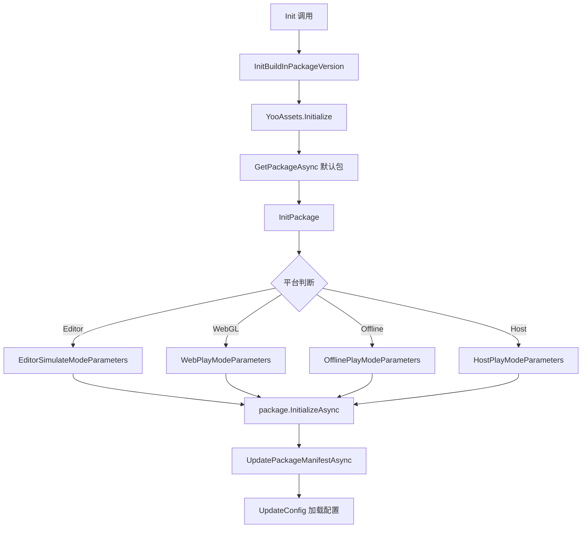
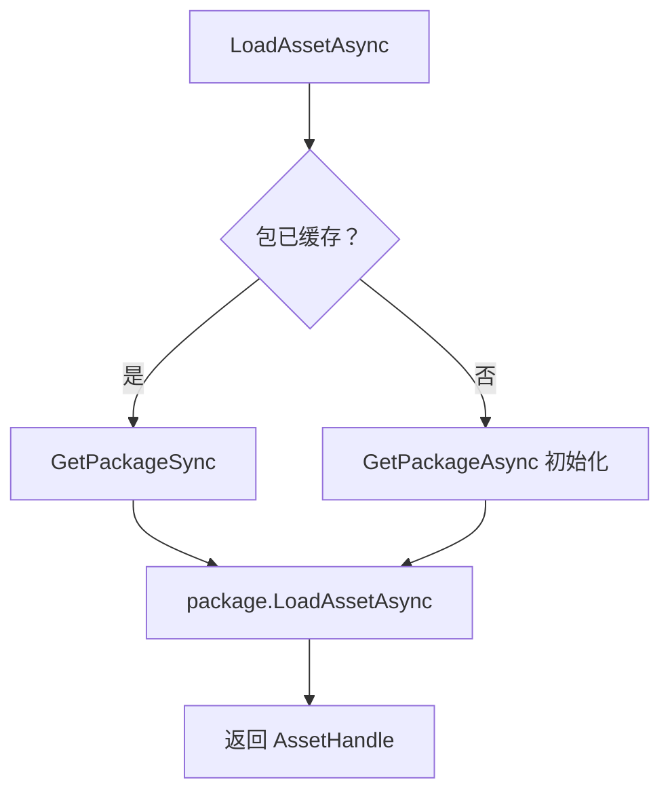

# PackageManager.cs 文档

## 📄 文件信息表

| 属性 | 值 |
|------|------|
| 文件路径 | `Assets/Scripts/Mono/Module/YooAssets/PackageManager.cs` |
| 命名空间 | `TaoTie` |
| 类类型 | 单例管理类 |
| 依赖模块 | YooAsset, UnityEngine, UnityEngine.SceneManagement |

---

## 🏗️ 类说明

**PackageManager** 是 YooAsset 资源管理系统的核心管理类，负责资源包的初始化、加载、更新和卸载。

### 核心职责

- 管理多个资源包（ResourcePackage）的生命周期
- 处理不同平台（Editor、WebGL、Offline、Host）的资源加载模式
- 支持资源版本管理和热更新
- 提供资源加载的同步/异步接口
- 处理资源解密（BundleDecryption）

---

## 📊 字段表

| 字段名 | 类型 | 访问修饰符 | 说明 |
|--------|------|------------|------|
| `Instance` | `PackageManager` | `public static` | 单例实例 |
| `CdnConfig` | `CDNConfig` | `public` | CDN 配置 |
| `Config` | `PackageConfig` | `public` | 资源包配置 |
| `DefaultPackage` | `ResourcePackage` | `public` | 默认资源包 |
| `BuildInPackageConfig` | `BuildInPackageConfig` | `public` | 内置包配置 |
| `PlayMode` | `EPlayMode` | `public` | 当前运行模式 |
| `packages` | `Dictionary<string, ResourcePackage>` | `private readonly` | 资源包字典缓存 |
| `initializeParameters` | `InitializeParameters` | `private` | 初始化参数 |

---

## 🔧 方法说明

### 初始化方法

#### `Init(EPlayMode mode)`
```csharp
public async ETTask Init(EPlayMode mode)
```
异步初始化资源系统。

**参数:**
- `mode`: 运行模式（EditorSimulateMode/WebPlayMode/OfflinePlayMode/HostPlayMode）

**流程:**
1. 初始化内置包版本
2. 设置 YooAsset 快速启动模式
3. 创建默认资源包
4. 更新配置信息

---

#### `InitPackage(EPlayMode mode, ResourcePackage package)`
```csharp
private async ETTask InitPackage(EPlayMode mode, ResourcePackage package)
```
初始化指定资源包，根据平台设置不同的初始化参数。

**支持的模式:**
- **EditorSimulateMode**: 编辑器模拟模式
- **WebPlayMode**: WebGL 网络模式（支持抖音/微信等平台）
- **OfflinePlayMode**: 单机离线模式
- **HostPlayMode**: 联机在线模式

---

### 资源包管理

#### `GetPackageAsync(string package)`
```csharp
public async ETTask<ResourcePackage> GetPackageAsync(string package)
```
异步获取资源包，如果未初始化则先初始化。

**参数:**
- `package`: 资源包名称（null 则使用默认包）

**返回:** 资源包实例

---

#### `GetPackageSync(string package)`
```csharp
public ResourcePackage GetPackageSync(string package)
```
同步获取已初始化的资源包。

**注意:** 只能获取已经初始化过的资源包

---

#### `UpdateConfig()`
```csharp
public async ETTask UpdateConfig()
```
从资源包加载并解析配置文件（config.bytes）。

---

### 资源加载

#### `LoadAssetSync<T>(string path, string package)`
```csharp
public AssetHandle LoadAssetSync<T>(string path, string package) where T : UnityEngine.Object
```
同步加载资源。

---

#### `LoadAssetAsync<T>(string path, string package)`
```csharp
public AssetHandle LoadAssetAsync<T>(string path, string package) where T : UnityEngine.Object
```
异步加载资源。

---

#### `LoadSceneAsync(string path, LoadSceneMode mode, string package, bool suspendLoad)`
```csharp
public SceneHandle LoadSceneAsync(string path, LoadSceneMode mode, string package, bool suspendLoad = false)
```
异步加载场景。

---

### 资源卸载

#### `UnloadUnusedAssets(string package)`
```csharp
public async ETTask UnloadUnusedAssets(string package)
```
卸载未使用的资源。

---

#### `ForceUnloadAllAssets(string package)`
```csharp
public async ETTask ForceUnloadAllAssets(string package)
```
强制卸载所有资源。

---

### 资源下载与更新

#### `CreateResourceDownloader(...)`
```csharp
public ResourceDownloaderOperation CreateResourceDownloader(
    int downloadingMaxNumber, 
    int failedTryAgain,
    int timeout, 
    string package, 
    string[] tags = null)
```
创建资源下载器。

---

#### `UpdatePackageManifestAsync(...)`
```csharp
public UpdatePackageManifestOperation UpdatePackageManifestAsync(
    string packageVersion, 
    int timeout,
    string package)
```
异步更新资源包清单。

---

### 查询方法

#### `GetAssetInfos(string tag, string package)`
```csharp
public AssetInfo[] GetAssetInfos(string tag, string package)
```
获取指定标签的资源信息列表。

---

#### `IsNeedDownloadFromRemote(string path, string package)`
```csharp
public bool IsNeedDownloadFromRemote(string path, string package)
```
检查资源是否需要从远程下载。

---

#### `GetPackageVersion(string package)`
```csharp
public int GetPackageVersion(string package = Define.DefaultName)
```
获取资源包版本（从 PlayerPrefs 读取）。

---

## 🔄 Mermaid 流程图

### 初始化流程



### 资源加载流程



---

## 💡 使用示例

### 初始化资源系统

```csharp
// 在游戏启动时初始化
await PackageManager.Instance.Init(EPlayMode.HostPlayMode);
```

### 加载资源

```csharp
// 异步加载预制体
var handle = PackageManager.Instance.LoadAssetAsync<GameObject>("Prefabs/Player.prefab", null);
await handle.Task;
var prefab = handle.GetAssetObject<GameObject>();

// 同步加载纹理
var texHandle = PackageManager.Instance.LoadAssetSync<Texture2D>("Images/icon.png", null);
var texture = texHandle.GetAssetObject<Texture2D>();
```

### 加载场景

```csharp
var sceneHandle = PackageManager.Instance.LoadSceneAsync(
    "Scenes/HomeScene", 
    LoadSceneMode.Single, 
    null
);
await sceneHandle.Task;
```

### 资源更新

```csharp
// 检查并下载远程资源
if (PackageManager.Instance.IsNeedDownloadFromRemote("Prefabs/test.prefab", null))
{
    var downloader = PackageManager.Instance.CreateResourceDownloader(
        downloadingMaxNumber: 3,
        failedTryAgain: 3,
        timeout: 60,
        package: null
    );
    await downloader.BeginDownloadAsync().Task;
}
```

### 卸载资源

```csharp
// 卸载未使用资源
await PackageManager.Instance.UnloadUnusedAssets(null);

// 强制卸载所有资源
await PackageManager.Instance.ForceUnloadAllAssets(null);
```

---

## 🔗 相关文档链接

- [PackageConfig.cs.md](./PackageConfig.cs.md) - 资源包配置类
- [BuildInPackageConfig.cs.md](./BuildInPackageConfig.cs.md) - 内置包配置
- [CDNConfig.cs.md](./CDNConfig.cs.md) - CDN 配置
- [RemoteServices.cs.md](./RemoteServices.cs.md) - 远程服务
- [BundleDecryption.cs.md](./BundleDecryption.cs.md) - 资源解密
- [StreamingAssetsHelper.cs.md](./StreamingAssetsHelper.cs.md) - 流式资源助手
- [Define.cs.md](../../Define.cs.md) - 全局常量定义

---

*最后更新：2026-03-02*
