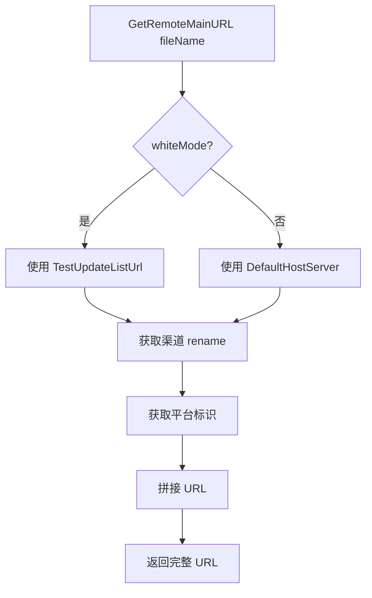
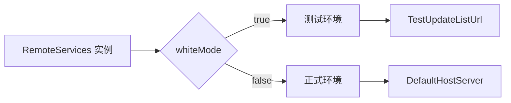

# RemoteServices.cs 文档

## 📄 文件信息表

| 属性 | 值 |
|------|------|
| 文件路径 | `Assets/Scripts/Mono/Module/YooAssets/RemoteServices.cs` |
| 命名空间 | `YooAsset` |
| 类类型 | 远程服务实现类 |
| 依赖模块 | YooAsset, TaoTie |
| 实现接口 | `IRemoteServices` |

---

## 🏗️ 类说明

**RemoteServices** 是 YooAsset 的远程服务实现类，用于构建资源下载的远程 URL。

### 核心职责

- 实现 YooAsset 的 `IRemoteServices` 接口
- 根据白名单模式选择正式/测试服务器
- 拼接渠道和平台信息到资源 URL
- 提供主备服务器地址切换

---

## 📊 字段表

| 字段名 | 类型 | 访问修饰符 | 说明 |
|--------|------|------------|------|
| `Instance` | `RemoteServices` | `public static` | 单例实例 |
| `whiteMode` | `bool` | `public` | 是否白名单模式 |
| `conf` | `CDNConfig` | `private` | CDN 配置引用 |
| `rename` | `string` | `private` | 渠道标识缓存 |

---

## 🔧 方法说明

### 构造函数

```csharp
public RemoteServices(CDNConfig config)
```

初始化远程服务。

**参数:**
- `config`: CDN 配置对象

**作用:**
- 保存 CDN 配置引用
- 设置单例实例
- 缓存渠道标识

---

### GetRemoteMainURL

```csharp
public string GetRemoteMainURL(string fileName)
```

获取主服务器资源 URL。

**参数:**
- `fileName`: 资源文件名

**返回:** 完整的资源下载 URL

**URL 格式:**
```
{baseUrl}/{channel}_{platform}/{fileName}
```

---

### GetRemoteFallbackURL

```csharp
public string GetRemoteFallbackURL(string fileName)
```

获取备用服务器资源 URL。

**参数:**
- `fileName`: 资源文件名

**返回:** 备用服务器的完整资源下载 URL

**用途:** 当主服务器不可用时使用备用地址

---

## 🔄 Mermaid 流程图

### URL 构建流程



### 白名单模式切换



---

## 💡 使用示例

### 初始化远程服务

```csharp
// 加载 CDN 配置
var cdnConfig = Resources.Load<CDNConfig>("CDNConfig");

// 创建远程服务
var remoteServices = new RemoteServices(cdnConfig);

// 设置白名单模式（用于测试）
RemoteServices.Instance.whiteMode = true;
```

### 获取资源 URL

```csharp
// 获取主服务器 URL
string mainUrl = remoteServices.GetRemoteMainURL("Prefabs/Player.prefab");
// 示例输出：https://cdn.example.com/official_windows/Prefabs/Player.prefab

// 获取备用服务器 URL
string fallbackUrl = remoteServices.GetRemoteFallbackURL("Prefabs/Player.prefab");
// 示例输出：https://cdn-backup.example.com/official_windows/Prefabs/Player.prefab
```

### 在 YooAsset 初始化中使用

```csharp
// WebGL 平台初始化
var initParameters = new WebPlayModeParameters();
var remoteServices = new RemoteServices(cdnConfig);

var webRemoteFileSystemParams = FileSystemParameters.CreateDefaultWebRemoteFileSystemParameters(
    remoteServices,
    new WebDecryption()
);

initParameters.WebRemoteFileSystemParameters = webRemoteFileSystemParams;
await package.InitializeAsync(initParameters);
```

---

## 🔗 相关文档链接

- [CDNConfig.cs.md](./CDNConfig.cs.md) - CDN 配置类
- [PackageManager.cs.md](./PackageManager.cs.md) - 资源包管理器
- [PlatformUtil.cs.md](../../Helper/PlatformUtil.cs.md) - 平台工具类
- [BundleDecryption.cs.md](./BundleDecryption.cs.md) - 资源解密类

---

*最后更新：2026-03-02*
