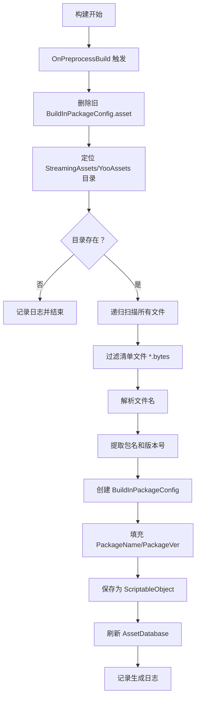
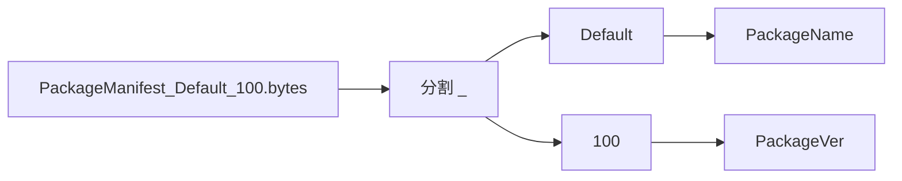

# StreamingAssetsHelper.cs 文档

## 📄 文件信息表

| 属性 | 值 |
|------|------|
| 文件路径 | `Assets/Scripts/Mono/Module/YooAssets/StreamingAssetsHelper.cs` |
| 命名空间 | `TaoTie` |
| 类类型 | 构建预处理类 |
| 依赖模块 | System.IO, UnityEngine, YooAsset, UnityEditor |
| 实现接口 | `UnityEditor.Build.IPreprocessBuildWithReport` |

---

## 🏗️ 类说明

**StreamingAssetsHelper** 中的 `PreprocessBuild` 类是一个 Unity 构建预处理脚本，在构建应用程序前自动扫描 YooAsset 资源目录并生成内置包版本配置。

### 核心职责

- 在构建前清理旧的配置文件
- 扫描 StreamingAssets 目录中的 YooAsset 资源包
- 解析资源包清单文件提取包名和版本号
- 自动生成 `BuildInPackageConfig.asset` 配置

### 使用场景

- 仅在 Unity 编辑器环境下生效
- 构建应用程序时自动触发
- 用于离线模式（OfflinePlayMode）的内置资源管理

---

## 📊 字段表

### PreprocessBuild 类

| 字段名 | 类型 | 访问修饰符 | 说明 |
|--------|------|------------|------|
| `callbackOrder` | `int` | `public` | 回调顺序（0 表示优先执行） |

---

## 🔧 方法说明

### OnPreprocessBuild

```csharp
public void OnPreprocessBuild(UnityEditor.Build.Reporting.BuildReport report)
```

在构建应用程序前执行的预处理方法。

**参数:**
- `report`: 构建报告对象

**执行流程:**

1. **清理旧配置**
   - 删除 `Assets/Resources/BuildInPackageConfig.asset`

2. **扫描资源目录**
   - 定位：`{Application.streamingAssetsPath}/YooAssets/`
   - 递归查找所有文件

3. **解析清单文件**
   - 匹配模式：`PackageManifest_{name}_{version}.bytes`
   - 提取包名和版本号

4. **生成配置**
   - 创建 `BuildInPackageConfig` ScriptableObject
   - 填充 `PackageName` 和 `PackageVer` 列表
   - 保存到 `Assets/Resources/BuildInPackageConfig.asset`

---

## 🔄 Mermaid 流程图

### 构建预处理流程



### 文件名解析



---

## 💡 使用示例

### 自动触发（构建时）

无需手动调用，Unity 会在构建时自动执行：

```
File → Build Settings → Build
↓
触发 IPreprocessBuildWithReport.OnPreprocessBuild
↓
自动生成 BuildInPackageConfig.asset
↓
继续构建流程
```

### 手动测试（编辑器下）

```csharp
#if UNITY_EDITOR
// 手动触发预处理（用于测试）
var preprocess = new PreprocessBuild();
var mockReport = new UnityEditor.Build.Reporting.BuildReport();
preprocess.OnPreprocessBuild(mockReport);
#endif
```

### 生成的配置示例

构建后生成的 `BuildInPackageConfig.asset` 内容：

```yaml
PackageName:
  - Default
  - UI
  - Audio
  - Effects
PackageVer:
  - 100
  - 50
  - 30
  - 25
```

对应目录结构：
```
StreamingAssets/
└── YooAssets/
    ├── PackageManifest_Default_100.bytes
    ├── PackageManifest_UI_50.bytes
    ├── PackageManifest_Audio_30.bytes
    └── PackageManifest_Effects_25.bytes
```

---

## 📝 注意事项

### 目录要求

- YooAsset 资源必须放在 `StreamingAssets/YooAssets/` 目录下
- 清单文件命名格式：`PackageManifest_{包名}_{版本号}.bytes`

### 编辑器专用

- 该类仅在 `UNITY_EDITOR` 定义下编译
- 打包后的运行时不会包含此代码
- 生成的 `BuildInPackageConfig.asset` 会包含在最终包中

### 清理机制

- 每次构建前会删除旧的配置文件
- 确保配置始终与当前构建内容一致

---

## 🔗 相关文档链接

- [BuildInPackageConfig.cs.md](./BuildInPackageConfig.cs.md) - 内置包配置类
- [PackageManager.cs.md](./PackageManager.cs.md) - 资源包管理器
- [PackageConfig.cs.md](./PackageConfig.cs.md) - 资源包配置

---

*最后更新：2026-03-02*
