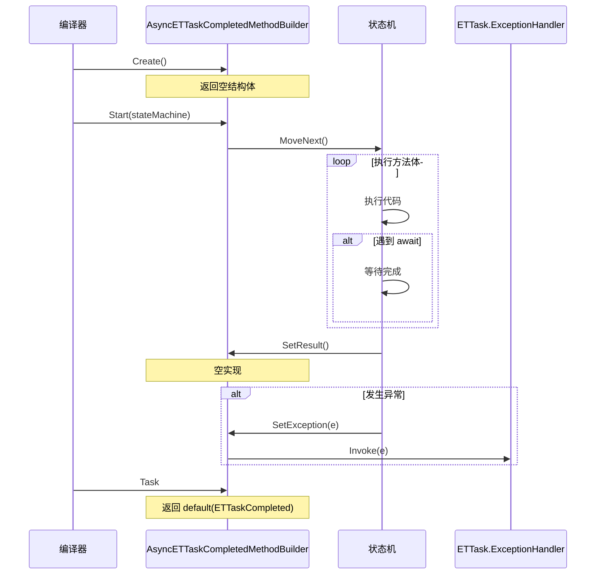

# AsyncETTaskCompletedMethodBuilder.cs - 已完成任务构建器

> **文件路径**: `Assets/Scripts/ThirdParty/ETTask/AsyncETTaskCompletedMethodBuilder.cs`  
> **命名空间**: `TaoTie`  
> **文档生成时间**: 2026-03-03  
> **文件类型**: 第三方库 (ET Framework)

---

## 📑 文件信息表

| 属性 | 值 |
|------|-----|
| **文件路径** | `Assets/Scripts/ThirdParty/ETTask/AsyncETTaskCompletedMethodBuilder.cs` |
| **命名空间** | `TaoTie` |
| **类/结构体** | `AsyncETTaskCompletedMethodBuilder` |
| **依赖** | `System`, `System.Diagnostics`, `System.Runtime.CompilerServices`, `System.Security` |
| **可见性** | `public struct` |
| **关联类型** | `ETTaskCompleted` |

---

## 🎯 类说明

### AsyncETTaskCompletedMethodBuilder

`ETTaskCompleted` 的异步方法构建器，由编译器自动生成和使用。

**核心职责**:
- 为返回 `ETTaskCompleted` 的 async 方法提供构建支持
- 将异常路由到 `ETTask.ExceptionHandler`
- 无需创建实际的任务对象

**与 AsyncETTaskMethodBuilder 的区别**:
| 特性 | AsyncETTaskCompletedMethodBuilder | AsyncETTaskMethodBuilder |
|------|----------------------------------|-------------------------|
| 返回类型 | `ETTaskCompleted` (空结构) | `ETTask` |
| Task 属性 | `default` | 实际的 `ETTask` 实例 |
| SetResult | 空实现 | 调用 `tcs.SetResult()` |
| SetException | 调用全局异常处理器 | 调用 `tcs.SetException()` |
| 内存开销 | 零 | 需要分配 `ETTask` 对象 |

---

## 📊 字段表

`AsyncETTaskCompletedMethodBuilder` 是空结构体，无字段。

---

## 🔧 方法说明

### 静态方法

#### Create()

```csharp
[DebuggerHidden]
public static AsyncETTaskCompletedMethodBuilder Create()
```

**说明**: 创建构建器实例。

**返回值**:
| 类型 | 说明 |
|------|------|
| `AsyncETTaskCompletedMethodBuilder` | 新的构建器实例 |

**内部逻辑**:
```csharp
return new AsyncETTaskCompletedMethodBuilder();
```

---

### 实例方法

#### Task (属性)

```csharp
public ETTaskCompleted Task => default;
```

**说明**: 返回默认的 `ETTaskCompleted` 值（空结构）。

---

#### SetException(Exception e)

```csharp
[DebuggerHidden]
public void SetException(Exception e)
```

**说明**: 将异常路由到全局异常处理器。

**参数**:
| 参数 | 类型 | 说明 |
|------|------|------|
| `e` | `Exception` | 异常对象 |

**内部逻辑**:
```csharp
ETTask.ExceptionHandler.Invoke(e);
```

---

#### SetResult()

```csharp
[DebuggerHidden]
public void SetResult()
```

**说明**: 空实现，无需设置结果。

---

#### AwaitOnCompleted<TAwaiter, TStateMachine>()

```csharp
[DebuggerHidden]
public void AwaitOnCompleted<TAwaiter, TStateMachine>(
    ref TAwaiter awaiter, 
    ref TStateMachine stateMachine) 
    where TAwaiter : INotifyCompletion 
    where TStateMachine : IAsyncStateMachine
```

**说明**: 注册 awaiter 完成后的回调。

**内部逻辑**:
```csharp
awaiter.OnCompleted(stateMachine.MoveNext);
```

---

#### AwaitUnsafeOnCompleted<TAwaiter, TStateMachine>()

```csharp
[DebuggerHidden]
[SecuritySafeCritical]
public void AwaitUnsafeOnCompleted<TAwaiter, TStateMachine>(
    ref TAwaiter awaiter, 
    ref TStateMachine stateMachine) 
    where TAwaiter : ICriticalNotifyCompletion 
    where TStateMachine : IAsyncStateMachine
```

**说明**: 注册 awaiter 完成后的回调（不安全版本）。

**内部逻辑**:
```csharp
awaiter.UnsafeOnCompleted(stateMachine.MoveNext);
```

---

#### Start<TStateMachine>()

```csharp
[DebuggerHidden]
public void Start<TStateMachine>(ref TStateMachine stateMachine) 
    where TStateMachine : IAsyncStateMachine
```

**说明**: 启动状态机执行。

**内部逻辑**:
```csharp
stateMachine.MoveNext();
```

---

#### SetStateMachine(IAsyncStateMachine)

```csharp
[DebuggerHidden]
public void SetStateMachine(IAsyncStateMachine stateMachine)
```

**说明**: 设置状态机（空实现，兼容接口）。

---

## 🔄 核心流程图

### 编译器使用流程



---

## 💡 使用示例

### 编译器生成的代码

```csharp
// 源代码
public async ETTaskCompleted ProcessAsync()
{
    await SomeOperation();
}

// 编译器生成的代码（简化版）
[CompilerGenerated]
public struct ProcessAsyncStateMachine : IAsyncStateMachine
{
    public int state;
    public AsyncETTaskCompletedMethodBuilder builder;
    
    public void MoveNext()
    {
        try
        {
            // 执行 await
            var awaiter = SomeOperation().GetAwaiter();
            if (!awaiter.IsCompleted)
            {
                state = 1;
                builder.AwaitOnCompleted(ref awaiter, ref this);
                return;
            }
            
            // await 完成
            awaiter.GetResult();
            builder.SetResult(); // 空实现
        }
        catch (Exception e)
        {
            builder.SetException(e); // 路由到全局处理器
        }
    }
}
```

---

### 实际应用场景

```csharp
// 场景 1: 接口实现需要返回 ETTask
public interface IProcessor
{
    ETTask ProcessAsync();
}

// 空实现或同步完成的情况
public class NoOpProcessor : IProcessor
{
    public ETTask ProcessAsync()
    {
        // 无需实际异步操作
        return ETTask.CompletedTask;
    }
}

// 如果使用 async，编译器会使用 AsyncETTaskCompletedMethodBuilder
public async ETTask ProcessAsync()
{
    // 空方法，编译器优化为返回 ETTaskCompleted
}
```

---

### 条件异步优化

```csharp
public async ETTask ValidateAsync(Data data)
{
    // 同步验证失败，直接返回
    if (!data.IsValid)
    {
        throw new ValidationException(); // 异常路由到全局处理器
    }
    
    // 异步验证
    await RemoteValidateAsync(data);
}

// 如果 data.IsValid 为 false，抛出异常后返回 ETTaskCompleted
```

---

## 📚 相关文档链接

| 文档 | 说明 |
|------|------|
| [ETTaskCompleted.cs.md](./ETTaskCompleted.cs.md) | 已完成任务结构 |
| [AsyncETVoidMethodBuilder.cs.md](./AsyncETVoidMethodBuilder.cs.md) | ETVoid 的构建器 |
| [AsyncETTaskMethodBuilder.cs.md](./AsyncETTaskMethodBuilder.cs.md) | ETTask 的构建器 |

---

## ⚠️ 注意事项

1. **编译器使用**: 通常由编译器自动生成，不需要手动调用
2. **零开销**: 空结构体，无内存分配
3. **异常处理**: 异常通过 `ETTask.ExceptionHandler` 统一处理
4. **无实际 Task**: `Task` 属性返回 `default`，不是实际的任务对象
5. **适用场景**: 仅用于返回 `ETTaskCompleted` 的 async 方法

---

## 🔍 设计原理

### 为什么需要专用构建器？

C# 编译器为不同的返回类型生成不同的构建器：

| 返回类型 | 构建器 |
|---------|--------|
| `Task` | `AsyncTaskMethodBuilder` |
| `Task<T>` | `AsyncTaskMethodBuilder<T>` |
| `void` | `AsyncVoidMethodBuilder` |
| `ETTask` | `ETAsyncTaskMethodBuilder` |
| `ETTask<T>` | `ETAsyncTaskMethodBuilder<T>` |
| `ETVoid` | `AsyncETVoidMethodBuilder` |
| `ETTaskCompleted` | `AsyncETTaskCompletedMethodBuilder` |

每个构建器针对其返回类型进行了优化：
- `ETTaskCompleted` 不需要实际的任务对象
- 空结构体减少内存分配
- 适合"同步完成的异步方法"

---

*文档由 OpenClaw AI 助手自动生成 | 基于静态代码分析*
