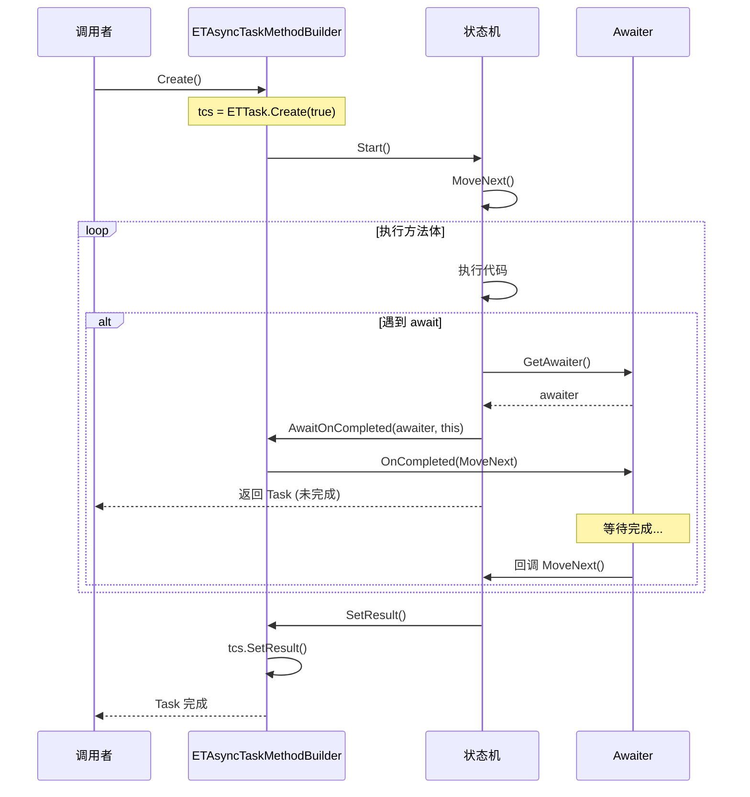

# AsyncETTaskMethodBuilder.cs - 异步方法构建器

> **文件路径**: `Assets/Scripts/ThirdParty/ETTask/AsyncETTaskMethodBuilder.cs`  
> **命名空间**: `TaoTie`  
> **文档生成时间**: 2026-03-03  
> **文件类型**: 第三方库 (ET Framework)

---

## 📑 文件信息表

| 属性 | 值 |
|------|-----|
| **文件路径** | `Assets/Scripts/ThirdParty/ETTask/AsyncETTaskMethodBuilder.cs` |
| **命名空间** | `TaoTie` |
| **类/结构体** | `ETAsyncTaskMethodBuilder`, `ETAsyncTaskMethodBuilder<T>` |
| **依赖** | `System`, `System.Diagnostics`, `System.Runtime.CompilerServices`, `System.Security` |
| **可见性** | `public struct` |

---

## 🎯 类说明

### ETAsyncTaskMethodBuilder

`ETTask` 的异步方法构建器，由编译器自动生成和使用。

**核心职责**:
- 创建 `ETTask` 实例
- 管理异步状态机的执行
- 设置任务结果或异常
- 调度 continuation

### ETAsyncTaskMethodBuilder<T>

`ETTask<T>` 的泛型异步方法构建器。

**核心职责**:
- 创建 `ETTask<T>` 实例
- 管理带返回值的异步状态机
- 设置泛型返回值或异常

---

## 📊 字段表

### ETAsyncTaskMethodBuilder 字段

| 字段名 | 类型 | 可见性 | 说明 |
|--------|------|--------|------|
| `tcs` | `ETTask` | `private` | 任务完成源 |

### ETAsyncTaskMethodBuilder<T> 字段

| 字段名 | 类型 | 可见性 | 说明 |
|--------|------|--------|------|
| `tcs` | `ETTask<T>` | `private` | 泛型任务完成源 |

---

## 🔧 方法说明

### 静态方法

#### Create()

```csharp
public static ETAsyncTaskMethodBuilder Create()
public static ETAsyncTaskMethodBuilder<T> Create()
```

**说明**: 创建构建器实例。

**返回值**:
| 类型 | 说明 |
|------|------|
| `ETAsyncTaskMethodBuilder` | 非泛型构建器 |
| `ETAsyncTaskMethodBuilder<T>` | 泛型构建器 |

**内部逻辑**:
```csharp
// 非泛型
var builder = new ETAsyncTaskMethodBuilder() 
{ 
    tcs = ETTask.Create(true) // 使用对象池
};

// 泛型
var builder = new ETAsyncTaskMethodBuilder<T>() 
{ 
    tcs = ETTask<T>.Create(true) // 使用对象池
};
```

---

### 实例方法

#### Task (属性)

```csharp
public ETTask Task { get; }
public ETTask<T> Task { get; }
```

**说明**: 获取关联的任务实例。

---

#### SetException(Exception exception)

```csharp
public void SetException(Exception exception)
```

**说明**: 设置任务异常状态。

**参数**:
| 参数 | 类型 | 说明 |
|------|------|------|
| `exception` | `Exception` | 异常对象 |

**内部逻辑**:
```csharp
tcs.SetException(exception);
```

---

#### SetResult()

```csharp
public void SetResult()
public void SetResult(T ret)
```

**说明**: 设置任务完成状态和返回值。

**参数**:
| 参数 | 类型 | 说明 |
|------|------|------|
| `ret` | `T` | 返回值（泛型版本） |

**内部逻辑**:
```csharp
// 非泛型
tcs.SetResult();

// 泛型
tcs.SetResult(ret);
```

---

#### AwaitOnCompleted<TAwaiter, TStateMachine>()

```csharp
public void AwaitOnCompleted<TAwaiter, TStateMachine>(
    ref TAwaiter awaiter, 
    ref TStateMachine stateMachine) 
    where TAwaiter : INotifyCompletion 
    where TStateMachine : IAsyncStateMachine
```

**说明**: 注册 awaiter 完成后的回调。

**参数**:
| 参数 | 类型 | 约束 | 说明 |
|------|------|------|------|
| `awaiter` | `TAwaiter` | `INotifyCompletion` | awaiter 实例 |
| `stateMachine` | `TStateMachine` | `IAsyncStateMachine` | 状态机实例 |

**内部逻辑**:
```csharp
awaiter.OnCompleted(stateMachine.MoveNext);
```

---

#### AwaitUnsafeOnCompleted<TAwaiter, TStateMachine>()

```csharp
[SecuritySafeCritical]
public void AwaitUnsafeOnCompleted<TAwaiter, TStateMachine>(
    ref TAwaiter awaiter, 
    ref TStateMachine stateMachine) 
    where TAwaiter : ICriticalNotifyCompletion 
    where TStateMachine : IAsyncStateMachine
```

**说明**: 注册 awaiter 完成后的回调（不安全版本）。

**参数**: 同 `AwaitOnCompleted`，但 `TAwaiter` 约束为 `ICriticalNotifyCompletion`。

**内部逻辑**:
```csharp
awaiter.OnCompleted(stateMachine.MoveNext);
```

---

#### Start<TStateMachine>()

```csharp
public void Start<TStateMachine>(ref TStateMachine stateMachine) 
    where TStateMachine : IAsyncStateMachine
```

**说明**: 启动状态机执行。

**参数**:
| 参数 | 类型 | 约束 | 说明 |
|------|------|------|------|
| `stateMachine` | `TStateMachine` | `IAsyncStateMachine` | 状态机实例 |

**内部逻辑**:
```csharp
stateMachine.MoveNext();
```

---

#### SetStateMachine(IAsyncStateMachine)

```csharp
public void SetStateMachine(IAsyncStateMachine stateMachine)
```

**说明**: 设置状态机（空实现，兼容接口）。

---

## 🔄 核心流程图

### 异步方法编译流程

```mermaid
flowchart TD
    Source[async ETTask Method()] --> Compile[编译器处理]
    Compile --> StateMachine[生成状态机类]
    StateMachine --> Builder[使用 ETAsyncTaskMethodBuilder]
    Builder --> Create[Builder.Create()]
    Create --> Task[创建 ETTask]
    Task --> Start[Builder.Start 状态机]
    Start --> MoveNext[状态机.MoveNext]
    MoveNext --> Await{遇到 await?}
    Await -->|是 | Register[Builder.AwaitOnCompleted]
    Register --> Suspend[挂起状态机]
    Await -->|否 | Continue[继续执行]
    Continue --> Complete{完成?}
    Complete -->|是 | SetResult[Builder.SetResult]
    Complete -->|异常 | SetException[Builder.SetException]
    SetResult --> Return[返回 Task]
    SetException --> Return
    Suspend --> Awaited[等待完成]
    Awaited --> MoveNext
```

### 状态机执行流程



---

## 💡 使用示例

### 编译器自动生成的代码

```csharp
// 源代码
public async ETTask DoWorkAsync()
{
    await TimerManager.Instance.WaitAsync(1000);
    Log.Info("完成");
}

// 编译器生成的代码（简化版）
[CompilerGenerated]
public class DoWorkAsyncStateMachine : IAsyncStateMachine
{
    public int state;
    public ETAsyncTaskMethodBuilder builder;
    private TimerManager timerMgr;
    private TaskAwaiter awaiter;
    
    public static ETAsyncTaskMethodBuilder Create()
    {
        return ETAsyncTaskMethodBuilder.Create();
    }
    
    public void MoveNext()
    {
        try
        {
            if (state == 0)
            {
                timerMgr = TimerManager.Instance;
                awaiter = timerMgr.WaitAsync(1000).GetAwaiter();
                state = 1;
                builder.AwaitOnCompleted(ref awaiter, ref this);
                return;
            }
            
            // await 完成后的代码
            Log.Info("完成");
            builder.SetResult();
        }
        catch (Exception e)
        {
            builder.SetException(e);
        }
    }
    
    public void Start<T>(ref T stateMachine) where T : IAsyncStateMachine
    {
        stateMachine.MoveNext();
    }
}
```

---

### 泛型版本

```csharp
// 源代码
public async ETTask<int> CalculateAsync()
{
    await TimerManager.Instance.WaitAsync(500);
    return 42;
}

// 使用 ETAsyncTaskMethodBuilder<int>
// builder.SetResult(42) 设置返回值
```

---

### 手动使用构建器（高级）

```csharp
// 一般不推荐手动使用，了解原理即可
public ETTask ManualAsync()
{
    var builder = ETAsyncTaskMethodBuilder.Create();
    
    // 异步操作
    ThreadPool.QueueUserWorkItem(_ =>
    {
        try
        {
            // 执行耗时操作
            DoWork();
            builder.SetResult();
        }
        catch (Exception e)
        {
            builder.SetException(e);
        }
    });
    
    return builder.Task;
}
```

---

## 📚 相关文档链接

| 文档 | 说明 |
|------|------|
| [ETTask.cs.md](./ETTask.cs.md) | 异步任务核心类 |
| [AsyncETVoidMethodBuilder.cs.md](./AsyncETVoidMethodBuilder.cs.md) | ETVoid 的构建器 |
| [AsyncETTaskCompletedMethodBuilder.cs.md](./AsyncETTaskCompletedMethodBuilder.cs.md) | ETTaskCompleted 的构建器 |

---

## ⚠️ 注意事项

1. **编译器自动生成**: 这些构建器通常由编译器自动生成和使用，不需要手动调用
2. **对象池**: `Create()` 方法使用对象池创建 `ETTask`，注意复用规则
3. **SetResult 幂等性**: 确保只调用一次 `SetResult` 或 `SetException`
4. **状态机生命周期**: 状态机在 async 方法完成前必须保持有效
5. **安全性**: `AwaitUnsafeOnCompleted` 标记为 `[SecuritySafeCritical]`，用于信任的代码

---

## 🔍 设计原理

### 为什么需要 MethodBuilder？

C# 的 async/await 是编译器特性，编译器会将 async 方法转换为状态机。MethodBuilder 是状态机与 Task 之间的桥梁：

1. **创建 Task**: 状态机需要创建返回的 Task
2. **调度执行**: 状态机需要在 await 完成后继续执行
3. **结果传递**: 状态机需要将结果或异常传递给 Task

### ET 框架的特殊性

ET Framework 的 `ETTask` 是自定义的 Task 实现，不是 .NET 原生的 `Task`，因此需要自定义的 MethodBuilder：

- 使用对象池减少 GC
- 更轻量的实现
- 支持协程 (Coroutine) 功能

---

*文档由 OpenClaw AI 助手自动生成 | 基于静态代码分析*
