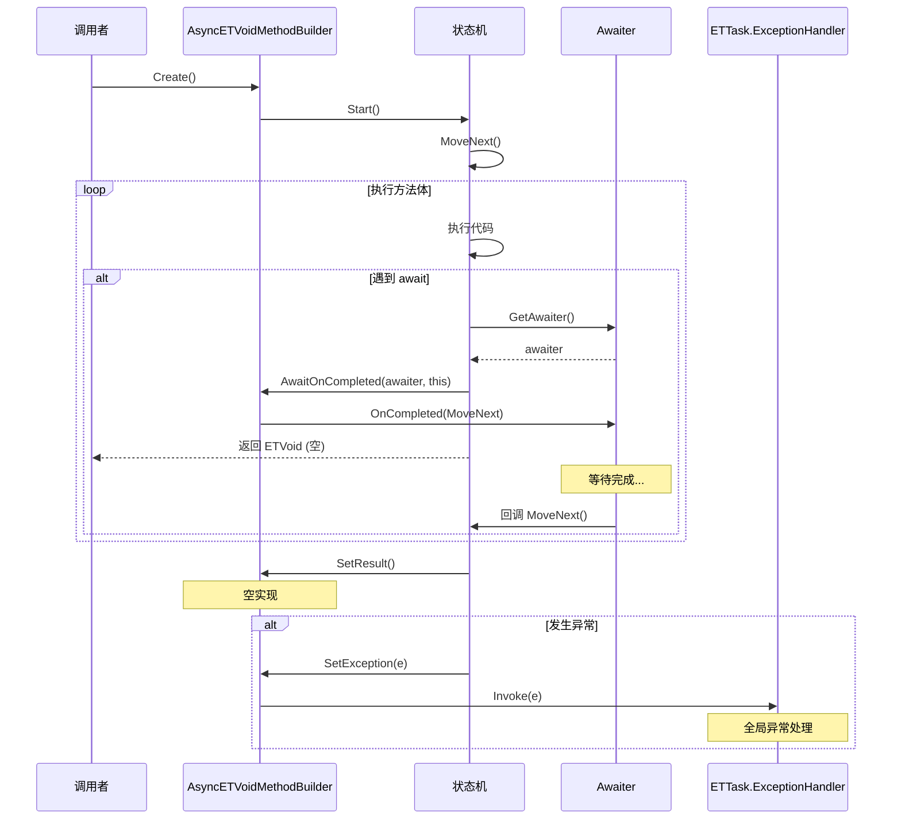

# AsyncETVoidMethodBuilder.cs - ETVoid 异步方法构建器

> **文件路径**: `Assets/Scripts/ThirdParty/ETTask/AsyncETVoidMethodBuilder.cs`  
> **命名空间**: `TaoTie`  
> **文档生成时间**: 2026-03-03  
> **文件类型**: 第三方库 (ET Framework)

---

## 📑 文件信息表

| 属性 | 值 |
|------|-----|
| **文件路径** | `Assets/Scripts/ThirdParty/ETTask/AsyncETVoidMethodBuilder.cs` |
| **命名空间** | `TaoTie` |
| **类/结构体** | `AsyncETVoidMethodBuilder` |
| **依赖** | `System`, `System.Diagnostics`, `System.Runtime.CompilerServices`, `System.Security` |
| **可见性** | `internal struct` |
| **关联类型** | `ETVoid` |

---

## 🎯 类说明

### AsyncETVoidMethodBuilder

`ETVoid` 的异步方法构建器，由编译器自动生成和使用。

**核心职责**:
- 为 `async ETVoid` 方法提供构建支持
- 将异常路由到 `ETTask.ExceptionHandler`
- 无需返回 Task，适合"发射后不管"的协程

**与 ETAsyncTaskMethodBuilder 的区别**:
| 特性 | AsyncETVoidMethodBuilder | ETAsyncTaskMethodBuilder |
|------|-------------------------|-------------------------|
| 返回类型 | `ETVoid` (空结构) | `ETTask` / `ETTask<T>` |
| Task 属性 | `default` (无实际对象) | 实际的 `ETTask` 实例 |
| SetResult | 空实现 | 设置任务完成 |
| SetException | 调用全局异常处理器 | 设置任务异常 |
| 使用场景 | 不等待的协程 | 需要等待的异步操作 |

---

## 📊 字段表

`AsyncETVoidMethodBuilder` 是空结构体，无字段。

---

## 🔧 方法说明

### 静态方法

#### Create()

```csharp
[DebuggerHidden]
public static AsyncETVoidMethodBuilder Create()
```

**说明**: 创建构建器实例。

**返回值**:
| 类型 | 说明 |
|------|------|
| `AsyncETVoidMethodBuilder` | 新的构建器实例 |

**内部逻辑**:
```csharp
return new AsyncETVoidMethodBuilder();
```

---

### 实例方法

#### Task (属性)

```csharp
[DebuggerHidden]
public ETVoid Task => default;
```

**说明**: 返回默认的 `ETVoid` 值（空结构）。

---

#### SetException(Exception e)

```csharp
[DebuggerHidden]
public void SetException(Exception e)
```

**说明**: 将异常路由到全局异常处理器。

**参数**:
| 参数 | 类型 | 说明 |
|------|------|------|
| `e` | `Exception` | 异常对象 |

**内部逻辑**:
```csharp
ETTask.ExceptionHandler.Invoke(e);
```

**⚠️ 重要**: 这是 `async ETVoid` 与 `async void` 的关键区别——异常不会丢失，而是通过全局处理器捕获。

---

#### SetResult()

```csharp
[DebuggerHidden]
public void SetResult()
```

**说明**: 空实现，无需设置结果。

---

#### AwaitOnCompleted<TAwaiter, TStateMachine>()

```csharp
[DebuggerHidden]
public void AwaitOnCompleted<TAwaiter, TStateMachine>(
    ref TAwaiter awaiter, 
    ref TStateMachine stateMachine) 
    where TAwaiter : INotifyCompletion 
    where TStateMachine : IAsyncStateMachine
```

**说明**: 注册 awaiter 完成后的回调。

**内部逻辑**:
```csharp
awaiter.OnCompleted(stateMachine.MoveNext);
```

---

#### AwaitUnsafeOnCompleted<TAwaiter, TStateMachine>()

```csharp
[DebuggerHidden]
[SecuritySafeCritical]
public void AwaitUnsafeOnCompleted<TAwaiter, TStateMachine>(
    ref TAwaiter awaiter, 
    ref TStateMachine stateMachine) 
    where TAwaiter : ICriticalNotifyCompletion 
    where TStateMachine : IAsyncStateMachine
```

**说明**: 注册 awaiter 完成后的回调（不安全版本）。

**内部逻辑**:
```csharp
awaiter.UnsafeOnCompleted(stateMachine.MoveNext);
```

---

#### Start<TStateMachine>()

```csharp
[DebuggerHidden]
public void Start<TStateMachine>(ref TStateMachine stateMachine) 
    where TStateMachine : IAsyncStateMachine
```

**说明**: 启动状态机执行。

**内部逻辑**:
```csharp
stateMachine.MoveNext();
```

---

#### SetStateMachine(IAsyncStateMachine)

```csharp
[DebuggerHidden]
public void SetStateMachine(IAsyncStateMachine stateMachine)
```

**说明**: 设置状态机（空实现，兼容接口）。

---

## 🔄 核心流程图

### async ETVoid 执行流程



### 异常处理对比

```mermaid
flowchart TD
    subgraph AsyncVoid[async void]
        V_Source[源代码] --> V_Compile[编译器]
        V_Compile --> V_SM[状态机]
        V_SM --> V_AsyncMethodBuilder[AsyncVoidMethodBuilder]
        V_AsyncMethodBuilder --> V_Exception{异常?}
        V_Exception -->|是 | V_Crash[程序崩溃 ❌]
    end
    
    subgraph AsyncETVoid[async ETVoid]
        EV_Source[源代码] --> EV_Compile[编译器]
        EV_Compile --> EV_SM[状态机]
        EV_SM --> EV_Builder[AsyncETVoidMethodBuilder]
        EV_Builder --> EV_Exception{异常?}
        EV_Exception -->|是 | EV_Handler[ETTask.ExceptionHandler ✅]
        EV_Handler --> EV_Log[记录日志/处理]
    end
    
    style AsyncVoid fill:#ffebee
    style AsyncETVoid fill:#e8f5e9
    style V_Crash fill:#f44336,color:#fff
    style EV_Handler fill:#4caf50,color:#fff
```



---

## 💡 使用示例

### 后台协程

```csharp
// 推荐：使用 async ETVoid 而非 async void
public async ETVoid BackgroundUpdateLoop()
{
    while (true)
    {
        await TimerManager.Instance.WaitAsync(1000);
        UpdateGameLogic();
    }
}

// 启动协程
BackgroundUpdateLoop().Coroutine();

// 异常会被全局处理器捕获，不会导致程序崩溃
```

---

### 全局异常处理器设置

```csharp
// 游戏启动时设置全局异常处理器
ETTask.ExceptionHandler = (exception) =>
{
    Log.Error($"未处理的协程异常：{exception}");
    
    // 可选：记录到日志文件
    // 可选：上报到错误追踪系统
    // 可选：显示错误提示给玩家
};

// 现在所有 async ETVoid 方法的异常都会被捕获
public async ETVoid RiskyCoroutine()
{
    await SomeOperation(); // 如果抛出异常，会被全局处理器捕获
}
```

---

### 与 ETTask 对比

```csharp
// ✅ 场景 1: 需要等待结果
public async ETTask LoadDataAsync()
{
    var data = await FetchDataAsync();
    ProcessData(data);
}

await LoadDataAsync(); // 等待完成

// ✅ 场景 2: 不等待的后台任务
public async ETVoid AutoSaveLoop()
{
    while (true)
    {
        await TimerManager.Instance.WaitAsync(60000); // 每分钟
        SaveGame();
    }
}

AutoSaveLoop().Coroutine(); // 启动不等待

// ❌ 避免：使用 async void
public async void BadCoroutine() // 异常无法捕获！
{
    await RiskyOperation();
}
```

---

### 带异常处理的协程

```csharp
// 虽然 ETVoid 有全局异常处理，但建议在协程内部处理已知异常
public async ETVoid NetworkHeartbeatLoop()
{
    while (true)
    {
        try
        {
            await TimerManager.Instance.WaitAsync(5000);
            await SendHeartbeatAsync();
        }
        catch (NetworkException e)
        {
            Log.Warning($"网络异常：{e}");
            // 可重试或等待重连
        }
        catch (Exception e)
        {
            Log.Error($"未知异常：{e}");
            // 未知异常会被全局处理器捕获
        }
    }
}
```

---

## 📚 相关文档链接

| 文档 | 说明 |
|------|------|
| [ETVoid.cs.md](./ETVoid.cs.md) | ETVoid 类型定义 |
| [ETTask.cs.md](./ETTask.cs.md) | ETTask 异步任务 |
| [AsyncETTaskMethodBuilder.cs.md](./AsyncETTaskMethodBuilder.cs.md) | ETTask 的构建器 |

---

## ⚠️ 注意事项

1. **内部类型**: `AsyncETVoidMethodBuilder` 是 `internal` 的，只能在程序集内部使用
2. **编译器使用**: 通常由编译器自动生成，不需要手动调用
3. **异常安全**: 虽然比 `async void` 安全，但仍建议在协程内部处理已知异常
4. **全局处理器**: 必须设置 `ETTask.ExceptionHandler`，否则异常会被吞掉
5. **Coroutine() 调用**: `ETVoid` 方法必须调用 `.Coroutine()` 才会真正执行

---

## 🔍 设计原理

### 为什么需要 ETVoid？

C# 的 `async void` 有严重问题：
- 异常无法捕获，直接导致程序崩溃
- 无法等待完成
- 不适合单元测试

`ETVoid` 提供了更安全的替代方案：
- 异常通过全局处理器捕获
- 可以显式调用 `Coroutine()` 启动
- 适合"发射后不管"的后台协程

### 与 Unity 协程对比

| 特性 | Unity Coroutine | async ETVoid |
|------|-----------------|--------------|
| 语法 | `IEnumerator` + `yield return` | `async` + `await` |
| 异常处理 | 需要手动 try-catch | 全局处理器 |
| 性能 | 需要分配 IEnumerator | 轻量级结构体 |
| 热更新 | 不支持 | 支持 |

---

*文档由 OpenClaw AI 助手自动生成 | 基于静态代码分析*
