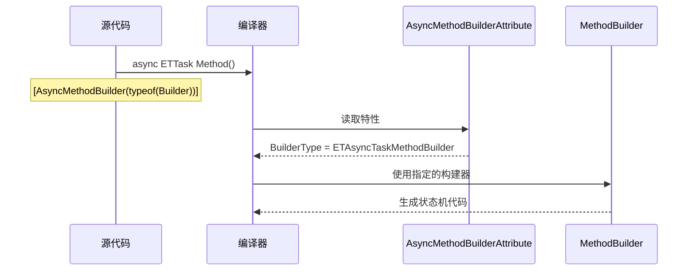

# AsyncMethodBuilderAttribute.cs - 异步方法构建器特性

> **文件路径**: `Assets/Scripts/ThirdParty/ETTask/AsyncMethodBuilderAttribute.cs`  
> **命名空间**: `System.Runtime.CompilerServices` (Unity 条件下)  
> **文档生成时间**: 2026-03-03  
> **文件类型**: 第三方库 (ET Framework / Polyfill)

---

## 📑 文件信息表

| 属性 | 值 |
|------|-----|
| **文件路径** | `Assets/Scripts/ThirdParty/ETTask/AsyncMethodBuilderAttribute.cs` |
| **命名空间** | `System.Runtime.CompilerServices` |
| **类/结构体** | `AsyncMethodBuilderAttribute` |
| **依赖** | `System` |
| **可见性** | `public sealed class` |
| **编译条件** | `!NOT_UNITY` (Unity 平台) |

---

## 🎯 类说明

### AsyncMethodBuilderAttribute

标记特性，用于指定异步返回类型应该使用的构建器类型。

**核心职责**:
- 告诉编译器某个异步返回类型使用哪个 MethodBuilder
- 连接返回类型（如 `ETTask`）和构建器（如 `ETAsyncTaskMethodBuilder`）

**设计特点**:
- 仅在不支持该特性的平台上定义（Polyfill）
- Unity 条件下编译（`!NOT_UNITY`）
- 标准 .NET 已内置此特性

---

## 📊 字段表

| 字段名 | 类型 | 可见性 | 说明 |
|--------|------|--------|------|
| `BuilderType` | `Type` | `public` | 构建器类型 |

---

## 🔧 方法说明

### 构造函数

#### AsyncMethodBuilderAttribute(Type builderType)

```csharp
public AsyncMethodBuilderAttribute(Type builderType)
```

**说明**: 创建特性实例。

**参数**:
| 参数 | 类型 | 说明 |
|------|------|------|
| `builderType` | `Type` | 构建器类型（必须是 `IMethodBuilder` 类型） |

**示例**:
```csharp
[AsyncMethodBuilder(typeof(ETAsyncTaskMethodBuilder))]
public class ETTask { }
```

---

### 属性

#### BuilderType

```csharp
public Type BuilderType { get; }
```

**说明**: 获取关联的构建器类型。

**返回值**:
| 类型 | 说明 |
|------|------|
| `Type` | 构建器的 `System.Type` 对象 |

---

## 🔄 核心流程图

### 编译器使用流程



---

## 💡 使用示例

### 在 ETTask 上的应用

```csharp
// ETTask.cs
[AsyncMethodBuilder(typeof(ETAsyncTaskMethodBuilder))]
public class ETTask : ICriticalNotifyCompletion
{
    // ...
}

// 使用时
public async ETTask DoWorkAsync()
{
    await TimerManager.Instance.WaitAsync(1000);
}

// 编译器看到返回类型是 ETTask
// 查找 [AsyncMethodBuilder] 特性
// 使用 ETAsyncTaskMethodBuilder 生成代码
```

---

### 泛型版本

```csharp
// ETTask<T>.cs
[AsyncMethodBuilder(typeof(ETAsyncTaskMethodBuilder<>))]
public class ETTask<T> : ICriticalNotifyCompletion
{
    // ...
}

// 使用时
public async ETTask<int> GetValueAsync()
{
    await TimerManager.Instance.WaitAsync(1000);
    return 42;
}

// 编译器使用 ETAsyncTaskMethodBuilder<int>
```

---

### ETVoid 的应用

```csharp
// ETVoid.cs
[AsyncMethodBuilder(typeof(AsyncETVoidMethodBuilder))]
internal struct ETVoid : ICriticalNotifyCompletion
{
    // ...
}

// 使用时
public async ETVoid BackgroundLoop()
{
    while (true)
    {
        await TimerManager.Instance.WaitAsync(1000);
    }
}

// 编译器使用 AsyncETVoidMethodBuilder
```

---

### ETTaskCompleted 的应用

```csharp
// ETTaskCompleted.cs
[AsyncMethodBuilder(typeof(AsyncETTaskCompletedMethodBuilder))]
public struct ETTaskCompleted : ICriticalNotifyCompletion
{
    // ...
}
```

---

## 📚 相关文档链接

| 文档 | 说明 |
|------|------|
| [ETTask.cs.md](./ETTask.cs.md) | ETTask 类 |
| [AsyncETTaskMethodBuilder.cs.md](./AsyncETTaskMethodBuilder.cs.md) | ETTask 的构建器 |
| [AsyncETVoidMethodBuilder.cs.md](./AsyncETVoidMethodBuilder.cs.md) | ETVoid 的构建器 |

---

## ⚠️ 注意事项

1. **Polyfill 性质**: 这个文件仅在 Unity 等不支持该特性的平台上定义
2. **编译条件**: `#if !NOT_UNITY` 确保只在 Unity 平台编译
3. **标准 .NET**: .NET Core / .NET Framework 已内置此特性
4. **命名空间**: 定义在 `System.Runtime.CompilerServices` 下，与标准库一致
5. **sealed 类**: 特性类是密封的，不能被继承

---

## 🔍 设计原理

### 为什么需要 Polyfill？

`AsyncMethodBuilderAttribute` 是 C# 7.0 (2017) 引入的特性，但：

1. **旧版 Unity**: 使用较旧的 .NET Framework / Mono，可能不包含此特性
2. **兼容性**: 确保在所有平台上都能编译
3. **条件编译**: `#if !NOT_UNITY` 确保只在需要的平台上定义

### 工作原理

```csharp
// 1. 在返回类型上标记特性
[AsyncMethodBuilder(typeof(MyBuilder))]
public class MyTask { }

// 2. 编译器看到 async 方法
public async MyTask DoWork() { }

// 3. 编译器查找 MyTask 的特性
// 4. 使用 MyBuilder 生成状态机代码
// 5. MyBuilder.Create() 创建构建器
// 6. 构建器管理任务生命周期
```

### 标准库定义（参考）

```csharp
// .NET 标准库中的定义
namespace System.Runtime.CompilerServices
{
    [AttributeUsage(AttributeTargets.Class | AttributeTargets.Struct | AttributeTargets.Enum | AttributeTargets.Interface, AllowMultiple = false)]
    public sealed class AsyncMethodBuilderAttribute : Attribute
    {
        public Type BuilderType { get; }
        
        public AsyncMethodBuilderAttribute(Type builderType)
        {
            BuilderType = builderType;
        }
    }
}
```

ET Framework 的定义与标准库一致，只是添加了条件编译。

---

*文档由 OpenClaw AI 助手自动生成 | 基于静态代码分析*
