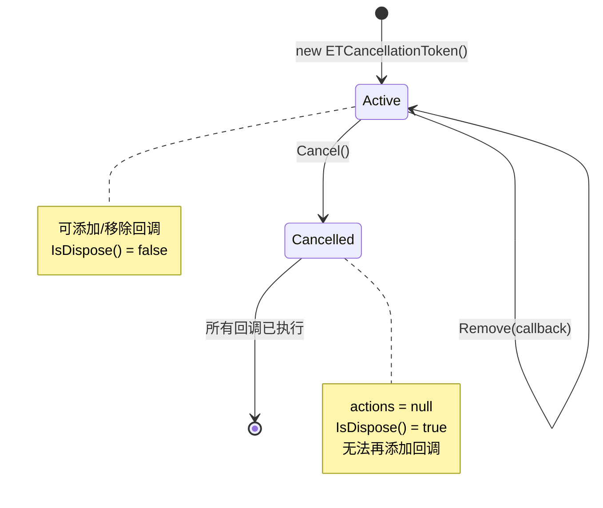
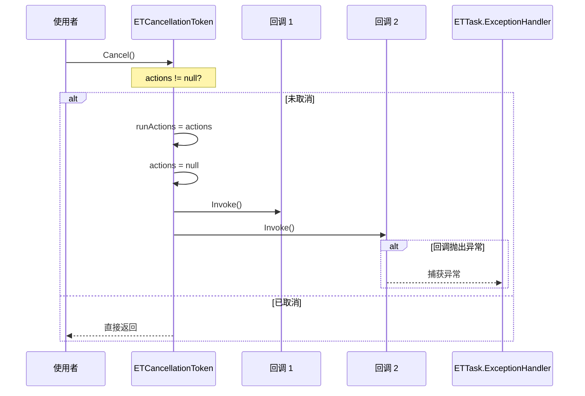

# ETCancellationToken.cs - 取消令牌

> **文件路径**: `Assets/Scripts/ThirdParty/ETTask/ETCancellationToken.cs`  
> **命名空间**: `TaoTie`  
> **文档生成时间**: 2026-03-03  
> **文件类型**: 第三方库 (ET Framework)

---

## 📑 文件信息表

| 属性 | 值 |
|------|-----|
| **文件路径** | `Assets/Scripts/ThirdParty/ETTask/ETCancellationToken.cs` |
| **命名空间** | `TaoTie` |
| **类/结构体** | `ETCancellationToken` |
| **依赖** | `System`, `System.Collections.Generic` |
| **可见性** | `public` |

---

## 🎯 类说明

### ETCancellationToken

协程取消令牌，用于管理和取消异步操作。

**核心职责**:
- 注册取消回调
- 触发取消操作
- 检测是否已取消

**设计特点**:
- 使用 `HashSet<Action>` 存储回调，避免重复
- 取消时清空回调集合，防止重复触发
- 异常通过 `ETTask.ExceptionHandler` 统一处理

---

## 📊 字段表

| 字段名 | 类型 | 可见性 | 说明 |
|--------|------|--------|------|
| `actions` | `HashSet<Action>` | `private` | 取消回调集合 |

---

## 🔧 方法说明

### Add(Action callback)

```csharp
public void Add(Action callback)
```

**说明**: 添加取消回调。

**参数**:
| 参数 | 类型 | 说明 |
|------|------|------|
| `callback` | `Action` | 取消时执行的回调 |

**⚠️ 注意**: 如果 `callback` 为 `null`，会抛出异常（防止协程泄漏）。

---

### Remove(Action callback)

```csharp
public void Remove(Action callback)
```

**说明**: 移除已注册的取消回调。

**参数**:
| 参数 | 类型 | 说明 |
|------|------|------|
| `callback` | `Action` | 要移除的回调 |

---

### IsDispose()

```csharp
public bool IsDispose()
```

**说明**: 检查令牌是否已取消（已调用 `Cancel()`）。

**返回值**:
| 类型 | 说明 |
|------|------|
| `bool` | `true` = 已取消，`false` = 未取消 |

---

### Cancel()

```csharp
public void Cancel()
```

**说明**: 触发取消，执行所有已注册的回调。

**行为**:
1. 检查是否已取消（`actions == null`），已取消则直接返回
2. 保存当前回调集合
3. 清空 `actions`（置为 `null`）
4. 遍历执行所有回调
5. 异常通过 `ETTask.ExceptionHandler` 处理

---

### Invoke()

```csharp
private void Invoke()
```

**说明**: 内部方法，执行所有取消回调。

---

## 🔄 核心流程图

### 取消令牌生命周期



### Cancel() 执行流程



---

## 💡 使用示例

### 基本取消操作

```csharp
var cancellationToken = new ETCancellationToken();

// 注册取消回调
cancellationToken.Add(() =>
{
    Log.Info("操作被取消");
});

// 执行异步操作
await SomeLongRunningOperation(cancellationToken);

// 需要取消时
cancellationToken.Cancel();
```

---

### 长时间运行任务的取消

```csharp
public async ETTask LongRunningTaskAsync(ETCancellationToken cancellationToken)
{
    cancellationToken.Add(() =>
    {
        Log.Info("任务被取消，清理资源...");
        Cleanup();
    });
    
    try
    {
        for (int i = 0; i < 100; i++)
        {
            // 检查是否已取消
            if (cancellationToken.IsDispose())
            {
                Log.Info("检测到取消，退出循环");
                return;
            }
            
            await TimerManager.Instance.WaitAsync(100);
            // 执行任务逻辑
        }
    }
    finally
    {
        // 清理回调
        cancellationToken.Remove(() => { });
    }
}
```

---

### 协程生命周期管理

```csharp
public class GameSession : IManager
{
    private ETCancellationToken _sessionToken;
    
    public void Init()
    {
        _sessionToken = new ETCancellationToken();
        StartSessionTasks();
    }
    
    public void Destroy()
    {
        // 会话结束时取消所有协程
        _sessionToken?.Cancel();
        _sessionToken = null;
    }
    
    private async ETVoid StartSessionTasks()
    {
        // 任务 1: 每秒更新
        _sessionToken.Add(() => Log.Info("更新任务停止"));
        while (!_sessionToken.IsDispose())
        {
            await TimerManager.Instance.WaitAsync(1000);
            UpdateLogic();
        }
        
        // 任务 2: 网络心跳
        _sessionToken.Add(() => Log.Info("心跳任务停止"));
        while (!_sessionToken.IsDispose())
        {
            await TimerManager.Instance.WaitAsync(5000);
            SendHeartbeat();
        }
    }
}
```

---

### 配合 WaitAsync 使用

```csharp
public async ETTask TimeoutOperationAsync(TimeSpan timeout)
{
    var cancellationToken = new ETCancellationToken();
    
    // 超时自动取消
    TimerManager.Instance.WaitAsync((long)timeout.TotalMilliseconds)
        .ContinueWith(() => cancellationToken.Cancel());
    
    try
    {
        await DoOperationAsync(cancellationToken);
        
        if (cancellationToken.IsDispose())
        {
            throw new TimeoutException("操作超时");
        }
    }
    finally
    {
        cancellationToken.Cancel();
    }
}
```

---

### 多个回调注册

```csharp
var token = new ETCancellationToken();

// 注册多个回调
token.Add(() => Log.Info("回调 1"));
token.Add(() => Log.Info("回调 2"));
token.Add(() => Log.Info("回调 3"));

// 取消时按注册顺序执行
token.Cancel();
// 输出:
// 回调 1
// 回调 2
// 回调 3
```

---

## 📚 相关文档链接

| 文档 | 说明 |
|------|------|
| [ETTask.cs.md](./ETTask.cs.md) | 异步任务核心类 |
| [ETTaskHelper.cs.md](./ETTaskHelper.cs.md) | 任务辅助工具 |
| [TimerManager.cs.md](../../Mono/Module/Timer/TimerManager.cs.md) | 定时器管理 |

---

## ⚠️ 注意事项

1. **回调不能为 null**: `Add(null)` 会抛出异常，防止协程泄漏
2. **取消后不可再用**: `Cancel()` 后 `actions` 被置为 `null`，无法再添加回调
3. **及时清理**: 长时间运行的协程应在结束时 `Remove` 回调，避免内存泄漏
4. **异常处理**: 回调中的异常通过 `ETTask.ExceptionHandler` 统一处理，不会中断其他回调
5. **线程安全**: 非线程安全，应在同一线程中操作

---

*文档由 OpenClaw AI 助手自动生成 | 基于静态代码分析*
