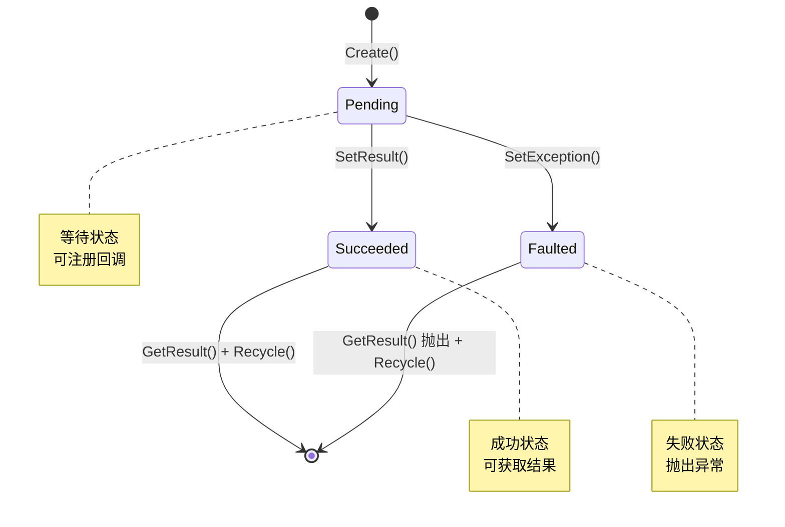
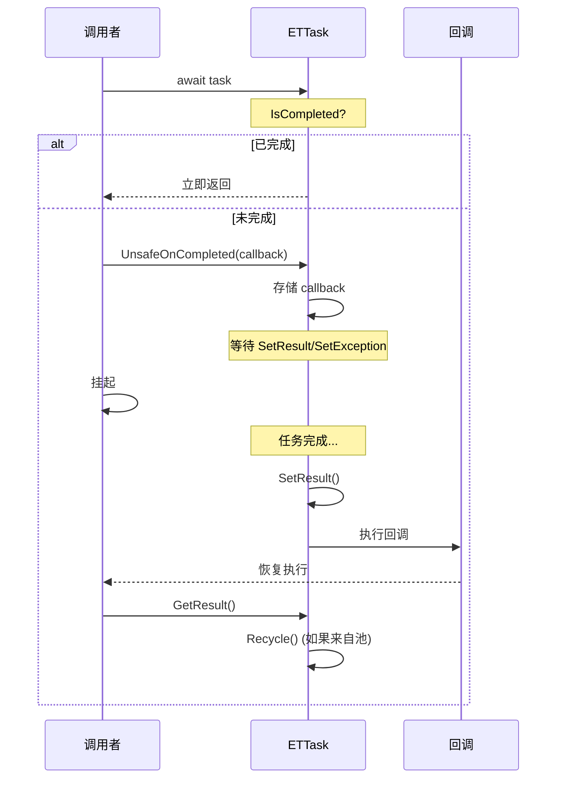
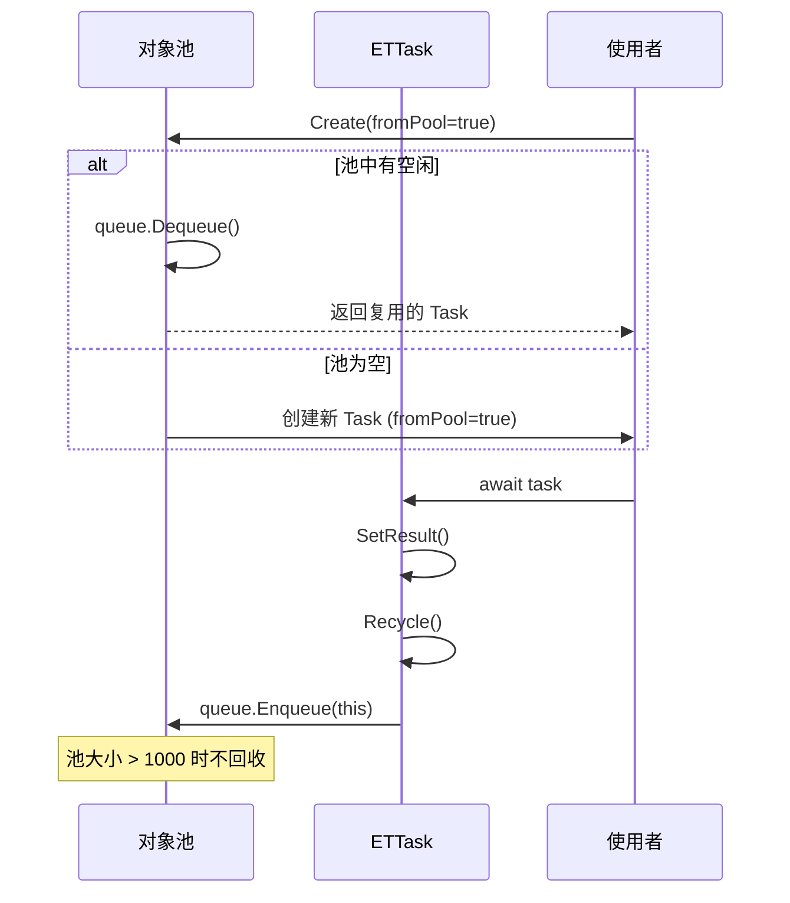

# ETTask.cs - 异步任务核心

> **文件路径**: `Assets/Scripts/ThirdParty/ETTask/ETTask.cs`  
> **命名空间**: `TaoTie`  
> **文档生成时间**: 2026-03-03  
> **文件类型**: 第三方库 (ET Framework)

---

## 📑 文件信息表

| 属性 | 值 |
|------|-----|
| **文件路径** | `Assets/Scripts/ThirdParty/ETTask/ETTask.cs` |
| **命名空间** | `TaoTie` |
| **类/结构体** | `ETTask`, `ETTask<T>` |
| **依赖** | `System`, `System.Diagnostics`, `System.Runtime.CompilerServices`, `System.Runtime.ExceptionServices` |
| **特性** | `[AsyncMethodBuilder]` |

---

## 🎯 类说明

### ETTask

无返回值的异步任务类，实现 `ICriticalNotifyCompletion` 接口，支持 async/await 模式。

**核心职责**:
- 提供轻量级的异步任务实现
- 支持对象池复用，减少 GC 压力
- 实现协程 (Coroutine) 功能
- 异常处理和回调通知

**设计特点**:
- 可选对象池模式 (`fromPool` 参数)
- 三种状态：`Pending`, `Succeeded`, `Faulted`
- 回调存储支持 `Action` 或 `ExceptionDispatchInfo`

### ETTask<T>

带返回值的泛型异步任务类，功能与 `ETTask` 类似，支持返回值。

---

## 📊 字段表

### ETTask 字段

| 字段名 | 类型 | 可见性 | 说明 |
|--------|------|--------|------|
| `ExceptionHandler` | `Action<Exception>` | `public static` | 全局异常处理器 |
| `queue` | `Queue<ETTask>` | `private static` | 对象池队列 |
| `fromPool` | `bool` | `private` | 是否来自对象池 |
| `state` | `AwaiterStatus` | `private` | 任务状态 |
| `callback` | `object` | `private` | 回调委托或异常信息 |

### ETTask<T> 字段

| 字段名 | 类型 | 可见性 | 说明 |
|--------|------|--------|------|
| `queue` | `Queue<ETTask<T>>` | `private static` | 泛型对象池队列 |
| `fromPool` | `bool` | `private` | 是否来自对象池 |
| `state` | `AwaiterStatus` | `private` | 任务状态 |
| `value` | `T` | `private` | 返回值 |
| `callback` | `object` | `private` | 回调委托或异常信息 |

---

## 🔧 方法说明

### 静态方法

#### Create(bool fromPool = false)

```csharp
public static ETTask Create(bool fromPool = false)
public static ETTask<T> Create(bool fromPool = false)
```

**说明**: 创建 ETTask 实例，可选择是否使用对象池。

**参数**:
| 参数 | 类型 | 默认值 | 说明 |
|------|------|--------|------|
| `fromPool` | `bool` | `false` | 是否从对象池获取 |

**⚠️ 警告**: 使用对象池时，await 之后不能再操作 ETTask，否则可能操作到再次从池中分配出来的 ETTask，产生灾难性后果！

---

#### CompletedTask (属性)

```csharp
public static ETTaskCompleted CompletedTask { get; }
```

**说明**: 获取已完成的空任务实例。

---

### 实例方法

#### GetAwaiter()

```csharp
public ETTask GetAwaiter()
public ETTask<T> GetAwaiter()
```

**说明**: 获取 awaiter，支持 await 语法。

---

#### IsCompleted (属性)

```csharp
public bool IsCompleted { get; }
```

**说明**: 获取任务是否已完成。

---

#### OnCompleted / UnsafeOnCompleted

```csharp
public void OnCompleted(Action action)
public void UnsafeOnCompleted(Action action)
```

**说明**: 注册完成回调。

---

#### GetResult()

```csharp
public void GetResult()
public T GetResult()
```

**说明**: 获取任务结果。如果任务失败则抛出异常。

**⚠️ 注意**: 不允许在任务未完成时直接调用 GetResult，请使用 await。

---

#### SetResult()

```csharp
public void SetResult()
public void SetResult(T result)
```

**说明**: 设置任务完成状态和返回值。

**异常**: `InvalidOperationException` - 任务已完成时再次调用。

---

#### SetException(Exception e)

```csharp
public void SetException(Exception e)
```

**说明**: 设置任务失败状态和异常。

---

#### Coroutine()

```csharp
public void Coroutine()
```

**说明**: 将任务作为协程启动（不等待）。

---

#### Recycle()

```csharp
private void Recycle()
```

**说明**: 回收到对象池（仅当 `fromPool=true` 时）。

---

## 🔄 核心流程图

### 任务状态转换



### 异步等待流程



### 对象池复用流程



---

## 💡 使用示例

### 基本异步方法

```csharp
// 无返回值
public async ETTask DoSomethingAsync()
{
    await TimerManager.Instance.WaitAsync(1000);
    Log.Info("1 秒后执行");
}

// 有返回值
public async ETTask<int> CalculateAsync()
{
    await TimerManager.Instance.WaitAsync(500);
    return 42;
}

// 调用
await DoSomethingAsync();
int result = await CalculateAsync();
```

---

### 使用对象池

```csharp
// 创建可复用的任务
var tcs = ETTask.Create(fromPool: true);

// 异步操作
_ = Task.Run(async () =>
{
    await TimerManager.Instance.WaitAsync(1000);
    tcs.SetResult(); // ⚠️ SetResult 后不要再用 tcs
});

await tcs; // await 后 tcs 可能已回收
```

---

### 协程启动

```csharp
// 启动不等待的协程
public async ETTask StartFireAndForget()
{
    var task = DoLongRunningTask();
    task.Coroutine(); // 启动但不等待
    // 继续执行其他逻辑
}
```

---

### 异常处理

```csharp
public async ETTask DangerousOperationAsync()
{
    try
    {
        await SomeRiskyOperation();
    }
    catch (Exception e)
    {
        Log.Error($"操作失败：{e}");
    }
}

// 设置全局异常处理器
ETTask.ExceptionHandler = (e) =>
{
    Log.Error($"未处理的异步异常：{e}");
};
```

---

### 取消令牌配合

```csharp
public async ETTask CancelableOperationAsync(ETCancellationToken cancellationToken)
{
    cancellationToken.Add(() =>
    {
        Log.Info("操作被取消");
    });
    
    try
    {
        await TimerManager.Instance.WaitAsync(5000);
        
        if (cancellationToken.IsDispose())
        {
            return; // 已取消
        }
        
        // 继续操作...
    }
    finally
    {
        cancellationToken.Remove(() => { });
    }
}
```

---

## 📚 相关文档链接

| 文档 | 说明 |
|------|------|
| [ETVoid.cs.md](./ETVoid.cs.md) | 无返回值的异步任务结构 |
| [ETTaskCompleted.cs.md](./ETTaskCompleted.cs.md) | 已完成的任务结构 |
| [ETCancellationToken.cs.md](./ETCancellationToken.cs.md) | 取消令牌 |
| [ETTaskHelper.cs.md](./ETTaskHelper.cs.md) | 任务辅助工具 (WaitAll/WaitAny) |
| [AsyncETTaskMethodBuilder.cs.md](./AsyncETTaskMethodBuilder.cs.md) | 异步方法构建器 |

---

## ⚠️ 注意事项

1. **对象池风险**: 使用 `fromPool=true` 时，await 后绝对不要再操作该 ETTask 对象
2. **SetResult 幂等性**: SetResult 前请确保 tcs 未被置空，避免多次 SetResult
3. **异常处理**: 建议设置全局 `ETTask.ExceptionHandler` 捕获未处理异常
4. **GetResult 调用**: 不要在任务未完成时直接调用 GetResult，请使用 await

---

*文档由 OpenClaw AI 助手自动生成 | 基于静态代码分析*
