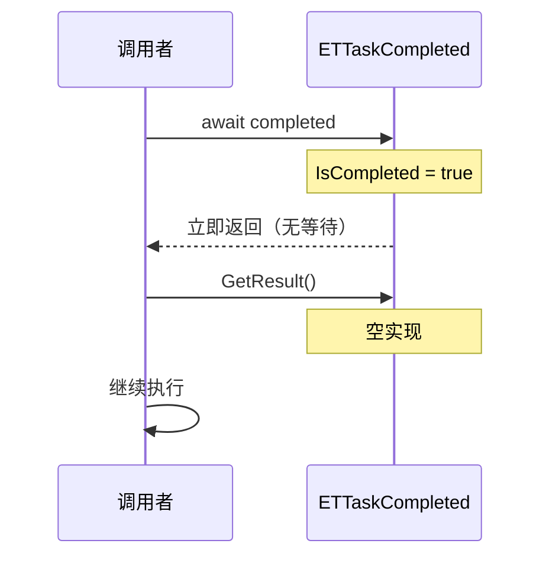
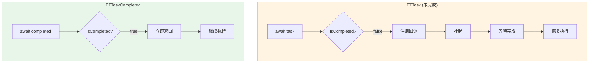

# ETTaskCompleted.cs - 已完成任务结构

> **文件路径**: `Assets/Scripts/ThirdParty/ETTask/ETTaskCompleted.cs`  
> **命名空间**: `TaoTie`  
> **文档生成时间**: 2026-03-03  
> **文件类型**: 第三方库 (ET Framework)

---

## 📑 文件信息表

| 属性 | 值 |
|------|-----|
| **文件路径** | `Assets/Scripts/ThirdParty/ETTask/ETTaskCompleted.cs` |
| **命名空间** | `TaoTie` |
| **类/结构体** | `ETTaskCompleted` |
| **依赖** | `System`, `System.Diagnostics`, `System.Runtime.CompilerServices` |
| **特性** | `[AsyncMethodBuilder(typeof(AsyncETTaskCompletedMethodBuilder))]` |
| **可见性** | `public struct` |

---

## 🎯 类说明

### ETTaskCompleted

表示已完成的异步任务的结构体，用于优化不需要等待的异步操作。

**核心职责**:
- 提供"已完成"的语义标记
- 避免为已完成操作分配实际的 `ETTask` 对象
- 支持 `await` 语法（立即返回）

**设计特点**:
- 空结构体（零内存开销）
- `IsCompleted` 始终返回 `true`
- 所有方法都是空实现（无实际操作）

**使用场景**:
- 缓存已完成的 task，避免重复创建
- 表示同步完成的异步方法
- 作为默认返回值

---

## 📊 字段表

`ETTaskCompleted` 是空结构体，无字段。

---

## 🔧 方法说明

### GetAwaiter()

```csharp
[DebuggerHidden]
public ETTaskCompleted GetAwaiter()
```

**说明**: 获取 awaiter（返回自身）。

**返回值**:
| 类型 | 说明 |
|------|------|
| `ETTaskCompleted` | 自身实例 |

---

### IsCompleted (属性)

```csharp
[DebuggerHidden]
public bool IsCompleted => true;
```

**说明**: 始终返回 `true`，表示任务已完成。

---

### GetResult()

```csharp
[DebuggerHidden]
public void GetResult()
```

**说明**: 空实现，无结果返回。

---

### OnCompleted(Action continuation)

```csharp
[DebuggerHidden]
public void OnCompleted(Action continuation)
```

**说明**: 空实现，无需注册回调（因为已完成）。

**参数**:
| 参数 | 类型 | 说明 |
|------|------|------|
| `continuation` | `Action` | 回调委托（被忽略） |

---

### UnsafeOnCompleted(Action continuation)

```csharp
[DebuggerHidden]
public void UnsafeOnCompleted(Action continuation)
```

**说明**: 空实现，无需注册回调（因为已完成）。

**参数**:
| 参数 | 类型 | 说明 |
|------|------|------|
| `continuation` | `Action` | 回调委托（被忽略） |

---

## 🔄 核心流程图

### await ETTaskCompleted 流程



### 与 ETTask 对比



---

## 💡 使用示例

### 缓存已完成任务

```csharp
public class ResourceManager
{
    // 缓存已完成的 task，避免重复创建
    private static readonly ETTask CompletedTask = ETTask.CompletedTask;
    
    public ETTask LoadResourceAsync(string path)
    {
        // 如果资源已缓存，直接返回已完成任务
        if (IsResourceCached(path))
        {
            return CompletedTask; // 无需创建新对象
        }
        
        // 否则异步加载
        return LoadResourceInternalAsync(path);
    }
}
```

---

### 同步完成的异步方法

```csharp
public async ETTask<int> GetValueAsync()
{
    // 如果值已缓存，同步返回
    if (cachedValue.HasValue)
    {
        return cachedValue.Value; // 编译器优化为返回 ETTaskCompleted
    }
    
    // 否则异步获取
    await FetchValueAsync();
    return cachedValue.Value;
}
```

---

### 默认返回值

```csharp
public ETTask GetTaskOrDefault(bool condition)
{
    if (condition)
    {
        return DoWorkAsync();
    }
    
    // 返回已完成任务作为默认值
    return ETTask.CompletedTask;
}

// 使用
await GetTaskOrDefault(hasPermission);
```

---

### 与 ETTask.CompletedTask 配合

```csharp
// ETTask.CompletedTask 返回 ETTaskCompleted 实例
public static ETTaskCompleted CompletedTask
{
    get
    {
        return new ETTaskCompleted();
    }
}

// 使用场景：立即完成的任务
public ETTask NoOpAsync()
{
    return ETTask.CompletedTask;
}

// 或者带返回值的版本
public ETTask<int> GetZeroAsync()
{
    return new ETTaskCompletedWithValue<int>(0); // 假设有这样的辅助类型
}
```

---

### 优化条件异步

```csharp
public async ETTask ProcessDataAsync(List<Data> dataList)
{
    // 空列表直接返回，避免不必要的异步操作
    if (dataList == null || dataList.Count == 0)
    {
        return; // 编译器优化为 ETTaskCompleted
    }
    
    // 处理数据
    foreach (var data in dataList)
    {
        await ProcessSingleDataAsync(data);
    }
}
```

---

## 📚 相关文档链接

| 文档 | 说明 |
|------|------|
| [ETTask.cs.md](./ETTask.cs.md) | 异步任务核心类 |
| [AsyncETTaskCompletedMethodBuilder.cs.md](./AsyncETTaskCompletedMethodBuilder.cs.md) | 构建器 |
| [ETVoid.cs.md](./ETVoid.cs.md) | 无返回值异步任务 |

---

## ⚠️ 注意事项

1. **零开销**: `ETTaskCompleted` 是空结构体，无内存分配
2. **立即完成**: `await` 一个 `ETTaskCompleted` 不会挂起，立即返回
3. **无回调**: 注册回调不会被执行（因为已完成）
4. **只读语义**: 不能对 `ETTaskCompleted` 调用 `SetResult` 或 `SetException`
5. **编译器优化**: 编译器会将 `async` 方法中的 `return;` 优化为返回 `ETTaskCompleted`

---

## 🔍 设计原理

### 为什么需要 ETTaskCompleted？

在异步编程中，经常需要返回"已完成"的任务：

```csharp
// 没有 ETTaskCompleted 的情况
public ETTask GetValueAsync()
{
    if (cached)
    {
        var tcs = ETTask.Create(); // 创建新对象
        tcs.SetResult();           // 立即完成
        return tcs;                // 每次调用都分配新对象 ❌
    }
    return LoadAsync();
}

// 使用 ETTaskCompleted
public ETTask GetValueAsync()
{
    if (cached)
    {
        return ETTask.CompletedTask; // 零开销 ✅
    }
    return LoadAsync();
}
```

### 性能优势

| 方案 | 内存分配 | GC 压力 | 性能 |
|------|---------|--------|------|
| `ETTask.Create()` + `SetResult()` | 每次调用分配 | 高 | 较差 |
| `ETTask.CompletedTask` | 无（栈上结构体） | 无 | 最优 |

---

*文档由 OpenClaw AI 助手自动生成 | 基于静态代码分析*
