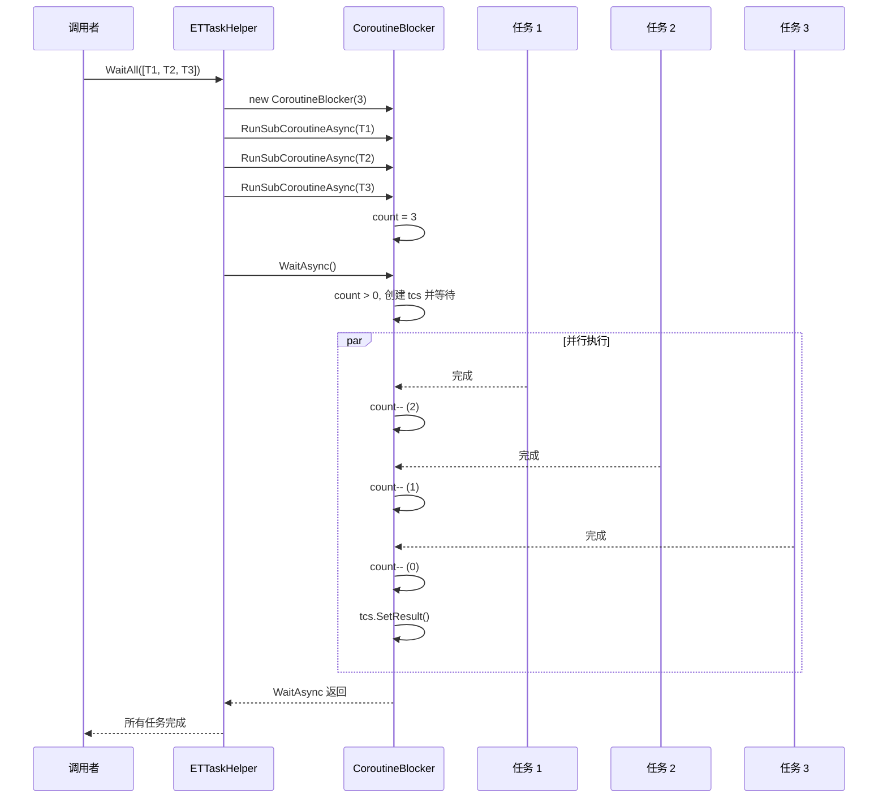
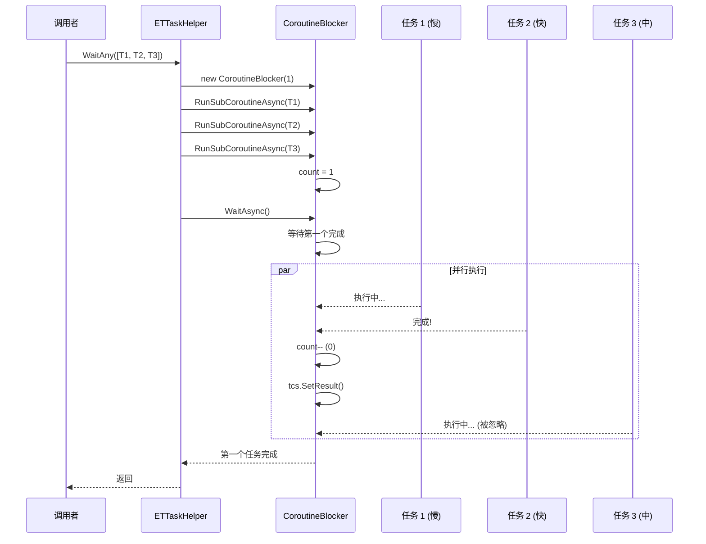

# ETTaskHelper.cs - 异步任务辅助工具

> **文件路径**: `Assets/Scripts/ThirdParty/ETTask/ETTaskHelper.cs`  
> **命名空间**: `TaoTie`  
> **文档生成时间**: 2026-03-03  
> **文件类型**: 第三方库 (ET Framework)

---

## 📑 文件信息表

| 属性 | 值 |
|------|-----|
| **文件路径** | `Assets/Scripts/ThirdParty/ETTask/ETTaskHelper.cs` |
| **命名空间** | `TaoTie` |
| **类/结构体** | `ETTaskHelper`, `CoroutineBlocker` |
| **依赖** | `System`, `System.Collections.Generic` |
| **可见性** | `public static` |

---

## 🎯 类说明

### ETTaskHelper

静态工具类，提供多任务等待和协调功能。

**核心职责**:
- `WaitAny`: 等待多个任务中任意一个完成
- `WaitAll`: 等待所有任务都完成
- 支持 `ETTask` 和 `ETTask<T>` 两种类型
- 支持 `List` 和数组两种集合类型

### CoroutineBlocker (内部类)

协程阻塞器，用于实现多任务等待的计数器机制。

**核心职责**:
- 维护待完成任务计数器
- 当所有子任务完成时通知主任务
- 支持 `ETTask` 和 `ETTask<T>` 两种子任务

---

## 📊 字段表

### CoroutineBlocker 字段

| 字段名 | 类型 | 可见性 | 说明 |
|--------|------|--------|------|
| `count` | `int` | `private` | 待完成任务计数器 |
| `tcs` | `ETTask` | `private` | 完成通知任务 |

---

## 🔧 方法说明

### 扩展方法

#### IsCancel()

```csharp
public static bool IsCancel(this ETCancellationToken self)
```

**说明**: 判断取消令牌是否已取消。

**参数**:
| 参数 | 类型 | 说明 |
|------|------|------|
| `self` | `ETCancellationToken` | 取消令牌 |

**返回值**:
| 类型 | 说明 |
|------|------|
| `bool` | `null` 返回 `false`，否则调用 `IsDispose()` |

**示例**:
```csharp
if (cancellationToken.IsCancel())
{
    return; // 已取消
}
```

---

### WaitAny - 等待任意一个完成

#### WaitAny(List<ETTask>)

```csharp
public static async ETTask WaitAny(List<ETTask> tasks)
```

**说明**: 等待列表中任意一个任务完成。

**参数**:
| 参数 | 类型 | 说明 |
|------|------|------|
| `tasks` | `List<ETTask>` | 任务列表 |

---

#### WaitAny(ETTask[])

```csharp
public static async ETTask WaitAny(ETTask[] tasks)
```

**说明**: 等待数组中任意一个任务完成。

**参数**:
| 参数 | 类型 | 说明 |
|------|------|------|
| `tasks` | `ETTask[]` | 任务数组 |

---

#### WaitAny<T>(List<ETTask<T>>)

```csharp
public static async ETTask WaitAny(List<ETTask<T>> tasks)
```

**说明**: 等待泛型任务列表中任意一个完成。

**参数**:
| 参数 | 类型 | 说明 |
|------|------|------|
| `tasks` | `List<ETTask<T>>` | 泛型任务列表 |

---

### WaitAll - 等待所有完成

#### WaitAll(ETTask[])

```csharp
public static async ETTask WaitAll(ETTask[] tasks)
```

**说明**: 等待数组中所有任务完成。

**参数**:
| 参数 | 类型 | 说明 |
|------|------|------|
| `tasks` | `ETTask[]` | 任务数组 |

---

#### WaitAll(List<ETTask>)

```csharp
public static async ETTask WaitAll(List<ETTask> tasks)
```

**说明**: 等待列表中所有任务完成。

**参数**:
| 参数 | 类型 | 说明 |
|------|------|------|
| `tasks` | `List<ETTask>` | 任务列表 |

---

#### WaitAll<T>(List<ETTask<T>>)

```csharp
public static async ETTask WaitAll(List<ETTask<T>> tasks)
```

**说明**: 等待泛型任务列表中所有任务完成。

**参数**:
| 参数 | 类型 | 说明 |
|------|------|------|
| `tasks` | `List<ETTask<T>>` | 泛型任务列表 |

---

### CoroutineBlocker 内部方法

#### RunSubCoroutineAsync(ETTask)

```csharp
public async ETTask RunSubCoroutineAsync(ETTask task)
```

**说明**: 运行子任务，完成后递减计数器。

---

#### RunSubCoroutineAsync<T>(ETTask<T>)

```csharp
public async ETTask RunSubCoroutineAsync<T>(ETTask<T> task)
```

**说明**: 运行泛型子任务，完成后递减计数器。

---

#### WaitAsync()

```csharp
public async ETTask WaitAsync()
```

**说明**: 等待所有子任务完成。

---

## 🔄 核心流程图

### WaitAll 执行流程



### WaitAny 执行流程



---

## 💡 使用示例

### WaitAll - 等待所有任务完成

```csharp
// 等待多个异步操作全部完成
public async ETTask LoadAllResourcesAsync()
{
    var tasks = new List<ETTask>
    {
        LoadTextureAsync("texture1"),
        LoadModelAsync("model1"),
        LoadAudioAsync("bgm"),
        LoadConfigAsync("settings")
    };
    
    await ETTaskHelper.WaitAll(tasks);
    Log.Info("所有资源加载完成");
}

// 使用数组
var taskArray = new[]
{
    DownloadFileAsync("file1"),
    DownloadFileAsync("file2"),
    DownloadFileAsync("file3")
};
await ETTaskHelper.WaitAll(taskArray);
```

---

### WaitAny - 等待第一个完成

```csharp
// 多个 CDN 节点，哪个快用哪个
public async ETTask<string> DownloadFromFastestAsync()
{
    var tasks = new List<ETTask<string>>
    {
        DownloadFromCdnAsync("cdn1.example.com"),
        DownloadFromCdnAsync("cdn2.example.com"),
        DownloadFromCdnAsync("cdn3.example.com")
    };
    
    await ETTaskHelper.WaitAny(tasks);
    // 第一个完成的 task 包含结果
}

// 超时模式：原始操作和超时任务哪个先完成
public async ETTask TimeoutOperationAsync(ETTask operation, int timeoutMs)
{
    var tasks = new List<ETTask>
    {
        operation,
        TimerManager.Instance.WaitAsync(timeoutMs)
    };
    
    await ETTaskHelper.WaitAny(tasks);
    // 如果超时先完成，说明操作超时
}
```

---

### 并行执行多个独立任务

```csharp
// 并行处理多个玩家数据
public async ETTask ProcessAllPlayersAsync(List<Player> players)
{
    var tasks = new List<ETTask>();
    
    foreach (var player in players)
    {
        tasks.Add(ProcessPlayerAsync(player));
    }
    
    await ETTaskHelper.WaitAll(tasks);
    Log.Info($"处理完成 {players.Count} 个玩家");
}

private async ETTask ProcessPlayerAsync(Player player)
{
    // 更新玩家数据
    await UpdatePlayerDataAsync(player);
    // 保存玩家数据
    await SavePlayerDataAsync(player);
}
```

---

### 带返回值的 WaitAll

```csharp
// 并行获取多个数据，收集所有结果
public async ETTask<List<UserData>> GetAllUserDataAsync(List<long> userIds)
{
    var tasks = new List<ETTask<UserData>>();
    
    foreach (var userId in userIds)
    {
        tasks.Add(GetUserDataByIdAsync(userId));
    }
    
    await ETTaskHelper.WaitAll(tasks);
    
    // 收集所有结果
    var results = new List<UserData>();
    foreach (var task in tasks)
    {
        results.Add(task.GetResult());
    }
    
    return results;
}
```

---

### 配合取消令牌使用

```csharp
public async ETTask DownloadWithTimeoutAsync(string url, int timeoutMs)
{
    var cancellationToken = new ETCancellationToken();
    
    var downloadTask = DownloadFileAsync(url, cancellationToken);
    var timeoutTask = TimerManager.Instance.WaitAsync(timeoutMs);
    
    var tasks = new List<ETTask> { downloadTask, timeoutTask };
    
    await ETTaskHelper.WaitAny(tasks);
    
    if (timeoutTask.IsCompleted && !downloadTask.IsCompleted)
    {
        // 超时了，取消下载
        cancellationToken.Cancel();
        throw new TimeoutException($"下载超时 ({timeoutMs}ms)");
    }
    
    // 下载完成
    await downloadTask;
}
```

---

### 批量处理分片

```csharp
// 将大量任务分批处理
public async ETTask ProcessInBatchesAsync(List<Item> items, int batchSize)
{
    for (int i = 0; i < items.Count; i += batchSize)
    {
        var batch = items.GetRange(i, Math.Min(batchSize, items.Count - i));
        var tasks = batch.Select(item => ProcessItemAsync(item)).ToList();
        
        await ETTaskHelper.WaitAll(tasks);
        Log.Info($"完成批次 {i / batchSize + 1}");
    }
}
```

---

## 📚 相关文档链接

| 文档 | 说明 |
|------|------|
| [ETTask.cs.md](./ETTask.cs.md) | 异步任务核心类 |
| [ETCancellationToken.cs.md](./ETCancellationToken.cs.md) | 取消令牌 |
| [TimerManager.cs.md](../../Mono/Module/Timer/TimerManager.cs.md) | 定时器管理 |

---

## ⚠️ 注意事项

1. **空集合处理**: 传入空列表或数组会直接返回，不等待
2. **异常传播**: 如果任一子任务抛出异常，异常会传播到调用者
3. **WaitAny 不取消其他任务**: WaitAny 返回后，其他未完成的任务仍会继续执行
4. **性能考虑**: 大量任务时建议使用分批处理，避免同时创建过多协程
5. **CoroutineBlocker 复用**: 每个 WaitAll/WaitAny 创建新的 CoroutineBlocker，不可复用

---

*文档由 OpenClaw AI 助手自动生成 | 基于静态代码分析*
