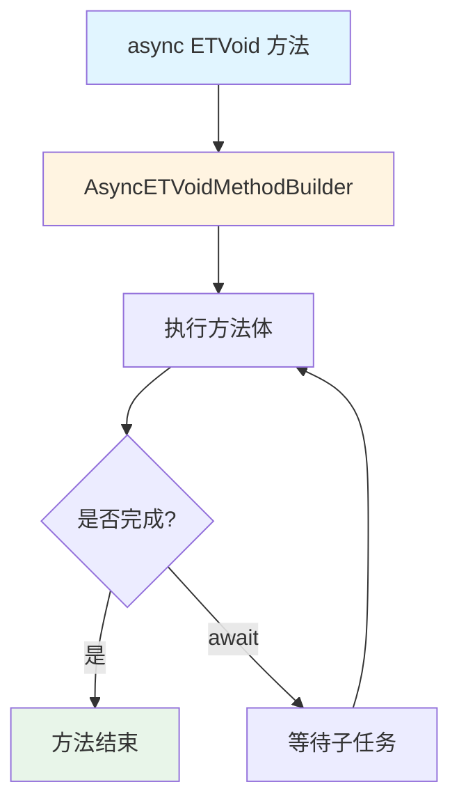
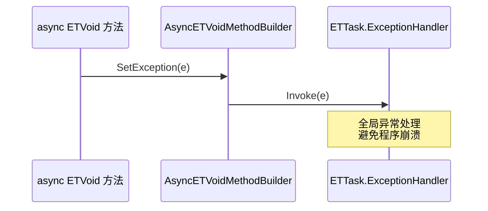

# ETVoid.cs - 无返回值异步任务结构

> **文件路径**: `Assets/Scripts/ThirdParty/ETTask/ETVoid.cs`  
> **命名空间**: `TaoTie`  
> **文档生成时间**: 2026-03-03  
> **文件类型**: 第三方库 (ET Framework)

---

## 📑 文件信息表

| 属性 | 值 |
|------|-----|
| **文件路径** | `Assets/Scripts/ThirdParty/ETTask/ETVoid.cs` |
| **命名空间** | `TaoTie` |
| **类/结构体** | `ETVoid` |
| **依赖** | `System`, `System.Diagnostics`, `System.Runtime.CompilerServices` |
| **特性** | `[AsyncMethodBuilder(typeof(AsyncETVoidMethodBuilder))]` |
| **可见性** | `internal` |

---

## 🎯 类说明

### ETVoid

内部结构体，用于标记无返回值且不需要等待的异步方法。

**核心职责**:
- 作为 `async ETVoid` 方法的返回类型
- 提供类似 `async void` 的功能，但更安全
- 支持协程启动 (`Coroutine()` 方法)

**与 async void 的区别**:
- `async void` 无法捕获异常，容易导致程序崩溃
- `ETVoid` 通过 `AsyncETVoidMethodBuilder` 将异常路由到 `ETTask.ExceptionHandler`
- `ETVoid` 可以显式调用 `Coroutine()` 启动

---

## 📊 字段表

`ETVoid` 是空结构体，无字段。

---

## 🔧 方法说明

### Coroutine()

```csharp
[DebuggerHidden]
public void Coroutine()
```

**说明**: 启动协程（空实现，仅用于语法兼容）。

---

### IsCompleted (属性)

```csharp
[DebuggerHidden]
public bool IsCompleted => true;
```

**说明**: 始终返回 `true`，表示已完成。

---

### OnCompleted / UnsafeOnCompleted

```csharp
[DebuggerHidden]
public void OnCompleted(Action continuation)
[DebuggerHidden]
public void UnsafeOnCompleted(Action continuation)
```

**说明**: 空实现，用于满足 `ICriticalNotifyCompletion` 接口。

---

## 🔄 核心流程图

### ETVoid 使用场景



### 异常处理流程



---

## 💡 使用示例

### 启动不等待的协程

```csharp
// 推荐方式：使用 ETVoid 而非 async void
public async ETVoid FireAndForgetCoroutine()
{
    while (true)
    {
        await TimerManager.Instance.WaitAsync(1000);
        Log.Info("每秒执行一次");
    }
}

// 启动协程
FireAndForgetCoroutine().Coroutine();
```

---

### 与 ETTask 对比

```csharp
// ✅ 推荐：需要等待时使用 ETTask
public async ETTask DoWorkAsync()
{
    await TimerManager.Instance.WaitAsync(1000);
}

await DoWorkAsync(); // 等待完成

// ✅ 推荐：不等待的后台协程使用 ETVoid
public async ETVoid BackgroundLoop()
{
    while (true)
    {
        await TimerManager.Instance.WaitAsync(1000);
        Log.Info("后台任务");
    }
}

BackgroundLoop().Coroutine(); // 启动不等待

// ❌ 避免：使用 async void
public async void BadAsyncVoid() // 异常无法捕获！
{
    await SomeOperation();
}
```

---

### 协程生命周期管理

```csharp
public class GameManager : IManager
{
    private ETCancellationToken _cancellationToken;
    
    public void Init()
    {
        _cancellationToken = new ETCancellationToken();
        StartBackgroundTasks();
    }
    
    public void Destroy()
    {
        _cancellationToken?.Cancel(); // 停止所有协程
    }
    
    private async ETVoid StartBackgroundTasks()
    {
        _cancellationToken.Add(() =>
        {
            Log.Info("后台任务已停止");
        });
        
        while (!_cancellationToken.IsDispose())
        {
            await TimerManager.Instance.WaitAsync(1000);
            // 执行后台逻辑
        }
    }
}
```

---

## 📚 相关文档链接

| 文档 | 说明 |
|------|------|
| [ETTask.cs.md](./ETTask.cs.md) | 标准异步任务类 |
| [AsyncETVoidMethodBuilder.cs.md](./AsyncETVoidMethodBuilder.cs.md) | ETVoid 的方法构建器 |
| [ETCancellationToken.cs.md](./ETCancellationToken.cs.md) | 取消令牌 |

---

## ⚠️ 注意事项

1. **内部类型**: `ETVoid` 是 `internal` 的，只能在程序集内部使用
2. **Coroutine() 调用**: `ETVoid` 方法必须调用 `.Coroutine()` 才会真正执行
3. **异常安全**: 虽然比 `async void` 安全，但仍建议设置全局异常处理器
4. **生命周期管理**: 长时间运行的 `ETVoid` 协程应使用 `ETCancellationToken` 管理生命周期

---

*文档由 OpenClaw AI 助手自动生成 | 基于静态代码分析*
