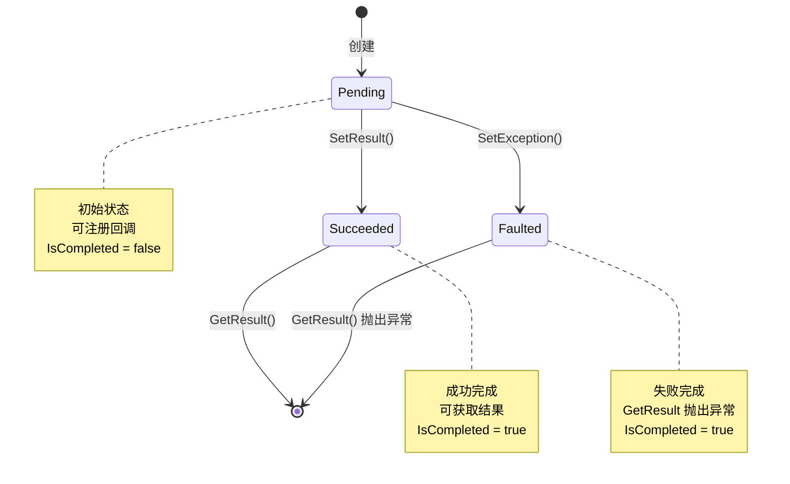

# IAwaiter.cs - 等待者接口定义

> **文件路径**: `Assets/Scripts/ThirdParty/ETTask/IAwaiter.cs`  
> **命名空间**: `TaoTie`  
> **文档生成时间**: 2026-03-03  
> **文件类型**: 第三方库 (ET Framework)

---

## 📑 文件信息表

| 属性 | 值 |
|------|-----|
| **文件路径** | `Assets/Scripts/ThirdParty/ETTask/IAwaiter.cs` |
| **命名空间** | `TaoTie` |
| **类/结构体** | `AwaiterStatus` (枚举) |
| **依赖** | 无 |
| **可见性** | `public enum` |

---

## 🎯 枚举说明

### AwaiterStatus

表示异步等待器的状态。

**核心职责**:
- 标记异步任务的当前状态
- 支持状态判断和流转

**设计特点**:
- 使用 `byte` 类型，最小内存开销
- 三种状态覆盖所有异步场景

---

## 📊 枚举值

| 值 | 名称 | 数值 | 说明 |
|----|------|------|------|
| `Pending` | 等待中 | `0` | 操作尚未完成 |
| `Succeeded` | 成功 | `1` | 操作成功完成 |
| `Faulted` | 失败 | `2` | 操作完成但发生错误 |

---

## 🔄 状态转换图



---

## 💡 使用示例

### 状态判断

```csharp
// ETTask 内部使用
private AwaiterStatus state;

// 检查是否完成
public bool IsCompleted => state != AwaiterStatus.Pending;

// 根据状态执行不同逻辑
switch (state)
{
    case AwaiterStatus.Pending:
        // 等待中，注册回调
        callback = action;
        break;
        
    case AwaiterStatus.Succeeded:
        // 成功，直接执行回调
        action?.Invoke();
        break;
        
    case AwaiterStatus.Faulted:
        // 失败，抛出异常
        exceptionInfo?.Throw();
        break;
}
```

---

### 状态流转

```csharp
public class CustomTask
{
    private AwaiterStatus state = AwaiterStatus.Pending;
    
    public void SetResult()
    {
        if (state != AwaiterStatus.Pending)
        {
            throw new InvalidOperationException("Already completed");
        }
        state = AwaiterStatus.Succeeded;
    }
    
    public void SetException(Exception e)
    {
        if (state != AwaiterStatus.Pending)
        {
            throw new InvalidOperationException("Already completed");
        }
        state = AwaiterStatus.Faulted;
    }
    
    public void GetResult()
    {
        switch (state)
        {
            case AwaiterStatus.Succeeded:
                return; // 成功
            case AwaiterStatus.Faulted:
                throw new Exception("Task failed");
            default:
                throw new NotSupportedException("Task not completed");
        }
    }
}
```

---

### 与 ETTask 配合

```csharp
// ETTask 内部实现
public class ETTask
{
    private AwaiterStatus state;
    
    public bool IsCompleted => state != AwaiterStatus.Pending;
    
    public void SetResult()
    {
        state = AwaiterStatus.Succeeded;
        // 执行回调...
    }
    
    public void SetException(Exception e)
    {
        state = AwaiterStatus.Faulted;
        // 执行回调...
    }
    
    public void GetResult()
    {
        switch (state)
        {
            case AwaiterStatus.Succeeded:
                Recycle(); // 回收到对象池
                break;
            case AwaiterStatus.Faulted:
                Recycle();
                throw exception;
            default:
                throw new NotSupportedException("Not completed");
        }
    }
}
```

---

## 📚 相关文档链接

| 文档 | 说明 |
|------|------|
| [ETTask.cs.md](./ETTask.cs.md) | 异步任务核心类 |
| [AsyncETTaskMethodBuilder.cs.md](./AsyncETTaskMethodBuilder.cs.md) | 异步方法构建器 |

---

## ⚠️ 注意事项

1. **不可逆转换**: 状态一旦变为 `Succeeded` 或 `Faulted`，不能再变回 `Pending`
2. **线程安全**: 状态转换应该在线程安全的环境中进行
3. **最终状态**: `Succeeded` 和 `Faulted` 都是最终状态，不可再改变
4. **默认值**: `Pending = 0` 是默认值，新建任务初始状态为 `Pending`

---

## 🔍 设计原理

### 为什么需要三种状态？

异步任务的生命周期需要明确的状态标记：

1. **Pending (等待中)**:
   - 任务正在执行
   - 可以注册回调
   - `IsCompleted = false`

2. **Succeeded (成功)**:
   - 任务成功完成
   - 可以获取结果
   - `IsCompleted = true`

3. **Faulted (失败)**:
   - 任务执行失败
   - `GetResult()` 会抛出异常
   - `IsCompleted = true`

这种设计与 .NET 的 `TaskStatus` 类似，但更简化，只保留最常用的三种状态。

### 与 .NET TaskStatus 对比

| ET Framework | .NET TaskStatus | 说明 |
|-------------|-----------------|------|
| `Pending` | `Created`, `WaitingForActivation`, `Running`, `WaitingToRun` | 未完成 |
| `Succeeded` | `RanToCompletion` | 成功完成 |
| `Faulted` | `Faulted`, `Canceled` | 失败/取消 |

ET Framework 简化了状态，因为：
- 不需要区分各种"未完成"的子状态
- 取消被视为一种失败（通过 `ETCancellationToken` 处理）

---

*文档由 OpenClaw AI 助手自动生成 | 基于静态代码分析*
