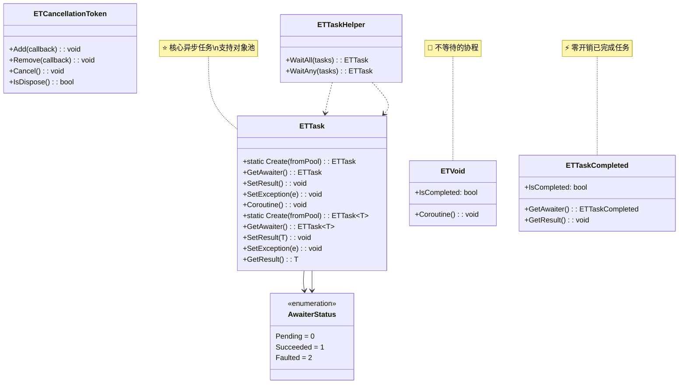
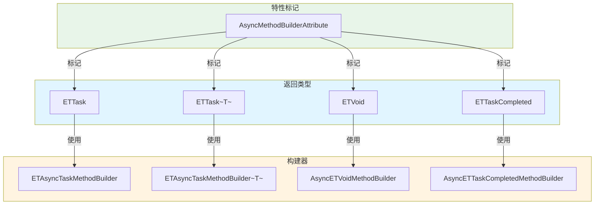
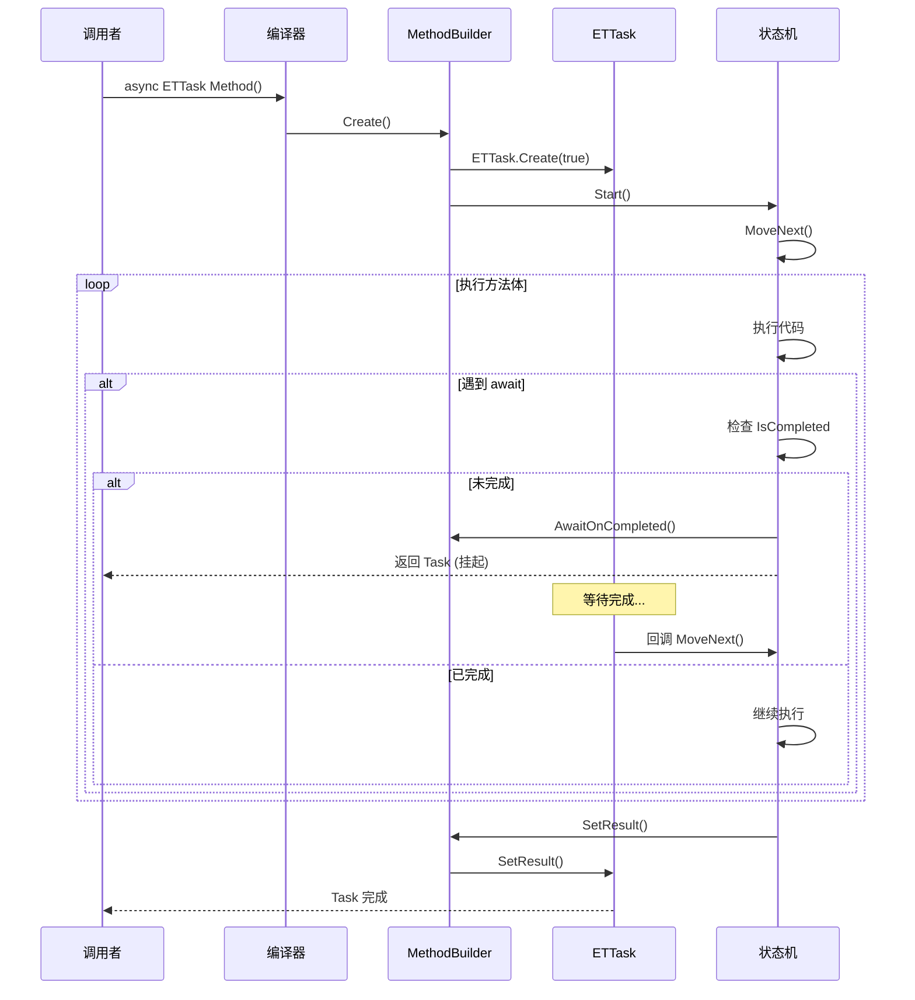
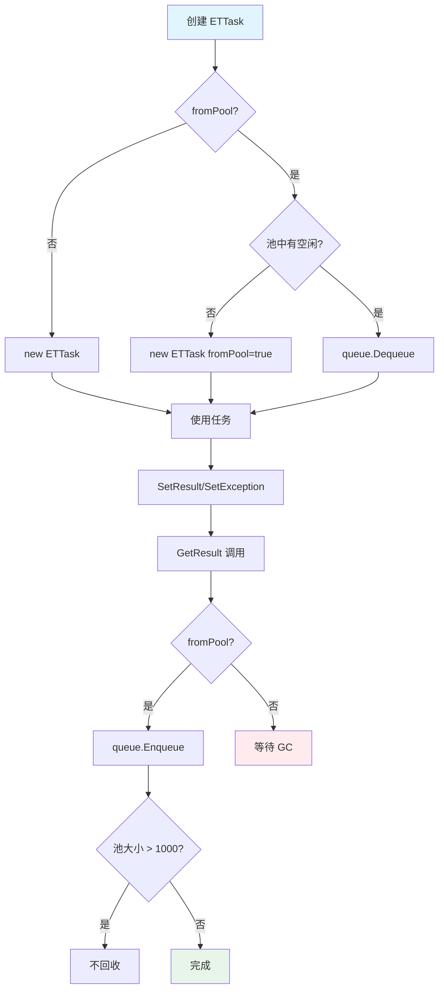

# ETTask 异步任务系统 - 总览文档

> **目录**: `Assets/Scripts/ThirdParty/ETTask/`  
> **命名空间**: `TaoTie`  
> **文档生成时间**: 2026-03-03  
> **文件类型**: 第三方库 (ET Framework)

---

## 📑 概述

ETTask 是 ET Framework 提供的轻量级异步任务系统，专为游戏开发设计，支持 async/await 语法，具有零 GC、对象池、协程等特性。

**核心优势**:
- ✅ **轻量级**: 比 .NET Task 更轻量，减少内存分配
- ✅ **对象池**: 支持任务对象池复用，降低 GC 压力
- ✅ **协程支持**: 原生支持 Unity 协程式的启动方式
- ✅ **热更新友好**: 支持 ILRuntime 等热更新方案
- ✅ **异常安全**: 全局异常处理器，避免程序崩溃

---

## 📁 文件清单

| 文件名 | 类型 | 说明 | 文档 |
|--------|------|------|------|
| `ETTask.cs` | 核心类 | 无返回值异步任务 | [ETTask.cs.md](./ETTask.cs.md) |
| `ETTask<T>.cs` | 核心类 | 带返回值异步任务 | [ETTask.cs.md](./ETTask.cs.md) |
| `ETVoid.cs` | 结构体 | 无返回值协程（类似 async void） | [ETVoid.cs.md](./ETVoid.cs.md) |
| `ETTaskCompleted.cs` | 结构体 | 已完成任务（零开销） | [ETTaskCompleted.cs.md](./ETTaskCompleted.cs.md) |
| `ETCancellationToken.cs` | 工具类 | 取消令牌 | [ETCancellationToken.cs.md](./ETCancellationToken.cs.md) |
| `ETTaskHelper.cs` | 工具类 | 多任务等待辅助 (WaitAll/WaitAny) | [ETTaskHelper.cs.md](./ETTaskHelper.cs.md) |
| `AsyncETTaskMethodBuilder.cs` | 构建器 | ETTask 的异步方法构建器 | [AsyncETTaskMethodBuilder.cs.md](./AsyncETTaskMethodBuilder.cs.md) |
| `AsyncETVoidMethodBuilder.cs` | 构建器 | ETVoid 的异步方法构建器 | [AsyncETVoidMethodBuilder.cs.md](./AsyncETVoidMethodBuilder.cs.md) |
| `AsyncETTaskCompletedMethodBuilder.cs` | 构建器 | ETTaskCompleted 的构建器 | [AsyncETTaskCompletedMethodBuilder.cs.md](./AsyncETTaskCompletedMethodBuilder.cs.md) |
| `IAwaiter.cs` | 枚举 | 等待者状态定义 | [IAwaiter.cs.md](./IAwaiter.cs.md) |
| `AsyncMethodBuilderAttribute.cs` | 特性 | 异步方法构建器特性标记 | [AsyncMethodBuilderAttribute.cs.md](./AsyncMethodBuilderAttribute.cs.md) |

---

## 🏗️ 架构设计

### 核心类图



---

### 构建器关系图



---

## 🔄 核心流程

### 异步方法执行流程



---

### 对象池复用流程



---

## 💡 使用示例

### 基本异步方法

```csharp
// 无返回值
public async ETTask LoadDataAsync()
{
    await TimerManager.Instance.WaitAsync(1000);
    Log.Info("加载完成");
}

// 有返回值
public async ETTask<int> CalculateAsync()
{
    await TimerManager.Instance.WaitAsync(500);
    return 42;
}

// 调用
await LoadDataAsync();
int result = await CalculateAsync();
```

---

### 协程启动（不等待）

```csharp
// 后台协程
public async ETVoid BackgroundLoop()
{
    while (true)
    {
        await TimerManager.Instance.WaitAsync(1000);
        UpdateLogic();
    }
}

// 启动
BackgroundLoop().Coroutine();
```

---

### 多任务等待

```csharp
// 等待所有任务完成
var tasks = new List<ETTask>
{
    LoadTextureAsync(),
    LoadModelAsync(),
    LoadAudioAsync()
};
await ETTaskHelper.WaitAll(tasks);
Log.Info("所有资源加载完成");

// 等待第一个完成
var fastest = new List<ETTask<string>>
{
    DownloadFromCdnAsync("cdn1"),
    DownloadFromCdnAsync("cdn2"),
    DownloadFromCdnAsync("cdn3")
};
await ETTaskHelper.WaitAny(fastest);
```

---

### 取消操作

```csharp
public async ETTask CancelableOperationAsync()
{
    var cancellationToken = new ETCancellationToken();
    
    // 注册取消回调
    cancellationToken.Add(() =>
    {
        Log.Info("操作被取消");
        Cleanup();
    });
    
    try
    {
        for (int i = 0; i < 100; i++)
        {
            if (cancellationToken.IsDispose())
            {
                return; // 已取消
            }
            
            await TimerManager.Instance.WaitAsync(100);
            DoWork();
        }
    }
    finally
    {
        cancellationToken.Cancel();
    }
}
```

---

### 全局异常处理

```csharp
// 游戏启动时设置
ETTask.ExceptionHandler = (exception) =>
{
    Log.Error($"未处理的协程异常：{exception}");
    // 可选：上报错误追踪系统
};

// 所有 async ETVoid 的异常都会被捕获
public async ETVoid RiskyCoroutine()
{
    await SomeOperation(); // 异常不会导致程序崩溃
}
```

---

## 📊 性能对比

### 内存分配对比

| 操作 | .NET Task | ETTask (无池) | ETTask (对象池) |
|------|-----------|---------------|-----------------|
| 创建任务 | ~48 bytes | ~32 bytes | 0 bytes (复用) |
| 完成回调 | 分配回调对象 | 直接存储 | 直接存储 |
| GC 压力 | 高 | 中 | 低 |

### 对象池效果

```
场景：每秒创建 1000 个短期任务

无对象池:
- 每秒分配：1000 个 ETTask 对象
- GC 频率：高
- 内存波动：明显

使用对象池:
- 每秒分配：初始 ~100 个，后续复用
- GC 频率：低
- 内存波动：稳定
```

---

## ⚠️ 注意事项

### 对象池陷阱

```csharp
// ❌ 错误：await 后继续使用来自对象池的 task
var task = ETTask.Create(fromPool: true);
_ = DoWorkAsync(task);
await task;
task.SetResult(); // ⚠️ 可能已回收到池中，影响其他使用者！

// ✅ 正确：SetResult 后立即置空
var tcs = ETTask.Create(fromPool: true);
tcs.SetResult();
tcs = null; // 避免再次使用
```

### 选择指南

| 场景 | 推荐类型 |
|------|---------|
| 需要等待结果 | `ETTask` / `ETTask<T>` |
| 不等待的后台协程 | `ETVoid` |
| 同步完成的异步方法 | `ETTaskCompleted` |
| 需要取消功能 | 配合 `ETCancellationToken` |
| 多任务协调 | `ETTaskHelper.WaitAll/WaitAny` |

---

## 📚 相关文档

### 框架层集成

| 模块 | 文档链接 |
|------|---------|
| TimerManager | [TimerManager.cs.md](../../Mono/Module/Timer/TimerManager.cs.md) |
| Messager | [Messager.cs.md](../../Mono/Module/Messager/Messager.cs.md) |
| ManagerProvider | [ManagerProvider.cs.md](../../Core/ManagerProvider.cs.md) |

### 使用场景

| 场景 | 示例 |
|------|------|
| 资源加载 | [ResourcesManager.cs.md](../../Mono/Module/Resource/ResourcesManager.cs.md) |
| UI 异步 | [UIManager.cs.md](../../Mono/Module/UI/UIManager.cs.md) |
| 网络请求 | [HttpManager.cs.md](../../Mono/Http/HttpManager.cs.md) |

---

## 🔍 设计原理

### 为什么不用 .NET Task？

| 特性 | .NET Task | ETTask |
|------|-----------|--------|
| 内存分配 | 每次创建新对象 | 支持对象池 |
| GC 压力 | 高 | 低 |
| 协程支持 | 需要 Coroutine | 原生支持 |
| 热更新 | 不支持 | 支持 |
| 异常处理 | 需要 try-catch | 全局处理器 |
| 代码体积 | ~2000 行 | ~500 行 |

### 适用场景

**推荐使用 ETTask**:
- ✅ Unity 游戏开发
- ✅ 需要热更新的项目
- ✅ 高频创建短期任务
- ✅ 需要协程功能

**考虑使用 .NET Task**:
- ⚠️ 服务器端 .NET Core 应用
- ⚠️ 需要完整 Task 生态（如 LINQ、Parallel 等）
- ⚠️ 与第三方库深度集成

---

*文档由 OpenClaw AI 助手自动生成 | ET Framework 版本分析*
