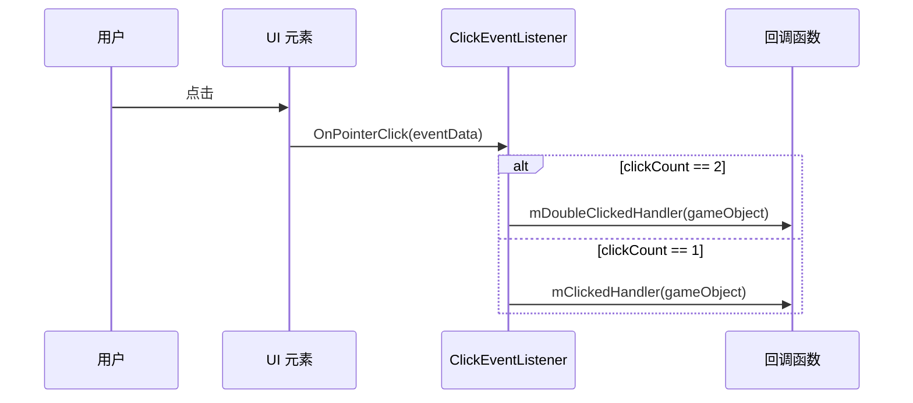
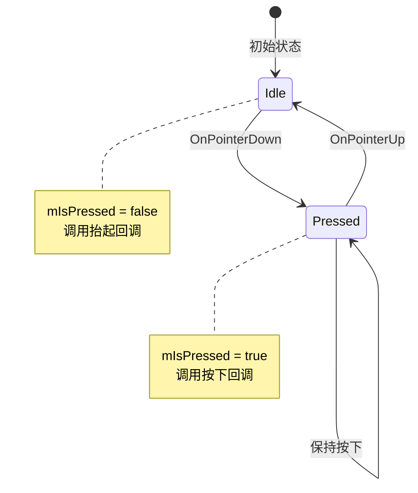

# ClickEventListener.cs - 点击事件监听器

> **文件路径**: `Assets/Scripts/ThirdParty/SuperScrollView/Common/ClickEventListener.cs`  
> **命名空间**: `SuperScrollView`  
> **文档生成时间**: 2026-03-03  
> **文件类型**: 第三方库 (SuperScrollView)

---

## 📑 文件信息表

| 属性 | 值 |
|------|-----|
| **文件路径** | `Assets/Scripts/ThirdParty/SuperScrollView/Common/ClickEventListener.cs` |
| **命名空间** | `SuperScrollView` |
| **类/结构体** | `ClickEventListener` |
| **依赖** | `UnityEngine`, `UnityEngine.EventSystems` |
| **基类/接口** | `MonoBehaviour`, `IPointerClickHandler`, `IPointerDownHandler`, `IPointerUpHandler` |
| **可见性** | `public` |

---

## 🎯 类说明

### ClickEventListener

Unity UI 点击事件监听器组件，提供简化的点击事件回调接口。

**核心职责**:
- 监听 GameObject 的点击事件
- 支持单击和双击检测
- 支持按下/抬起事件
- 提供静态 Get 方法自动添加组件

**设计特点**:
- 组件模式，直接挂载到 GameObject
- 静态 Get 方法自动获取或添加组件
- 支持多个事件类型
- 按下状态追踪

---

## 📊 字段表

| 字段名 | 类型 | 可见性 | 说明 |
|--------|------|--------|------|
| `mClickedHandler` | `Action<GameObject>` | `private` | 单击回调 |
| `mDoubleClickedHandler` | `Action<GameObject>` | `private` | 双击回调 |
| `mOnPointerDownHandler` | `Action<GameObject>` | `private` | 按下回调 |
| `mOnPointerUpHandler` | `Action<GameObject>` | `private` | 抬起回调 |
| `mIsPressed` | `bool` | `private` | 是否按下状态 |

---

## 🔧 API 说明

### 静态方法

#### Get

```csharp
public static ClickEventListener Get(GameObject obj)
```

**说明**: 获取或添加 ClickEventListener 组件。

**参数**:
| 参数 | 类型 | 说明 |
|------|------|------|
| `obj` | `GameObject` | 目标对象 |

**返回值**:
| 类型 | 说明 |
|------|------|
| `ClickEventListener` | 组件实例 |

**逻辑**:
1. 尝试获取已有组件
2. 如果不存在则添加新组件
3. 返回组件实例

**示例**:
```csharp
var listener = ClickEventListener.Get(gameObject);
listener.SetClickEventHandler(OnClick);
```

---

### 事件设置

#### SetClickEventHandler

```csharp
public void SetClickEventHandler(Action<GameObject> handler)
```

**说明**: 设置单击事件回调。

**参数**:
| 参数 | 类型 | 说明 |
|------|------|------|
| `handler` | `Action<GameObject>` | 回调函数 |

---

#### SetDoubleClickEventHandler

```csharp
public void SetDoubleClickEventHandler(Action<GameObject> handler)
```

**说明**: 设置双击事件回调。

---

#### SetPointerDownHandler

```csharp
public void SetPointerDownHandler(Action<GameObject> handler)
```

**说明**: 设置指针按下事件回调。

---

#### SetPointerUpHandler

```csharp
public void SetPointerUpHandler(Action<GameObject> handler)
```

**说明**: 设置指针抬起事件回调。

---

### 接口实现

#### OnPointerClick

```csharp
public void OnPointerClick(PointerEventData eventData)
```

**说明**: 点击事件处理（IPointerClickHandler）。

**逻辑**:
- 检测 `eventData.clickCount == 2` 触发双击
- 否则触发单击

---

#### OnPointerDown

```csharp
public void OnPointerDown(PointerEventData eventData)
```

**说明**: 指针按下事件处理（IPointerDownHandler）。

**逻辑**:
- 设置 `mIsPressed = true`
- 调用按下回调

---

#### OnPointerUp

```csharp
public void OnPointerUp(PointerEventData eventData)
```

**说明**: 指针抬起事件处理（IPointerUpHandler）。

**逻辑**:
- 设置 `mIsPressed = false`
- 调用抬起回调

---

### 属性

#### IsPressd

```csharp
public bool IsPressd { get; }
```

**说明**: 获取当前是否按下状态。

**注意**: 拼写错误，应为 `IsPressed`。

---

## 🔄 核心流程图

### 事件处理流程



---

### 按下/抬起流程



---

## 💡 使用示例

### 基础点击事件

```csharp
void Start()
{
    var listener = ClickEventListener.Get(gameObject);
    listener.SetClickEventHandler(OnClick);
}

void OnClick(GameObject obj)
{
    Debug.Log($"点击了：{obj.name}");
}
```

---

### 双击检测

```csharp
void Start()
{
    var listener = ClickEventListener.Get(gameObject);
    listener.SetClickEventHandler(OnClick);
    listener.SetDoubleClickEventHandler(OnDoubleClick);
}

void OnClick(GameObject obj)
{
    Debug.Log("单击");
}

void OnDoubleClick(GameObject obj)
{
    Debug.Log("双击");
}
```

---

### 按下/抬起事件

```csharp
void Start()
{
    var listener = ClickEventListener.Get(gameObject);
    listener.SetPointerDownHandler(OnPointerDown);
    listener.SetPointerUpHandler(OnPointerUp);
}

void OnPointerDown(GameObject obj)
{
    Debug.Log("按下");
    // 改变视觉反馈
    var image = GetComponent<Image>();
    image.color = Color.gray;
}

void OnPointerUp(GameObject obj)
{
    Debug.Log("抬起");
    // 恢复视觉反馈
    var image = GetComponent<Image>();
    image.color = Color.white;
}
```

---

### 检查按下状态

```csharp
void Update()
{
    var listener = GetComponent<ClickEventListener>();
    
    if (listener.IsPressd)
    {
        // 正在按下
        Debug.Log("持续按下中...");
    }
}
```

---

### 在列表 Item 中使用

```csharp
public class ListItem : MonoBehaviour
{
    public void Init(int index, string content)
    {
        var listener = ClickEventListener.Get(gameObject);
        listener.SetClickEventHandler(_ => OnItemClick(index));
        
        var text = GetComponentInChildren<Text>();
        text.text = content;
    }
    
    void OnItemClick(int index)
    {
        Debug.Log($"点击了 Item {index}");
        // 通知列表视图
    }
}
```

---

### 长按检测（配合 Update）

```csharp
public class LongClickButton : MonoBehaviour
{
    ClickEventListener listener;
    bool isLongClicking = false;
    float longClickTime = 0;
    const float LONG_CLICK_THRESHOLD = 0.5f;
    
    void Start()
    {
        listener = ClickEventListener.Get(gameObject);
        listener.SetPointerDownHandler(_ => OnPointerDown());
        listener.SetPointerUpHandler(_ => OnPointerUp());
    }
    
    void OnPointerDown()
    {
        isLongClicking = true;
        longClickTime = 0;
    }
    
    void OnPointerUp()
    {
        isLongClicking = false;
    }
    
    void Update()
    {
        if (isLongClicking)
        {
            longClickTime += Time.deltaTime;
            if (longClickTime >= LONG_CLICK_THRESHOLD)
            {
                isLongClicking = false;
                OnLongClick();
            }
        }
    }
    
    void OnLongClick()
    {
        Debug.Log("长按触发");
    }
}
```

---

## 📚 相关文档链接

| 文档 | 说明 |
|------|------|
| [LoopListView2.cs.md](../ListView/LoopListView2.cs.md) | 列表视图核心 |
| [LoopListViewItem2.cs.md](../ListView/LoopListViewItem2.cs.md) | Item 基类 |

---

## ⚠️ 注意事项

1. **需要 Image 或 Graphic**: GameObject 需要有 Image 或其他 Graphic 组件才能接收指针事件
2. **Raycast Target**: 确保 Image 的 Raycast Target 已启用
3. **拼写错误**: `IsPressd` 应为 `IsPressed`
4. **EventSystem**: 场景中需要有 EventSystem 组件
5. **回调生命周期**: 注意清理回调，避免内存泄漏

---

## 🔍 与 Unity Button 对比

| 特性 | ClickEventListener | Unity Button |
|------|-------------------|--------------|
| 双击检测 | ✅ 支持 | ❌ 不支持 |
| 按下/抬起 | ✅ 支持 | ❌ 不支持（需额外代码） |
| 按下状态 | ✅ 支持 | ❌ 不支持 |
| 可视化编辑 | ❌ 代码设置 | ✅ Inspector 设置 |
| 依赖 | 无 | Button 组件 |
| 灵活性 | 高 | 中 |

---

*文档由 OpenClaw AI 助手自动生成 | SuperScrollView 版本 2.4.0*
