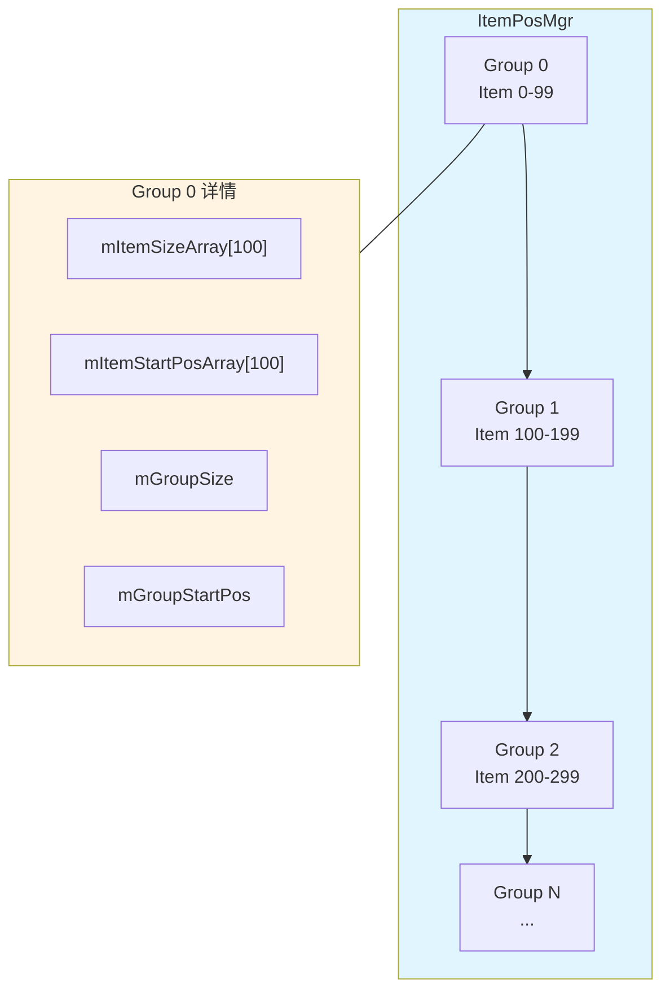
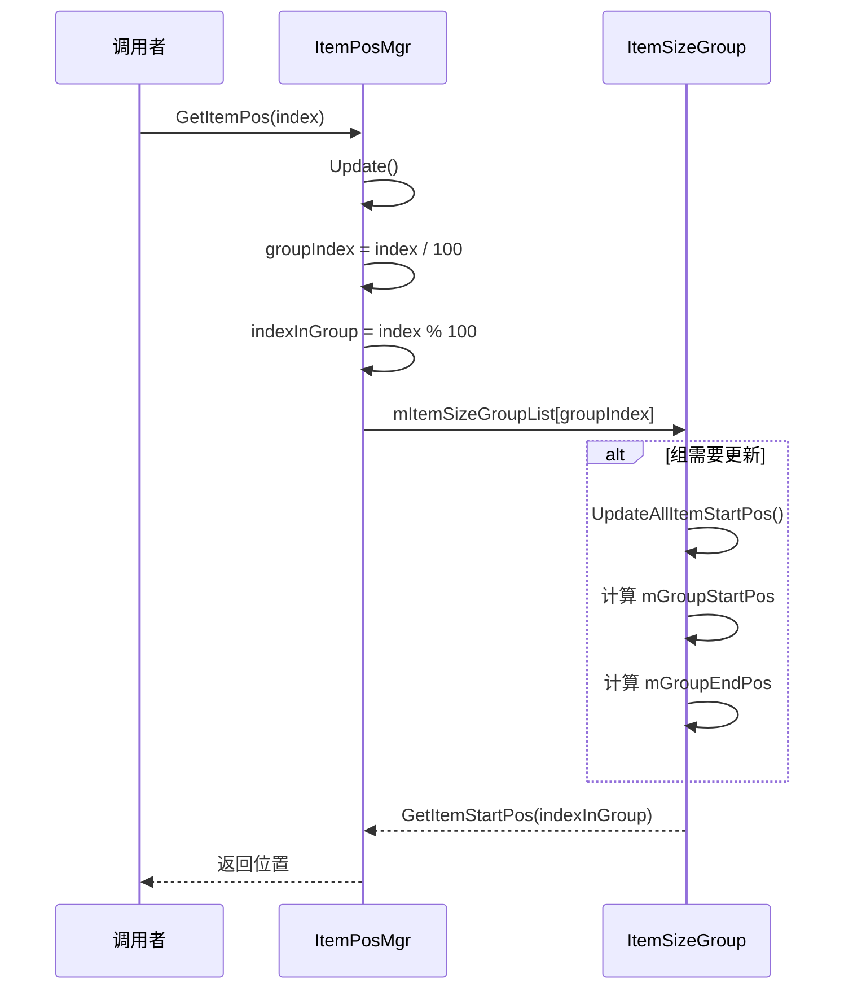

# ItemPosMgr.cs - Item 位置管理器

> **文件路径**: `Assets/Scripts/ThirdParty/SuperScrollView/Common/ItemPosMgr.cs`  
> **命名空间**: `SuperScrollView`  
> **文档生成时间**: 2026-03-03  
> **文件类型**: 第三方库 (SuperScrollView)

---

## 📑 文件信息表

| 属性 | 值 |
|------|-----|
| **文件路径** | `Assets/Scripts/ThirdParty/SuperScrollView/Common/ItemPosMgr.cs` |
| **命名空间** | `SuperScrollView` |
| **类/结构体** | `ItemPosMgr`, `ItemSizeGroup` |
| **依赖** | `UnityEngine`, `System`, `System.Collections.Generic` |
| **可见性** | `public` |

---

## 🎯 类说明

### ItemPosMgr

Item 位置管理器，管理所有 Item 的尺寸和起始位置。

**核心职责**:
- 存储每个 Item 的尺寸
- 计算每个 Item 的起始位置
- 支持动态 Item 尺寸
- 分组管理（每组 100 个 Item）优化性能
- 提供位置到索引的二分查找

**设计特点**:
- 分组管理大列表（每组 100 个 Item）
- 惰性更新（仅更新必要的组）
- 二分查找快速定位
- 支持动态尺寸 Item

---

### ItemSizeGroup

Item 尺寸组，管理一组（最多 100 个）Item 的尺寸和位置。

**核心职责**:
- 存储组内每个 Item 的尺寸
- 计算组内每个 Item 的起始位置
- 维护组的总尺寸
- 惰性更新位置数组

---

## 📊 字段表

### ItemPosMgr 字段

| 字段名 | 类型 | 可见性 | 说明 |
|--------|------|--------|------|
| `mItemSizeGroupList` | `List<ItemSizeGroup>` | `private` | 尺寸组列表 |
| `mDirtyBeginIndex` | `int` | `private` | 脏数据起始组索引 |
| `mTotalSize` | `float` | `public` | 所有 Item 的总尺寸 |
| `mItemDefaultSize` | `float` | `public` | Item 默认尺寸 |
| `mMaxNotEmptyGroupIndex` | `int` | `private` | 最大非空组索引 |
| `mItemMaxCountPerGroup` | `const int` | `public` | 每组最大 Item 数（100） |

---

### ItemSizeGroup 字段

| 字段名 | 类型 | 可见性 | 说明 |
|--------|------|--------|------|
| `mItemSizeArray` | `float[]` | `public` | Item 尺寸数组 |
| `mItemStartPosArray` | `float[]` | `public` | Item 起始位置数组 |
| `mItemCount` | `int` | `public` | Item 数量 |
| `mDirtyBeginIndex` | `int` | `public` | 脏数据起始索引 |
| `mGroupSize` | `float` | `public` | 组总尺寸 |
| `mGroupStartPos` | `float` | `public` | 组起始位置 |
| `mGroupEndPos` | `float` | `public` | 组结束位置 |
| `mGroupIndex` | `int` | `public` | 组索引 |
| `mItemDefaultSize` | `float` | `private` | Item 默认尺寸 |
| `mMaxNoZeroIndex` | `int` | `private` | 最大非零尺寸索引 |

---

## 🔧 API 说明

### ItemPosMgr

#### 构造函数

```csharp
public ItemPosMgr(float itemDefaultSize)
```

**说明**: 创建位置管理器。

**参数**:
| 参数 | 类型 | 说明 |
|------|------|------|
| `itemDefaultSize` | `float` | Item 默认尺寸 |

---

#### SetItemMaxCount

```csharp
public void SetItemMaxCount(int maxCount)
```

**说明**: 设置 Item 最大数量。

**参数**:
| 参数 | 类型 | 说明 |
|------|------|------|
| `maxCount` | `int` | 最大数量 |

**内部逻辑**:
1. 计算需要的组数
2. 创建或销毁组
3. 设置每组的 Item 数量
4. 计算总尺寸

---

#### SetItemSize

```csharp
public void SetItemSize(int itemIndex, float size)
```

**说明**: 设置指定 Item 的尺寸。

**参数**:
| 参数 | 类型 | 说明 |
|------|------|------|
| `itemIndex` | `int` | Item 索引 |
| `size` | `float` | Item 尺寸 |

**注意**: 调用后需要调用 `Update` 更新位置。

---

#### GetItemPos

```csharp
public float GetItemPos(int itemIndex)
```

**说明**: 获取指定 Item 的起始位置。

**参数**:
| 参数 | 类型 | 说明 |
|------|------|------|
| `itemIndex` | `int` | Item 索引 |

**返回值**:
| 类型 | 说明 |
|------|------|
| `float` | Item 起始位置 |

---

#### GetItemIndexAndPosAtGivenPos

```csharp
public bool GetItemIndexAndPosAtGivenPos(float pos, ref int index, ref float itemPos)
```

**说明**: 根据位置获取 Item 索引和位置。

**参数**:
| 参数 | 类型 | 说明 |
|------|------|------|
| `pos` | `float` | 目标位置 |
| `index` | `ref int` | 输出的 Item 索引 |
| `itemPos` | `ref float` | 输出的 Item 起始位置 |

**返回值**:
| 类型 | 说明 |
|------|------|
| `bool` | 是否找到 |

**算法**: 二分查找定位组，然后二分查找定位 Item。

---

#### Update

```csharp
public void Update(bool updateAll)
```

**说明**: 更新位置数据。

**参数**:
| 参数 | 类型 | 说明 |
|------|------|------|
| `updateAll` | `bool` | 是否更新所有组 |

---

### ItemSizeGroup

#### SetItemSize

```csharp
public float SetItemSize(int index, float size)
```

**说明**: 设置 Item 尺寸，返回尺寸变化量。

---

#### GetItemIndexByPos

```csharp
public int GetItemIndexByPos(float pos)
```

**说明**: 根据位置获取 Item 索引（二分查找）。

---

#### UpdateAllItemStartPos

```csharp
public void UpdateAllItemStartPos()
```

**说明**: 更新所有 Item 的起始位置。

---

## 🔄 核心流程图

### 分组管理结构



---

### 位置计算流程



---

### 二分查找流程

```mermaid
flowchart TD
    Start[GetItemIndexByPos pos] --> Init[low=0, high=count-1]
    Init --> Check{low <= high?}
    Check -->|否 | NotFound[返回 -1]
    Check -->|是 | Mid[mid = (low+high)/2]
    Mid --> GetPos[获取 mid 的 startPos 和 endPos]
    GetPos --> InRange{pos 在范围内？}
    InRange -->|是 | Found[返回 mid]
    InRange -->|pos > endPos| Right[low = mid + 1]
    InRange -->|pos < startPos| Left[high = mid - 1]
    Right --> Check
    Left --> Check
    
    style Found fill:#e8f5e9
    style NotFound fill:#ffebee
```

---

## 💡 使用示例

### 基础使用

```csharp
// 创建管理器（默认尺寸 20）
var posMgr = new ItemPosMgr(20f);

// 设置 Item 总数
posMgr.SetItemMaxCount(1000);

// 设置特定 Item 的尺寸（动态高度）
posMgr.SetItemSize(0, 50f);  // 第 0 个 Item 高度 50
posMgr.SetItemSize(1, 100f); // 第 1 个 Item 高度 100
posMgr.SetItemSize(2, 30f);  // 第 2 个 Item 高度 30

// 更新位置数据
posMgr.Update(true);

// 获取 Item 位置
float pos0 = posMgr.GetItemPos(0); // 0
float pos1 = posMgr.GetItemPos(1); // 50
float pos2 = posMgr.GetItemPos(2); // 150

// 根据位置查找 Item
int index = 0;
float itemPos = 0;
bool found = posMgr.GetItemIndexAndPosAtGivenPos(100, ref index, ref itemPos);
// found = true, index = 1, itemPos = 50
```

---

### 动态高度列表

```csharp
public class DynamicHeightList : MonoBehaviour
{
    ItemPosMgr posMgr;
    List<string> contents;
    
    void Start()
    {
        posMgr = new ItemPosMgr(100f); // 默认高度 100
        contents = LoadContents();
        posMgr.SetItemMaxCount(contents.Count);
        
        // 初始化所有 Item 尺寸
        for (int i = 0; i < contents.Count; i++)
        {
            float height = CalculateHeight(contents[i]);
            posMgr.SetItemSize(i, height);
        }
        
        posMgr.Update(true);
    }
    
    void OnItemClicked(int index)
    {
        // 滚动到指定 Item
        float pos = posMgr.GetItemPos(index);
        ScrollToPosition(pos);
    }
    
    void Update()
    {
        // 获取可见区域的 Item
        float viewportPos = GetViewportPosition();
        int index = 0;
        float itemPos = 0;
        
        if (posMgr.GetItemIndexAndPosAtGivenPos(viewportPos, ref index, ref itemPos))
        {
            // index 是可见区域的第一个 Item
            LoadVisibleItems(index);
        }
    }
}
```

---

### 分组性能优化

```csharp
// 大列表场景（10000 个 Item）
var posMgr = new ItemPosMgr(50f);
posMgr.SetItemMaxCount(10000);

// 仅更新前 5 组（500 个 Item）
// 其他组惰性更新
posMgr.Update(false);

// 访问远处的 Item 时才会更新对应的组
float pos9999 = posMgr.GetItemPos(9999);
// 此时才会更新第 99 组（Item 9900-9999）
```

---

## 📚 相关文档链接

| 文档 | 说明 |
|------|------|
| [LoopListView2.cs.md](../ListView/LoopListView2.cs.md) | 列表视图核心 |
| [CommonDefine.cs.md](./CommonDefine.cs.md) | 公共定义 |

---

## ⚠️ 注意事项

1. **分组大小**: 每组固定 100 个 Item，不可配置
2. **惰性更新**: 调用 `Update(false)` 仅更新必要的组
3. **尺寸变更**: 修改 Item 尺寸后必须调用 `Update`
4. **二分查找**: 要求 Item 按顺序排列，位置递增
5. **默认尺寸**: 构造函数设置的默认尺寸用于初始化

---

## 🔍 性能优化

### 分组设计的优势

```
场景：10000 个 Item 的列表

不分组:
- 尺寸数组：float[10000]
- 位置数组：float[10000]
- 更新：每次更新 10000 个位置
- 查找：二分查找 10000 个元素

分组（每组 100 个）:
- 100 个组，每组 float[100]
- 更新：仅更新必要的组
- 查找：二分查找 100 个组 + 二分查找组内 100 个元素
- 结果：log2(100) + log2(100) ≈ 14 次比较 vs log2(10000) ≈ 14 次

优势:
- 惰性更新减少计算
- 内存局部性更好
- 支持超大列表
```

---

*文档由 OpenClaw AI 助手自动生成 | SuperScrollView 版本 2.4.0*
