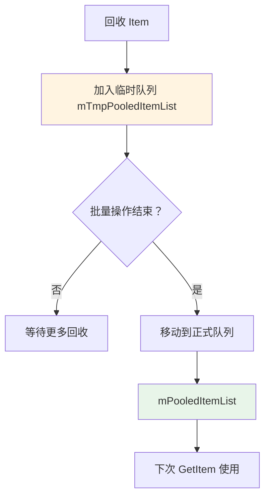
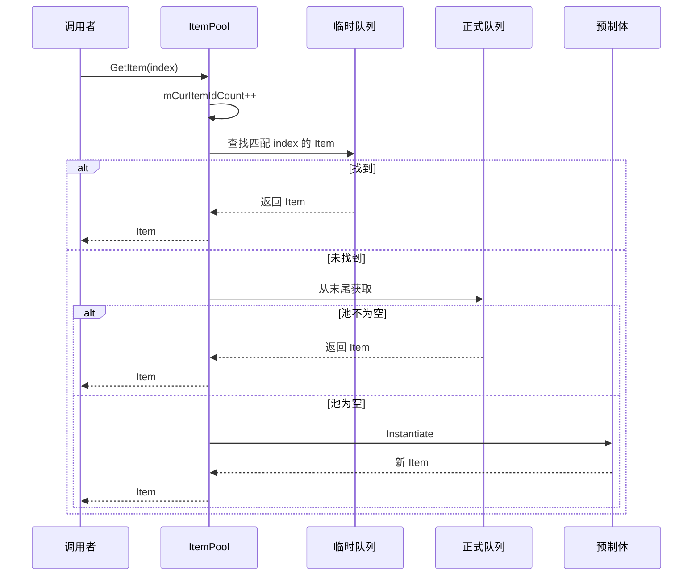

# LoopListItemPool.cs - 列表项对象池

> **文件路径**: `Assets/Scripts/ThirdParty/SuperScrollView/ListView/LoopListItemPool.cs`  
> **命名空间**: `SuperScrollView`  
> **文档生成时间**: 2026-03-03  
> **文件类型**: 第三方库 (SuperScrollView)

---

## 📑 文件信息表

| 属性 | 值 |
|------|-----|
| **文件路径** | `Assets/Scripts/ThirdParty/SuperScrollView/ListView/LoopListItemPool.cs` |
| **命名空间** | `SuperScrollView` |
| **类/结构体** | `ItemPool` |
| **依赖** | `UnityEngine`, `System`, `System.Collections.Generic` |
| **可见性** | `public` |

---

## 🎯 类说明

### ItemPool

列表项对象池，管理单一类型 Item 的创建、回收和复用。

**核心职责**:
- 管理 Item 预制体
- 维护空闲 Item 列表
- 提供 Item 获取和回收接口
- 支持临时回收队列（批量操作优化）

**设计特点**:
- 两级回收队列（临时 + 正式）
- 支持按索引查找回收的 Item
- 自动递增 ItemId
- 支持清理回调

---

## 📊 字段表

| 字段名 | 类型 | 可见性 | 说明 |
|--------|------|--------|------|
| `mPrefabObj` | `GameObject` | `private` | 预制体对象 |
| `mPrefabName` | `string` | `private` | 预制体名称 |
| `mInitCreateCount` | `int` | `private` | 初始化创建数量 |
| `mPadding` | `float` | `private` | Item 间距 |
| `mStartPosOffset` | `float` | `private` | 起始位置偏移 |
| `mTmpPooledItemList` | `List<LoopListViewItem2>` | `private` | 临时回收队列 |
| `mPooledItemList` | `List<LoopListViewItem2>` | `private` | 正式回收队列 |
| `mCurItemIdCount` | `int` | `private static` | 当前 ItemId 计数器 |
| `mItemParent` | `RectTransform` | `private` | Item 父节点 |

---

## 🔧 API 说明

### 初始化

#### Init

```csharp
public void Init(
    GameObject prefabObj, 
    float padding, 
    float startPosOffset, 
    int createCount, 
    RectTransform parent)
```

**说明**: 初始化对象池。

**参数**:
| 参数 | 类型 | 说明 |
|------|------|------|
| `prefabObj` | `GameObject` | Item 预制体 |
| `padding` | `float` | Item 间距 |
| `startPosOffset` | `float` | 起始位置偏移 |
| `createCount` | `int` | 初始化创建数量 |
| `parent` | `RectTransform` | Item 父节点 |

---

#### ClearPool

```csharp
public void ClearPool()
```

**说明**: 清空对象池，重置 ItemId 计数器。

---

#### CleanUp

```csharp
public void CleanUp(Action<GameObject> beforeDestroy)
```

**说明**: 清理对象池，可指定销毁前回调。

**参数**:
| 参数 | 类型 | 说明 |
|------|------|------|
| `beforeDestroy` | `Action<GameObject>` | 销毁前回调 |

---

### Item 管理

#### GetItem

```csharp
public LoopListViewItem2 GetItem(int? index)
```

**说明**: 从对象池获取 Item。

**参数**:
| 参数 | 类型 | 说明 |
|------|------|------|
| `index` | `int?` | 可选的索引（用于查找特定 Item） |

**返回值**:
| 类型 | 说明 |
|------|------|
| `LoopListViewItem2` | 获取的 Item |

**逻辑**:
1. 递增 `mCurItemIdCount`
2. 优先从临时回收队列查找
3. 如果指定 index，尝试匹配
4. 否则从正式回收队列获取
5. 都为空则创建新 Item

---

#### RecycleItem

```csharp
public void RecycleItem(LoopListViewItem2 item)
```

**说明**: 回收 Item 到临时队列。

**参数**:
| 参数 | 类型 | 说明 |
|------|------|------|
| `item` | `LoopListViewItem2` | 要回收的 Item |

---

#### ClearTmpRecycledItem

```csharp
public void ClearTmpRecycledItem()
```

**说明**: 将临时回收队列的 Item 移到正式队列。

---

### 内部方法

#### CreateItem

```csharp
public LoopListViewItem2 CreateItem()
```

**说明**: 从预制体创建新 Item。

---

#### RecycleItemReal

```csharp
void RecycleItemReal(LoopListViewItem2 item)
```

**说明**: 真正回收到正式队列（设置 inactive）。

---

#### DestroyAllItem

```csharp
public void DestroyAllItem()
```

**说明**: 销毁池中所有 Item。

---

## 🔄 核心流程图

### 两级回收机制



### GetItem 流程



---

## 💡 使用示例

### 对象池初始化

```csharp
// 由 LoopListView2 自动调用，了解原理即可
ItemPool pool = new ItemPool();
pool.Init(
    itemPrefab,      // Item 预制体
    10f,             // 间距
    0f,              // 起始偏移
    5,               // 初始创建 5 个
    containerTrans   // 父节点
);
```

---

### 获取和回收 Item

```csharp
// 获取 Item
var item = pool.GetItem();
item.gameObject.SetActive(true);
// 使用 Item...

// 回收 Item（先放入临时队列）
pool.RecycleItem(item);
item.gameObject.SetActive(false);

// 批量操作结束后，清理临时队列
pool.ClearTmpRecycledItem();
```

---

### 按索引获取回收的 Item

```csharp
// 如果想复用特定索引的 Item（优化）
var item = pool.GetItem(targetIndex);
// 如果临时队列中有该索引的 Item，会优先返回
```

---

### 清理回调

```csharp
// 销毁前清理资源
pool.CleanUp((go) =>
{
    // 清理组件引用
    var component = go.GetComponent<MyComponent>();
    if (component != null)
    {
        component.Cleanup();
    }
});
```

---

## 📚 相关文档链接

| 文档 | 说明 |
|------|------|
| [LoopListView2.cs.md](./LoopListView2.cs.md) | 列表视图核心 |
| [LoopListViewItem2.cs.md](./LoopListViewItem2.cs.md) | Item 基类 |

---

## ⚠️ 注意事项

1. **临时队列**: `RecycleItem` 只是放入临时队列，需要调用 `ClearTmpRecycledItem` 才真正回收
2. **批量优化**: 临时队列设计用于批量回收场景，减少队列操作
3. **ItemId 递增**: 每次 GetItem 都会递增 ItemId，确保唯一性
4. **静态计数器**: `mCurItemIdCount` 是静态的，全局唯一
5. **池清空**: `ClearPool` 会重置 ItemId 计数器

---

## 🔍 设计原理

### 为什么需要两级回收队列？

```
场景：列表刷新，需要回收 20 个 Item，然后重新获取 20 个

单级队列:
- RecycleItem 20 次 → 20 次列表添加操作
- GetItem 20 次 → 20 次列表移除操作
- 共 40 次列表操作

两级队列:
- RecycleItem 20 次 → 20 次临时列表添加（快速）
- ClearTmpRecycledItem 1 次 → 批量移动（1 次遍历）
- GetItem 20 次 → 20 次正式列表移除
- 共 21 次列表操作 + 优化

结果：减少列表操作次数，提升性能
```

---

*文档由 OpenClaw AI 助手自动生成 | SuperScrollView 版本 2.4.0*
