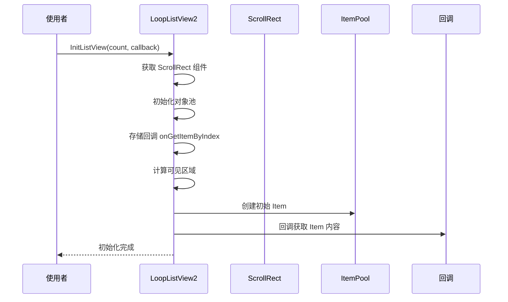
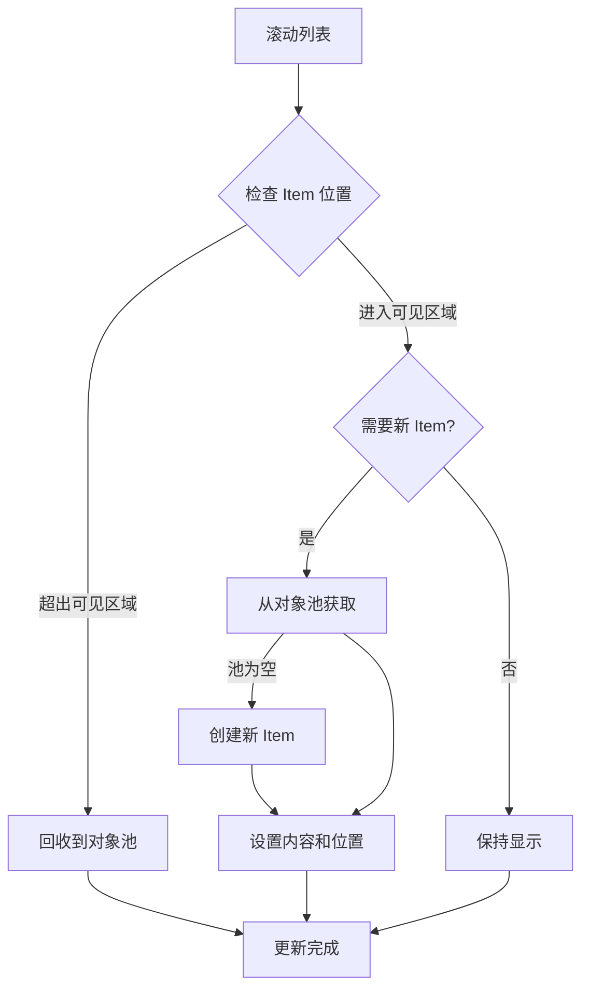
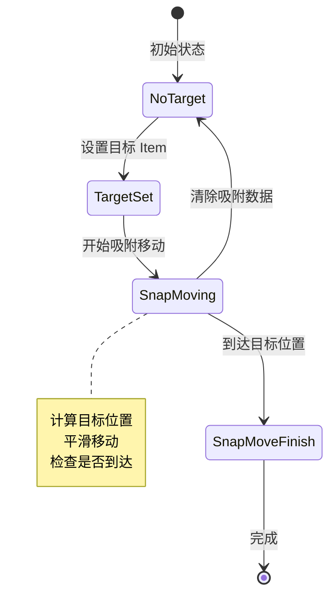

# LoopListView2.cs - 循环列表视图核心

> **文件路径**: `Assets/Scripts/ThirdParty/SuperScrollView/ListView/LoopListView2.cs`  
> **命名空间**: `SuperScrollView`  
> **文档生成时间**: 2026-03-03  
> **文件类型**: 第三方库 (SuperScrollView)

---

## 📑 文件信息表

| 属性 | 值 |
|------|-----|
| **文件路径** | `Assets/Scripts/ThirdParty/SuperScrollView/ListView/LoopListView2.cs` |
| **命名空间** | `SuperScrollView` |
| **类/结构体** | `LoopListView2`, `ItemPrefabConfData`, `LoopListViewInitParam`, `SnapData` |
| **依赖** | `UnityEngine`, `UnityEngine.UI`, `UnityEngine.EventSystems` |
| **基类/接口** | `MonoBehaviour`, `IBeginDragHandler`, `IEndDragHandler`, `IDragHandler` |
| **可见性** | `public` |

---

## 🎯 类说明

### LoopListView2

高性能循环列表视图组件，支持无限滚动和对象池复用。

**核心职责**:
- 管理可滚动列表中的项目显示与回收
- 实现对象池机制，减少 GC 压力
- 支持 4 种排列方向（上到下、下到上、左到右、右到左）
- 提供 Item 吸附（Snap）功能
- 处理拖拽事件和滚动条

**设计特点**:
- 仅渲染可见区域的项目，不可见项目回收到池中
- 支持多种 Item 预制体类型
- 自动计算和更新内容尺寸
- 支持动态 Item 尺寸

---

### ItemPrefabConfData

Item 预制体配置数据类。

| 字段 | 类型 | 说明 |
|------|------|------|
| `mItemPrefab` | `GameObject` | Item 预制体引用 |
| `mPadding` | `float` | Item 间距 |
| `mInitCreateCount` | `int` | 初始化创建数量 |
| `mStartPosOffset` | `float` | 起始位置偏移 |

---

### LoopListViewInitParam

初始化参数配置类。

| 字段 | 类型 | 默认值 | 说明 |
|------|------|--------|------|
| `mDistanceForRecycle0` | `float` | 300 | 回收距离阈值 0 |
| `mDistanceForNew0` | `float` | 200 | 新建距离阈值 0 |
| `mDistanceForRecycle1` | `float` | 300 | 回收距离阈值 1 |
| `mDistanceForNew1` | `float` | 200 | 新建距离阈值 1 |
| `mSmoothDumpRate` | `float` | 0.3f | 平滑减速率 |
| `mSnapFinishThreshold` | `float` | 0.01f | 吸附完成阈值 |
| `mSnapVecThreshold` | `float` | 145 | 吸附速度阈值 |
| `mItemDefaultWithPaddingSize` | `float` | 20 | Item 默认尺寸（含间距） |

---

## 📊 核心字段表

| 字段名 | 类型 | 可见性 | 说明 |
|--------|------|--------|------|
| `mItemPoolDict` | `Dictionary<string, ItemPool>` | `private` | Item 对象池字典 |
| `mItemPrefabDataList` | `List<ItemPrefabConfData>` | `private` | 预制体配置列表 |
| `mArrangeType` | `ListItemArrangeType` | `private` | 排列类型 |
| `mItemList` | `List<LoopListViewItem2>` | `private` | 当前显示的 Item 列表 |
| `mContainerTrans` | `RectTransform` | `private` | 内容容器 |
| `mScrollRect` | `ScrollRect` | `private` | 滚动矩形组件 |
| `mItemTotalCount` | `int` | `private` | Item 总数 |
| `mIsVertList` | `bool` | `private` | 是否为垂直列表 |
| `mOnGetItemByIndex` | `Func<...>` | `private` | 获取 Item 回调 |
| `mItemPosMgr` | `ItemPosMgr` | `private` | Item 位置管理器 |
| `mItemSnapEnable` | `bool` | `private` | 是否启用吸附 |
| `mCurSnapData` | `SnapData` | `private` | 当前吸附数据 |
| `mListViewInited` | `bool` | `private` | 是否已初始化 |

---

## 🔧 核心 API 说明

### 初始化

#### InitListView

```csharp
public void InitListView(
    int itemTotalCount,
    Func<LoopListView2, int, LoopListViewItem2> onGetItemByIndex,
    LoopListViewInitParam initParam = null)
```

**说明**: 初始化列表视图。

**参数**:
| 参数 | 类型 | 说明 |
|------|------|------|
| `itemTotalCount` | `int` | Item 总数（-1 表示无限） |
| `onGetItemByIndex` | `Func` | 根据索引获取 Item 的回调 |
| `initParam` | `LoopListViewInitParam` | 可选的初始化参数 |

**示例**:
```csharp
listView.InitListView(100, (view, index) =>
{
    var item = view.NewListViewItem("ItemPrefab");
    item.SetContent($"Item {index}");
    return item;
});
```

---

#### SetListItemCount

```csharp
public void SetListItemCount(int itemCount, bool resetPos = true)
```

**说明**: 运行时设置 Item 总数。

**参数**:
| 参数 | 类型 | 说明 |
|------|------|------|
| `itemCount` | `int` | 新的 Item 总数 |
| `resetPos` | `bool` | 是否重置位置 |

---

### Item 管理

#### NewListViewItem

```csharp
public LoopListViewItem2 NewListViewItem(string itemPrefabName, int? index = null)
```

**说明**: 从对象池获取或创建新 Item。

**参数**:
| 参数 | 类型 | 说明 |
|------|------|------|
| `itemPrefabName` | `string` | 预制体名称 |
| `index` | `int?` | 可选的索引 |

---

#### GetShownItemByItemIndex

```csharp
public LoopListViewItem2 GetShownItemByItemIndex(int itemIndex)
```

**说明**: 根据索引获取可见 Item（不可见返回 null）。

---

#### RefreshItemByItemIndex

```csharp
public void RefreshItemByItemIndex(int itemIndex)
```

**说明**: 刷新指定索引的 Item。

---

#### OnItemSizeChanged

```csharp
public void OnItemSizeChanged(int itemIndex)
```

**说明**: Item 尺寸变化时调用（动态高度 Item）。

---

### 位置控制

#### MovePanelToItemIndex

```csharp
public void MovePanelToItemIndex(int itemIndex, float offset)
```

**说明**: 滚动到指定 Item 位置。

**参数**:
| 参数 | 类型 | 说明 |
|------|------|------|
| `itemIndex` | `int` | 目标 Item 索引 |
| `offset` | `float` | 偏移量（0 到视口大小） |

---

#### FinishSnapImmediately

```csharp
public void FinishSnapImmediately()
```

**说明**: 立即完成吸附移动。

---

### 清理

#### ClearListView

```csharp
public void ClearListView()
```

**说明**: 清理列表视图，回收所有 Item。

---

#### CleanUp

```csharp
public void CleanUp(string name = null, Action<GameObject> beforeDestroy = null)
```

**说明**: 清理对象池，可指定预制体名称。

---

## 🔄 核心流程图

### 初始化流程



---

### Item 回收与复用流程



---

### 吸附（Snap）流程



---

## 💡 使用示例

### 基础列表

```csharp
public class MyListView : MonoBehaviour
{
    public LoopListView2 listView;
    
    void Start()
    {
        listView.InitListView(100, OnGetItemByIndex);
    }
    
    LoopListViewItem2 OnGetItemByIndex(LoopListView2 view, int index)
    {
        var item = view.NewListViewItem("ItemPrefab");
        var text = item.GetComponentInChildren<Text>();
        text.text = $"Item {index}";
        return item;
    }
}
```

---

### 动态高度 Item

```csharp
LoopListViewItem2 OnGetItemByIndex(LoopListView2 view, int index)
{
    var item = view.NewListViewItem("ItemPrefab");
    var content = GetContent(index); // 获取不同长度的内容
    
    // 设置内容后，通知列表 Item 尺寸变化
    listView.OnItemSizeChanged(index);
    
    return item;
}
```

---

### 多种 Item 类型

```csharp
// Inspector 中配置多个 ItemPrefabConfData
// 每个配置对应一种 Item 类型

LoopListViewItem2 OnGetItemByIndex(LoopListView2 view, int index)
{
    string prefabName = GetPrefabNameByIndex(index); // 根据索引决定类型
    var item = view.NewListViewItem(prefabName);
    
    if (prefabName == "TextItem")
    {
        // 设置文本内容
    }
    else if (prefabName == "ImageItem")
    {
        // 设置图片内容
    }
    
    return item;
}
```

---

### 滚动到指定位置

```csharp
// 滚动到第 50 个 Item
listView.MovePanelToItemIndex(50, 0);

// 滚动到第 50 个 Item，并偏移 100 像素
listView.MovePanelToItemIndex(50, 100);

// 立即完成吸附
listView.FinishSnapImmediately();
```

---

### 事件监听

```csharp
void Start()
{
    listView.mOnBeginDragAction += OnBeginDrag;
    listView.mOnDragingAction += OnDragging;
    listView.mOnEndDragAction += OnEndDrag;
}

void OnBeginDrag(PointerEventData data)
{
    Debug.Log("开始拖拽");
}

void OnDragging(PointerEventData data)
{
    Debug.Log("拖拽中");
}

void OnEndDrag(PointerEventData data)
{
    Debug.Log("拖拽结束");
}
```

---

### 启用吸附功能

```csharp
void Start()
{
    listView.ItemSnapEnable = true;
    listView.mOnSnapItemFinished += OnSnapFinished;
    listView.mOnSnapNearestChanged += OnSnapNearestChanged;
}

void OnSnapFinished(LoopListView2 view, LoopListViewItem2 item)
{
    Debug.Log($"吸附完成：Item {item.ItemIndex}");
}

void OnSnapNearestChanged(LoopListView2 view, LoopListViewItem2 item)
{
    Debug.Log($"最近 Item 变更：{item.ItemIndex}");
}
```

---

## 📚 相关文档链接

| 文档 | 说明 |
|------|------|
| [LoopListViewItem2.cs.md](./LoopListViewItem2.cs.md) | Item 基类 |
| [LoopListItemPool.cs.md](./LoopListItemPool.cs.md) | Item 对象池 |
| [CommonDefine.cs.md](../Common/CommonDefine.cs.md) | 枚举和常量定义 |
| [ItemPosMgr.cs.md](../Common/ItemPosMgr.cs.md) | Item 位置管理 |

---

## ⚠️ 注意事项

1. **只能调用一次 InitListView**: 多次调用会触发错误日志
2. **itemTotalCount = -1**: 表示无限列表，不支持滚动条
3. **动态高度 Item**: 必须在内容设置后调用 `OnItemSizeChanged`
4. **对象池复用**: Item 从池中获取时，需要重置状态
5. **距离阈值**: `mDistanceForRecycle` 必须大于 `mDistanceForNew`
6. **吸附功能**: 需要设置 `ItemSnapEnable = true` 才生效

---

## 🔍 性能优化建议

1. **合理设置 mInitCreateCount**: 根据视口大小设置，避免过多初始创建
2. **使用对象池**: 避免运行时频繁 Instantiate/Destroy
3. **减少回调复杂度**: `OnGetItemByIndex` 应保持轻量
4. **批量刷新**: 避免频繁调用 `RefreshItemByItemIndex`
5. **缓存 Item 内容**: 避免重复加载资源

---

*文档由 OpenClaw AI 助手自动生成 | SuperScrollView 版本 2.4.0*
