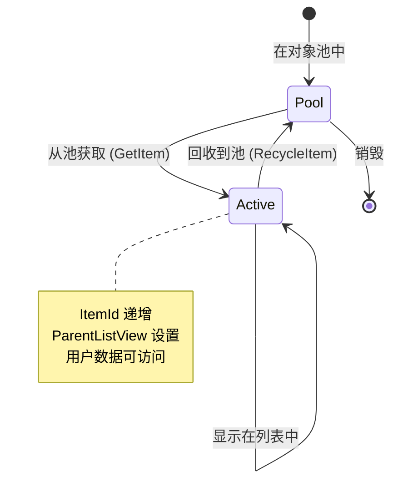

# LoopListViewItem2.cs - 列表项基类

> **文件路径**: `Assets/Scripts/ThirdParty/SuperScrollView/ListView/LoopListViewItem2.cs`  
> **命名空间**: `SuperScrollView`  
> **文档生成时间**: 2026-03-03  
> **文件类型**: 第三方库 (SuperScrollView)

---

## 📑 文件信息表

| 属性 | 值 |
|------|-----|
| **文件路径** | `Assets/Scripts/ThirdParty/SuperScrollView/ListView/LoopListViewItem2.cs` |
| **命名空间** | `SuperScrollView` |
| **类/结构体** | `LoopListViewItem2` |
| **依赖** | `UnityEngine` |
| **基类** | `MonoBehaviour` |
| **可见性** | `public` |

---

## 🎯 类说明

### LoopListViewItem2

列表项基类，附加在每个 Item 上，提供索引、ID 等元数据。

**核心职责**:
- 存储 Item 在列表中的索引（ItemIndex）
- 存储 Item 的唯一 ID（ItemId）
- 提供用户数据字段（Object/Int/String）
- 缓存 RectTransform 引用
- 计算 Item 尺寸和位置信息

**设计特点**:
- 轻量级数据容器
- 支持多种用户数据字段
- 自动缓存组件引用
- 提供便捷的位置计算属性

---

## 📊 字段表

### 核心字段

| 字段名 | 类型 | 可见性 | 说明 |
|--------|------|--------|------|
| `mItemIndex` | `int` | `private` | Item 在列表中的索引 |
| `mItemId` | `int` | `private` | Item 唯一 ID（从池获取时递增） |
| `mParentListView` | `LoopListView2` | `private` | 父列表视图引用 |
| `mIsInitHandlerCalled` | `bool` | `private` | 初始化处理器是否已调用 |
| `mItemPrefabName` | `string` | `private` | 预制体名称 |
| `mCachedRectTransform` | `RectTransform` | `private` | 缓存的 RectTransform |
| `mPadding` | `float` | `private` | Item 间距 |
| `mDistanceWithViewPortSnapCenter` | `float` | `private` | 与视口吸附中心的距离 |
| `mItemCreatedCheckFrameCount` | `int` | `private` | Item 创建时的帧计数 |
| `mStartPosOffset` | `float` | `private` | 起始位置偏移 |

### 用户数据字段

| 字段名 | 类型 | 说明 |
|--------|------|------|
| `mUserObjectData` | `object` | 用户对象数据 |
| `mUserIntData1` | `int` | 用户整数数据 1 |
| `mUserIntData2` | `int` | 用户整数数据 2 |
| `mUserStringData1` | `string` | 用户字符串数据 1 |
| `mUserStringData2` | `string` | 用户字符串数据 2 |

---

## 🔧 API 说明

### 索引与 ID

#### ItemIndex

```csharp
public int ItemIndex { get; set; }
```

**说明**: Item 在列表中的索引。

**范围**:
- 无限列表：`-MaxInt` 到 `+MaxInt`
- 有限列表：`0` 到 `itemTotalCount - 1`

---

#### ItemId

```csharp
public int ItemId { get; set; }
```

**说明**: Item 唯一 ID，从对象池获取时递增。

**注意**: Item 回收到池后，ItemId 不再改变，直到下次从池获取。

---

### 父视图引用

#### ParentListView

```csharp
public LoopListView2 ParentListView { get; set; }
```

**说明**: 获取或设置父列表视图引用。

---

### RectTransform

#### CachedRectTransform

```csharp
public RectTransform CachedRectTransform { get; }
```

**说明**: 缓存的 RectTransform 组件（自动缓存）。

---

### 位置属性

#### TopY / BottomY

```csharp
public float TopY { get; }
public float BottomY { get; }
```

**说明**: 获取 Item 顶部/底部 Y 坐标（根据排列类型计算）。

---

#### LeftX / RightX

```csharp
public float LeftX { get; }
public float RightX { get; }
```

**说明**: 获取 Item 左侧/右侧 X 坐标（根据排列类型计算）。

---

### 尺寸属性

#### ItemSize

```csharp
public float ItemSize { get; }
```

**说明**: 获取 Item 尺寸（垂直列表为高度，水平列表为宽度）。

---

#### ItemSizeWithPadding

```csharp
public float ItemSizeWithPadding { get; }
```

**说明**: 获取 Item 尺寸加间距。

---

### 用户数据

#### UserObjectData / UserIntData1 / UserIntData2

```csharp
public object UserObjectData { get; set; }
public int UserIntData1 { get; set; }
public int UserIntData2 { get; set; }
```

**说明**: 用户自定义数据字段。

---

#### UserStringData1 / UserStringData2

```csharp
public string UserStringData1 { get; set; }
public string UserStringData2 { get; set; }
```

**说明**: 用户自定义字符串数据字段。

---

## 🔄 核心流程图

### Item 生命周期



---

## 💡 使用示例

### 设置 Item 内容

```csharp
LoopListViewItem2 OnGetItemByIndex(LoopListView2 view, int index)
{
    var item = view.NewListViewItem("ItemPrefab");
    
    // 设置用户数据
    item.UserIntData1 = index;
    item.UserStringData1 = GetData(index);
    
    // 设置显示内容
    var text = item.GetComponentInChildren<Text>();
    text.text = $"Item {index}";
    
    return item;
}
```

---

### 获取 Item 位置信息

```csharp
void Update()
{
    foreach (var item in listView.ItemList)
    {
        // 获取 Item 边界
        float top = item.TopY;
        float bottom = item.BottomY;
        float left = item.LeftX;
        float right = item.RightX;
        
        // 检查是否在视口内
        if (top > viewportTop && bottom < viewportBottom)
        {
            // Item 可见
        }
    }
}
```

---

### 动态高度 Item

```csharp
LoopListViewItem2 OnGetItemByIndex(LoopListView2 view, int index)
{
    var item = view.NewListViewItem("ItemPrefab");
    
    // 设置可变内容
    var text = item.GetComponent<Text>();
    text.text = GetContentWithVariableLength(index);
    
    // 通知列表 Item 尺寸变化
    // 需要等待 Layout 更新后调用
    StartCoroutine(NotifySizeChangedCoroutine(item, index));
    
    return item;
}

IEnumerator NotifySizeChangedCoroutine(LoopListViewItem2 item, int index)
{
    yield return null; // 等待一帧
    listView.OnItemSizeChanged(index);
}
```

---

### 使用用户数据字段

```csharp
// 存储数据
item.UserObjectData = new ItemData { id = 123, name = "Test" };
item.UserIntData1 = 100; // 分数
item.UserIntData2 = 5;   // 等级
item.UserStringData1 = "PlayerName";
item.UserStringData2 = "GuildName";

// 获取数据
var data = (ItemData)item.UserObjectData;
int score = item.UserIntData1;
int level = item.UserIntData2;
```

---

### 点击事件处理

```csharp
void Start()
{
    var button = item.GetComponent<Button>();
    button.onClick.AddListener(() => OnItemClick(item));
}

void OnItemClick(LoopListViewItem2 item)
{
    Debug.Log($"点击了 Item {item.ItemIndex}, ID={item.ItemId}");
    Debug.Log($"数据：{item.UserStringData1}");
}
```

---

## 📚 相关文档链接

| 文档 | 说明 |
|------|------|
| [LoopListView2.cs.md](./LoopListView2.cs.md) | 列表视图核心 |
| [LoopListItemPool.cs.md](./LoopListItemPool.cs.md) | Item 对象池 |

---

## ⚠️ 注意事项

1. **ItemIndex 范围**: 确保在有效范围内设置
2. **ItemId 唯一性**: ItemId 在 Item 生命周期内不变
3. **缓存引用**: CachedRectTransform 自动缓存，无需重复获取
4. **用户数据清理**: Item 回收到池前，建议清理用户数据
5. **ParentListView**: 由列表自动设置，不要手动修改

---

*文档由 OpenClaw AI 助手自动生成 | SuperScrollView 版本 2.4.0*
