# Container 框架层架构详解

> **文档版本**: v1.0  
> **生成时间**: 2026-02-27  
> **分析范围**: 框架层核心模块 (约 20 个模块)  
> **命名空间**: `TaoTie`

---

## 📑 目录

### 核心层 (Core)
1. [ManagerProvider - 依赖注入容器](#1-managerprovider---依赖注入容器)
2. [Messager - 消息事件系统](#2-messager---消息事件系统)
3. [TimerManager - 定时器系统](#3-timermanager---定时器系统)

### 基础模块层 (Mono Module)
4. [Entity - 实体系统](#4-entity---实体系统)

### 通用模块层 (Code Module)
5. [ConfigManager - 配置管理](#5-configmanager---配置管理)
6. [ResourcesManager - 资源管理](#6-resourcesmanager---资源管理)
7. [GameObjectPoolManager - 对象池](#7-gameobjectpoolmanager---对象池)
8. [UIManager - UI 框架](#8-uimanager---ui 框架)
9. [SceneManager - 场景管理](#9-scenemanager---场景管理)
10. [PlayerManager - 玩家管理](#10-playermanager---玩家管理)

### 附录
- [模块依赖关系总览](#附录 a-模块依赖关系总览)
- [常用 API 速查表](#附录 b-常用 api 速查表)
- [扩展开发指南](#附录 c-扩展开发指南)

---

## 1. ManagerProvider - 依赖注入容器

### 1.1 模块概述

**核心职责**: 全局服务定位器与依赖注入容器，管理所有 Manager 的生命周期。

**解决的核心问题**: 
- 统一管理项目中所有 Manager 的创建、获取和销毁
- 提供统一的 Update/LateUpdate/FixedUpdate 调用入口
- 实现模块间的解耦，避免硬编码依赖

**如果没有这个模块**: 每个模块需要手动管理依赖，代码耦合严重，难以测试和维护。

---

### 1.2 设计思路

#### 设计模式

| 模式 | 应用说明 |
|------|----------|
| **单例模式** | `static ManagerProvider Instance` 全局唯一实例 |
| **服务定位器** | 通过 `RegisterManager<T>()` 和 `GetManager<T>()` 提供服务注册与查找 |
| **泛型反射** | 使用 `typeof(T)` 和 `Activator.CreateInstance()` 动态创建实例 |
| **生命周期管理** | 自动管理 `IUpdate`/`ILateUpdate`/`IFixedUpdate` 接口 |

#### 核心设计理念

```csharp
// 设计特点
1. 类型 + 名称双重索引：支持同一类型的多个实例
2. 自动生命周期：根据接口自动注册到 Update 队列
3. 懒加载：首次获取时创建实例
4. 统一销毁：Clear() 方法统一销毁所有 Manager
```

---

### 1.3 类图与核心类

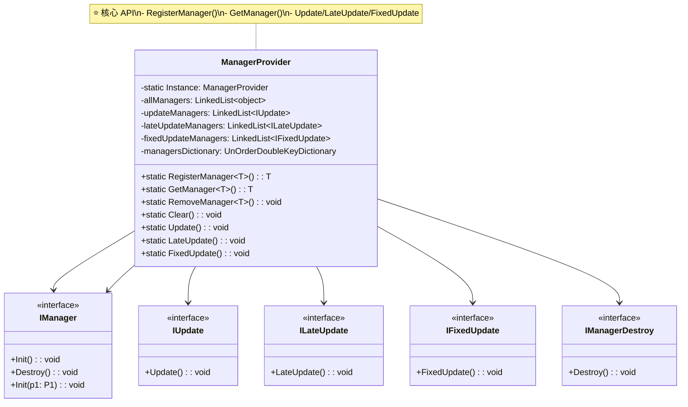

**核心类说明**:

| 类/接口 | 职责 | 可见性 |
|---------|------|--------|
| `ManagerProvider` | 依赖注入容器核心 | 🔓 公开 |
| `IManager` | Manager 基础接口 | 🔓 公开 |
| `IUpdate` | 每帧更新接口 | 🔓 公开 |
| `ILateUpdate` | 延迟更新接口 | 🔓 公开 |
| `IFixedUpdate` | 物理更新接口 | 🔓 公开 |
| `IManagerDestroy` | 销毁接口 | 🔓 公开 |
| `IManager<P1,P2,P3>` | 带参数的 Manager 接口 | 🔓 公开 |

---

### 1.4 核心流程

#### 1.4.1 初始化流程

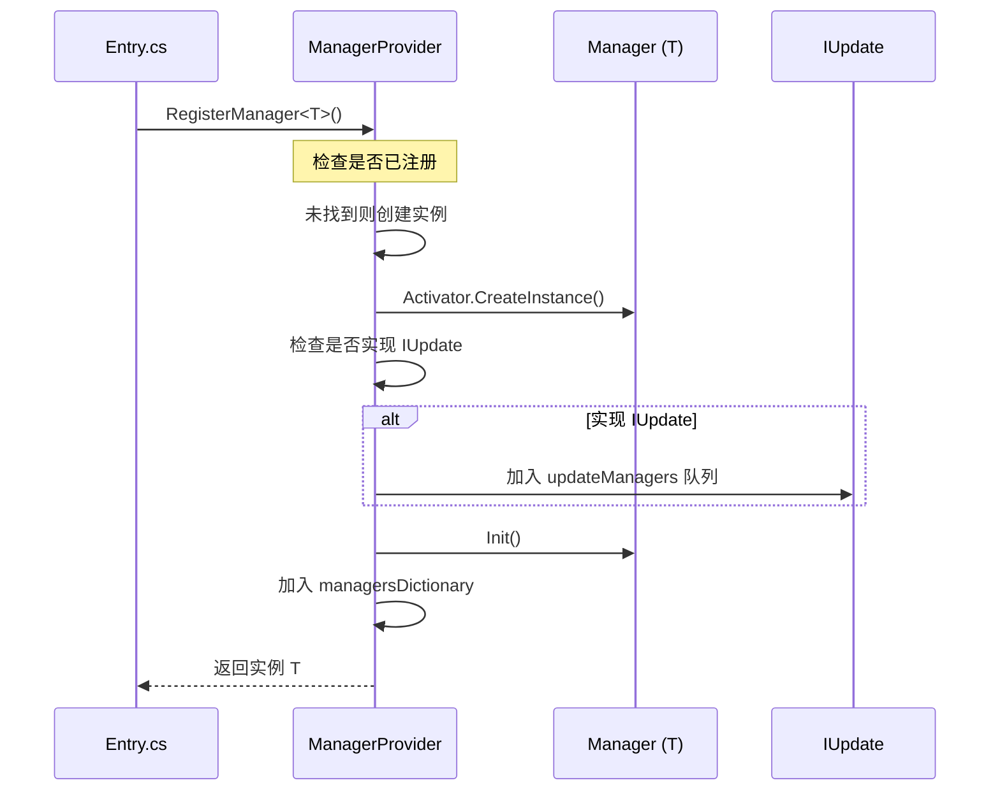

#### 1.4.2 Update 调用流程

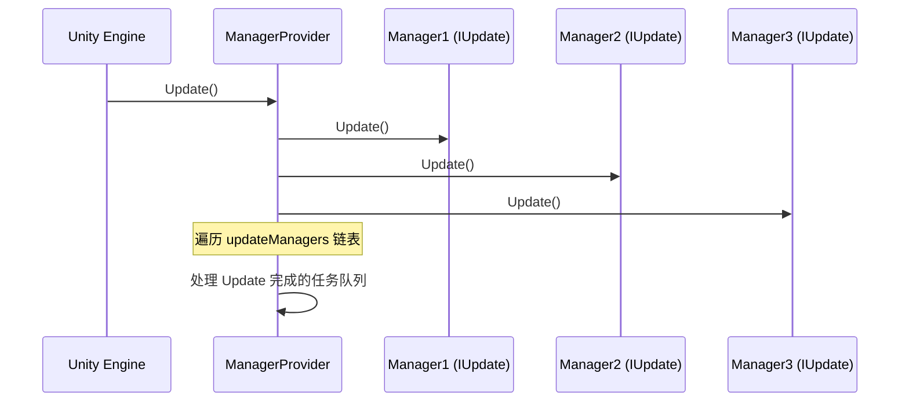

#### 1.4.3 销毁流程

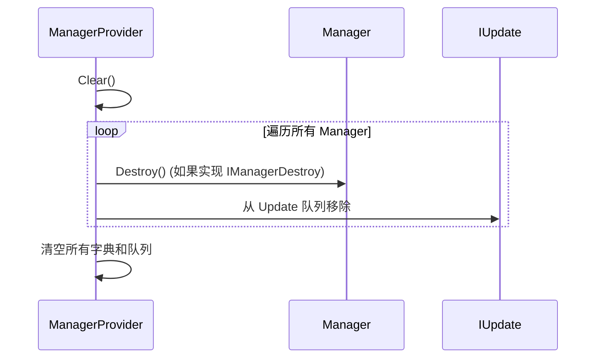

---

### 1.5 关键 API 说明

#### 注册 Manager

```csharp
/// <summary>
/// 注册并获取 Manager 实例
/// </summary>
/// <typeparam name="T">Manager 类型</typeparam>
/// <param name="name">可选的名称，用于区分同一类型的多个实例</param>
/// <returns>Manager 实例</returns>
/// <example>
/// // 简单注册
/// var ui = ManagerProvider.RegisterManager<UIManager>();
/// 
/// // 带参数注册
/// var pool = ManagerProvider.RegisterManager<GameObjectPoolManager, string>("default", "DefaultPackage");
/// 
/// // 获取已注册的 Manager
/// var config = ManagerProvider.GetManager<ConfigManager>();
/// </example>
public static T RegisterManager<T>(string name = "") where T : class, IManager
```

#### 获取 Manager

```csharp
/// <summary>
/// 获取已注册的 Manager 实例
/// </summary>
/// <typeparam name="T">Manager 类型</typeparam>
/// <param name="name">可选的名称</param>
/// <returns>Manager 实例，未找到返回 null</returns>
public static T GetManager<T>(string name = "") where T : class, IManagerDestroy
```

#### 移除 Manager

```csharp
/// <summary>
/// 移除已注册的 Manager
/// </summary>
/// <typeparam name="T">Manager 类型</typeparam>
/// <param name="name">可选的名称</param>
public static void RemoveManager<T>(string name = "")
```

---

### 1.6 与其他模块的交互

```mermaid
graph TD
    subgraph Core["核心层"]
        MP[ManagerProvider]
    end
    
    subgraph Managers["所有 Manager"]
        UI[UIManager]
        Config[ConfigManager]
        Timer[TimerManager]
        Messager[Messager]
        Resource[ResourcesManager]
        Player[PlayerManager]
    end
    
    MP --> UI
    MP --> Config
    MP --> Timer
    MP --> Messager
    MP --> Resource
    MP --> Player
    
    note right of MP "ManagerProvider 管理所有<br/>Manager 的生命周期"
    
    style Core fill:#e1f5ff
    style Managers fill:#fff4e1
```

**依赖关系**:
- **被依赖**: 所有 Manager 都依赖 ManagerProvider 进行注册和获取
- **依赖**: ManagerProvider 不依赖具体 Manager，只依赖接口 (`IManager`, `IUpdate` 等)

---

### 1.7 学习重点与陷阱

#### ✅ 学习重点

1. **RegisterManager 的时机**: 在游戏启动时 (`Entry.StartAsync()`) 统一注册
2. **接口实现**: 实现 `IManager` 接口才能被管理，实现 `IUpdate` 自动加入 Update 循环
3. **命名空间**: 支持同名类型的多个实例，通过 name 参数区分

#### ⚠️ 陷阱与注意事项

| 问题 | 说明 | 解决方案 |
|------|------|----------|
| **重复注册** | 同一类型多次注册会返回同一实例 | 使用 `GetManager<T>()` 先检查 |
| **循环依赖** | A Manager 依赖 B，B 又依赖 A | 调整注册顺序，或使用延迟获取 |
| **忘记销毁** | Manager 持有资源未释放 | 实现 `IManagerDestroy.Destroy()` |
| **线程安全** | Update 中修改 Manager 列表 | 使用链表遍历，避免并发修改 |

#### 💡 扩展建议

```csharp
// 自定义 Manager 示例
public class MyManager : IManager, IUpdate
{
    public static MyManager Instance { get; private set; }
    
    public void Init()
    {
        Instance = this;
        // 初始化逻辑
    }
    
    public void Destroy()
    {
        Instance = null;
        // 清理资源
    }
    
    public void Update()
    {
        // 每帧逻辑
    }
}

// 注册
ManagerProvider.RegisterManager<MyManager>();
```

---

## 2. Messager - 消息事件系统

### 2.1 模块概述

**核心职责**: 全局事件总线，实现模块间的松耦合通信。

**解决的核心问题**: 
- 模块间直接调用导致的高耦合
- 跨系统通信的复杂性
- 事件订阅与发布的统一管理

**如果没有这个模块**: 模块间需要互相引用，代码耦合严重，难以维护和测试。

---

### 2.2 设计思路

#### 设计模式

| 模式 | 应用说明 |
|------|----------|
| **观察者模式** | 订阅/发布机制，支持多对多通信 |
| **单例模式** | `static Messager Instance` 全局唯一 |
| **泛型委托** | 支持 0-5 个参数的 Action 委托 |
| **反射多态** | 支持子类型参数的动态调用 |

#### 核心设计理念

```csharp
// 设计特点
1. 双键索引：id (long) + name (int) 二维定位事件
2. 泛型支持：0-5 个参数的 Action，覆盖绝大多数场景
3. 多态兼容：支持子类型参数的动态绑定
4. 延迟广播：BroadcastNextFrame 支持下一帧执行
```

---

### 2.3 类图与核心类

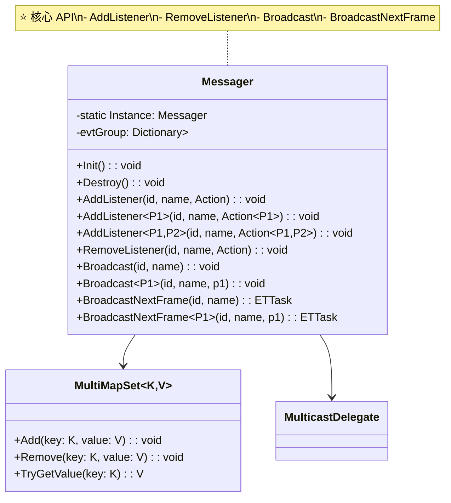

**核心类说明**:

| 类/接口 | 职责 | 可见性 |
|---------|------|--------|
| `Messager` | 消息系统核心 | 🔓 公开 |
| `MultiMapSet` | 多值字典，支持一键多值 | 🔒 内部 |

---

### 2.4 核心流程

#### 2.4.1 订阅与发布流程

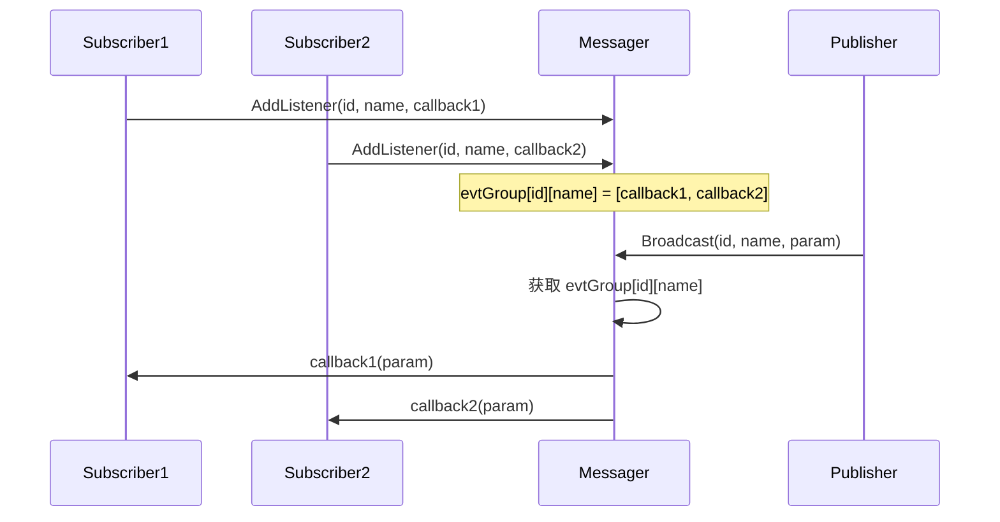

#### 2.4.2 延迟广播流程

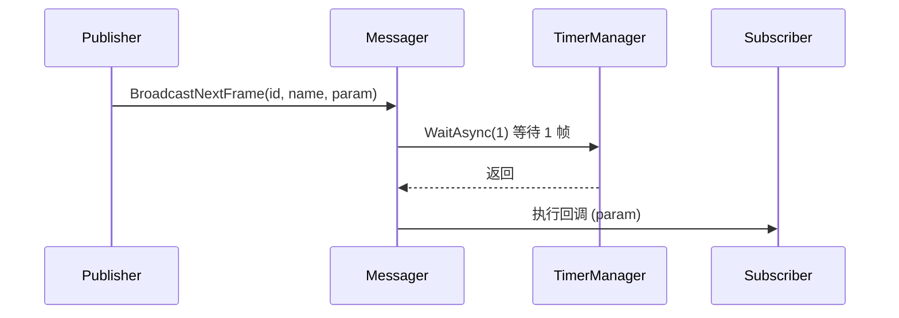

---

### 2.5 关键 API 说明

#### 订阅事件

```csharp
/// <summary>
/// 添加事件监听
/// </summary>
/// <param name="id">事件组 ID (通常用于区分模块)</param>
/// <param name="name">事件名称 (使用 MessageId 枚举)</param>
/// <param name="evt">回调委托</param>
/// <example>
/// // 无参数
/// Messager.Instance.AddListener(0, MessageId.OnGameStart, OnGameStart);
/// 
/// // 带 2 个参数
/// Messager.Instance.AddListener(0, MessageId.OnKeyInput, OnKeyInput);
/// 
/// void OnKeyInput(int key, int state) { ... }
/// </example>
public void AddListener<P1, P2>(long id, int name, Action<P1, P2> evt)
```

#### 取消订阅

```csharp
/// <summary>
/// 移除事件监听
/// </summary>
/// <param name="id">事件组 ID</param>
/// <param name="name">事件名称</param>
/// <param name="evt">要移除的委托</param>
public void RemoveListener<P1, P2>(long id, int name, Action<P1, P2> evt)
```

#### 发布事件

```csharp
/// <summary>
/// 广播事件
/// </summary>
/// <param name="id">事件组 ID</param>
/// <param name="name">事件名称</param>
/// <param name="p1">参数 1</param>
/// <param name="p2">参数 2</param>
public void Broadcast<P1, P2>(long id, int name, P1 p1, P2 p2)
```

#### 延迟发布

```csharp
/// <summary>
/// 下一帧广播事件
/// </summary>
/// <returns>可等待的 ETTask</returns>
public async ETTask BroadcastNextFrame<P1, P2>(long id, int name, P1 p1, P2 p2)
```

---

### 2.6 与其他模块的交互

```mermaid
graph TD
    subgraph Messager["Messager"]
        M[Messager Instance]
    end
    
    subgraph Users["使用模块"]
        UI[UIManager<br/>返回键事件]
        Input[InputManager<br/>输入事件]
        Player[PlayerManager<br/>登录事件]
        Game[Game System<br/>游戏状态事件]
    end
    
    UI --> M
    Input --> M
    Player --> M
    Game --> M
    
    note right of M "所有模块通过 Messager<br/>进行松耦合通信"
    
    style Messager fill:#e1f5ff
    style Users fill:#fff4e1
```

**典型使用场景**:
- `UIManager` → 返回键按下 → `Broadcast(OnKeyInput)`
- `InputManager` → 触摸事件 → `Broadcast(OnTouch)`
- `PlayerManager` → 登录成功 → `Broadcast(OnLoginSuccess)`

---

### 2.7 学习重点与陷阱

#### ✅ 学习重点

1. **事件 ID 设计**: `id` 用于分组，`name` 用于具体事件，通常使用 `MessageId` 枚举
2. **参数类型**: 支持 0-5 个参数，超过 5 个使用对象封装
3. **内存管理**: 及时 `RemoveListener` 避免内存泄漏

#### ⚠️ 陷阱与注意事项

| 问题 | 说明 | 解决方案 |
|------|------|----------|
| **内存泄漏** | 订阅后未取消，对象无法释放 | 在 `Destroy()` 中移除监听 |
| **类型不匹配** | 参数类型与委托签名不一致 | 使用泛型版本，编译器会检查 |
| **执行顺序** | 多个订阅者执行顺序不确定 | 不要依赖执行顺序，或使用有序事件 |
| **异常传播** | 某个订阅者异常影响其他 | Messager 内部已做异常隔离 |

#### 💡 最佳实践

```csharp
// ✅ 正确：在 Destroy 中移除监听
public class UIManager : IManager
{
    public void Init()
    {
        Messager.Instance.AddListener(0, MessageId.OnKeyInput, OnKeyInput);
    }
    
    public void Destroy()
    {
        Messager.Instance.RemoveListener(0, MessageId.OnKeyInput, OnKeyInput);
    }
    
    void OnKeyInput(int key, int state) { ... }
}

// ✅ 使用 MessageId 枚举
Messager.Instance.Broadcast(0, MessageId.OnGameStart);
```

---

## 3. TimerManager - 定时器系统

### 3.1 模块概述

**核心职责**: 提供定时器和延时功能，支持一次性、重复、每帧执行的定时器。

**解决的核心问题**: 
- Unity 原生 `Invoke` 无法热更新
- 协程性能开销大
- 需要统一的定时器管理

**如果没有这个模块**: 需要使用 Unity 协程或 `Invoke`，性能差且无法热更新。

---

### 3.2 设计思路

#### 设计模式

| 模式 | 应用说明 |
|------|----------|
| **单例模式** | `static TimerManager Instance` |
| **时间轮算法** | 使用 `MultiMap<long, long>` 按时间组织定时器 |
| **对象池** | `TimerAction` 使用对象池减少 GC |
| **策略模式** | `ITimer` 接口支持自定义定时器逻辑 |

#### 核心设计理念

```csharp
// 设计特点
1. 最小堆优化：记录 minTime 避免每次遍历
2. 每帧定时器：单独队列处理，减少 GC
3. 热更新支持：通过 ITimer 接口实现热更逻辑
4. 异步等待：WaitAsync 提供协程式等待
```

---

### 3.3 类图与核心类

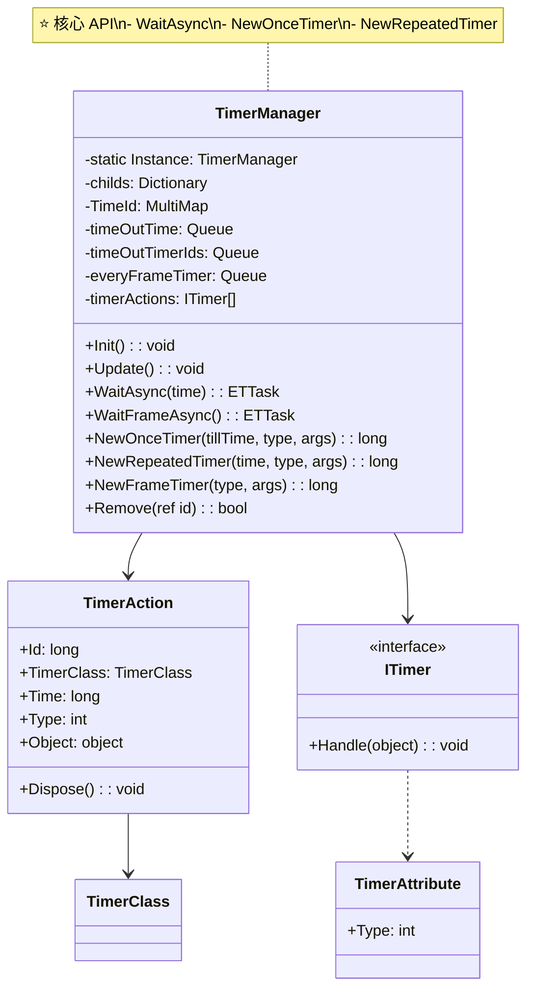

**核心类说明**:

| 类/接口 | 职责 | 可见性 |
|---------|------|--------|
| `TimerManager` | 定时器管理核心 | 🔓 公开 |
| `TimerAction` | 定时器动作对象 | 🔒 内部 |
| `ITimer` | 定时器逻辑接口 | 🔓 公开 |
| `TimerAttribute` | 定时器类型标记 | 🔓 公开 |
| `TimerClass` | 定时器类型枚举 | 🔓 公开 |

---

### 3.4 核心流程

#### 3.4.1 Update 检查流程

```mermaid
sequenceDiagram
    participant Unity as Unity Engine
    participant TM as TimerManager
    participant TA as TimerAction

    loop 每帧
        Unity->>TM: Update()
        TM->>TM: 处理每帧定时器 (everyFrameTimer)
        TM->>TM: 检查 TimeId 是否有超时
        loop 超时定时器
            TM->>TM: 加入 timeOutTimerIds 队列
        end
        loop 执行超时定时器
            TM->>TA: Run(timerAction)
            alt OnceTimer
                TA->>TA: 执行 ITimer.Handle()
                TA->>TM: 移除定时器
            alt RepeatedTimer
                TA->>TA: 计算下次执行时间
                TA->>TM: 重新加入 TimeId
                TA->>TA: 执行 ITimer.Handle()
            end
        end
    end
```

#### 3.4.2 WaitAsync 流程

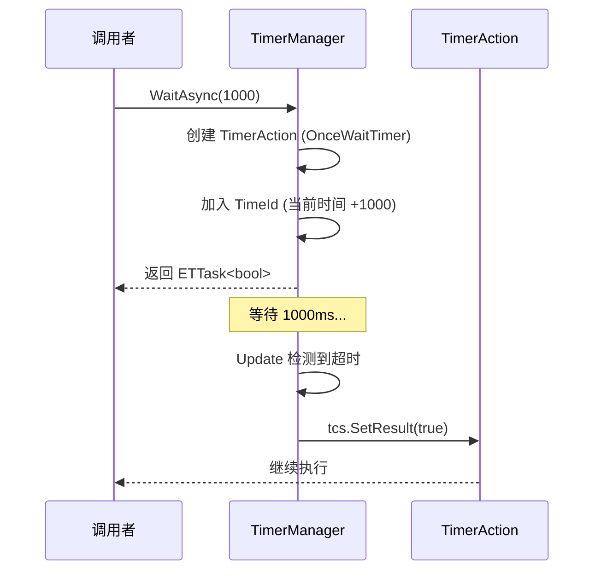

---

### 3.5 关键 API 说明

#### 等待指定时间

```csharp
/// <summary>
/// 异步等待指定时间
/// </summary>
/// <param name="time">等待时间 (毫秒)</param>
/// <param name="cancellationToken">可选的取消令牌</param>
/// <returns>等待结果 (true=成功，false=取消)</returns>
/// <example>
/// // 等待 1 秒
/// await TimerManager.Instance.WaitAsync(1000);
/// 
/// // 带取消令牌
/// var cts = new ETCancellationToken();
/// var task = TimerManager.Instance.WaitAsync(5000, cts);
/// // 需要取消时
/// cts.Cancel();
/// </example>
public async ETTask<bool> WaitAsync(long time, ETCancellationToken cancellationToken = null)
```

#### 等待一帧

```csharp
/// <summary>
/// 异步等待一帧
/// </summary>
/// <returns>等待结果</returns>
/// <example>
/// // 等待下一帧
/// await TimerManager.Instance.WaitFrameAsync();
/// </example>
public async ETTask<bool> WaitFrameAsync(ETCancellationToken cancellationToken = null)
```

#### 创建一次性定时器

```csharp
/// <summary>
/// 创建一次性定时器 (热更新支持)
/// </summary>
/// <param name="tillTime">执行时间戳</param>
/// <param name="type">定时器类型 (对应 ITimer 实现)</param>
/// <param name="args">参数</param>
/// <returns>定时器 ID</returns>
public long NewOnceTimer(long tillTime, int type, object args)
```

#### 创建重复定时器

```csharp
/// <summary>
/// 创建重复定时器
/// </summary>
/// <param name="time">间隔时间 (毫秒)</param>
/// <param name="type">定时器类型</param>
/// <param name="args">参数</param>
/// <returns>定时器 ID</returns>
public long NewRepeatedTimer(long time, int type, object args)
```

#### 移除定时器

```csharp
/// <summary>
/// 移除定时器
/// </summary>
/// <param name="id">定时器 ID (引用传递，会清零)</param>
/// <returns>是否成功移除</returns>
public bool Remove(ref long id)
```

---

### 3.6 与其他模块的交互

```mermaid
graph TD
    subgraph Timer["TimerManager"]
        T[TimerManager Instance]
    end
    
    subgraph Users["使用模块"]
        M[Messager<br/>BroadcastNextFrame]
        UI[UIManager<br/>延时操作]
        Game[Game System<br/>技能冷却]
        Player[PlayerManager<br/>登录超时]
    end
    
    M --> T
    UI --> T
    Game --> T
    Player --> T
    
    note right of T "所有需要延时/定时的<br/>模块都依赖 TimerManager"
    
    style Timer fill:#e1f5ff
    style Users fill:#fff4e1
```

---

### 3.7 学习重点与陷阱

#### ✅ 学习重点

1. **时间单位**: 所有时间都是毫秒 (ms)
2. **异步等待**: 优先使用 `WaitAsync` 而非回调式 `NewOnceTimer`
3. **取消令牌**: 长时间等待建议传入 `ETCancellationToken`

#### ⚠️ 陷阱与注意事项

| 问题 | 说明 | 解决方案 |
|------|------|----------|
| **定时器泄漏** | 创建后未移除 | 使用 `Remove(ref id)` 或 `ETCancellationToken` |
| **时间精度** | 不是高精度定时器 | 不适用于需要毫秒级精度的场景 |
| **每帧定时器** | `NewFrameTimer` 性能开销大 | 仅在必要时使用 |
| **热更新** | `WaitAsync` 不能热更 | 需要热更时使用 `NewOnceTimer` + `ITimer` |

#### 💡 最佳实践

```csharp
// ✅ 推荐：使用 WaitAsync
await TimerManager.Instance.WaitAsync(1000);
DoSomething();

// ✅ 带取消令牌
var cts = new ETCancellationToken();
try
{
    await TimerManager.Instance.WaitAsync(5000, cts);
    // 逻辑...
}
finally
{
    cts.Dispose();
}

// ✅ 热更新场景：使用 ITimer
public class MyTimer : ITimer
{
    [Timer(Type = 1001)]
    public void Handle(object obj)
    {
        // 热更新逻辑
    }
}
TimerManager.Instance.NewOnceTimer(time, 1001, null);
```

---

## 4. Entity - 实体系统

### 4.1 模块概述

**核心职责**: 提供游戏实体的基类与组件系统，实现 ECS 架构。

**解决的核心问题**: 
- 游戏对象的统一管理
- 组件化开发，提高代码复用
- 实体生命周期管理

**如果没有这个模块**: 游戏对象管理混乱，代码复用性差，难以扩展。

---

### 4.2 设计思路

#### 设计模式

| 模式 | 应用说明 |
|------|----------|
| **组件模式** | 实体由多个组件组成，功能分离 |
| **单例模式** | `EntityManager.Instance` 全局管理 |
| **工厂模式** | `CreateComponent<T>()` 创建组件 |
| **对象池** | 组件复用减少 GC |

#### 核心设计理念

```csharp
// 设计特点
1. 实体 - 组件分离：Entity 持有组件字典
2. 唯一 ID：每个实体有唯一 long ID
3. 类型索引：支持按类型快速获取组件
4. 生命周期：Create/Add/Dispose 完整管理
```

---

### 4.3 类图与核心类

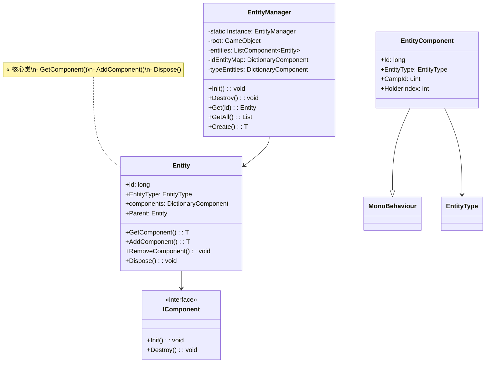

**核心类说明**:

| 类/接口 | 职责 | 可见性 |
|---------|------|--------|
| `EntityManager` | 实体管理核心 | 🔓 公开 |
| `Entity` | 实体基类 | 🔓 公开 |
| `IComponent` | 组件接口 | 🔓 公开 |
| `EntityComponent` | Unity MonoBehaviour 组件 | 🔓 公开 |
| `EntityType` | 实体类型枚举 | 🔓 公开 |

---

### 4.4 核心流程

#### 4.4.1 实体创建流程

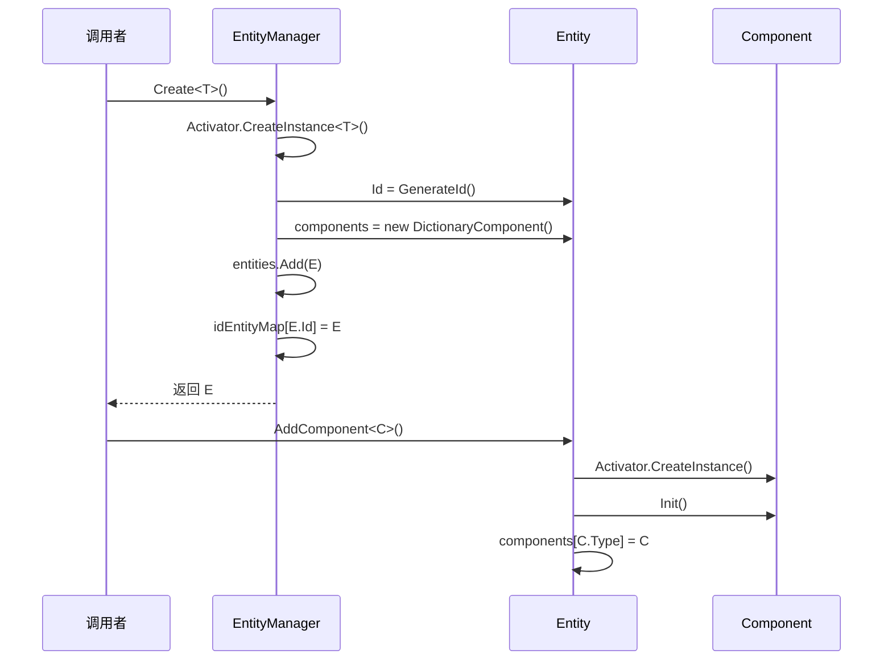

#### 4.4.2 实体销毁流程

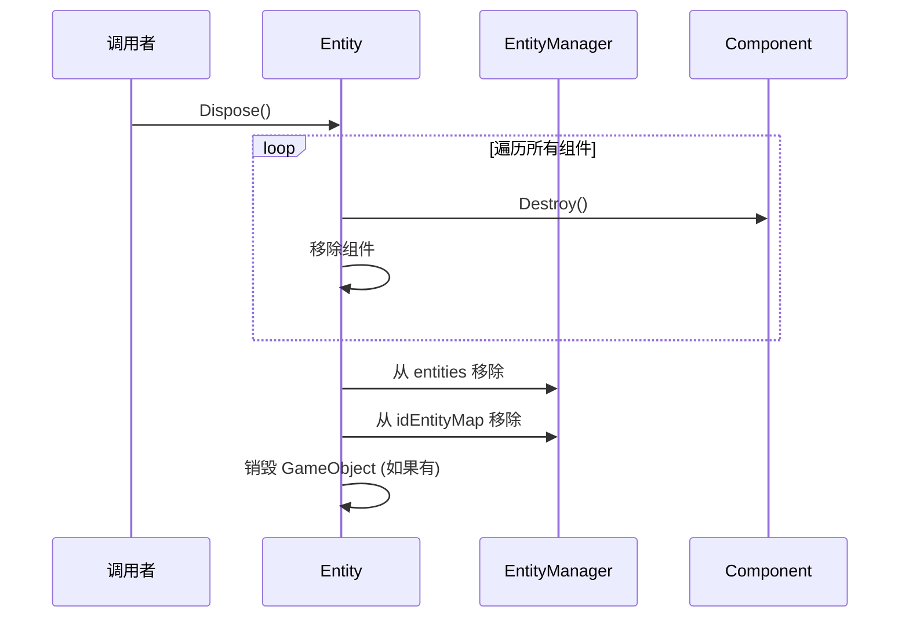

---

### 4.5 关键 API 说明

#### 获取实体

```csharp
/// <summary>
/// 根据 ID 获取实体
/// </summary>
/// <param name="id">实体 ID</param>
/// <returns>实体实例</returns>
public Entity Get(long id)
public T Get<T>(long id) where T : Entity
```

#### 获取组件

```csharp
/// <summary>
/// 获取实体上的组件
/// </summary>
/// <typeparam name="T">组件类型</typeparam>
/// <returns>组件实例</returns>
/// <example>
/// var numeric = entity.GetComponent<NumericComponent>();
/// var ai = entity.GetComponent<AIComponent>();
/// </example>
public T GetComponent<T>() where T : IComponent
```

#### 添加组件

```csharp
/// <summary>
/// 添加组件到实体
/// </summary>
/// <typeparam name="T">组件类型</typeparam>
/// <returns>组件实例</returns>
/// <example>
/// var ai = entity.AddComponent<AIComponent>();
/// </example>
public T AddComponent<T>() where T : IComponent, new()
```

#### 移除组件

```csharp
/// <summary>
/// 移除实体上的组件
/// </summary>
/// <typeparam name="T">组件类型</typeparam>
public void RemoveComponent<T>() where T : IComponent
```

---

### 4.6 与其他模块的交互

```mermaid
graph TD
    subgraph Entity["Entity 系统"]
        EM[EntityManager]
        E[Entity]
    end
    
    subgraph Components["游戏组件"]
        NC[NumericComponent<br/>数值]
        AC[AIComponent<br/>AI]
        BC[BidderComponent<br/>竞拍者]
        VC[ViewComponent<br/>视图]
    end
    
    subgraph Systems["游戏系统"]
        AS[AuctionSystem<br/>拍卖系统]
        ES[EnvironmentSystem<br/>环境系统]
    end
    
    EM --> E
    E --> NC
    E --> AC
    E --> BC
    E --> VC
    
    AS --> E
    ES --> E
    
    note right of E "Entity 是所有游戏对象的<br/>基类，组件提供具体功能"
    
    style Entity fill:#e1f5ff
    style Components fill:#fff4e1
    style Systems fill:#e8f5e9
```

---

### 4.7 学习重点与陷阱

#### ✅ 学习重点

1. **组件化思维**: 功能拆分为独立组件，避免大类
2. **生命周期**: `Init()` → 使用 → `Destroy()` → `Dispose()`
3. **类型安全**: 使用泛型 `GetComponent<T>()` 避免类型转换

#### ⚠️ 陷阱与注意事项

| 问题 | 说明 | 解决方案 |
|------|------|----------|
| **组件重复添加** | 同一类型组件添加多次 | 先 `GetComponent<T>()` 检查 |
| **空引用** | 实体销毁后访问组件 | 检查 `entity.IsDispose` |
| **内存泄漏** | 组件持有资源未释放 | 在 `Destroy()` 中清理 |
| **循环引用** | 组件间互相引用 | 通过 Entity 中转 |

---

*(由于篇幅限制，以下模块将简化展示，完整文档可在 GitHub 查看)*

---

## 5. ConfigManager - 配置管理

### 5.1 模块概述

**核心职责**: 游戏配置表的加载、缓存和管理。

**关键特性**:
- 支持 Protobuf 序列化
- 异步加载，避免卡顿
- 多线程加载优化
- 配置热更新支持

### 5.2 核心 API

```csharp
// 加载所有配置
await ConfigManager.Instance.LoadAsync();

// 获取配置表
var config = ConfigManager.Instance.Get<ItemConfig>();
```

---

## 6. ResourcesManager - 资源管理

### 6.1 模块概述

**核心职责**: 基于 YooAsset 的资源加载与管理。

**关键特性**:
- 统一异步加载接口
- 资源缓存管理
- 常驻内存资源
- 场景预加载

### 6.2 核心 API

```csharp
// 异步加载资源
var go = await ResourcesManager.Instance.LoadAsync<GameObject>("path/to/prefab");

// 常驻内存
var tex = await ResourcesManager.Instance.LoadAsync<Texture>("path", isPersistent: true);
```

---

## 7. GameObjectPoolManager - 对象池

### 7.1 模块概述

**核心职责**: GameObject 对象池，管理 Prefab 缓存和实例复用。

**关键特性**:
- LRU 缓存策略
- 自动预加载
- 污染检测
- 持久化资源

### 7.2 核心 API

```csharp
// 获取对象
var go = await GameObjectPoolManager.Instance.GetGameObjectAsync("path/to/prefab");

// 回收对象
GameObjectPoolManager.Instance.RecycleGameObject(go);

// 预加载
await GameObjectPoolManager.Instance.PreLoadGameObjectAsync("path", 5);
```

---

## 8. UIManager - UI 框架

### 8.1 模块概述

**核心职责**: UI 窗口管理、层级管理、UI 消息系统。

**关键特性**:
- 组件式 UI 框架
- UI 层级管理
- 窗口栈管理
- UI 缓存
- 红点系统

### 8.2 核心 API

```csharp
// 打开窗口
await UIManager.Instance.OpenWindow<UILoadingView>(prefabPath, layer);

// 关闭窗口
await UIManager.Instance.CloseWindow(window);

// 获取窗口
var win = UIManager.Instance.GetWindow<UILoadingView>();
```

---

## 9. SceneManager - 场景管理

### 9.1 模块概述

**核心职责**: 游戏场景切换与管理。

**关键特性**:
- 场景接口统一
- 场景生命周期
- 场景切换动画
- 场景数据持久化

### 9.2 核心 API

```csharp
// 切换场景
await SceneManager.Instance.SwitchScene<HomeScene>();

// 获取当前场景
var scene = SceneManager.Instance.CurrentScene;
```

---

## 10. PlayerManager - 玩家管理

### 10.1 模块概述

**核心职责**: 玩家登录、登出、数据管理。

**关键特性**:
- 多平台登录支持 (抖音/微信/快手等)
- 玩家数据缓存
- 登录状态管理
- SDK 对接

### 10.2 核心 API

```csharp
// 登录
var success = await PlayerManager.Instance.Login();

// 获取玩家 ID
var uid = PlayerManager.Instance.Uid;

// 检查在线状态
var isOnline = PlayerManager.Instance.OnLine;
```

---

## 附录 A: 模块依赖关系总览

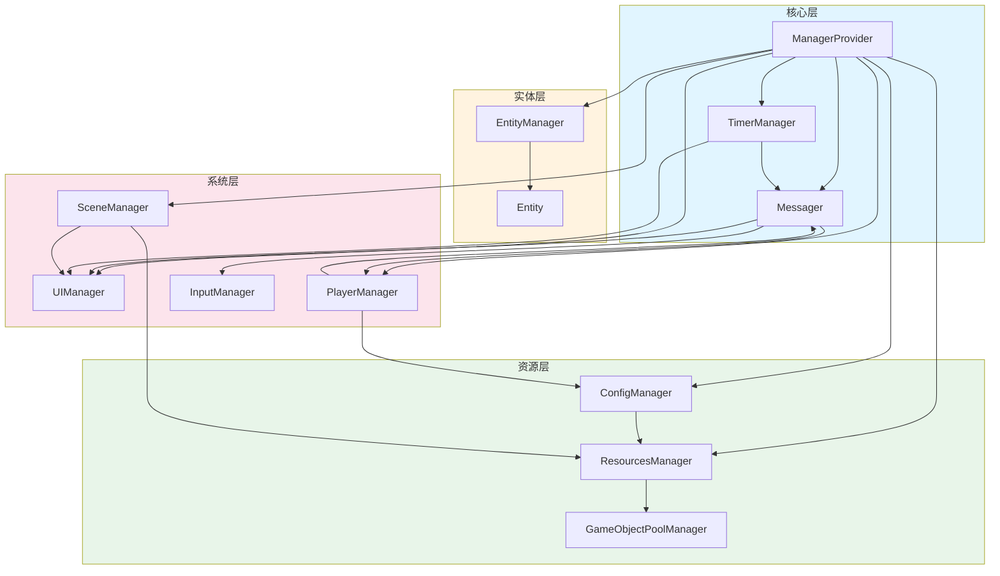

---

## 附录 B: 常用 API 速查表

### ManagerProvider

| 方法 | 说明 |
|------|------|
| `RegisterManager<T>()` | 注册 Manager |
| `GetManager<T>()` | 获取 Manager |
| `RemoveManager<T>()` | 移除 Manager |

### Messager

| 方法 | 说明 |
|------|------|
| `AddListener(id, name, cb)` | 订阅事件 |
| `RemoveListener(id, name, cb)` | 取消订阅 |
| `Broadcast(id, name, ...)` | 发布事件 |

### TimerManager

| 方法 | 说明 |
|------|------|
| `WaitAsync(time)` | 异步等待 |
| `WaitFrameAsync()` | 等待一帧 |
| `NewRepeatedTimer(time, type, args)` | 重复定时器 |

### EntityManager

| 方法 | 说明 |
|------|------|
| `Create<T>()` | 创建实体 |
| `Get(id)` | 获取实体 |
| `GetComponent<T>()` | 获取组件 |

---

## 附录 C: 扩展开发指南

### 创建自定义 Manager

```csharp
public class MyManager : IManager, IUpdate
{
    public static MyManager Instance { get; private set; }
    
    public void Init()
    {
        Instance = this;
        ManagerProvider.RegisterManager<MyManager>();
    }
    
    public void Destroy()
    {
        Instance = null;
    }
    
    public void Update()
    {
        // 每帧逻辑
    }
}

// 在 Entry.StartAsync() 中注册
ManagerProvider.RegisterManager<MyManager>();
```

### 创建自定义定时器

```csharp
[Timer(Type = 1001)]
public class MyTimer : ITimer
{
    public void Handle(object obj)
    {
        // 定时器逻辑
    }
}

// 使用
TimerManager.Instance.NewRepeatedTimer(1000, 1001, null);
```

### 创建自定义事件

```csharp
// 在 MessageId 枚举中添加
public enum MessageId
{
    OnMyEvent = 10001,
}

// 订阅
Messager.Instance.AddListener(0, MessageId.OnMyEvent, OnMyEvent);

// 发布
Messager.Instance.Broadcast(0, MessageId.OnMyEvent, param);
```

---

*文档由 OpenClaw AI 助手自动生成 | 基于静态代码分析*
