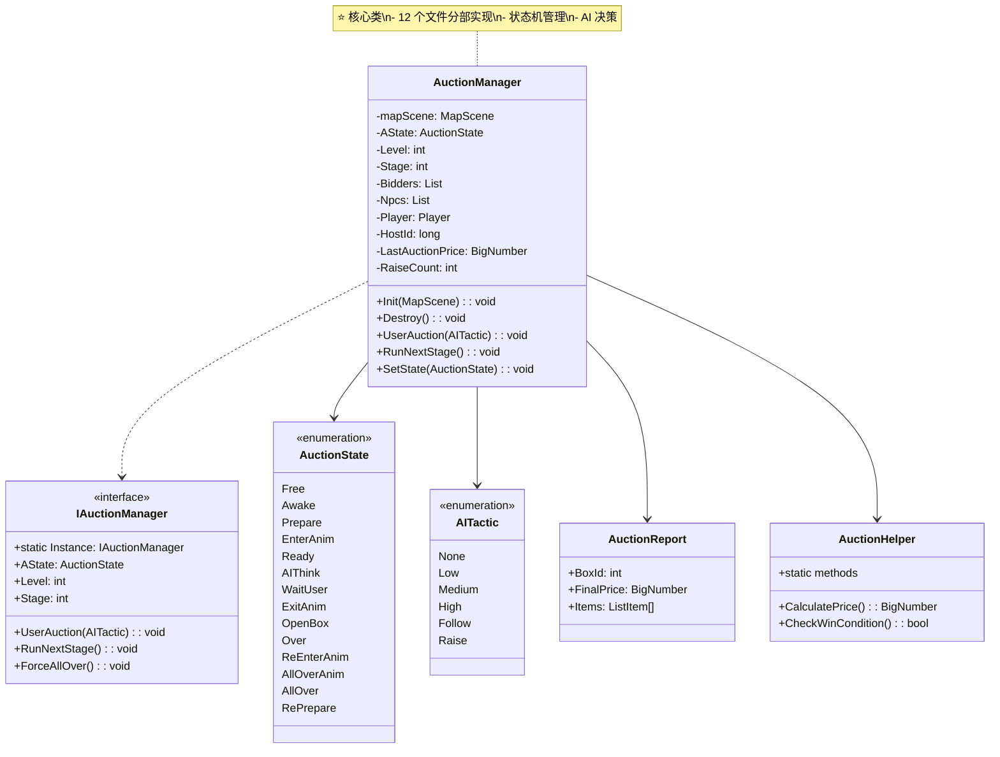
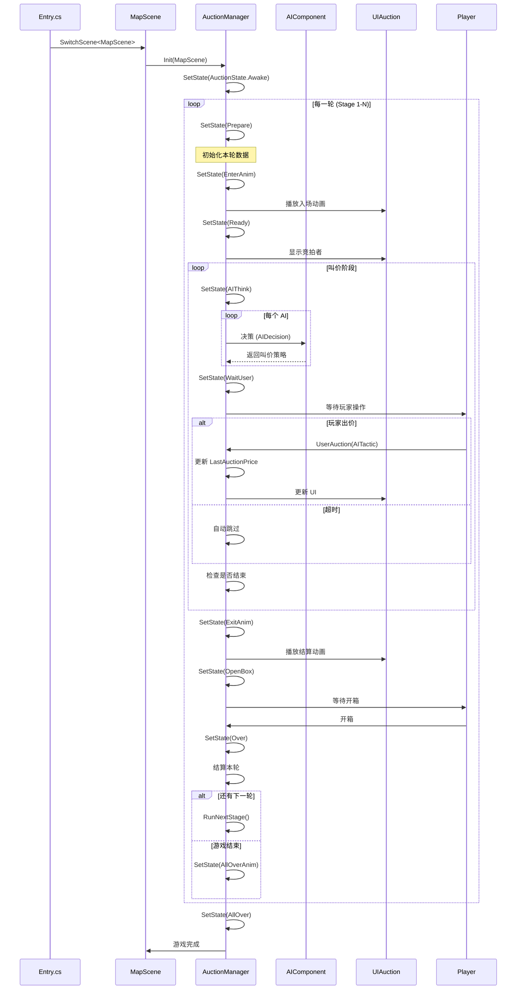
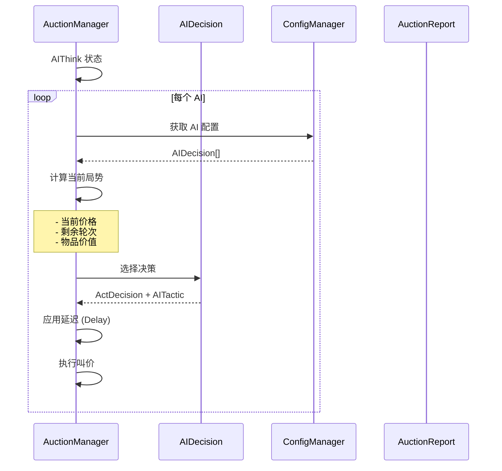
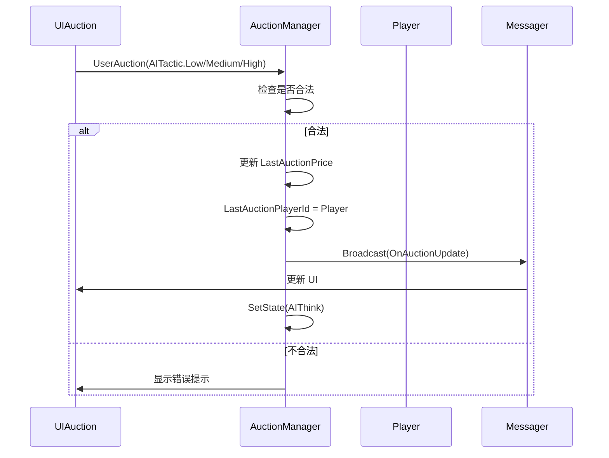
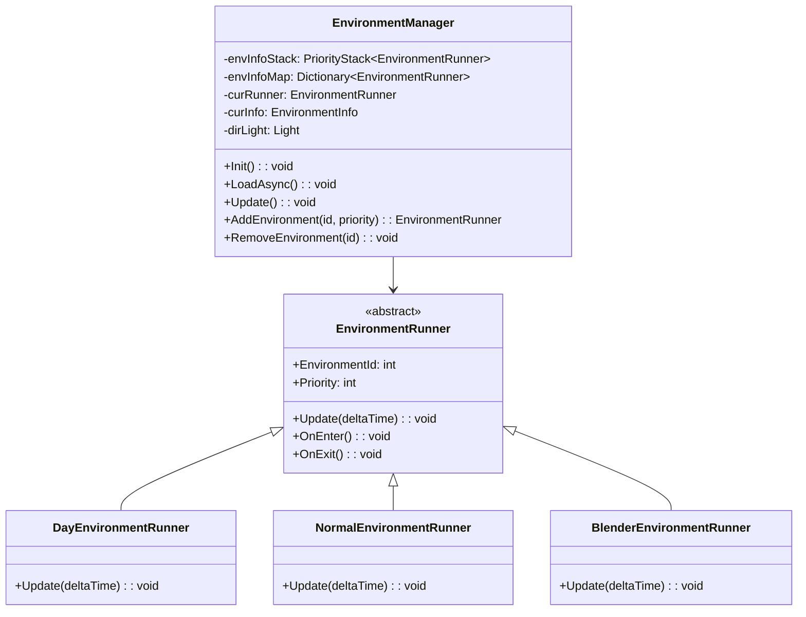
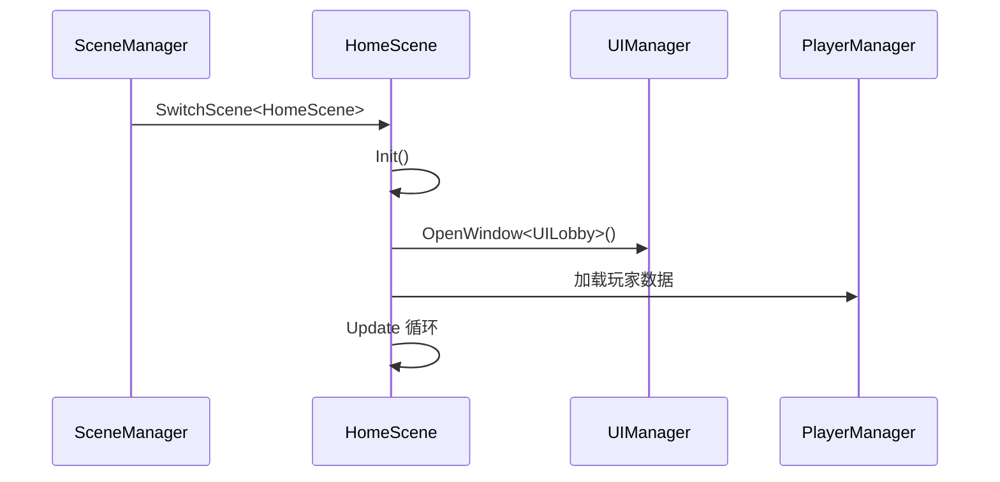
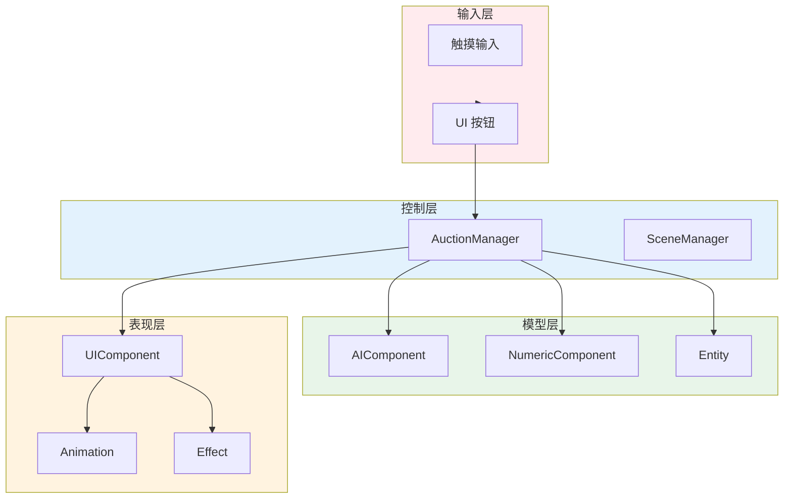

# Container 玩法层系统详解

> **文档版本**: v1.0  
> **生成时间**: 2026-02-27  
> **分析范围**: 玩法层核心系统 (约 14 个系统/组件)  
> **命名空间**: `TaoTie`  
> **核心玩法**: 集装箱拍卖 + AI 竞拍 + 环境互动

---

## 📑 目录

### 核心玩法系统
1. [AuctionSystem - 拍卖系统](#1-auctionsystem---拍卖系统) ⭐⭐⭐⭐⭐
2. [EnvironmentSystem - 环境系统](#2-environmentsystem---环境系统) ⭐⭐⭐⭐
3. [NumericSystem - 数值系统](#3-numericsystem---数值系统) ⭐⭐⭐⭐
4. [EntityManager (Game) - 游戏实体管理](#4-entitymanager-game---游戏实体管理) ⭐⭐⭐

### 游戏组件
5. [AIComponent - AI 组件](#5-aicomponent---ai 组件) ⭐⭐⭐⭐
6. [NumericComponent - 数值组件](#6-numericcomponent---数值组件) ⭐⭐⭐
7. [TypeComponent - 类型组件](#7-typecomponent---类型组件) ⭐⭐
8. [ViewComponent - 视图组件](#8-viewcomponent---视图组件) ⭐⭐

### 场景系统
9. [HomeScene - 家园场景](#9-homescene---家园场景) ⭐⭐⭐
10. [MapScene/GuideScene - 地图/引导场景](#10-mapsceneguidescene---地图引导场景) ⭐⭐⭐

### UI 系统
11. [UIAuction - 拍卖 UI](#11-uiauction---拍卖 ui) ⭐⭐⭐
12. [UILobby - 大厅 UI](#12-uilobby---大厅 ui) ⭐⭐
13. [UICreate - 创建 UI](#13-uicreate---创建 ui) ⭐⭐
14. [UIMiniGame - 小游戏 UI](#14-uiminigame---小游戏 ui) ⭐⭐

### 附录
- [玩法数据流总览](#附录 a-玩法数据流总览)
- [配置表使用说明](#附录 b-配置表使用说明)
- [新玩法开发指南](#附录 c-新玩法开发指南)

---

## 1. AuctionSystem - 拍卖系统

### 1.1 系统概述

**核心职责**: 实现集装箱拍卖的核心玩法逻辑，包括 AI 竞拍、玩家出价、拍卖流程控制。

**游戏玩法说明**:
- 玩家参与集装箱拍卖，与其他 AI 竞拍者竞争
- 通过叫价 (低/中/高) 竞拍集装箱
- 使用情报、骰子等道具影响拍卖结果
- 开箱获取物品，完成关卡目标

**解决的核心问题**: 
- 复杂的状态机管理 (15 个拍卖状态)
- AI 决策与玩家交互的同步
- 多轮次拍卖流程控制
- 道具系统与拍卖的整合

**如果没有这个系统**: 游戏核心玩法无法实现，无法进行拍卖流程。

---

### 1.2 设计思路

#### 架构设计

```
┌─────────────────────────────────────────────────────────┐
│                    AuctionManager                        │
│  ┌─────────────┐  ┌─────────────┐  ┌─────────────┐     │
│  │  State      │  │  AI         │  │  Player     │     │
│  │  Machine    │  │  Decision   │  │  Input      │     │
│  └─────────────┘  └─────────────┘  └─────────────┘     │
│  ┌─────────────┐  ┌─────────────┐  ┌─────────────┐     │
│  │  Report     │  │ 道具        │  │  UI         │     │
│  │  结算       │  │ 系统        │  │ 交互        │     │
│  └─────────────┘  └─────────────┘  └─────────────┘     │
└─────────────────────────────────────────────────────────┘
```

#### 设计模式

| 模式 | 应用说明 |
|------|----------|
| **状态模式** | `AuctionState` 枚举 + `SetState()` 管理 15 个状态 |
| **策略模式** | `AITactic` 枚举定义 AI 叫价策略 |
| **观察者模式** | `Messager` 发送事件通知 UI 更新 |
| **接口隔离** | `IAuctionManager` 接口提供统一访问 |
| **分部类** | `partial class` 按功能拆分文件 |

#### 核心设计理念

```csharp
// 设计特点
1. 状态机驱动：每个状态有独立的 Enter/Update/Exit 逻辑
2. AI 决策树：基于配置的 AI 行为决策系统
3. 玩家异步等待：ETTask 实现玩家操作超时处理
4. 数据驱动：配置表定义拍卖参数、AI 行为
5. 模块化：通过 partial class 拆分大文件
```

---

### 1.3 类图与核心类



**文件结构**:

| 文件 | 职责 | 行数 |
|------|------|------|
| `AuctionManager.cs` | 主逻辑、状态机 | 1400+ |
| `AuctionManager.State.cs` | 状态管理 | 200+ |
| `AuctionManager.Anim.cs` | 动画控制 | 150+ |
| `AuctionManager.API.cs` | 外部接口 | 100+ |
| `AuctionManager.AIMiniPlay.cs` | AI 与小玩法 | 200+ |
| `AuctionGuideManager.cs` | 拍卖引导 | 150+ |
| `AuctionState.cs` | 状态枚举 | 30 |
| `IAuctionManager.cs` | 接口定义 | 80 |
| `AuctionHelper.cs` | 辅助工具 | 100 |

**核心类说明**:

| 类/接口 | 职责 | 可见性 |
|---------|------|--------|
| `AuctionManager` | 拍卖系统核心实现 | 🔒 内部 |
| `IAuctionManager` | 对外接口 | 🔓 公开 |
| `AuctionState` | 状态枚举 | 🔓 公开 |
| `AITactic` | AI 策略枚举 | 🔓 公开 |
| `AuctionReport` | 拍卖结果数据 | 🔓 公开 |
| `AuctionHelper` | 辅助工具类 | 🔒 内部 |

---

### 1.4 核心流程

#### 1.4.1 拍卖完整流程



#### 1.4.2 AI 决策流程



#### 1.4.3 玩家出价流程



---

### 1.5 关键 API 说明

#### 玩家出价

```csharp
/// <summary>
/// 玩家出价
/// </summary>
/// <param name="type">叫价类型 (低/中/高)</param>
/// <example>
/// // 玩家点击低价按钮
/// IAuctionManager.Instance.UserAuction(AITactic.Low);
/// 
/// // 玩家点击中价按钮
/// IAuctionManager.Instance.UserAuction(AITactic.Medium);
/// 
/// // 玩家点击高价按钮
/// IAuctionManager.Instance.UserAuction(AITactic.High);
/// </example>
public void UserAuction(AITactic type)
```

#### 进入下一轮

```csharp
/// <summary>
/// 进行下一场
/// </summary>
/// <example>
/// // 当前轮结束后
/// IAuctionManager.Instance.RunNextStage();
/// </example>
public void RunNextStage()
```

#### 设置鉴定结果

```csharp
/// <summary>
/// 设置鉴定结果 (小玩法)
/// </summary>
/// <param name="configId">物品配置 ID</param>
/// <param name="newId">新物品 ID</param>
public void SetAppraisalResult(int configId, int newId)
```

#### 设置小游戏结果

```csharp
/// <summary>
/// 设置小游戏结果
/// </summary>
/// <param name="configId">物品配置 ID</param>
/// <param name="newPrice">新价格</param>
public void SetMiniGameResult(int configId, BigNumber newPrice)
```

#### 获取最终情报配置

```csharp
/// <summary>
/// 根据当前状态判断是否应用情报并返回
/// </summary>
/// <param name="ignoreId">是否忽略情报 ID</param>
/// <returns>最终使用的情报配置</returns>
public GameInfoConfig GetFinalGameInfoConfig(bool ignoreId = false)
```

#### 选择情报

```csharp
/// <summary>
/// 选择使用情报
/// </summary>
/// <param name="id">情报 ID</param>
public void SelectGameInfo(int id)
```

#### 选择骰子

```csharp
/// <summary>
/// 选择命运骰子
/// </summary>
/// <param name="id">骰子 ID</param>
/// <param name="onSelectOver">选择完成回调</param>
public void SelectDice(int id, Action onSelectOver)
```

#### AI 离场

```csharp
/// <summary>
/// AI 离场
/// </summary>
/// <param name="id">AI ID</param>
/// <param name="type">离场类型 (0=走开)</param>
public void Leave(long id, int type)
```

---

### 1.6 与其他系统的交互

```mermaid
graph TD
    subgraph Auction["AuctionSystem"]
        AM[AuctionManager]
    end
    
    subgraph Framework["框架层"]
        UI[UIManager]
        Config[ConfigManager]
        Messager[Messager]
        Timer[TimerManager]
    end
    
    subgraph Gameplay["玩法层"]
        AI[AIComponent]
        Numeric[NumericSystem]
        Entity[EntityManager]
        Env[EnvironmentManager]
    end
    
    AM --> UI
    AM --> Config
    AM --> Messager
    AM --> Timer
    
    AM --> AI
    AM --> Numeric
    AM --> Entity
    AM --> Env
    
    note right of AM "AuctionManager 是玩法核心<br/>协调所有系统"
    
    style Auction fill:#ffebee
    style Framework fill:#e3f2fd
    style Gameplay fill:#e8f5e9
```

**依赖关系**:

| 依赖系统 | 依赖方式 | 用途 |
|---------|---------|------|
| `UIManager` | 直接调用 | 打开/关闭 UI 窗口 |
| `ConfigManager` | 直接调用 | 读取拍卖配置、AI 配置 |
| `Messager` | 事件广播 | 通知 UI 更新 |
| `TimerManager` | 直接调用 | 倒计时、延迟执行 |
| `AIComponent` | 内部调用 | AI 决策逻辑 |
| `NumericSystem` | 直接调用 | 数值计算 |
| `EntityManager` | 直接调用 | 创建/销毁实体 |
| `EnvironmentManager` | 直接调用 | 环境效果 |

---

### 1.7 学习重点与扩展指南

#### ✅ 学习重点

1. **状态机设计**: 15 个状态的转换逻辑，每个状态的 Enter/Update/Exit
2. **AI 决策树**: 基于配置的 AI 行为选择
3. **异步等待**: 玩家操作的超时处理 (`ETCancellationToken`)
4. **数据驱动**: 配置表定义拍卖参数

#### ⚠️ 陷阱与注意事项

| 问题 | 说明 | 解决方案 |
|------|------|----------|
| **状态混乱** | 状态转换条件复杂 | 绘制状态转换图，严格检查条件 |
| **AI 作弊** | AI 知道玩家不知道的信息 | 确保 AI 只使用公开信息决策 |
| **数值溢出** | BigNumber 计算溢出 | 使用 BigNumber 而非 long/int |
| **内存泄漏** | 未取消的 CancellationToken | 在 Destroy 中统一 Cancel |

#### 💡 扩展指南

**添加新的拍卖状态**:

```csharp
// 1. 在 AuctionState 枚举中添加
public enum AuctionState
{
    // ...
    NewState,  // 新状态
}

// 2. 在 AuctionManager.State.cs 中添加状态处理
private void EnterNewState()
{
    // 进入状态逻辑
}

private void UpdateNewState()
{
    // 每帧逻辑
}

private void ExitNewState()
{
    // 离开状态逻辑
}

// 3. 在状态转换中添加
private void SetState(AuctionState newState)
{
    // ...
    switch (newState)
    {
        case AuctionState.NewState:
            EnterNewState();
            break;
    }
}
```

**添加新的 AI 策略**:

```csharp
// 1. 在 AITactic 枚举中添加
public enum AITactic
{
    // ...
    Aggressive,  // 激进策略
}

// 2. 在 AIDecisionTree 中添加决策逻辑
if (condition)
{
    return new AIDecision 
    { 
        Act = ActDecision.Bid,
        Tactic = AITactic.Aggressive,
        Delay = 500
    };
}
```

**修改拍卖规则**:

```csharp
// 在 ConfigManager 中修改配置表
// StageConfig.csv:
// Level,Stage,Auction1,Auction2,Auction3,RaiseAuctionAddon
// 1,1,100,200,300,50

// 代码自动读取配置
public BigNumber LowAuction => LastAuctionPrice + Config.Auction1;
```

---

## 2. EnvironmentSystem - 环境系统

### 2.1 系统概述

**核心职责**: 管理游戏环境效果，包括昼夜循环、光照变化、天空盒切换。

**解决的核心问题**: 
- 动态环境效果管理
- 多环境优先级叠加
- 性能优化 (光照/天空盒缓存)

---

### 2.2 核心架构



### 2.3 关键 API

```csharp
// 添加环境效果
var runner = EnvironmentManager.Instance.AddEnvironment(envId, priority);

// 移除环境效果
EnvironmentManager.Instance.RemoveEnvironment(envId);

// 获取当前环境
var curInfo = EnvironmentManager.Instance.CurInfo;
```

---

## 3. NumericSystem - 数值系统

### 3.1 系统概述

**核心职责**: 管理游戏数值计算，包括属性加成、公式计算、数值变更监听。

**核心设计**:
- 键值对存储数值 (`Dictionary<int, decimal>`)
- 支持整数和浮点数
- 数值变更自动通知

### 3.2 核心 API

```csharp
// 获取组件
var numeric = entity.GetComponent<NumericComponent>();

// 设置数值
numeric.Set(NumericType.Attack, 100);

// 获取数值 (float/int/decimal)
var attack = numeric.GetAsInt(NumericType.Attack);

// 监听数值变更
numeric.OnChange += (type, value) => { ... };
```

---

## 4. AIComponent - AI 组件

### 4.1 系统概述

**核心职责**: 实现 AI 竞拍者的决策逻辑，包括决策树、知识库、行为执行。

### 4.2 决策树结构

```
AIDecisionTree
├── DecisionConditionNode (条件节点)
│   └── 检查当前价格、轮次等
├── DecisionActionNode (行为节点)
│   └── 执行叫价、离场等
└── ActDecision (最终行为)
    ├── Bid (叫价)
    ├── Follow (跟风)
    ├── Raise (抬价)
    └── Leave (离场)
```

### 4.3 关键 API

```csharp
// AI 决策
var decision = aiComponent.MakeDecision(auctionContext);

// 执行行为
aiComponent.ExecuteAction(decision.Act);
```

---

## 5. HomeScene - 家园场景

### 5.1 系统概述

**核心职责**: 管理家园场景逻辑，包括场景初始化、UI 显示、玩家交互。

### 5.2 核心流程



---

## 6. MapScene/GuideScene - 地图/引导场景

### 6.1 MapScene 概述

**核心职责**: 拍卖场景，承载 AuctionManager 运行。

**关键功能**:
- 初始化 AuctionManager
- 管理场景实体 (竞拍者、箱子等)
- 处理场景切换

### 6.2 GuideScene 概述

**核心职责**: 新手引导场景，引导玩家完成首次拍卖。

---

## 附录 A: 玩法数据流总览



---

## 附录 B: 配置表使用说明

### 拍卖配置

| 配置表 | 用途 | 关键字段 |
|--------|------|----------|
| `StageConfig` | 关卡配置 | Level, Stage, Auction1/2/3 |
| `LevelConfig` | 难度配置 | Id, Name, Difficulty |
| `AIConfig` | AI 行为配置 | Id, DecisionTree, Tactic |
| `GameInfoConfig` | 情报配置 | Id, Effect, Description |
| `DiceConfig` | 骰子配置 | Id, Effect, Probability |

### 使用示例

```csharp
// 读取关卡配置
var stageConfig = StageConfigCategory.Instance.GetLevelConfigByLvAndStage(level, stage);

// 读取 AI 配置
var aiConfig = AIConfigCategory.Instance.Get(aiId);

// 读取情报配置
var gameInfo = GameInfoConfigCategory.Instance.Get(gameInfoId);
```

---

## 附录 C: 新玩法开发指南

### 添加新的拍卖道具

1. **创建配置**: 在 `ItemConfig.csv` 中添加新物品
2. **创建效果类**: 实现物品效果逻辑
3. **注册到系统**: 在 `AuctionManager` 中添加处理逻辑
4. **UI 支持**: 在 `UIAuction` 中添加显示

### 添加新的小游戏

1. **创建 UI**: 新建 UI 窗口
2. **创建逻辑**: 实现小游戏规则
3. **接入拍卖**: 在 `AuctionManager.AIMiniPlay.cs` 中添加调用
4. **配置支持**: 添加配置表字段

### 修改 AI 行为

1. **修改决策树**: 编辑 `ConfigAIDecisionTree` 配置
2. **添加新行为**: 在 `AIDecision` 中添加新行为
3. **测试验证**: 运行游戏测试 AI 行为

---

*文档由 OpenClaw AI 助手自动生成 | 基于静态代码分析*
