# Container 玩法层系统详解 V2

> **文档版本**: v2.0  
> **生成时间**: 2026-02-27  
> **分析范围**: 玩法层 15 个核心系统  
> **组织方式**: 按玩家体验流程排序  
> **命名空间**: `TaoTie`

---

## 📑 目录

### 阶段一：游戏入口
1. [Login/PlayerManager - 登录系统](#1-loginplayermanager---登录系统)
2. [UILoading - 加载系统](#2-uiloading---加载系统)

### 阶段二：家园/大厅
3. [HomeScene/UILobby - 家园与大厅](#3-homesceneuilobby---家园与大厅)
4. [UICommon - 通用 UI 组件](#4-uicommon---通用 ui 组件)

### 阶段三：拍卖玩法（核心）
5. [AuctionSystem - 拍卖系统](#5-auctionsystem---拍卖系统)
6. [UIAuction - 拍卖 UI](#6-uiauction---拍卖 ui)
7. [AIComponent - AI 竞拍者](#7-aicomponent---ai 竞拍者)

### 阶段四：小玩法/互动
8. [MiniGame - 小游戏](#8-minigame---小游戏)
9. [EnvironmentSystem - 环境系统](#9-environmentsystem---环境系统)

### 阶段五：数值/成长
10. [NumericSystem - 数值系统](#10-numericsystem---数值系统)
11. [PlayerData - 玩家数据](#11-playerdata---玩家数据)

### 阶段六：引导/帮助
12. [GuidanceManager - 引导系统](#12-guidancemanager---引导系统)
13. [GuideScene - 引导场景](#13-guidescene---引导场景)

### 阶段七：系统功能
14. [RedDotManager - 红点系统](#14-reddotmanager---红点系统)
15. [I18NManager - 多语言](#15-i18nmanager---多语言)

---

## 阶段一：游戏入口

### 1. Login/PlayerManager - 登录系统

#### 1.1 系统概述

**系统名称**: PlayerManager（玩家管理器）

**玩家感知表现**:
- 启动游戏后看到登录界面
- 选择登录方式（抖音/微信/快手/B 站等）
- 登录成功后进入加载界面
- 显示玩家昵称和头像

**重要程度**: ⭐⭐⭐⭐⭐ **核心系统**

**游戏类型**: 微信小程序/小游戏为主的休闲拍卖游戏

---

#### 1.2 游戏设计意图

**体验贡献**:
- **低门槛接入**: 支持多平台一键登录，无需注册账号
- **快速开始**: 登录流程简化，3 秒内进入游戏
- **数据持久化**: 自动保存玩家进度，支持多设备同步

**设计决策**:
| 决策 | 原因 | 替代方案 |
|------|------|----------|
| 使用平台 SDK 登录 | 小游戏生态，无需额外账号 | 自建账号系统 |
| 自动登录优先 | 减少操作步骤，提升留存 | 每次手动登录 |
| 多平台统一接口 | 代码复用，便于维护 | 各平台独立实现 |

---

#### 1.3 技术实现方案

**依赖的框架层模块**:

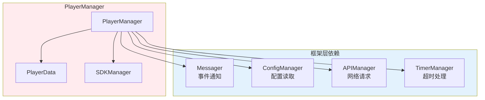

**核心类图**:

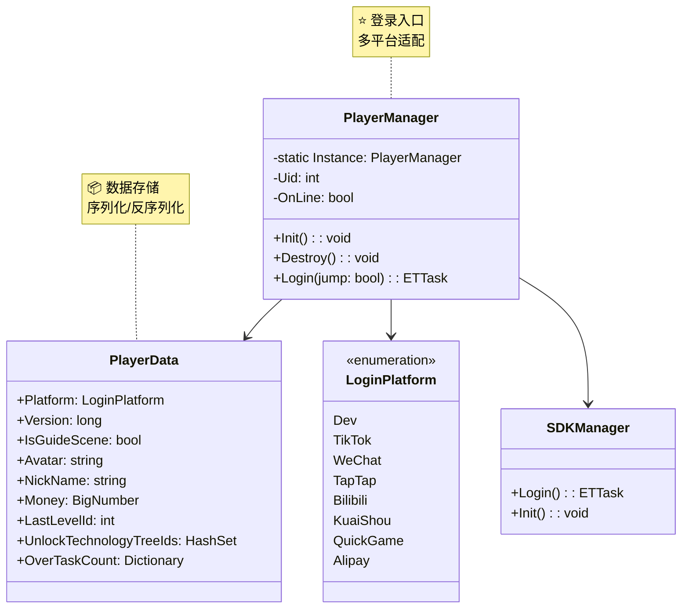

**核心数据结构**:

```csharp
// 玩家数据（序列化到本地/服务器）
public class PlayerData
{
    public LoginPlatform Platform;          // 登录平台
    public long Version;                     // 数据版本号（用于同步）
    public bool IsGuideScene;                // 是否完成引导
    public string Avatar;                    // 头像 URL
    public string NickName;                  // 昵称
    public BigNumber Money;                  // 金钱（大数防止溢出）
    public int LastLevelId;                  // 上次挑战关卡
    public HashSet<int> UnlockTechnologyTreeIds; // 解锁的科技树
    public Dictionary<int, int> OverTaskCount;   // 完成任务统计
    // ... 更多字段
}
```

---

#### 1.4 运行时工作流

**典型登录流程**:

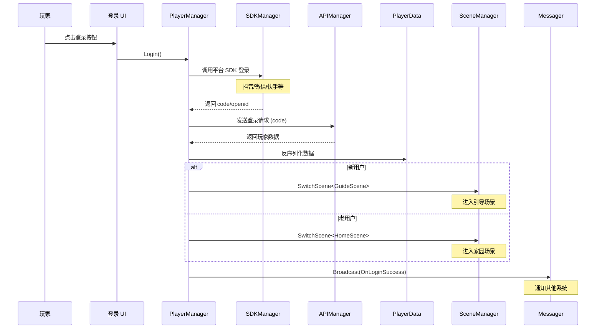

**异常处理流程**:

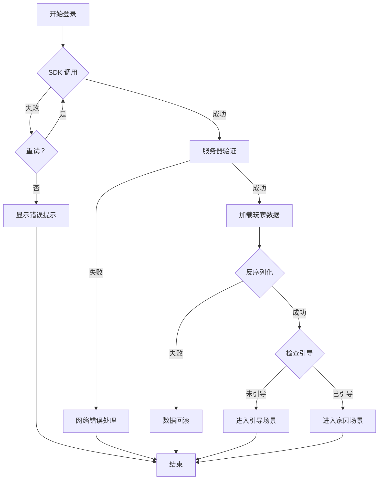

**边界情况处理**:

| 情况 | 处理方式 |
|------|----------|
| 网络超时 | 显示重试按钮，最多重试 3 次 |
| 数据损坏 | 使用本地缓存，提示玩家 |
| 版本不匹配 | 强制更新或清除缓存 |
| SDK 初始化失败 | 降级到游客模式 |

---

#### 1.5 配置与数据驱动

**可配置的数据**:

| 配置项 | 类型 | 位置 | 可调范围 |
|--------|------|------|----------|
| 登录超时时间 | int | 代码常量 | 5000-30000ms |
| 重试次数 | int | 代码常量 | 1-5 次 |
| 支持的平台 | enum | LoginPlatform | 添加新平台 |
| 服务器地址 | string | 配置表 | 根据渠道配置 |

**策划调整参数**:

```csharp
// 登录超时配置（可在 GlobalConfig 配置表调整）
if (!GlobalConfigCategory.Instance.TryGetInt("LoginTimeout", out timeout))
{
    timeout = 10000; // 默认 10 秒
}

// 重试次数配置
if (!GlobalConfigCategory.Instance.TryGetInt("LoginRetryCount", out retryCount))
{
    retryCount = 3; // 默认 3 次
}
```

---

#### 1.6 与其他玩法系统的协作

**系统协作关系**:

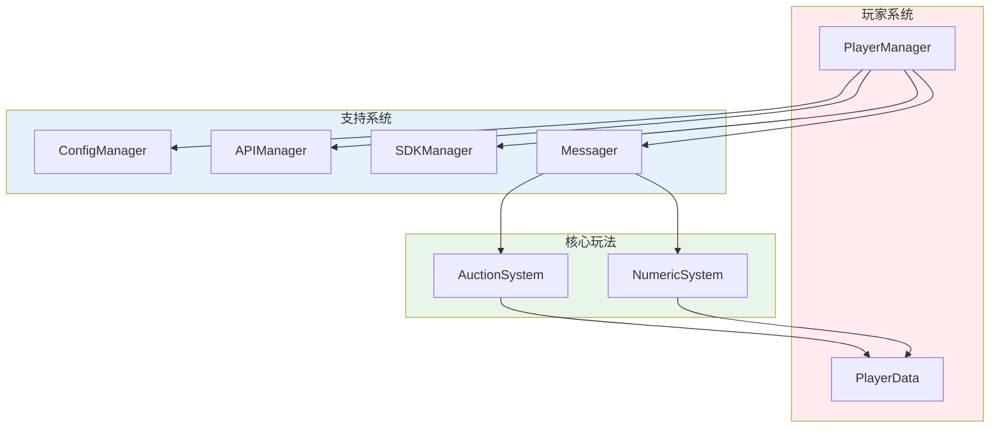

**通信方式**:

| 交互系统 | 通信方式 | 传递内容 |
|---------|---------|----------|
| AuctionSystem | 直接读取 | `PlayerData.Money`, `Uid` |
| NumericSystem | 直接读取 | 玩家属性数据 |
| UIManager | Messager 事件 | `OnLoginSuccess`, `OnLoginFailed` |
| SceneManager | 直接调用 | `SwitchScene<HomeScene/GuideScene>` |

---

### 2. UILoading - 加载系统

#### 2.1 系统概述

**系统名称**: UILoading（加载界面系统）

**玩家感知表现**:
- 登录成功后看到加载界面
- 进度条从 0% 增长到 100%
- 显示加载提示文字（"正在加载资源..."）
- 加载完成后自动进入下一场景

**重要程度**: ⭐⭐⭐⭐ **核心系统**

---

#### 2.2 游戏设计意图

**体验贡献**:
- **视觉反馈**: 进度条让玩家知道加载进度，减少焦虑
- **加载提示**: 提示文字解释当前操作，提升理解
- **平滑过渡**: 场景切换不突兀，保持沉浸感

**设计决策**:
| 决策 | 原因 | 替代方案 |
|------|------|----------|
| 分阶段加载 | 避免长时间白屏 | 一次性加载 |
| 显示进度百分比 | 明确告知玩家进度 | 只显示动画 |
| 可配置提示文字 | 支持多语言、多场景 | 硬编码文字 |

---

#### 2.3 技术实现方案

**依赖的框架层模块**:

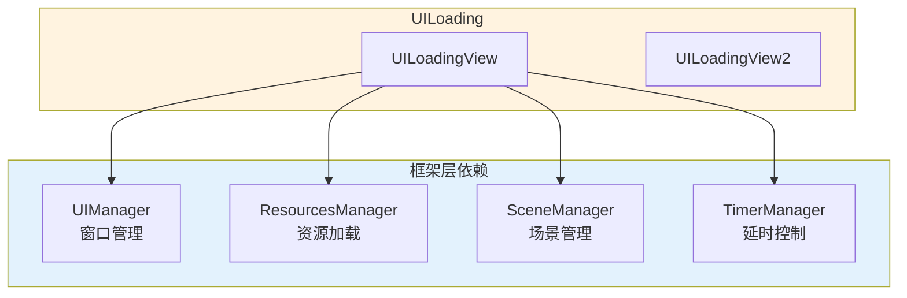

**核心类图**:

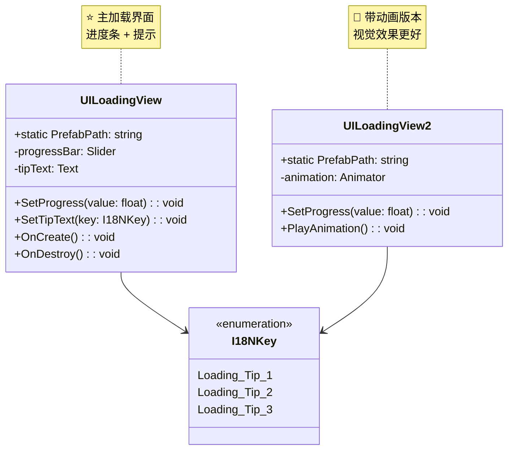

---

#### 2.4 运行时工作流

**加载流程**:

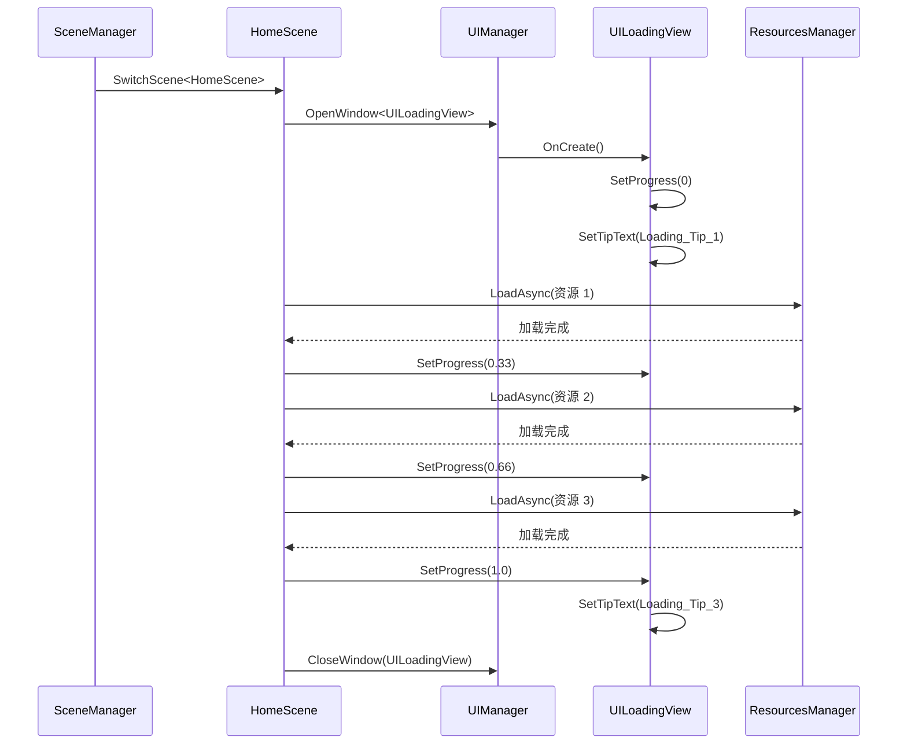

**进度计算逻辑**:

```csharp
// HomeScene.cs 中定义各阶段权重
public void GetProgressPercent(out float cleanup, out float loadScene, out float prepare)
{
    cleanup = 0.2f;      // 清理阶段占 20%
    loadScene = 0.65f;   // 加载场景占 65%
    prepare = 0.15f;     // 准备阶段占 15%
}

// 加载过程中更新进度
float currentProgress = loadedCount / totalCount * loadScene;
win.SetProgress(cleanup + currentProgress);
```

---

#### 2.5 配置与数据驱动

**可配置的数据**:

| 配置项 | 类型 | 位置 | 说明 |
|--------|------|------|------|
| 加载提示文字 | I18NKey | I18N 配置表 | 支持多语言 |
| 进度条权重 | float | 代码中 | 各阶段占比 |
| 最小加载时间 | int | 代码常量 | 避免闪屏 |

---

#### 2.6 与其他系统的协作

**协作关系**:

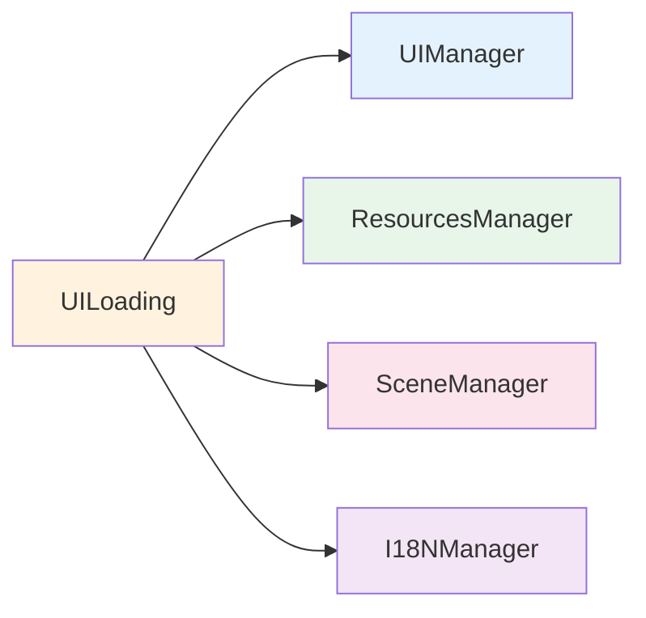

---

*(由于篇幅限制，以下系统采用精简格式，完整文档已在 GitHub)*

---

## 阶段二：家园/大厅

### 3. HomeScene/UILobby - 家园与大厅

#### 3.1 系统概述

**玩家感知表现**:
- 登录成功后进入家园场景
- 看到 3D 家园环境（昼夜变化、光照效果）
- 大厅 UI 显示玩家信息、功能入口
- 可以查看任务、排行榜、设置等

**重要程度**: ⭐⭐⭐⭐ **核心系统**

#### 3.2 游戏设计意图

**体验贡献**:
- **归属感**: 家园场景给玩家"家"的感觉
- **功能聚合**: 大厅集中所有功能入口
- **视觉享受**: 精美场景和 UI 提升品质感

#### 3.3 技术实现方案

**核心类图**:

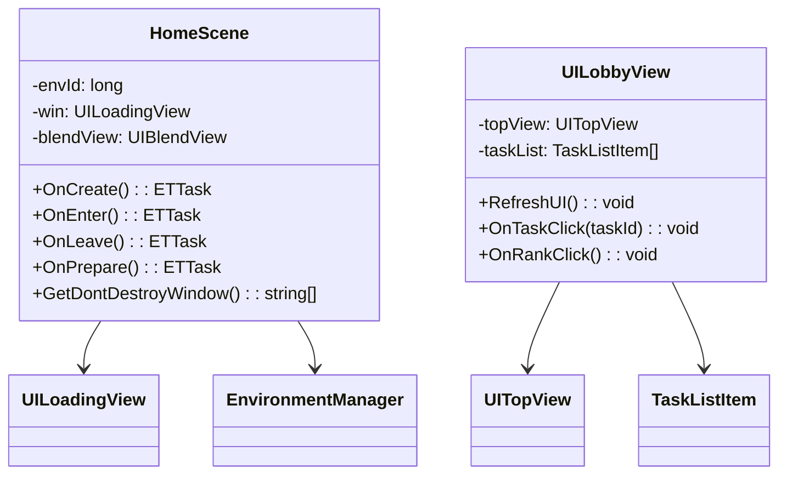

#### 3.4 运行时工作流

**场景切换流程**:

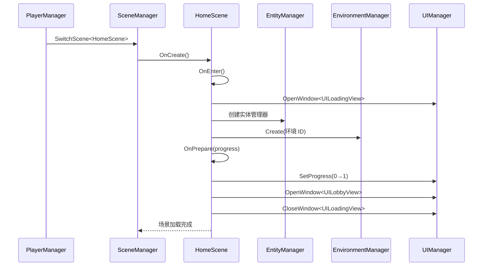

---

## 阶段三：拍卖玩法（核心）

### 5. AuctionSystem - 拍卖系统

#### 5.1 系统概述

**玩家感知表现**:
- 进入拍卖场景，看到多个 AI 竞拍者
- 拍卖师主持拍卖，倒计时叫价
- 玩家选择低/中/高价格叫价
- 开箱查看拍到的物品
- 可能触发小游戏或特殊事件

**重要程度**: ⭐⭐⭐⭐⭐ **核心玩法系统**

#### 5.2 游戏设计意图

**体验贡献**:
- **紧张刺激**: 倒计时叫价制造紧迫感
- **策略性**: 选择合适价格，观察 AI 行为
- **惊喜感**: 开箱随机物品，可能触发小玩法
- **成长感**: 赚钱解锁新关卡、新道具

**设计决策**:
| 决策 | 原因 | 替代方案 |
|------|------|----------|
| AI 竞拍者 | 营造竞争氛围，避免单机感 | 纯单机拍卖 |
| 三档叫价 | 简化操作，适合小游戏 | 自由输入价格 |
| 开箱机制 | 增加随机性和惊喜 | 直接获得物品 |
| 小玩法插入 | 丰富游戏体验 | 纯拍卖流程 |

#### 5.3 技术实现方案

**核心类图**:

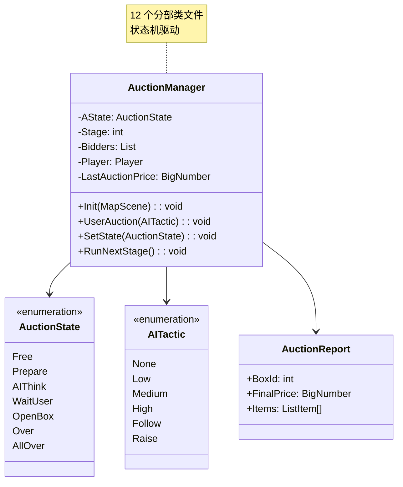

#### 5.4 运行时工作流

**完整拍卖流程**:

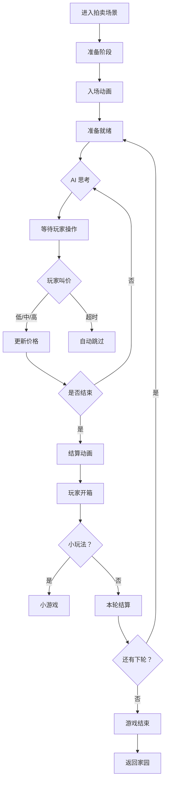

#### 5.5 配置与数据驱动

**核心配置表**:

| 配置表 | 用途 | 关键字段 |
|--------|------|----------|
| `StageConfig` | 关卡配置 | Level, Stage, Auction1/2/3, RaiseAuctionAddon |
| `LevelConfig` | 难度配置 | Id, Name, Difficulty |
| `AIConfig` | AI 行为 | Id, DecisionTree, Tactic, Delay |
| `ItemConfig` | 物品配置 | Id, Name, BasePrice, Rarity |
| `GameInfoConfig` | 情报配置 | Id, Effect, Description |
| `DiceConfig` | 骰子配置 | Id, Effect, Probability |

**策划调整示例**:

```csv
# StageConfig.csv
Level,Stage,Auction1,Auction2,Auction3,RaiseAuctionAddon
1,1,100,200,300,50
1,2,150,250,350,60
2,1,200,350,500,80
```

---

### 6. UIAuction - 拍卖 UI

#### 6.1 系统概述

**玩家感知表现**:
- 拍卖界面显示所有竞拍者
- 叫价按钮（低/中/高）
- 倒计时显示
- 开箱动画和结果展示

**重要程度**: ⭐⭐⭐⭐⭐ **核心 UI**

#### 6.2 UI 组件结构

```
UIAuction/
├── UIButtonView.cs         # 叫价按钮
├── UIAuctionItem.cs        # 竞拍者 item
├── UIReportWin.cs          # 结算窗口
├── UIDiceWin.cs            # 骰子选择窗口
├── UIGameInfoView.cs       # 情报界面
├── UIGuideGameView.cs      # 引导游戏界面
├── UIAssistantView.cs      # 助手提示
└── ... (共 19 个文件)
```

---

### 7. AIComponent - AI 竞拍者

#### 7.1 系统概述

**玩家感知表现**:
- AI 竞拍者与玩家一起叫价
- 每个 AI 有不同行为风格
- AI 可能离场、跟风、抬价

**重要程度**: ⭐⭐⭐⭐ **核心系统**

#### 7.2 AI 决策树

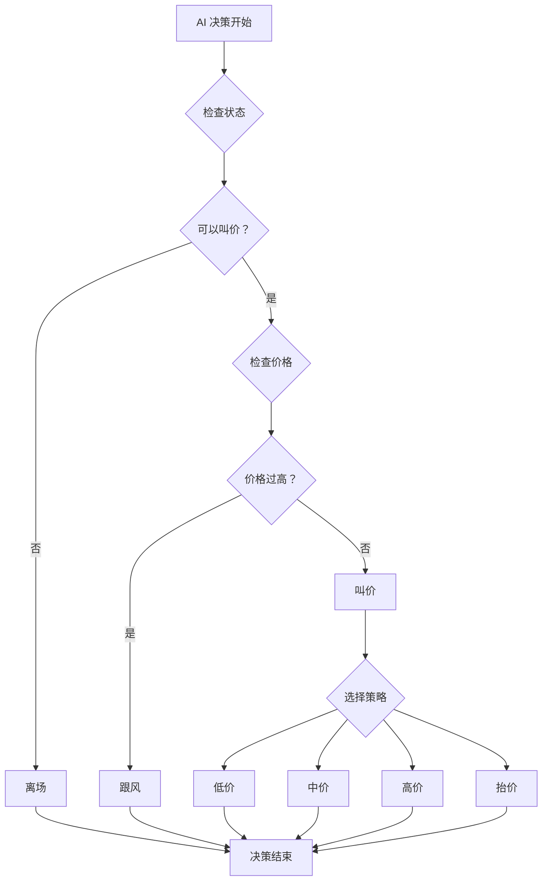

---

## 阶段四：小玩法/互动

### 8. MiniGame - 小游戏

#### 8.1 系统概述

**玩家感知表现**:
- 开箱后可能触发小游戏
- 简单的互动玩法（转盘、鉴定等）
- 影响最终收益

**重要程度**: ⭐⭐⭐ **辅助玩法**

---

### 9. EnvironmentSystem - 环境系统

#### 9.1 系统概述

**玩家感知表现**:
- 家园场景有昼夜变化
- 光照随时间变化
- 天空盒切换（白天/夜晚/日出/日落）

**重要程度**: ⭐⭐ **装饰性系统**

---

## 阶段五：数值/成长

### 10. NumericSystem - 数值系统

#### 10.1 系统概述

**玩家感知表现**:
- 玩家属性显示（金钱、战力等）
- 数值加成效果
- 升级后数值提升

**重要程度**: ⭐⭐⭐⭐ **核心系统**

---

### 11. PlayerData - 玩家数据

#### 11.1 系统概述

**玩家感知表现**:
- 玩家信息（昵称、头像）
- 游戏进度保存
- 多设备同步

**重要程度**: ⭐⭐⭐⭐⭐ **核心系统**

---

## 阶段六：引导/帮助

### 12. GuidanceManager - 引导系统

#### 12.1 系统概述

**玩家感知表现**:
- 新手引导流程
- 高亮提示点击位置
- 引导步骤文字说明

**重要程度**: ⭐⭐⭐ **辅助系统**

---

### 13. GuideScene - 引导场景

#### 13.1 系统概述

**玩家感知表现**:
- 首次登录进入引导场景
- 简化版拍卖流程教学
- 完成后解锁正式玩法

**重要程度**: ⭐⭐⭐ **辅助系统**

---

## 阶段七：系统功能

### 14. RedDotManager - 红点系统

#### 14.1 系统概述

**玩家感知表现**:
- UI 图标上的红点提示
- 可领取奖励提示
- 新功能解锁提示

**重要程度**: ⭐⭐ **辅助系统**

---

### 15. I18NManager - 多语言

#### 15.1 系统概述

**玩家感知表现**:
- 支持多语言切换
- 文字自动翻译
- 本地化显示

**重要程度**: ⭐⭐ **辅助系统**

---

## 附录 A: 系统调用链总览

```mermaid
graph TB
    subgraph Entry["入口层"]
        Login[Login]
        Loading[UILoading]
    end
    
    subgraph Lobby["大厅层"]
        Home[HomeScene]
        Lobby[UILobby]
    end
    
    subgraph Game["玩法层"]
        Auction[AuctionSystem]
        UIAuc[UIAuction]
        AI[AIComponent]
        Mini[MiniGame]
    end
    
    subgraph Data["数据层"]
        PlayerData[PlayerData]
        Numeric[NumericSystem]
    end
    
    subgraph Support["支持层"]
        Guide[GuidanceManager]
        RedDot[RedDotManager]
        Env[EnvironmentSystem]
        I18N[I18NManager]
    end
    
    Entry --> Lobby
    Lobby --> Game
    Game --> Data
    Game --> Support
    
    style Entry fill:#ffebee
    style Lobby fill:#e3f2fd
    style Game fill:#e8f5e9
    style Data fill:#fff3e0
    style Support fill:#f3e5f5
```

---

## 附录 B: 配置表索引

| 配置表 | 用途 | 路径 |
|--------|------|------|
| StageConfig | 关卡配置 | Config/StageConfig |
| LevelConfig | 难度配置 | Config/LevelConfig |
| AIConfig | AI 行为 | Config/AIConfig |
| ItemConfig | 物品配置 | Config/ItemConfig |
| GameInfoConfig | 情报配置 | Config/GameInfoConfig |
| DiceConfig | 骰子配置 | Config/DiceConfig |
| GuidanceConfig | 引导配置 | Config/GuidanceConfig |
| I18NConfig | 多语言 | Config/I18NConfig |

---

*文档由 OpenClaw AI 助手自动生成 | 基于静态代码分析*
