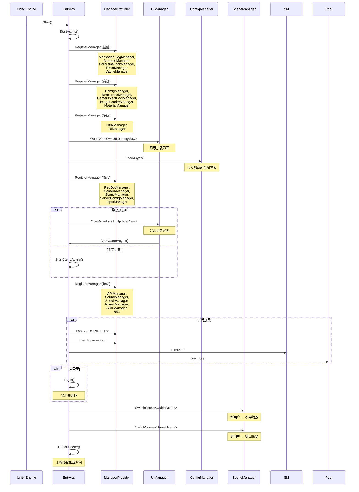
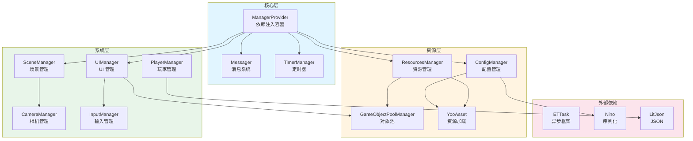
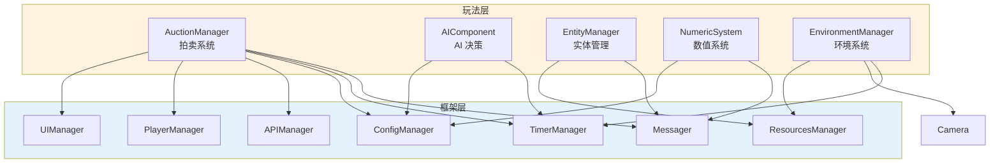
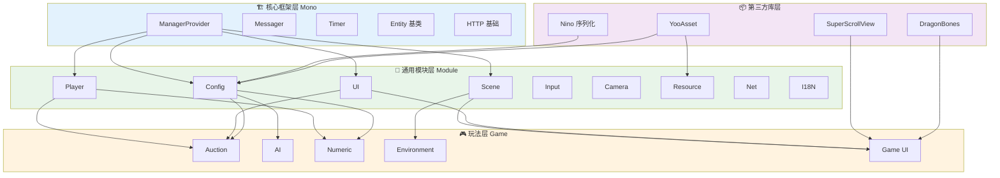

# Container 项目全景文档

> 项目代号：**TaoTie** (饕餮)  
> 文档生成时间：2026-02-26  
> 分析范围：`Assets/Scripts/` (共 646 个 C# 文件)

---

## 📑 目录

1. [项目基本信息](#1-项目基本信息)
2. [项目目录结构总览](#2-项目目录结构总览)
3. [代码分层分类](#3-代码分层分类)
4. [核心架构模式识别](#4-核心架构模式识别)
5. [模块依赖关系概览](#5-模块依赖关系概览)

---

## 1. 项目基本信息

### 1.1 项目概述

| 属性 | 值 |
|------|-----|
| **项目名称** | Container (内部代号：TaoTie) |
| **项目类型** | Unity 手机游戏 (微信小程序/小游戏为主) |
| **命名空间** | `TaoTie` |
| **代码文件总数** | 646 个 C# 文件 |
| **核心代码** | 339 个文件 (Assets/Scripts/Code) |
| **框架代码** | 103 个文件 (Assets/Scripts/Mono) |
| **第三方库** | ~204 个文件 (Assets/Scripts/ThirdParty) |

### 1.2 目标平台

根据代码分析，项目主要面向以下平台：

```csharp
// 平台宏定义 (来自 Entry.cs)
UNITY_WEBGL_TT        // 抖音小游戏
UNITY_WEBGL_WeChat    // 微信小游戏
UNITY_WEBGL_KS        // 快手小游戏
UNITY_WEBGL_TAPTAP    // TapTap
UNITY_WEBGL_QG        // OPPO 小游戏
UNITY_WEBGL_MINIHOST  // 小游戏主机
UNITY_WEBGL_BILIGAME  // B 站游戏
UNITY_WEBGL_4399      // 4399 小游戏
```

### 1.3 核心插件/Package

| 插件/库 | 用途 | 位置 |
|---------|------|------|
| **YooAsset** | 资源管理与热更新 | `Assets/Scripts/Mono/Module/YooAssets` |
| **Nino** | 高性能序列化库 | `Assets/Scripts/ThirdParty/Nino` |
| **LitJson** | JSON 解析 | `Assets/Scripts/ThirdParty/LitJson` |
| **DragonBones** | 2D 骨骼动画 | `Assets/Scripts/ThirdParty/DragonBones` |
| **SuperScrollView** | 滚动列表优化 | `Assets/Scripts/ThirdParty/SuperScrollView` |
| **ETTask** | 异步任务框架 | `Assets/Scripts/ThirdParty/ETTask` |

### 1.4 渲染管线

根据代码分析，项目支持多种渲染管线：

```csharp
// CameraManager 支持多种渲染管线
CameraManager.cs          // 通用实现
CameraManager.URP.cs      // Universal Render Pipeline
CameraManager.TaoTieRP.cs // 自研渲染管线
```

---

## 2. 项目目录结构总览

### 2.1 根目录结构

```
Container/
├── Assets/                    # Unity 资源目录
│   ├── Scripts/               # 所有脚本代码
│   │   ├── Code/              # 【核心】游戏业务代码 (339 文件)
│   │   ├── Mono/              # 【框架】基础框架代码 (103 文件)
│   │   └── ThirdParty/        # 【第三方】第三方库 (~204 文件)
│   ├── Resources/             # Unity 资源
│   ├── Scenes/                # 场景文件
│   └── ...                    # 其他 Unity 资源
├── Modules/                   # 模块化资源 (12 个子模块)
├── Packages/                  # Unity Package 配置
├── .git/                      # Git 版本控制
└── README.md                  # 项目说明
```

### 2.2 Scripts 目录详解

```
Assets/Scripts/
│
├── Code/                      # ────────────────────────────────────────
│   ├── Game/                  # │  【玩法层】游戏具体业务逻辑
│   │   ├── Component/         # │   - AI 决策系统
│   │   │   ├── AI/            # │   - 数值组件
│   │   │   │   ├── Decision/  # │   - 角色类型组件
│   │   │   │   └── Knowledge/ # │   - UI 视图组件
│   │   │   ├── Numeric/       # │
│   │   │   ├── Type/          # │
│   │   │   └── View/          # │
│   │   ├── Entity/            # │
│   │   ├── Scene/             # │   场景系统
│   │   │   ├── Home/          # │   - 家园场景
│   │   │   └── Map/           # │   - 地图场景
│   │   │       ├── GuideScene.cs    # 引导场景
│   │   │       └── MapScene.cs      # 地图场景
│   │   ├── System/            # │   核心玩法系统
│   │   │   ├── Auction/       # │   - 拍卖系统 (8 文件)
│   │   │   ├── Entity/        # │   - 实体系统
│   │   │   ├── Environment/   # │   - 环境系统 (昼夜/光照)
│   │   │   └── Numeric/       # │   - 数值系统
│   │   └── UI/                # │   UI 界面
│   │       ├── UICommon/      # │   - 通用 UI
│   │       ├── UIGuidance/    # │   - 引导 UI
│   │       ├── UILoading/     # │   - 加载 UI
│   │       └── UIUpdate/      # │   - 更新 UI
│   │
│   └── Module/                # ────────────────────────────────────────
│       ├── Camera/            # │  【框架层】通用模块
│       ├── Config/            # │   配置系统 (6 子目录)
│       │   ├── Blender/       # │   - 配置混合器
│       │   └── DecisionTree/  # │   - AI 决策树配置
│       ├── Const/             # │   常量定义
│       ├── CoroutineLock/     # │   协程锁
│       ├── Generate/          # │   代码生成 (配置扩展)
│       ├── Guidance/          # │   引导系统
│       ├── I18N/              # │   国际化
│       ├── Input/             # │   输入管理
│       ├── Log/               # │   日志系统
│       ├── Net/               # │   网络模块
│       ├── Player/            # │   玩家系统 (8 文件)
│       ├── Resource/          # │   资源管理
│       ├── Scene/             # │   场景管理
│       ├── UI/                # │   UI 框架 (含红点系统)
│       ├── UIComponent/       # │   UI 组件
│       └── Update/            # │   热更新流程
│
├── Mono/                      # ────────────────────────────────────────
│   ├── Core/                  # │  【核心框架】底层基础设施
│   │   ├── Manager/           # │   - ManagerProvider (依赖注入)
│   │   └── Object/            # │   - 对象池/优先级栈
│   ├── Helper/                # │  工具助手类
│   └── Module/                # │  基础模块
│       ├── Assembly/          # │   - 程序集管理
│       ├── CodeLoader/        # │   - 代码加载器
│       ├── Entity/            # │   - 实体基类
│       ├── Http/              # │   - HTTP 请求
│       ├── I18N/              # │   - 国际化基础
│       ├── Log/               # │   - 日志基础
│       ├── Messager/          # │   - 消息系统
│       ├── Timer/             # │   - 定时器
│       ├── UI/                # │   - UI 基础
│       └── YooAssets/         # │   - YooAsset 封装
│
└── ThirdParty/                # ────────────────────────────────────────
    ├── DragonBones/           # │  2D 骨骼动画库 (14 子目录)
    ├── LitJson/               # │  JSON 解析库
    ├── Nino/                  # │  序列化库 (10 子目录)
    ├── ETTask/                # │  异步任务框架
    └── SuperScrollView/       # │  滚动列表优化
```

### 2.3 文件统计

| 目录 | C# 文件数 | 说明 |
|------|----------|------|
| `Assets/Scripts/Code` | 339 | 游戏业务代码 |
| `Assets/Scripts/Mono` | 103 | 基础框架代码 |
| `Assets/Scripts/ThirdParty` | ~204 | 第三方库 |
| **总计** | **646** | |

---

## 3. 代码分层分类

### 3.1 总体分层架构

```
┌─────────────────────────────────────────────────────────┐
│                    玩法层 (Gameplay)                     │
│  ┌─────────────┐  ┌─────────────┐  ┌─────────────┐     │
│  │  Game/      │  │  Game/      │  │  Game/      │     │
│  │  Component  │  │  System     │  │  UI         │     │
│  │  (组件)     │  │  (系统)     │  │  (界面)     │     │
│  └─────────────┘  └─────────────┘  └─────────────┘     │
├─────────────────────────────────────────────────────────┤
│                    框架层 (Framework)                    │
│  ┌─────────────┐  ┌─────────────┐  ┌─────────────┐     │
│  │  Code/      │  │  Mono/      │  │  ThirdParty │     │
│  │  Module     │  │  Core       │  │  (第三方)   │     │
│  │  (模块)     │  │  (核心)     │  │             │     │
│  └─────────────┘  └─────────────┘  └─────────────┘     │
└─────────────────────────────────────────────────────────┘
```

---

### 3.2 A. 框架层代码 (Framework)

**底层通用系统，不直接涉及具体玩法，可复用于其他项目。**

#### A1. 核心基础设施 (`Assets/Scripts/Mono/Core`)

| 文件/目录 | 职责 | 关键类 |
|-----------|------|--------|
| `Manager/ManagerProvider.cs` | 依赖注入容器 | `ManagerProvider` |
| `Object/` | 对象池与优先级栈 | `PriorityStack`, `ObjectPool` |

**ManagerProvider - 核心依赖注入系统:**
```csharp
// 单例模式 + 泛型注册
public static T RegisterManager<T>(string name = "") where T : class, IManager
public static T GetManager<T>(string name = "") where T : class, IManagerDestroy
// 支持 Update/LateUpdate/FixedUpdate 生命周期
public static void Update()
public static void LateUpdate()
public static void FixedUpdate()
```

#### A2. 基础模块 (`Assets/Scripts/Mono/Module`)

| 模块 | 文件数 | 职责 |
|------|--------|------|
| `Assembly/` | - | 程序集管理、类型反射 |
| `CodeLoader/` | - | 动态代码加载 |
| `Entity/` | - | 实体基类与组件系统 |
| `Http/` | - | HTTP 请求封装 |
| `I18N/` | - | 国际化基础 |
| `Log/` | - | 日志系统 |
| `Messager/` | - | 消息事件系统 |
| `Timer/` | - | 定时器与时间管理 |
| `UI/` | - | UI 基础组件 |
| `YooAssets/` | - | 资源加载封装 |

#### A3. 通用模块 (`Assets/Scripts/Code/Module`)

| 模块 | 文件数 | 职责 | 关键类 |
|------|--------|------|--------|
| `Camera/` | 3 | 相机管理 | `CameraManager` (URP/TaoTieRP) |
| `Config/` | 10+ | 配置系统 | `ConfigManager`, `ConfigLoader` |
| `Const/` | - | 全局常量 | `Define`, `MessageId` |
| `CoroutineLock/` | - | 协程锁 | `CoroutineLockManager` |
| `Generate/` | 30+ | 代码生成配置扩展 | `*ConfigCategory` |
| `Guidance/` | - | 新手引导 | `GuidanceManager` |
| `I18N/` | - | 国际化 | `I18NManager` |
| `Input/` | - | 输入管理 | `InputManager` |
| `Log/` | - | 日志 | `LogManager` |
| `Net/` | - | 网络 | `APIManager` |
| `Player/` | 8 | 玩家系统 | `PlayerManager`, `PlayerDataManager` |
| `Resource/` | 5 | 资源管理 | `ResourcesManager`, `GameObjectPoolManager` |
| `Scene/` | 4 | 场景管理 | `SceneManager` |
| `UI/` | 10+ | UI 框架 | `UIManager`, `RedDotManager` |
| `UIComponent/` | - | UI 组件 | - |
| `Update/` | 3 | 热更新 | `UpdateManager`, `ServerConfigManager` |

#### A4. 第三方库 (`Assets/Scripts/ThirdParty`)

| 库 | 文件数 | 职责 |
|----|--------|------|
| `DragonBones/` | ~50 | 2D 骨骼动画运行时 |
| `LitJson/` | ~12 | JSON 解析与序列化 |
| `Nino/` | ~40 | 高性能二进制序列化 |
| `ETTask/` | - | 异步任务框架 (类似 UniTask) |
| `SuperScrollView/` | ~100 | 高性能滚动列表 |

---

### 3.3 B. 玩法层代码 (Gameplay)

**依赖框架层实现的具体游戏逻辑。**

#### B1. 游戏组件 (`Assets/Scripts/Code/Game/Component`)

| 组件 | 文件数 | 职责 |
|------|--------|------|
| `AI/` | 5 | AI 决策树与知识库 |
| `Numeric/` | 4 | 数值计算与公式 |
| `Type/` | - | 角色类型 (竞拍者等) |
| `View/` | 3 | 视图组件 (黑仔、休闲动作等) |

**AI 决策系统:**
```
Component/AI/
├── AIComponent.cs           # AI 组件基类
├── Decision/
│   ├── AIDecision.cs        # 决策节点
│   ├── AIDecisionInterface.cs
│   └── AIDecisionTree.cs    # 决策树
└── Knowledge/
    └── AIKnowledge.cs       # AI 知识库
```

#### B2. 实体系统 (`Assets/Scripts/Code/Game/Entity`)

| 文件 | 职责 |
|------|------|
| `Scene/` | 场景实体 |
| `Home/` | 家园场景 |
| `Map/` | 地图场景 |

#### B3. 核心玩法系统 (`Assets/Scripts/Code/Game/System`)

| 系统 | 文件数 | 职责 |
|------|--------|------|
| `Auction/` | 9 | **拍卖系统** (核心玩法) |
| `Entity/` | 2 | 实体管理 |
| `Environment/` | 4 | 环境系统 (昼夜/光照/天空盒) |
| `Numeric/` | 1 | 数值系统 |

**拍卖系统详解:**
```
System/Auction/
├── AuctionManager.cs           # 拍卖管理器 (主逻辑)
├── AuctionManager.AIMiniPlay.cs # AI 竞拍逻辑
├── AuctionManager.API.cs       # 网络 API
├── AuctionManager.Anim.cs      # 动画控制
├── AuctionManager.State.cs     # 状态管理
├── AuctionGuideManager.cs      # 拍卖引导
├── AuctionGuideManager.State.cs
├── AuctionGuideManager.Anim.cs
├── AuctionGuideManager.API.cs
├── AuctionHelper.cs            # 辅助工具
├── AuctionState.cs             # 状态枚举
└── IAuctionManager.cs          # 接口定义
```

#### B4. UI 界面 (`Assets/Scripts/Code/Game/UI`)

| 目录 | 文件数 | 职责 |
|------|--------|------|
| `UICommon/` | - | 通用 UI |
| `UIGuidance/` | - | 引导界面 |
| `UILoading/` | - | 加载界面 |
| `UIUpdate/` | - | 更新界面 |

#### B5. 游戏 UI (`Assets/Scripts/Code/Game/UIGame`)

| 目录 | 职责 |
|------|------|
| `UIAuction/` | 拍卖界面 |
| `UICreate/` | 创建界面 |
| `UILobby/` | 大厅界面 |
| `UIMiniGame/` | 小游戏界面 |
| `UITT/` | 抖音相关 UI |
| `UITT/` | 其他平台 UI |

---

## 4. 核心架构模式识别

### 4.1 设计模式

#### 4.1.1 单例模式 (Singleton)

几乎所有 Manager 都使用单例模式：

```csharp
// ManagerProvider.cs
static ManagerProvider Instance { get; } = new ManagerProvider();

// UIManager.cs
public static UIManager Instance { get; private set; }

// ConfigManager.cs
public static ConfigManager Instance { get; private set; }

// EntityManager.cs
public static EntityManager Instance;
```

#### 4.1.2 依赖注入 (Dependency Injection)

通过 `ManagerProvider` 实现服务定位器模式：

```csharp
// 注册
ManagerProvider.RegisterManager<Messager>();
ManagerProvider.RegisterManager<LogManager>();
ManagerProvider.RegisterManager<UIManager>();

// 获取
var ui = UIManager.Instance;  // 或
var config = ManagerProvider.GetManager<ConfigManager>();
```

#### 4.1.3 观察者模式 (Observer)

通过 `Messager` 实现事件系统：

```csharp
// 订阅
Messager.Instance.AddListener<int, int>(0, MessageId.OnKeyInput, OnKeyInput);

// 发布
Messager.Instance.SendMessage(MessageId.OnKeyInput, key, state);
```

#### 4.1.4 状态模式 (State Pattern)

拍卖系统使用状态模式：

```csharp
// AuctionState.cs - 状态枚举
public enum AuctionState { }

// AuctionManager.State.cs - 状态管理
partial class AuctionManager {
    private AuctionState currentState;
    public void ChangeState(AuctionState newState) { }
}
```

#### 4.1.5 策略模式 (Strategy Pattern)

相机管理支持多种渲染管线策略：

```
CameraManager.cs          // 基础策略
CameraManager.URP.cs      // URP 策略
CameraManager.TaoTieRP.cs // 自研管线策略
```

#### 4.1.6 工厂模式 (Factory Pattern)

```csharp
// ManagerProvider 作为 Manager 工厂
public static T RegisterManager<T>() {
    res = Activator.CreateInstance(type) as T;
    // ...
}

// ConfigLoader 作为配置加载工厂
public interface IConfigLoader {
    Task<byte[]> GetOneConfigBytes(string name);
}
```

#### 4.1.7 组件模式 (Component Pattern)

游戏实体使用组件模式：

```csharp
// Entity 基类
public class Entity {
    private DictionaryComponent<Type, IComponent> components;
    
    public T AddComponent<T>() where T : IComponent, new()
    public T GetComponent<T>() where T : IComponent
}

// 组件示例
NumericComponent, AIComponent, BidderComponent, etc.
```

#### 4.1.8 异步模式 (Async/Await)

使用 `ETTask` 实现异步编程：

```csharp
// Entry.cs
private static async ETTask StartAsync() {
    await UIManager.Instance.OpenWindow<UILoadingView>(...);
    await cm.LoadAsync();
    await ETTaskHelper.WaitAll(tasks);
}
```

---

### 4.2 数据流向

```
┌─────────────┐     ┌─────────────┐     ┌─────────────┐
│   输入层    │ ──→ │   处理层    │ ──→ │   表现层    │
│   (Input)   │     │  (System)   │     │    (UI)     │
└─────────────┘     └─────────────┘     └─────────────┘
       │                   │                   │
       ▼                   ▼                   ▼
┌─────────────┐     ┌─────────────┐     ┌─────────────┐
│ InputManager│     │AuctionManager│    │ UIManager   │
│  输入管理   │     │  拍卖系统   │     │  UI 管理    │
└─────────────┘     └─────────────┘     └─────────────┘
                           │
                           ▼
                    ┌─────────────┐
                    │EntityManager│
                    │  实体管理   │
                    └─────────────┘
```

**主要数据流路径:**

1. **用户输入流:**
   ```
   触摸/点击 → InputManager → Messager (事件) → 对应 System → UI 更新
   ```

2. **网络数据流:**
   ```
   服务器响应 → APIManager → PlayerDataManager → Entity 更新 → UI 刷新
   ```

3. **配置加载流:**
   ```
   YooAsset → ConfigLoader → ConfigManager → 业务系统使用
   ```

---

### 4.3 初始化/启动流程



**启动阶段总结:**

| 阶段 | 内容 | 关键 Manager |
|------|------|-------------|
| 1. 基础初始化 | 消息、日志、定时器 | `Messager`, `LogManager`, `TimerManager` |
| 2. 资源初始化 | 配置、资源池 | `ConfigManager`, `ResourcesManager` |
| 3. 系统初始化 | UI、相机、场景 | `UIManager`, `CameraManager`, `SceneManager` |
| 4. 玩法初始化 | 玩家、网络、音效 | `PlayerManager`, `APIManager`, `SoundManager` |
| 5. 场景切换 | 引导场景/家园场景 | `SceneManager` |

---

## 5. 模块依赖关系概览

### 5.1 框架层模块依赖



### 5.2 玩法层对框架层的依赖



### 5.3 完整架构依赖图



---

## 附录

### A. 关键文件清单

| 文件路径 | 重要性 | 说明 |
|---------|--------|------|
| `Assets/Scripts/Code/Entry.cs` | ⭐⭐⭐⭐⭐ | 游戏入口点 |
| `Assets/Scripts/Mono/Core/Manager/ManagerProvider.cs` | ⭐⭐⭐⭐⭐ | 依赖注入核心 |
| `Assets/Scripts/Code/Module/UI/UIManager.cs` | ⭐⭐⭐⭐⭐ | UI 框架 |
| `Assets/Scripts/Code/Module/Config/ConfigManager.cs` | ⭐⭐⭐⭐ | 配置管理 |
| `Assets/Scripts/Code/Game/System/Auction/AuctionManager.cs` | ⭐⭐⭐⭐⭐ | 核心玩法 |
| `Assets/Scripts/Code/Module/Scene/SceneManager.cs` | ⭐⭐⭐⭐ | 场景管理 |
| `Assets/Scripts/Code/Game/System/Entity/EntityManager.cs` | ⭐⭐⭐⭐ | 实体管理 |

### B. 命名空间结构

```
TaoTie.
├── (全局)              # Entry, GameSetting, Define
├── Manager             # ManagerProvider, IManager 接口
├── Module.             # 各功能模块
│   ├── Config
│   ├── UI
│   ├── Scene
│   ├── Player
│   └── ...
└── Game.               # 游戏业务
    ├── Component
    ├── System
    ├── Scene
    └── UI
```

### C. 代码统计摘要

```
总代码文件：646 个
├── 框架层：442 个 (68.4%)
│   ├── Mono 核心：103 个
│   ├── Module 模块：~130 个
│   └── ThirdParty: ~204 个
└── 玩法层：204 个 (31.6%)
    ├── Game/Component: ~20 个
    ├── Game/System: ~25 个
    ├── Game/UI: ~16 个
    └── Game/UIGame: ~143 个 (估算)
```

---

*文档由 OpenClaw AI 助手自动生成 | 基于静态代码分析*
